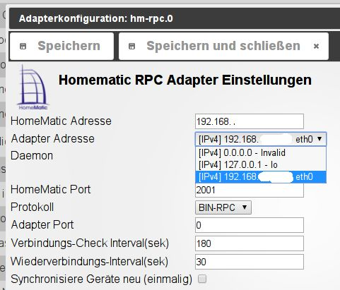
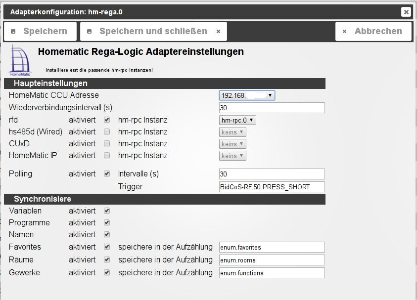

# Erste Schritte mit ioBroker

Um eine Installation für Homematic User zur Visualisierung und Bedienung der Datenpunkte über z.B. ein Tablet als Minimalkonfiguration zu erstellen muss ioBroker zuerst die Daten aus der CCU erhalten.

Dazu müssen folgende Adapter konfiguriert werden

*   HM-RPC zur Einbindung der Datenpunkte
*   HM-REGA zur Einbindung von u.a. Systenmvariablen, Programmen und Namen der Datenpunkte

## Erster Start

Nach der Installation von ioBroker auf einer der [möglichen Plattformen](http://www.iobroker.net/?page_id=3334&lang=de) wird die Software zum ersten Mal durch den Aufruf der <IPdesServers>:8081 gestartet.

Es erscheint das [Web-Frontend des Administrators](http://www.iobroker.net/?page_id=2240&lang=de).  Hier werden die zu installierenden Module (Adapter) ausgewählt, indem man ganz rechts in der Spalte _**Installieren**_ auf das (+) klickt.

### Update des Images

Wenn Die Installation aus einem Image erfolgt ist können einzelne Versionen bereits durch neuere ersetzt worden sein. In diesem Fall erscheint das Wort Adapter im ersten Reiter in grüner Schrift. Zusätzlich befindet sich ein Update-Icon hinter der Versionsinfo in der Spalte _**installiert**_ (5). Diese Adapter sollten als erstes aktualisiert werden.

In seltenen Fällen erscheint auch die Beschriftung des Reiters _**Hosts**_ in grüner Schrift. Dann muss der js-controller (das Modul, welches alle anderen überwacht) über die Konsole upgedated werden.

<pre class="width-set:true width-mode:2 width:50 width-unit:1 h-align:2 lang:default decode:true">cd /opt/iobroker
sudo iobroker stop
sudo iobroker.upgrade self
sudo iobroker start</pre>

Hilfe gibt es immer im [ioBroker-Forum](http://forum.iobroker.net).

Ist alles auf den neuesten Stand müssen die Adapter [HM-RPC](http://www.iobroker.net/?page_id=2829&lang=de) und  [HM-REGA](http://www.iobroker.net/?page_id=2825&lang=de) für die Verbindung zur Homematic-Welt konfiguriert werden..

### Konfiguration von Adaptern

Hierzu muss von den gewünschten Adaptern eine Instanz installiert werden. Dies geschieht indem man bei dem gewünschten Adapter ganz rechts in der Spalte _**Installation**_ auf das (+)-Icin (=Instanz hinzufügen) klickt. Bei den Images sind für die wichtigsten Adapter bereits je eine Instanz installiert.

Die Konfiguration dieser Instanzen findet im Reiter _**Instanzen**_ statt.

Dort wird auf das zweite Icon (Handbuch) geklickt und die Konfiguration vorgenommen. Nach fertiggestellter Konfiguration muss die Instanz gestartet werden indem auf das rote play-Icon geklickt wird, wenn die Instanz nicht automatisch nach der Konfiguration gestartet wurde.

Wenn der Adapter störungsfrei läuft schaltet sich das Ampelsymbol ganz links auf grün (Nicht alle Adapter besitzen diese Ampel).

#### HM-RPC

Der hm-rpc Adapter meldet sich an der CCU an und fordert die CCU auf die Werte der Datenpunkte bei Änderung sofort an ioBroker zu senden. Daher werden die Datenpunkte in ioBroker immer aktuell gehalten. Allerdings sind bei einem Neustart teilweise nicht die echten Zustände vorhanden, sondern erst bei eine Änderung.

Damit diese Verbindung funktioniert, muss unter **_homematic-Adresse_** die IP-Adresse der CCU in einem vom Netz aus zugänglichen Format, etwa 192.168.178.111 eingegeben werden.

Unter **_Adapter-Adresse_** sollte die IP-Adresse des ioBroker-Servers ausgewählt werden.

Als _**Daemon**_ muss der gewünschte Dienst auf der CCU (rfd=Funk, rs485=Wired, HMIP oder CuxD) ausgewählt werden, von dem die Daten abgerufen werden sollen. Für jeden Dienst muss eine eigene Instanz des hm-rpc Adapters installiert werden!

Als **_Protokoll_** sollte bei rfd und wired _BIN-RPC_, bei CuxD _XML-RPC_ gewählt werden.

Bei der Erstkonfiguration oder nach Hinzufügen neuer Geräte in der CCU muss der Haken bei _**Synchronisiere Geräte neu (einmalig)**_ gesetzt werden.

Das Ganze dann mit _**Speichern**_ beenden.

#### HM-REGA

Der hm-rega Adapter wird je CCU einmal angelegt und sorgt u.a. dafür, dass den Datenpunkten der hm-rpc in ioBroker auch die Namen aus der CCU zugeordnet werden können. Außerdem werden hiermit die Datenpunkte aus den Systemvariablen und die Programme sowie die Favoriten, Räume und Gewerke in ioBroker eingelesen.

Unter _**Homematic CCU-Adresse**_ wird bereits die in einem hm-rpc Adapter festgelegte IP der CCU angegeben. Hat man dort mehrere CCU angelegt, so kann man hier eine auswählen. In den folgenden Zeilen werden die verwendeten Dienste ausgewählt und die jeweiligen hm-rpc Instanzen zugeordnet.

Im Gegensatz zu dem hm-rpc-Adapter werden die Datenpunkte des hm-rega Adapters aktiv von der CCU abgerufen. Um die CCU nicht zu überlasten ist das Abfrageintervall per default auf 30 Sekunden konfiguriert, kann aber unter _**Polling**_ entweder komplett deaktiviert oder die Zeit geändert werden. Alternativ kann bei einer Aktion auf der CCU bei der z.B. ein Wert einer Systemvariablen geändert wird, als weiterer Befehl eine virtuelle Taste gedrückt werden. Diese führt dann eine Aktualisierung der Rega-Werte durch. Standardmäßig ist dies die BidCos-RF:50.PRESS_SHORT.

Die beiden Adapter müssen jetzt noch aktiviert werden. Dazu werden sie unter dem [Reiter Instanzen](http://iobroker.net/wp-content/uploads/Instanzen-Übersicht.jpg) über den play-Button gestartet. Dieser schaltet nach einiger Zeit von rot auf grün, und die Ampel ganz links wechselt ebenfalls auf grün.

Im Reiter _**LOG**_ sieht man jetzt, dass die Datenpunkte angelegt und eingelesen werden. Diese Datenpunkte kann man jetzt auch unter dem Reiter _**Objekte**_ finden