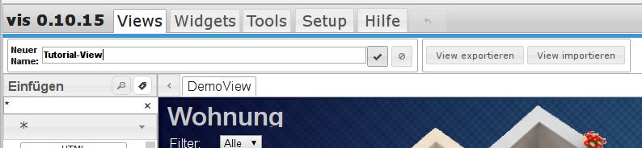
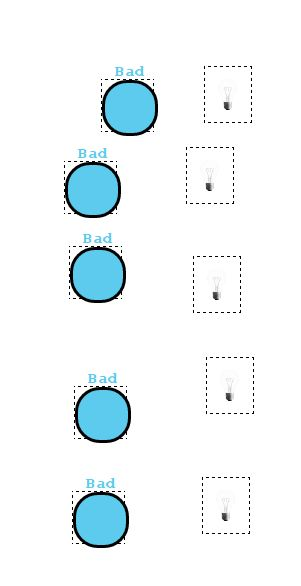

# Eine erste Visualisierung

Um mit ioBroker eine Visualisierung zu erstellen müssen noch wenige Schritte vorbereitet werden

Dazu müssen je eine Instanz von folgenden Adapter installiert werden

*   _**vis**_ zur Erzeugung der Views (so heißen die Screens die im Browser dargestellt werden)
*   _**web**_ zur Erzeugung eines Webinterfaces über das auf die Views zugegriffen werden kann

## Installation von vis

Über das [Web-Frontend des Administrators](http://www.iobroker.net/?page_id=2240&lang=de) wird Eine Instanz des zu installierende Adapter vis ausgewählt, indem man ganz rechts in der Spalte _**Installieren**_ auf das (+) klickt.

## Aufrufen des Editors

Der vollständige Aufruf des .vis-Editors erfolgt mit`<IP_des_ioBroker_Servers>:8082/vis/edit.html?_ProjektName_#_ViewName._`

Für den ersten Aufruf reicht jedoch: `<IP_des_ioBroker_Servers>:8082/vis/`

Bevor sich der Editor mit einem DemoView endgültig öffnet, erscheinen mehrere Info-Popups, die anzeigen, dass noch keine Views bzw. die Datei dafür existieren. Diese Popups werden alle mit **_OK_** bestätigt.

Dann öffnet sich endlich der Editor:

### Anlegen eines neuen Views

Mit diesem Demo-View kann man gut die Funktionen von vis durch try and error kennenlernen. Daher löschen wir ihn nicht, sondern erstellen für dieses Tutorial einen weiteren View.

Dazu wechseln wir oben auf den Reiter Views und legen einen neuen View durch Anklicken des (+)-Icons neben dem Namen-Pulldown an:

#### Änderungen speichern

Änderungen an einem View werden immer sofort automatisch gespeichert. Dies wird durch ein Disketten-Icon, das bei Speichervorgängen erscheint, angezeigt:

Unerwünschte Änderungen kann man mit dem Redo-Button (rechts neben den Reitern in der Titelzeile, oder mit STRG-Z wieder rückgängig machen. Will man den Editor verlassen, bevor die automatische Speicherung beendet ist, wird durch eine Warnmeldung darauf hingewiesen.

#### Vergeben eines Namens

Die Ansicht ändert sich und es wird aufgefordert einen neuen Namen einzugeben.

Hier wird jetzt ein eindeutiger und möglichst kurzer Name eingegeben und anschließend mit dem Haken-Icon bestätigt. Soll die Aktion abgebrochen werden muss das Abbruch Icon (Ø) angeklickt werden.

Es erscheint über der Arbeitsfläche ein weiterer Reiter mit dem Namen des Views. Die Arbeitsfläche ist leer.

#### Festlegen der Größe

Um die Größe des neuen Views festzulegen wechseln wir in der Titelzeile auf den Reiter Tools und öffnen das Pulldownmenü bei _**Auflösung**_.

Dort kann man wahlweise eine vorgegeben Auflösung eines Mobilgeräts, oder eine eigene Auflösung wählen.

Wir wählen vom Anwender definiert und es erscheinen 2 Eingabefelder um die Breite (px) und Höhe(px) des geplanten Views einzugeben.

Nachdem dort für die Breite 1280 und für die Höhe 800 eingegeben wurde (Was bei vielen 10.1" Tablets der möglichen Auflösung entspricht) erscheint auf der Arbeitsfläche ein brauner Rahmen, der die Grenzen unseres Arbeitsbereiches darstellt.

### Arbeiten mit Widgets

Alle installierten Widgets befinden sich in der Widget-Sidebar links von der Arbeitsfläche. Zur Zeit sind nur die Widgets der Grundinstallation verfügbar. Weitere Widgetsätze können nachinstalliert werden. Dazu später.

Wenn man Widgets mit einer bestimmten Funktion sucht, kann man in das Filterfeld links oben die gesuchte Funktion (z.B. "on/off", "bool" oder "number") eingeben. Anschließend werden nur noch passende Widgets angezeigt.

Klickt man das Filterfeld mit der Maus an, werden sämtliche Filterworte für die installierten Widgets angezeigt. Wenn man also das genaue Filterwort nicht kennt, kann man sich hier eins auswählen.

Jetzt ziehen wir mit gedrückter Maustaste (oder Doppelklick) das Widget _**Bulb on/off**_ auf die Arbeitsfläche. Das jeweils aktive Widget wird durch eine gestrichelte Umrandung markiert.

In der Eigenschaften-Sidebar auf der rechten Seite wird der Reiter Widget aktiviert und die laufende Nummer des angewählten Widgets wird angezeigt. In der Sidebar wird die Gruppe Allgemein geöffnet, die die spezifischen Daten für dieses Widget enthält.

Ist außerdem der Reiter Widgets in der Titelzeile des Editors ausgewählt wird dieses Widget mit Nummer und Namen als _**Aktiv Widget**_ angezeigt.

Dieses Widget soll jetzt dazu dienen eine Lampe zu schalten und den Zustand darzustellen. Dafür müssen wir das Widget mit einem (Licht-) Schaltaktor verknüpfen.

#### Datenpunktzuordnung

In der Eigenschaften-Sidebar befindet sich unter dem Reiter Widget der Block Allgemein des gerade selektierten Widgets. Der erste Punkt darin ist die Object-ID (OID) die dem Widget zugeordnet werden soll. Über den Button  rechts neben dem Feld (rot) gelangt man in den Objekt-Explorer.

Durch geschicktes Auswählen von Filtern (grün) (hier rpc bei ID, weil wir das Widget mit einem HM-Datenpunkt verknüpfen wollen, dessen Zustand über den hm-rpc eingelesen wird und Licht bei Name, weil bei mir die Aktoren für Licht dieses Wort im Namen haben sowie state bei Type und role) kann man die angezeigten Datenpunkte deutlich reduzieren um den gewünschten schneller zu finden. Nach Anklicken des offenen Ordners (blau) werden alle Objekte, auf die die Filterkriterien zutreffen aufgeklappt.

Das Widget soll den Zustand (=state) der Lampe verändern. Deswegen darf es nicht mit dem Gerät (=device) oder dem Kanal (=channel) verknüft werden. Es muss sich um einen Zustand handeln, der sich verändern kann.

Der gewünschte Datenpunkt wird markiert und über den Button _**Auswählen**_ übernommen. In dem Feld Objekt_ID erscheint dann die ausgewählte OID und darunter der Klarname.

Die weiteren Einstellungen, die für die Funktion des Widgets notwendig sind, sind schell erklärt.

*   **min:** der Wert, den der Datenpunkt bei off annehmen soll
*   **max:** der Wert, den der Datenpunkt bei on annehmen soll (bei Schaltaktoren 1, bei Dimmern 100)
*   **icon_off:** das Bild das angezeigt werden soll, wenn der Aktor den Zustand min besitzt
*   **icon_on:** das Bild das angezeigt werden soll, wenn der Aktor den Zustand max besitzt (Wenn der Dimmer auf 98% steht, wird das Widget **nicht** aktiv angezeigt!)
*   **nur lesend:** Soll das Widget nicht zur Bedienung dienen, sondern nur zur Visualisierung des Zustandes, muss diese Checkbox angehakt werden.

Damit hätten wir unser erstes Widget erfolgreich angelegt.

#### Widgeteigenschaften

Als nächstes wollen wir diesem doch farblosen Widget einen Hintergrund verpassen. Dazu nehmen wir das Widget basic Border und ziehen es genau über die Glühbirne. wenn es nicht exakt passt, kann man es auch mit den Pfeiltasten bewegen. Zu den Ausrichtungswerkzeugen, die das Ganze noch vereinfachen kommen wir nachher. Wenn das bewegte Widget eine bestimmte Ausrichtung zu einem bestehenden Widget hat wird kurz eine rote Hilfslinie sichtbar. [

 Wir füllen jetzt das optionale Feld _**Titel**_ aus, indem wir dort eine kurze aussagekräftige Bezeichnung für die Lampe eintragen. In  diesem Fall "Bad". Über den Colorpicker wählen wir dann eine geeignete Farbe für diesen Titel aus:  anschließend verschieben wir die Beschriftung noch mit den beiden Slidern an die gewünschte Stelle

##### Anpassen der Schrift

Wir aktivieren nun die Checkbox CSS Font & Text um Anpassungen an der Schrift durchzuführen. Dadurch klappt der entsprechende Block auf. Hier werden die dem Widget zugeordneten Schriften unseren Wünschen angepasst. Dieser Block wird standardmäßig dafür benutzt. In unserem speziellen Fall gibt es bereits gleiche Parameter unter allgemein, die jetzt hier nicht noch einmal ausgefüllt werden müssen.  Wir wählen in dem Dropdown-Menü eine Schriftfamilie aus (wenn weitere Schriftsätze per Adapter installiert sind, werden sie ebenfalls hier aufgeführt). Weiterhin den font-weight und die Font Größe. Letztere kann relativ (large, larger...) oder absolut in px oder pt angegeben werden.

##### Hintergrund

Als nächstes wollen wir die Fläche des Widgets in der selben Farbe wie die Beschriftung füllen. Dazu aktivieren wir den Block _**CSS Hintergrund (background-...)**_ und kopieren den Code für die Farbe aus dem Feld _**Titelfarbe**_ dort hinein.  Mit Schrecken stellen wir fest, dass die Glühbirne jetzt verschwunden ist. Um diese wiederherzustellen müssen wir an der Anordnung der Widgets arbeiten. Dazu gibt es den Block

##### CSS allgemein

Um das Glühbirnen-Widget wieder hervorholen zu können müssen wir das Widget _**basic  bulb on/off**_ über das Widgetauswahlmenü oben links aktivieren. 

   Jetzt wird in dem aufgeklappten Block _**css allgemein**_ der Wert für den z-Index erhöht. Dieser Wert gibt an in welcher Ebene über der Arbeitsfläche dieses Widget liegen soll. (0=Arbeitsfläche; hoher Wert ganz weit oben)  Jetzt ist das Widget wieder sichtbar!   Es empfiehlt sich bei vielen und großen Widgets die Werte für den z-Index in großzügigen Stufen zu bemessen, damit man ggf. noch Zwischenebenen einbauen kann.

##### CSS Border

In diesem Block kann jetzt der Rahmen konfiguriert werden. Dazu wählen wir wieder das Widget basic border aus und öffnen den Block CSS Ränder (border...)  Hier geben wir die gewünschten Werte für die Umrandung der Hintergrundfläche ein.

*   **width** ist die Dicke der Umrandung in px
*   **style** gibt die Strichart an. Wir wählen solid (= durchgängig)
*   **color** ist die Farbe der Umrandung
*   **radius** gibt die Krümmung der Ecken an. Gibt man hier einen Wert ein, der größer oder gleich der Hälfte des größeren Wertes von _**width**_ bzw. _**height**_ in _css allgemein_ ist ergibt das eine runde Fläche.

#### Arbeiten mit mehreren Widgets

Wir ziehen mit der Maus ein Gummiband um die beiden Widgets und kopieren sie mehrfach.

Dies geschieht über das _**copy-widget Icon**_ oder bei einigen Browsern auch mit STRG-C und STRG-V. In einer späteren Version von .vis wird es die Möglichkeit geben mehrere Widgets dauerhaft zu einer Gruppe zu verbinden.

Das Ergebnis ist nicht optimal um damit weiterzuarbeiten, 

daher ziehen wir die Widgets jetzt erst einmal weiter auseinander. 

Den Glühbirnen weisen wir jetzt verschiedene Schaltaktoren zu. Dann wird der Titel der Hintergrundwidgets entsprechend angepasst, und wer es bunt mag kann auch noch den Flächen und Titeln zu den Zimmern passende Farben vergeben. Bei mir sind es die Farben der Tapeten der Räume. 

##### Widgets anordnen

Jetzt wollen wir die Widgets vernünftig positionieren. Dazu gibt es im Prinzip zwei Möglichkeiten, die ich jetzt beide vorstellen werde:

1.) **Anordnung über die Einstellungen:** Wir wählen wieder per Gummiband alle Hintergründe aus und sehen uns den Block _**CSS Allgemein**_ in der Einstellungs-Sidebar an:

An vielen Stellen steht jetzt _**verschiedene**_ anstelle der absoluten Werte. Klickt man so eine Feld (in unserem Falle _**left**_) an, so werden dort alle verfügbaren Werte angezeigt. Hatte man vorher die Widgets mit der Maus oder den Pfeiltasten einzeln versucht zu positionieren, kann man jetzt mit einem Klick allen selektierten Widgets den gleichen Wert geben.

Dies gilt für alle Werte in der Einstellungen-Sidebar. Einheitliche Änderung des Schrifttyps, der Farbe usw. kann für viele Widgets mit einem Klick durchgeführt werden. Lässt sich um die gewünschten Widgets kein Gummiband ziehen, kann man die Widgets auch per STRG-Klick oder per Checkbox im Aktivwidget-Pulldown oben links auswählen.

Wir nehmen hier einmal den niedrigsten Wert und klicken diesen an. Sofort richten sich die Widgets vertikal nach dem am weitesten links liegenden Widget aus.

Dies ist jedoch nur die halbe Miete. Der Abstand passt noch nicht so richtig. Um diesen einzurichten verwenden wir die zweite Methode:

**2.) Anordnung über die Werkzeugleiste:** In der Titelzeile befindet sich eine Werkzeugleiste zum Ausrichten von Widgets.

Das markierte Icon dient dazu, den Abstand zwischen den Widgets abzugleichen. Diese klicken wir jetzt an.

Zu jedem der Icons gibt es eine kurze Hilfe, wenn man kurz mit der Maus darüber stehen bleibt.

Jetzt müssen nur noch die Glühbirnen in die Flächen gezogen werden. Dazu brauchen wir nur die oberste und unterste Glühbirne (mit Maus oder Pfeiltasten) exakt zu positionieren, dann alle Glühbirnen selektieren und die übrigen Widgets erst mit dem ersten Icon linksbündig und dann mit dem 8\. Icon auf Abstand zu korrigieren.

## Editor schließen

Um sich den Erfolg ansehen zu können schließen wir den Editor über das Kreuz rechts oben oder das daneben liegende pulldownmenü (rot). Nach einem kurzen Hinweis, wie man den Editor wieder aufruft befindet man sich im Anzeigemodus von .vis

## Weiterführende Dokumentation von .vis

Eine sehr ausführliche Dokumentation aller Funktionen von ioBroker.vis befindet sich [hier](http://www.iobroker.net/?page_id=2754&lang=de).