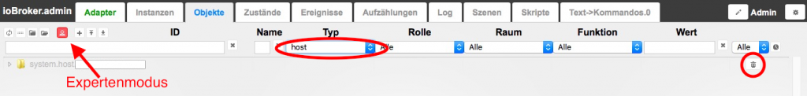

# Multihost Modus

ioBroker ist in der Lage, die Aufgaben von mehreren Servern erledigen zu lassen. Dadurch kann die Rechenlast auf mehrere Hosts verteilen werden. Man kann aber auch systemspezifische Erweiterungen eines Einplatinencomputers nutzen (GPIO von einem RaspberryPi, obwohl der „Hauptrechner“ ein leistungsfähigerer BananaPi ist).

## Installation

**Wichtig:** Die verschiedenenen Hosts müssen unbedingt eindeutige Hostnamen besitzen. Dazu installiert man zuerst auf allen verwendeten hosts ganz normal ioBroker. Auf den untergeordneten hosts führt man nach der Installation in dem entsprechenden Installationsverzeichnis den folgenden Befehl aus: `./iobroker setup custom` In dem nun folgenden Dialog wird wie folgt eingegeben: `Type of objects DB [file, couch, redis], default [file]: ENTER` `Host of objects DB(file), default[127.0.0.1]: < IP ADRESSE> vom Hauptsystem` `Port of objects DB(file), default[9001]: ENTER` `Type of states DB [file, redis], default [file]: ENTER` `Host of states DB (file), default[cubie]: ENTER` `Port of states DB (file), default[9000]: ENTER` `Host name of this machine [hostname]: ENTER` Nun das untergeordnete System neu starten. Auf dem Hauptsystem erscheint danach unter Hosts auch der neu angelegte Host.

* * *

## Multihost mit redis

Soll eine Multihost-Umgebung installiert werden, bei der die  States in redis gespeichert werden, muss noch einiges beachtet werden. Die Datei redis.conf auf dem Host, auf dem die States gespeichert werden muss wie folgt geändert werden.

`nano /etc/redis/redis.conf`

Die darin enthaltene Zeile

`bind 127.0.0.1`

muss mit der IP des Netzwerkadapters ergänzt werden, damit der Redis-Server connects von extern zulässt. Also zB

`bind 127.0.0.1 192.168.1.10`

unter der Annahme, dass 192.168.1.10 die lokale IP des ioBroker Masters ist. Diese Anpassung ist auch nur am Master nötig. Alternativ geht auch `bind 0.0.0.0` Zum Schluss den Redis-Server oder Rechner neu starten. zB:

`sudo service redis-server restart`

* * *

## Aufgaben verteilen

Es gibt zwei Möglichkeiten, die Aufgaben auf die Hosts zu verteilen.

*   Ist es eine Neuinstallation, wählt man im Reiter _Adapter_ aus dem pulldown-Menü über der Adapterliste den Host aus, auf dem die Instanz des Adapters installiert werden soll. Anschließend fügt man dort die Instanz hinzu, indem man auf das (+) in der rechten Spalte klickt.
*   Hat man bereits vorher viele Adapter auf einem Host installiert, kann man die Zuordnung der bereits installierten Instanzen nachträglich im Reiter _Instanzen_ ändern.

* * *

## Host löschen

Zum Löschen eines Hosts im _Admin_-Reiter Objekte den Experten-Modus aktivieren und in der Spalte _Typ_ die Auswahl _host_ aktivieren. Dann den gewünschten Host löschen. 

