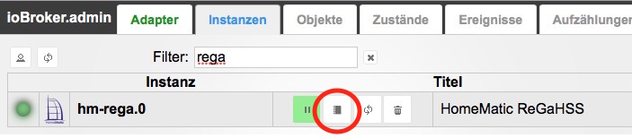

# Installation eines Adapters und Konfiguration einer Instanz

Die Installation eines Adapters wird hier am Beispiel des _[hm-rega](http://www.iobroker.net/?page_id=2825&lang=de)_ Adapters vorgestellt. Anleitungen für weitere Adapter werden in den Adapterbeschreibungen näher beschrieben. Wenn man die Daten (Gerätenamen, Programme, Systemvariablen) aus der Homematic CCU übernehmen will, sollte man als erstes eine Instanz des hm-rega-Adapter installieren. Der dazu notwendige _hm-rpc_-Adapter wird automatisch mitinstalliert. Im Reiter Adapter sucht man die Zeile _Homematic ReGaHSS_ und klickt in der letzten Spalte "_Installieren"_ auf das (+). Ein kleines Fenster mit dem Installations-Log erscheint und beendet sich selbst. Die bereits installierten Instanzen werden in den oberen Bereich der Liste verschoben. Zur Konfiguration der bereits installierten Instanzen wechselt man auf den Reiter „_Instanzen_“ und klickt auf das zweite Icon "_Konfiguration_" hinter dem Instanznamen in der Liste aller Instanzen. 

 Ein Einstellungsfenster öffnet sich. Nach der Konfiguration wird das Einstellungsfenster mit „_Speichern und schließen_“ geschlossen. Beim erstmaligen Konfigurieren ist der Status der Instanz noch als _false_ gekennzeichnet (rotes "_play_" Icon) Dort bitte klicken, dann springt das Icon auf grün. Jetzt ist der Adapter aktiv. **Hinweis:** Bei erneuter Konfiguration der Instanz wird sie nach dem „_Speichern und schließen_“ automatisch neu gestartet.