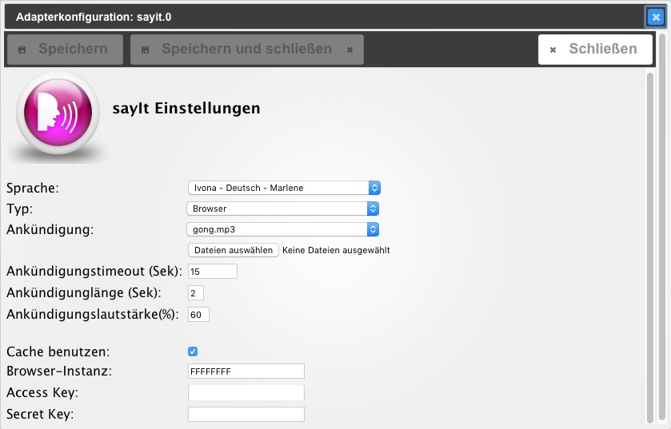

Der SayIt Adapter kann Text in Sprache konvertieren und auf einigen Geräten und im Browser abspielen.

## Konfiguration

  

  

### Sprache

Es stehen mehrere Sprachen und Stimmen zur Auswahl (zur Zeit Google und Ivona). Die Ivona Stimmen setzen eine [Registrierung](http://www.ivona.com) voraus.

* * *

### Typ

Hier ist die Auswahl des Ausgabegerätes möglich.

* * *

#### Browser

Der Text wird von dem Browser abgespielt, auf dem .vis geöffnet ist. Dies geht mit nahezu allen Desktop-Browsern und einigen mobilen Browsern.

* * *

#### Home24- MediaPlayer [

Der Text wird an ein Android-Gerät geschickt, auf dem der Home24 Mediaplayer installiert ist und dort abgespielt. Dabei wird die Android TTS Engine benutzt. Der Port kann nicht geändert werden und ist fest auf 50000 eingestellt.

* * *

#### Home24 - MediaPlayer and FTP Server [

Der Text wird - fertig als MP3-Datei konvertiert -  an ein Android-Gerät geschickt, auf dem der Home24 Mediaplayer installiert ist und dort abgespielt. Dafür wird die _Google text to speech engine_ benutzt. Die erzeugte MP3 Datei wird mittels FTP auf das Android-Gerät kopiert und mit dem Home24 – MediaPlayer abgespielt. Beide Apps müssen dasselbe Hauptverzeichnis (z.B. das root directory der "sd card") haben.

* * *

#### System

Der Text wird von dem Betriebssystem, auf dem der SayIt-Adapter läuft, abgespielt. Folgende Betriebssysteme werden unterstützt: Windows, linux, Mac OS X.  

##### Systemkommando (nur bei System)

@Todo@  

##### Windows engine

Der Text wird von windows, auf dem der Sayit-Adapter läuft abgespielt. Dafür wird die Winndows text to speech engine benutzt, die durch den Anwender konfiguriert werden muss. Setup-Hinweise gibt es hier.

* * *

#### Sonos

spielt den Text auf einem Sonos-Gerät ab, sofern der _Sonos-Adapter_ 

 installiert wurde.  

##### Gerät (nur bei Sonos)

Auswahl des Gerätes, das im _Sonos-Adapter_ installiert wurde  

##### Web instance (nur bei Sonos)

Auswahl der Instanz des _Web-Adapters_ 

* * *

### Ankündigung

Auswahl eines Tons, der eine Sprachausgabe ankündigt, also vor jeder Sprachausgabe abgespielt wird.

* * *

### Ankündigungstimeout

Timeout in Sekunden.

* * *

### Ankündigungslänge

Dauer der Ankündigung in Sekunden.

* * *

### Ankündigungslautstärke

Lautstärke in Prozent der Maximallautstärke.

* * *

### Cache benutzen

Bei Auswahl werden MP3-Dateien aus dem Cache genutzt.

* * *

### Browser-Instanz

Diese Instanz legt fest, auf welchem Browser die Sprachausgabe getätigt werden soll. Die Instanz kann in VIS mit dem _Basic - screen resolution_ - Widget abgefragt, oder im [VIS-Editor](http://www.iobroker.net/?page_id=2754&lang=de) unter _Tools / Instanz ID_ erzeugt werden. Die Standard-Einstellung ist FFFFFFFF (8x F). Das ermöglicht die Sprachausgabe auf allen Browsern, die VIS oder den VIS-Editor geöffnet haben.

* * *

### Access Key und Secret Key (nur bei Ivona Sprachauswahl)

Hier werden die [Ivona Benutzerdaten](#Sprache) eingegeben.

* * *

## **Bedienung**

### Datenpunkte

Der Sayit-Adapter bietet verschiedene Datenpunkte für die Kommunikation an.  Diese lassen sich im Admin-Reiter _Objekte_ unter _sayit_ einsehen. Zum Beschreiben und auslesen der Datenpunkte eignet sich u.a. der Javascript-Adapter. 

  

#### mp3

MP3-Datei, welche abgespielt werden soll. Wenn zur Ausgabe _[SONOS](#Sonos)_ oder _[Browser](#Browser)_ gewählt wurde, ist die Datei unter `http://ip:8082/state/sayit.0.tts.mp3` verfügbar.  

#### playing

Boolean-Variable, die angibt, ob gerade eine Sprachausgabe stattfindet.  

#### text

Text, welcher ausgegeben werden soll. **Tipp**: Innerhalb des Textes können Sprache und Lautstärke optional erneut definiert werden. Dazu wird dem zu sprechenden Text die Sprache als Kürzel (de, en, ru, ...) und die Lautstärke in Prozent und jeweils durch Semikolon separiert vorangestellt. `en;50;Good bye!` Die Lautstärkeangabe bezieht sich dabei auf die in den Einstellungen festgelegte Lautstärke. Wenn in den Einstellungen 70% festgelegt sind, bewirkt die obige Eingabe von 50 eine Gesamtlautstärke von 35%.  

#### volume

Lautstärke in Prozent.

* * *

### Tipp

Der Adapter lässt die Installation mehrerer Instanzen zu. Es können für jede Instanz verschiedene Einstellungen gemacht werden. So lässt sich differenzieren, ob eine Ausgabe z.B. nur auf dem Wandtablet oder nur auf einem Sonos-Lautsprecher getätigt werden soll. Auch die raumweise Unterscheidung ist durch das Ansprechen der verschiedenen Instanzen `sayit.0`, `sayit.1`, ... leicht möglich.