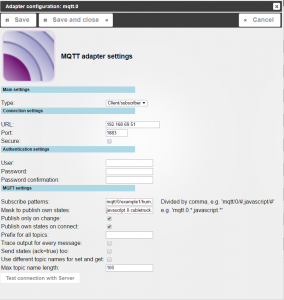
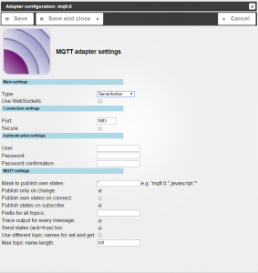
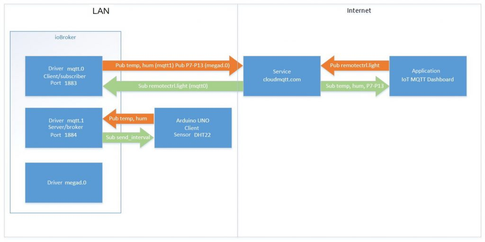
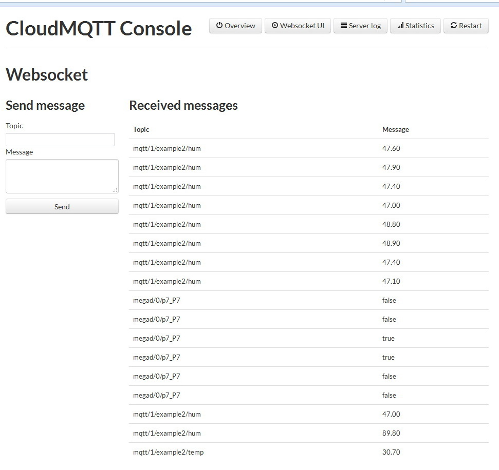
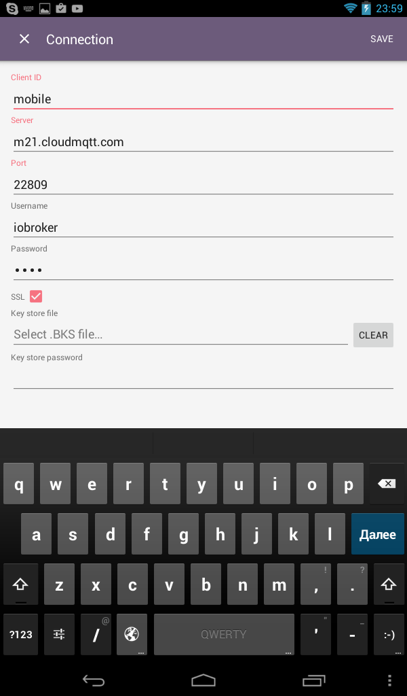
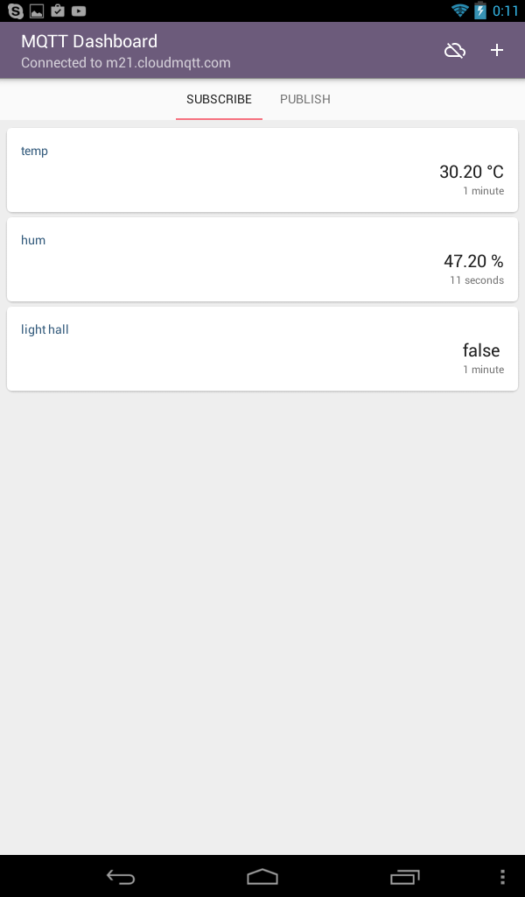
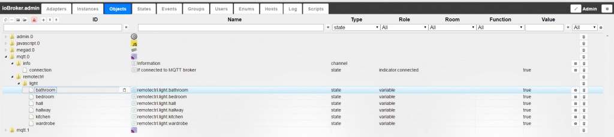

# Beschreibung

[MQTT](http://mqtt.org/) (Message Queue Telemetry Transport) ist ein schlankes Protokoll für die Kommunikation zwischen verschiedenen Geräten (M2M - machine-to-machine). Es benutzt das publisher-subscriber Modell um Nachrichten über das TCP / IP Protokoll zu senden. Die zentrale Stelle des Protokolls ist der MQTT-Server oder Broker Der Zugriff auf den publisher und den subscriber besitzt. Dieses Protokoll ist sehr simpel: ein kurzer Header ohne Integrität (deshalb setzt die Übermittlung auf TCP auf), legt der Struktur keinerlei Beschränkungen beim Code oder einem Datenbankschema auf. Die einzige Bedingung ist dass jedes Datenpaket eine Information zur Identifikation beinhalten muss. Diese Identifikationsinformation heißt Topic Name.

Das MQTT Protokoll benötigt einen Datenbroker. Dieses ist die zentrale Idee dieser Technologie. Alle Geräte senden ihre Daten nur zu diesem Broker und erhalten ihre Informationen auch nur von ihm. Nach dem Empfang des Paketes sendet der Broker es zu allen Geräten in dem Netzwerk, die es abonniert haben. Wenn ein Gerät etwas von dem Broker möchte, muss er das entsprechende Topic abonnieren. Topics entstehen dynamisch bei Abonnement oder beim Empfang eines Paketes mit diesem Topic. Nach dem Abonnement eines Topics braucht man nichts mehr zu tun. Deswegen sind Topics sehr bequem um verschiedenen Beziehungen zu organisieren: one-to-many, many-to-one and many-to-many.

**Wichtig:**

*   Die Geräte stellen selber die Kommunikation mit dem Broker her. Sie können hniter einer NAT liegen und  müssen keine feste IP besitzen,
*   Man kann den Traffic mit SSL absichern,
*   MQTT Broker ermöglichen es diese über ein Websocket Protokoll auf Port 80 zu erreichen,
*   Mehrere Broker können miteinander verbunden werden und abonnieren dann die Nachrichte gegenseitig.

# Steckbrief

<table width="100%">

<tbody>

<tr>

<td style="width: 50%; height: 20px;">**Aktuelle Version**</td>

<td style="width: 50%; height: 20px;"></td>

</tr>

<tr>

<td style="width: 50%; height: 20px;">**Voraussetzungen**</td>

<td style="width: 50%; height: 20px;">/</td>

</tr>

<tr>

<td style="width: 50%; height: 20px;">**Entwickler**</td>

<td style="width: 50%; height: 20px;">Bluefox</td>

</tr>

<tr>

<td style="width: 50%; height: 20px;">**Keywords**</td>

<td style="width: 50%; height: 20px;">data transmission, sensors, cloud, publish/subscribe</td>

</tr>

<tr>

<td style="width: 50%; height: 20px;">**Github**</td>

<td style="width: 50%; height: 20px;">

 [Link](https://github.com/ioBroker/ioBroker.mqtt)</td>

</tr>

<tr>

<td style="width: 50%; height: 20px;">**Platform**</td>

<td style="width: 50%; height: 20px;">Javascript/Node.js</td>

</tr>

<tr>

<td style="width: 50%; height: 20px;">**Lizenz**</td>

<td style="width: 50%; height: 20px;">MIT</td>

</tr>

</tbody>

</table>

# Installation

Die Installation findet im Admin im Reiter _**Adapter**_ statt. In der Gruppe Kommunikation befindet sich eine Zeile **_MQTT Adapter_**, dort wird über das (+)-Icon ganz rechts eine neue Instanz angelegt. [

 Ein pop-up Fenster erscheint mit den Installationsinformationen und schließt nach der Installation eigenständig. [

 Wenn alles klappt befindet sich anschließend unter dem Reiter _**Instanzen**_ die neu installierte **mqtt.0** Instanz. [

# Konfiguration

Wie bereits oben gesagt, besteht ein MQTT-System aus einem Broker und Clients.  Der ioBroker Server kann als Broker oder als Client arbeiten.  Entsprechend des gewünschten Modus wird der Typ auf _**server/broker**_ oder **_Client/subscriber_** eingestellt. Hier sollte die Einstellung gut überlegt werden.

## IoBroker als MQTT-Broker

Die Grundeinstellungen um den Adapter als Server/Broker zu verwenden sind in der Abbildung gezeigt: 

### Allgemeine Einstellungen

*   **Typ** - Entsprechend der gewünschten Verwendung wird der Typ auf _**server/broker**_ oder **_Client/subscriber_** eingestellt
*   **Use WebSockets** - Wenn man Websockets für die Verbindung benötigt, muss diese Checkbox aktiviert werden. Dann läuft der TCP-Server parallel zum WebSocket Server,
*   **Port** - Der Port um mit TCP zu verbinden (default: 1883),  ein WebSocket Server (siehe oben) läuft einen Port höher (default: 1884),

### Verbindungseinstellungen

*   **SSL** - Diese Option wird benötigt um den gesamten Datenverkehr zu verschlüsseln (TCP und WebSocket), deshalb muss man in den jetzt zur Verfügung stehenden Feldern die zu verwendenden Zertifikate angeben. In den Pulldowns kann man diese aus den in den Systemeinstellungen angelegten Zertifikaten auswählen,

### Authentication Einstellungen

*   **Username** und **Passwort** - Wenn gewünscht kann hier ein Username und ein Passwort vergeben werden. Dies muss auf jeden Fall mit SSH Verschlüsselung benutzt werden, damit Passworte nicht unverschlüsselt übertragen werden.

### MQTT Einstellungen

*   **Maske für Bekanntgeben von eigenen States** - Diese Maske (oder mehrere durch Komma getrennt)dienen dazu die Variablen zu filtern, die an den Client geschickt werden sollen. Man kann Sonderzeichen angeben um eine Gruppe von Nachrichten zu definieren (z.B.  `memRSS, mqtt.0` - sendet alle Variablen zum memory status aller Adapter und alle variablen der **mqtt.0 Adapter** Instanz),
*   **Publish nur bei Änderungen** - sending data to the client will be made only in case of change of a variable (if the state simply update - the value is not changed, the customer message will not be sent) from the client will be accepted any message, even if the value has not changed,
*   **To give private values at startup** - for each successful client connection will be transferred to all known states (defined by the mask state) – in order to tell the client about the current state of the ioBroker,
*   **Post status subscribes** - immediately after the subscription will be sent to the customer value of the variable on which it is signed (at the first start or restart the client will receive the values of variables on which it is signed, can be used to initialize variables),
*   **The prefix for all values** - if the specified value, it will be added as a prefix to every sent topic, for example, if you specify iobroker/, then all topics sent along the following lines: `iobroker/mqtt/0/connected`,
*   **Output log for each change** - in the log file will display debugging information for each change,
*   **To send not only commands, but also the state (ack=true)** - if this option is not active, the client will only send variables/commands with ack=false, if the flag is set, then variables will be transferred regardless of the state of ack (false / true),
*   **The maximum length of the name of a topic** - the maximum number of characters for the description of the topic, including service.

As an example, consider the exchange of data between the client based on the [arduino board](https://www.arduino.cc/) and the broker is an instance of mqtt.0 driver system ioBroker.

*   - the client – the fee for developing [arduino UNO](https://www.arduino.cc/en/Main/ArduinoBoardUno) + [ethernet shield](https://store.arduino.cc/product/A000072) based on W5100 chip,
*   - to work with the ethernet board uses the standard [library](https://www.arduino.cc/en/Reference/Ethernet) for working with MQTT library [Pubsubclient](https://github.com/knolleary/pubsubclient),
*   - the AM2302 sensor (temperature and humidity) connected to pin_8 for the survey used library with DHTlib with [DHTlib](https://github.com/RobTillaart/Arduino/tree/master/libraries/DHTlib) resource github.com,
*   - led **led_green** is connected to pin_9, control in discrete mode on/off
*   - broker – ioBroker system driver mqtt.

Format topics of data exchange:

*   `example1/send_interval` - client signed to change the transmission interval of the temperature readings and humidity (int value in seconds),
*   `example1/temp` - client publishes a specified temperature interval with DHT22 sensor (float type),
*   `example1/hum` - client publishes a specified humidity value intervals with DHT22 sensor (float type),
*   `example1/led` - the client is subscribed to the state change of the led (the text on/off or 0/1 or true/false).

Driver settings will be as follows: [

 Connecting via TCP (WebSocket is not necessary), default port 1883\. The client within the local network, so to encrypt traffic and authenticate the user is not necessary. We will send only the changes since the client signed on the send interval indications and led state to obtain information about the update (without changing the value) to a variable makes no sense. To publish the subscription - note this option, as when you first connect (or connected after disconnection) of the client, he must know the state of the variables on which it is signed (a current interval of sending and whether the LED is to be turned on). Setting to send variables ack = true or false is also worth noting, as a variable (which signed the client) can change any driver / script / VIS and any changes should be sent to the client. The complete code for the arduino board will look like this:

<pre>// Connecting libraries
#include
#include
#include //https://github.com/knolleary/pubsubclient
#include //https://github.com/RobTillaart/Arduino/tree/master/libraries/DHTlib
//Settings of a network
byte mac[] = {
0xAB,
0xBC,
0xCD,
0xDE,
0xEF,
0x31
};
byte ip[] = {
192,
168,
69,
31
}; //arduino board IP address
byte mqttserver[] = {
192,
168,
69,
51
}; // ioBroker server IP address
EthernetClient ethClient;
void callback(char * topic, byte * payload, unsigned int length);
PubSubClient client(mqttserver, 1883, callback, ethClient);
//Global variables
#define LED_pin 9
unsigned int send_interval = 10; // the sending interval of indications to the server, by default 10 seconds
unsigned long last_time = 0; // the current time for the timer
dht DHT;
#define DHT22_PIN 8
char buff[20];
// The processing function for incoming connections - reception of data on a subscription
void callback(char * topic, byte * payload, unsigned int length) {
Serial.println("");
Serial.println("-------");
Serial.println("New callback of MQTT-broker");
// let's transform a subject (topic) and value (payload) to a line
payload[length] = '\0';
String strTopic = String(topic);
String strPayload = String((char * ) payload);
// research that "arrived" from the server on a subscription::
// Change of an interval of inquiry
if (strTopic == "example1/send_interval") {
int tmp = strPayload.toInt();
if (tmp == 0) {
send_interval = 10;
} else {
send_interval = strPayload.toInt();
}
}
// Control of a LED
if (strTopic == "example1/led") {
if (strPayload == "off" || strPayload == "0" || strPayload == "false") digitalWrite(LED_pin, LOW);
if (strPayload == "on" || strPayload == "1" || strPayload == "true") digitalWrite(LED_pin, HIGH);
}
Serial.print(strTopic);
Serial.print(" ");
Serial.println(strPayload);
Serial.println("-------");
Serial.println("");
}
void setup() {
Serial.begin(9600);
Serial.println("Start...");
// start network connection
Ethernet.begin(mac, ip);
Serial.print("IP: ");
Serial.println(Ethernet.localIP());
// initialize input/output ports, register starting values
pinMode(LED_pin, OUTPUT);
digitalWrite(LED_pin, LOW); // when the LED is off
}
void loop() {
// If the MQTT connection inactively, then we try to set it and to publish/subscribe
if (!client.connected()) {
Serial.print("Connect to MQTT-boker... ");
// Connect and publish / subscribe
if (client.connect("example1")) {
Serial.println("success");
// Value from sensors
if (DHT.read22(DHT22_PIN) == DHTLIB_OK) {
dtostrf(DHT.humidity, 5, 2, buff);
client.publish("example1/hum", buff);
dtostrf(DHT.temperature, 5, 2, buff);
client.publish("example1/temp", buff);
}
// subscribe for an inquiry interval
client.subscribe("example1/send_interval");
// subscribe to the LED control variable
client.subscribe("example1/led");
} else {
// If weren't connected, we wait for 10 seconds and try again
Serial.print("Failed, rc=");
Serial.print(client.state());
Serial.println(" try again in 10 seconds");
delay(10000);
}
// If connection is active, then sends the data to the server with the specified time interval
} else {
if (millis() & gt;
(last_time + send_interval * 1000)) {
last_time = millis();
if (DHT.read22(DHT22_PIN) == DHTLIB_OK) {
dtostrf(DHT.humidity, 5, 2, buff);
client.publish("example1/hum", buff);
dtostrf(DHT.temperature, 5, 2, buff);
client.publish("example1/temp", buff);
}
}
}
// Check of incoming connections on a subscription
client.loop();
}
</pre>

The result of the part of the broker (temperature and humidity data is updated with the preset time period): [

 The result of the client-side (incoming data subscription output to the console for debugging): 

## IoBroker working as MQTT-client

For an instance MQTT driver earned as a client / subscriber - you need to choose the appropriate type of configuration. In this set of options will change slightly: 

### Allgemeine Einstellungen

*   Typ

### Verbindungseinstellungen

- specifies the URL and port of the broker (if you want to encrypt traffic, indicated SSL) - settings to connect to the broker,

### **Authentication settings**

*   - user name and password, if the broker requires authentication (it is appropriate to use SSL to avoid transmitting the password in clear text),

### MQTT Einstellungen

*   **Patterns** - a mask for variables for which the customer subscribes (variables broker), the values are listed separated by commas, the # (pound) is used to indicate the set,
*   **Mask private values** - filter variables that should be published (client variables) whose values are listed separated by commas, for indicating a set use the symbol * (asterisk),
*   **To send only changes** - the client will publish only the variables that changed value (according to mask),
*   **To give private values at startup** - if this option is checked, the will be published all the States (according to mask) every time a connection is established, to declare the available variables and their values,
*   **The prefix for all values** - if the specified value, it will be added as a prefix to each published topic, for example, if you specify client1 /, then all topics will be published the following lines: `client1/javascript/0/cubietruck`,
*   **Output log for each change** - in the log file will display debugging information for each change,
*   **To send not only the team, but also the state (ack = true)** - if this option is not checked, the broker only sent variables / commands with ack = false, if the option to note that will be sent to all data, regardless of ack = true or ack = false,
*   **The maximum length of a topic** - the maximum number of characters for the description of the topic, including service.

Examples for setting the subscription mask variables (patterns). Consider topics:

*   "Sport"
*   "Sport/Tennis"
*   "Sport/Basketball"
*   "Sport/Swimming"
*   "Sport/Tennis/Finals"
*   "Sport/Basketball/Finals"
*   "Sport/Swimming/Finals"

If you want to subscribe to a certain set of topics, you can use the characters # (pound sign) or + (plus sign).

*   "Sport/Tennis/#" (subscription only "Sport/Tennis" and "Sport/Tennis/Finals")
*   "Sport/Tennis/+" (subscription only "Sport/Tennis/Finals", but not "Sport/Tennis")

For JMS topics, if you want to subscribe to all topics "Finals", you can use the characters # (pound sign) or + (plus sign)

*   "Sport/#/Finals"
*   "Sport/+/Finals"

For MQTT topics if you want to subscribe to all topics "Finals", you can use the + (plus sign)

*   "Sport/+/Finals"

As an example, consider the exchange of data between the two systems ioBroker. There is a working system ioBroker for BananaPi-Board (IP address 192.168.69.51), it launched MQTT- driver in the server/broker mode from the example above. To the server connects a client that publishes data from the sensor DHT22 – temperature and humidity, as well as signed variables of interval measurement transmission and the status led (enable/disable) – in the example above. The second operating system ioBroker on the Board Cubietruck, it will run the MQTT driver in a client/subscriber mode. He signs up for the variables temperature and humidity of the broker (which, in turn, receives from another client) and will publish all the script variables - [the state of the battery](http://www.iobroker.net/?page_id=4268&lang=ru#_Li-polLi-ion) board (only the changes). Client configuration will be similar to the following: [

 Connection type – the customer/subscriber indicates the IP address of the broker and the port (default 1883). Traffic encryption and authentication is not needed. Mask for the subscriptions (Patterns) - `mqtt/0/example1/hum,mqtt/0/example1/temp` - client is subscribed only on temperature and humidity (values separated by comma without spaces). Mask the data for publication - `javascript.0.cubietruck.battery.*` - publish all the script variables `cubietruck` in the group `battery` driver `javascript.0`. To send only the changes - send state variables batteries (makes no sense to send if the value has not changed). To give private values at startup – when starting the driver, the client immediately will release all variables according to the mask – even if they are null or empty to create variables in the broker. To send data with ack=false, variables work battery updated driver javascript, so they are always ack=false. The result of the work on the client side (temperature and humidity data of another customer - see the example above): [

 The result of the broker (status data of the battery client): [

## Application - MQTT gateway protocols - ModBus RTU

Driver MQTT can be used as a gateway for various protocols to connect new devices to the system ioBroker or any other. A universal basis for the development of such solutions are arduino boards. In a network many examples, libraries and best practices. A huge community is working with these controllers, and the system integrated a variety of devices/equipment/devices. For example, consider the common industrial protocol ModBus. In ioBroker system has a driver to work with it - version ModBus TCP (over ethernet). A set of sensors, controllers and actuators work physically on the RS-485 Network / 232 and ModBus RTU protocol. In order to integrate them can be applied MQTT Gateway - ModBus RTU based on arduino platform. Consider an example. **There is a temperature and humidity sensor** (for the test on the basis of arduino pro mini board DHT22 Sensor), that outputs data via ModBUS RTU:

*   Port UART (you can use MAX485 chip to convert RS-485 interface) running at 9600 with options 8E1 (1 start bit, 8 data bits, 1 Even parity bit, 1 stop bit),
*   the address of the ModBus – 10,
*   temperature address 0 the value multiplied by 10 (the reader function 3),
*   humidity – address 1 value multiplied by 10 (read function 3),
*   PWM LED address 2 value 0...1023 to check the recording function (write function 6).

Connection scheme: [caption id="" align="alignnone" width="401"] by Fritzing[/caption] Code for arduino pro mini controller produces the following:

<pre>#include  //https://github.com/RobTillaart/Arduino/tree/master/libraries/DHTlib
#include  //https://code.google.com/archive/p/simple-modbus/
#include  //https://github.com/PaulStoffregen/MsTimer2
// modbus registers
enum {
TEMP,
HUM,
PWM,
TEST,
HOLDING_REGS_SIZE
};
#define ID_MODBUS 10 // modbus address of the slave device
unsigned int holdingRegs[HOLDING_REGS_SIZE]; // modbus register array
// temperature and humidity sensor DHT22
dht DHT;
#define DHT22_PIN 2
#define LED 9 // LED is connected to the PWM pin-9
void setup()
{
// configure the modbus
modbus_configure(& Serial, 9600, SERIAL_8E1, ID_MODBUS, 0, HOLDING_REGS_SIZE, holdingRegs);
holdingRegs[TEST] = -157; // for the test of the negative values
// initialize a timer for 2 seconds update data in temperature and humidity registers
MsTimer2::set(2000, read_sensors);
MsTimer2::start(); // run timer
pinMode(LED, OUTPUT); // LED port initialization
}
// the function launched by timer each 2 seconds
void read_sensors()
{
if (DHT.read22(DHT22_PIN) == DHTLIB_OK) {
if
data from the sensor DHT22 managed to be read
// we write integer value in the register of humidity
holdingRegs[HUM]
= 10 * DHT.humidity;
// we write integer value in the register of temperature
holdingRegs[TEMP] = 10 * DHT.temperature;
}
else {
// if it wasn't succeeded to read data from the sensor DHT22, we write zero in registers
holdingRegs[HUM] = 0;
holdingRegs[TEMP] = 0;
}
}
void loop()
{
modbus_update(); // modbus data update
// data from the LED control register transmit to the PWM (bit shift by 2 bits)
analogWrite(LED, holdingRegs[PWM] & gt; > 2);
}</pre>

To test the operation code and schema, you can connect to port serial board (for example, using a USB-UART Converter) and a special program to interview just made the temperature sensor and humidity with ModBus RTU interface. For the survey can be used, for example, [qmodbus](http://qmodbus.sourceforge.net/) or any other program. Settings:

*   port (choose from the list which port is connected to the serial Arduino boards);
*   speed and other parameters – 9600 8E1;
*   slave id: 10, read: function No. 3 read holding registers, starting address: 0, number of registers: 3,
*   slave id: 10, record: function No. 6 write single register start address: 2,

The answer in the program when reading should be approximately the following: [

 The answer in the program when recording:  **Now configure the gateway itself and connect it to the iobroker** The gateway will be based on the platform arduino MEGA 2560 with ethernet shield - client MQTT, broker - an instance mqtt.0 ioBroker system driver. Choosing the MEGA 2560 due to the fact that on this Board more than one UART port, respectively, is zero Serial0 (pin_0 (RX) and pin_1 (TX)) or simply Serial – use to output debug messages, and Serial1 (pin_19 (RX) and pin_18 (TX)) – for slave via ModBus.

*   the client – the fee for developing arduino MEGA 2560 + ethernet shield based on W5100 chip;
*   to work with the ethernet board uses the [standard library](https://www.arduino.cc/en/Reference/Ethernet) for working with MQTT library [Pubsubclient](https://github.com/knolleary/pubsubclient);
*   for the survey on the modbus use library [SimpleModbus](https://code.google.com/archive/p/simple-modbus/) version master;
*   survey on UART port (just connect the RX port master, TX port slave and respectively TX port master, RX port slave), transmission control port is not used (it is for RS-485);
*   port settings: speed 9600, 8Е1;
*   - the address of the slave device 10, a function of reading number 3 (read holding registers), recording function no. 6 (write single register);
*   - broker – ioBroker system driver mqtt.

Format topics of data exchange:

*   `modbusgateway/send_interval` - client signed to change the transmission interval of the temperature readings and humidity (int value in seconds),
*   `modbusgateway/temp` - client publishes with a a given interval the value of the temperature sensor DHT22 (type float),
*   `modbusgateway/hum` - the client publishes with a given interval the value of the humidity sensor DHT22 (type float),
*   `modbusgateway/led` - the client is subscribed to the state change of the led (PWM control value 0...1024).

СThe connection diagram will look something like this: [caption id="" align="alignnone" width="699"][

 For the test slave device energized from the master device. The Master in turn will work from the USB port, which is being debug (Serial0). Driver settings will be as follows: [

 Connecting via TCP (WebSocket is not necessary), default port 1883\. The client within the local network, so to encrypt traffic and authenticate the user is not necessary. We will send only the changes since the client signed on the send interval indications and led state to obtain information about the update (without changing the value) to a variable makes no sense. To publish the subscription - note this option, as when you first connect (or connected after disconnection) of the client, he must know the state of the variables on which it is signed (a current interval of sending and whether the LED is to be turned on). Setting to send variables ack = true or false is also worth noting, as a variable (which signed the client) can change any driver / script / VIS and any changes should be sent to the client. The complete code for the arduino board will look like this:

<pre>// Connecting libraries
#include
#include
#include  //https://github.com/knolleary/pubsubclient
#include  //https://github.com/RobTillaart/Arduino/tree/master/libraries/DHTlib
// Settings of a network
byte mac[] = { 0xAB, 0xBC, 0xCD, 0xDE, 0xEF, 0x31 };
byte ip[] = { 192, 168, 69, 31 }; // arduino board IP address
byte mqttserver[] = { 192, 168, 69, 51 }; // ioBroker server IP address
EthernetClient ethClient;
void callback(char* topic, byte* payload, unsigned int length);
PubSubClient client(mqttserver, 1884, callback, ethClient);
// Global variables
unsigned int send_interval = 10; // the sending interval of indications to the server, by default 10 seconds
unsigned long last_time = 0; // the current time for the timer
dht DHT;
#define DHT22_PIN 8
char buff[20];
//The processing function for incoming connections - reception of data on a subscription
void callback(char* topic, byte* payload, unsigned int length)
{
Serial.println("");
Serial.println("-------");
Serial.println("New callback of MQTT-broker");
// let's transform a subject (topic) and value (payload) to a line
payload[length] = '\0';
String strTopic = String(topic);
String strPayload = String((char*)payload);
// Research that "arrived" from the server on a subscription:
// Change of an interval of inquiry
if (strTopic == "example2/send_interval") {
int tmp = strPayload.toInt();
if (tmp == 0) {
send_interval = 10;
}
else {
send_interval = strPayload.toInt();
}
}
Serial.print(strTopic);
Serial.print(" ");
Serial.println(strPayload);
Serial.println("-------");
Serial.println("");
}
void setup()
{
Serial.begin(9600);
Serial.println("Start...");
// start network connection
Ethernet.begin(mac, ip);
Serial.print("IP: ");
Serial.println(Ethernet.localIP());
// initialize input/output ports, register starting values
}
void loop()
{
// If the MQTT connection inactively, then we try to set it and to publish/subscribe
if (!client.connected()) {
Serial.print("Connect to MQTT-boker... ");
// Connect and publish / subscribe
if (client.connect("example2")) {
Serial.println("success");
// Value from sensors
if (DHT.read22(DHT22_PIN) == DHTLIB_OK) {
dtostrf(DHT.humidity, 5, 2, buff);
client.publish("example2/hum", buff);
dtostrf(DHT.temperature, 5, 2, buff);
client.publish("example2/temp", buff);
}
// Subscribe for an inquiry interval
client.subscribe("example2/send_interval");
}
else {
// If weren't connected, we wait for 10 seconds and try again
Serial.print("Failed, rc=");
Serial.print(client.state());
Serial.println(" try again in 10 seconds");
delay(10000);
}
// If connection is active, then sends the data to the server with the specified time interval
}
else {
if (millis() & gt; (last_time + send_interval * 1000)) {
last_time = millis();
if (DHT.read22(DHT22_PIN) == DHTLIB_OK) {
dtostrf(DHT.humidity, 5, 2, buff);
client.publish("example2/hum", buff);
dtostrf(DHT.temperature, 5, 2, buff);
client.publish("example2/temp", buff);
}
}
}
// Check of incoming connections on a subscription
client.loop();
}
</pre>

This solution can be used as a prototype (example) ModBus network in your automation system. The data from the slave is transmitted with the desired spacing in the ioBroker. [

 MQTT client signed variables and redirects needed in slave-device on the ModBus network. 

## Application - connecting mobile clients

Recently MQTT protocol became very common due to the simplicity, economy of the traffic and the elaboration of good libraries for different platforms. There are many programs to work with MQTT on mobile devices, for example [IoT MQTT Dashboard](https://play.google.com/store/apps/details?id=com.thn.iotmqttdashboard&hl=en). With this program you can connect to the MQTT broker in a local network or the Internet. Consider an example, in the role of the broker will be the ioBroker system, to which using MQTT to connect the client – application IoT MQTT Dashboard. In this example, we control the light controller [MegaD-328](http://www.ab-log.ru/smart-house/ethernet/megad-328), which is connected to the ioBroker with the driver [MegaD](http://www.iobroker.net/?page_id=4052&lang=en). Controls relay (MegaD port **P7**) light in the lobby, a special script, which is signed by the state of the port - button **P0** and MQTT-variable state **mqtt.0.remotectrl.light.hall**, which will publish the mobile client. This script toggles the state of the port that is bound to the switch (port P7), ie inverts it. It turns out that each time you press the button, electrically connected to port **P0** (caught the **true** state) and every time you publish variable **mqtt.0.remotectrl.light.hall** value as **true**, the port **P7** to turn on or off the light. The text of the script will be like this:

<pre class="">// Control of lighting in the hall by means of the button p0 port of the MegaD controller the driver instance megad.0
on({ id : 'megad.0.p0_P0', change : 'any' }, function(obj) {
if (obj.newState.val != = '' || typeof obj.newState.val != = "undefined") {
if (obj.newState.val == = true) {
if (getState('megad.0.p7_P7').val == = true) {
setState('megad.0.p7_P7', false);
}
else {
setState('megad.0.p7_P7', true);
}
}
}
});
// Control of lighting in the hall is remote on MQTT a topic "mqtt.0.remotectrl.light.hall"
on({ id : 'mqtt.0.remotectrl.light.hall', change : 'any' }, function(obj) {
if (obj.newState.val != = '' || typeof obj.newState.val != = "undefined") {
if (obj.newState.val == = true) {
if (getState('megad.0.p7_P7').val == = true) {
setState('megad.0.p7_P7', false);
}
else {
setState('megad.0.p7_P7', true);
}
}
}
});
</pre>

Connect button and light bulbs to MegaD controller: [

 MQTT driver settings: [

 The mobile client can publish data to variable mqtt.0.remotectrl.light.hall and signs up for a real port status MegaD – megad.0.p7_P7\. The configure publishing and subscriptions: [

 [

 In total for one channel light control turn the control window (publish) and subscription window is a real condition light relay (for feedback): 

## Application - working with cloud servers

The example described above has several disadvantages. First, it is not always the mobile client may be on the same local network as the server ioBroker, and secondly, even if you implement port forwarding in the Internet and to protect the connection, not always the server itself ioBroker can accept incoming connection (located behind a NAT which has no access to settings). In the global network many different services that support MQTT - paid and free, for example sending weather data, geolocation, etc. Some services may act as MQTT protocol broker and can be used as a gateway (bridge) to output data from ioBroker the global network, or to obtain data in ioBroker. As an example, consider the work of the bundles:

*   server / broker - service [cloudmqtt.com](https://www.cloudmqtt.com/) (there is a free tariff),
*   customer/subscriber – the ioBroker system with access to the Internet, publishes data of temperature and humidity (see [example above](http://www.iobroker.net/?page_id=6435&lang=en#ioBroker_working_as_MQTT-broker)), publishes the real status of ports **P7-P13** (relay driver MegaD **megad.0** – light control), subscribing to properties of the remote light control (an instance of the driver mqtt **mqtt.0**),
*   килент/подписчик - приложение [IoT MQTT Dashboard](https://play.google.com/store/apps/details?id=com.thn.iotmqttdashboard&hl=en) для удаленной работы - подписка на данные сенсора температуры и влажности, подписка на реальное состояние портов **P7-P13** (реле MegaD драйвера **megad.0**), публикация переменных удаленного управления светом (экземпляр драйвера **mqtt.0**). - customer/subscriber – the application of [IoT MQTT Dashboard](https://play.google.com/store/apps/details?id=com.thn.iotmqttdashboard&hl=en) to work remotely – subscribe to sensor data of temperature and humidity, subscription to the real status of ports **P7-P13** (relay driver MegaD **megad.0**), publication of variables of a remote control light (driver instance **mqtt.0**).

he result is the following structure: [

 Bundle driver **mqtt.1** (broker) – Arduino UNO + Ethernet + DHT22 (client) as in [the example above](http://www.iobroker.net/?page_id=6435&lang=en#ioBroker_working_as_MQTT-broker) with a few modifications. Configuring an instance of the mqtt **driver.1**: [

 Code for the arduino platform:

<pre>// Connecting libraries
#include
#include
#include  //https://github.com/knolleary/pubsubclient
#include  //https://github.com/RobTillaart/Arduino/tree/master/libraries/DHTlib
// Settings of a network
byte mac[] = { 0xAB, 0xBC, 0xCD, 0xDE, 0xEF, 0x31 };
byte ip[] = { 192, 168, 69, 31 }; // arduino board IP address
byte mqttserver[] = { 192, 168, 69, 51 }; // ioBroker server IP address
EthernetClient ethClient;
void callback(char* topic, byte* payload, unsigned int length);
PubSubClient client(mqttserver, 1884, callback, ethClient);
// Global variables
unsigned int send_interval = 10; // the sending interval of indications to the server, by default 10 seconds
unsigned long last_time = 0; // the current time for the timer
dht DHT;
#define DHT22_PIN 8
char buff[20];
//The processing function for incoming connections - reception of data on a subscription
void callback(char* topic, byte* payload, unsigned int length)
{
Serial.println("");
Serial.println("-------");
Serial.println("New callback of MQTT-broker");
// let's transform a subject (topic) and value (payload) to a line
payload[length] = '\0';
String strTopic = String(topic);
String strPayload = String((char*)payload);
// Research that "arrived" from the server on a subscription:
// Change of an interval of inquiry
if (strTopic == "example2/send_interval") {
int tmp = strPayload.toInt();
if (tmp == 0) {
send_interval = 10;
}
else {
send_interval = strPayload.toInt();
}
}
Serial.print(strTopic);
Serial.print(" ");
Serial.println(strPayload);
Serial.println("-------");
Serial.println("");
}
void setup()
{
Serial.begin(9600);
Serial.println("Start...");
// start network connection
Ethernet.begin(mac, ip);
Serial.print("IP: ");
Serial.println(Ethernet.localIP());
// initialize input/output ports, register starting values
}
void loop()
{
// If the MQTT connection inactively, then we try to set it and to publish/subscribe
if (!client.connected()) {
Serial.print("Connect to MQTT-boker... ");
// Connect and publish / subscribe
if (client.connect("example2")) {
Serial.println("success");
// Value from sensors
if (DHT.read22(DHT22_PIN) == DHTLIB_OK) {
dtostrf(DHT.humidity, 5, 2, buff);
client.publish("example2/hum", buff);
dtostrf(DHT.temperature, 5, 2, buff);
client.publish("example2/temp", buff);
}
// Subscribe for an inquiry interval
client.subscribe("example2/send_interval");
}
else {
// If weren't connected, we wait for 10 seconds and try again
Serial.print("Failed, rc=");
Serial.print(client.state());
Serial.println(" try again in 10 seconds");
delay(10000);
}
// If connection is active, then sends the data to the server with the specified time interval
}
else {
if (millis() & gt; (last_time + send_interval * 1000)) {
last_time = millis();
if (DHT.read22(DHT22_PIN) == DHTLIB_OK) {
dtostrf(DHT.humidity, 5, 2, buff);
client.publish("example2/hum", buff);
dtostrf(DHT.temperature, 5, 2, buff);
client.publish("example2/temp", buff);
}
}
}
// Check of incoming connections on a subscription
client.loop();
}</pre>

The result of the work - **mqtt.1** driver objects: [

 Now let's set up publish/subscribe data to the cloud. For a start, register on the site [cloudmqtt.com](https://www.cloudmqtt.com/), select the desired rate, create instance, get settings: [

 For greater security it is better to create a separate user, assume that it will be user **iobroker**with the password **1234**. Give user permission to read and write in any topic: [

 Next set the instance of the mqtt **driver.0** to connect as a client/subscriber cloud broker and a list of publications/subscriptions: [

*   connection type – the customer/subscriber,
*   connection settings – specify the URL issued in the control panel [cloudmqtt.com](https://www.cloudmqtt.com/) the port will use **22809**that works with **SSL**,
*   in the authentication options specify the user name and password,
*   patterns – our client ioBroker will be signed on all the topics that are in the cloud, so you specify here the number sign (**#**), you can use a mask to selectively subscribe,
*   mask of the eigenvalues client will publish to the server **temperature/humidity** and the status of all ports megaD (ports with relay P7-P13),this field separated by a comma specify the required variables: **mqtt.1.example2.hum,mqtt.1.example2.temp,megad.0.p7_P7,megad.0.p8_P8,megad.0.p9_P9,megad.0.p10_P10,megad.0.p11_P11,megad.0.p12_P12,megad.0.p13_P13**,
*   to send only changes – put a tick, will publish only the changes,
*   to give your own values at the start – just specify to create topics,
*   to send not only commands, but also the state (ack=true) – it should be noted that setting both the temperature/humidity updated driver mqtt (ack=true).

Settings saved, make sure that the connection is established (on the control panel [cloudmqtt.com](https://www.cloudmqtt.com/) watch the log server). After some time, data will appear (in the panel link **WebsocketUI**): [

 In the end, it remains only to configure a mobile client, for example [IoT MQTT Dashboard](https://play.google.com/store/apps/details?id=com.thn.iotmqttdashboard&hl=en). Create a new connection: [

 Create topics for publication (for example, lighting of the hall - port **P7** MegaD): [

 Создаем топики подписок (температура, влажность, освещение зала порт **P7** MegaD): [

 [

 In the end, your dashboard might look something like this: [

 [

 After the creation of the publications on a mobile device, in the driver instance **mqtt.0** system ioBroker should appear variable light control that should be used in the script for lighting control (see [example above](http://www.iobroker.net/?page_id=6435&lang=en#Application_8211_connecting_mobile_clients)): [

 Congratulations! Now you can control the system ioBroker and receive data via a cloud service!