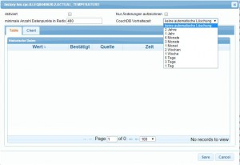
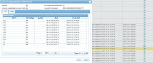

# History

Der history-Adapter dient dem Logging von Datenpunkten. Er speichert in zwei Schritten: zuerst werden die Werte eines Datenpunktes im RAM gespeichert und dann beim Erreichen von maxLength in das Speicherverzeichnis geschrieben.

## Konfiguration

### **[

**

### Storage-Einstellungen

#### Speicherverzeichnis

Pfad zum Verzeichnis, in dem die History-Daten gespeichert werden. Die Angabe kann relativ zum `/iobroker-data` Verzeichnis oder absolut ( `/mnt/history` oder `D:/history` ) erfolgen.

#### Speichern Quelle vom Ereignis mit

Legt fest, ob die Quelle mitgespeichert werden soll. **TODO**

#### Speichern Ack vom Ereignis mit

Legt fest, ob _Ack_ mitgespeichert werden soll. **TODO**

### Default Einstellungen für Zustände

#### Maximale Anzahl von Ereignissen in RAM

Nach dem Erreichen dieser Anzahl werden die Werte vom RAM ins Speicherverzeichnis geschoben.

#### Entprellzeit (ms)

Schutz vor zu häufigen Änderungen eines Wertes

#### Storage Vorhaltezeit

Legt fest, wie lange die Werte gespeichert werden sollen (unendlich, 2 Jahre, 1 Jahre, ..., 1 Tag).

### Demo Data

Todo

## Einstellungen für Datenpunkte

Die Einstellungen für die zu loggenden Datenpunkte werden in dem Reiter „Objekte“ bei dem entsprechenden Datenpunkt durchgeführt. [

 Dazu wählt man ganz rechts in der Spalte das Uhrensymbol zu dem gewünschten Datenpunkt aus. Das Konfigurationsmenü öffnet sich: [

### Aktiviert

Logging des Datenpunktes aktivieren Nur Änderungen aufzeichnen: Es werden nur Werte gespeichert, wenn sich der Wert des Datenpunktes ändert. Das spart Speicherplatz.

### Entprellzeit

Der Vorgabewert liegt bei 10000msec.

### minimale Anzahl Datenpunkte in Redis

Anzahl der Datenpunkte, die in der schnellen Datenbank Redis gehalten werden sollen, der Rest wird in CouchDB gespeichert

### DB Vorhaltezeit

Hier kann man einstellen, ob und wann ältere Daten in der DB automatisch wieder gelöscht werden sollen. Anschließend die Konfiguration speichern und das Fenster schließen. Die entsprechende Uhr ist jetzt grün markiert. Mit dem Uhrensymbol ganz oben rechts im Tabellenheader werden alle Datenpunkte der darunterliegenden Liste geloggt! Dieser Button ist mit Bedacht einzusetzen. Eine sinnvolle Nutzung ergibt sich, wenn man vorher über die Filterfelder in dem Tabellenheader die Datenpunkte so filtert, dass man z.B. nur die "State" Datenpunkte herausfiltert, um sie dann zu loggen [

1.  die Ansicht als Liste ohne Gruppierung anzeigen lassen
2.  den oder die Filterbegriffe eingeben
3.  alle gefilterten Datenpunkte zum loggen auswählen
    1.  Das Konfigurationsmenü für die Einstellungen der log-Parameter öffnet sich
4.  Das loggen für alle gefilterten Datenpunkte auf einmal aktivieren
    1.  Weitere Parameter wie "nur Änderungen" und Vorhaltezeit für alle gefilterten Datenpunkte einheitlich auswählen
5.  Die Änderungen speichern

## **Bedienung**

Wählt man in der Titelzeile unter Historie „With“ aus, werden nur noch Datenpunkte mit Logging angezeigt. [

 Ein Klick auf das Uhrensymbol öffnet die geloggten Daten: [

 Im Reiter Table werden die Daten tabellarisch angezeigt. Eine Sortierung kann durch Anklicken der Spaltenköpfe geändert werden, [

 Im Reiter Chart kann bei installiertem Rickshaw-Adapter eine Verlaufsgrafik angezeigt werden.