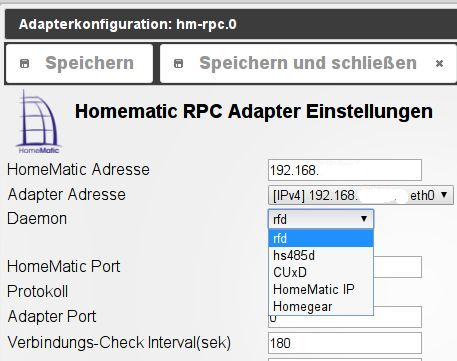

# Adapter - Homematic RPC

Der hm-rpc Adapter bietet die Anbindung an die Kommunikationsmodule einer Homematic-Zentrale CCU2 / CCU1\. Es werden die Module rfd (funk), hs485d (wired), cuxd (Zusatzsoftware zur Anbindung externer Komponenten wie EnOcean, FS20 usw.) und homegear (CCU Ersatz) unterstützt. Eine Instanz des Adapters ist für genau EINES dieser Module zuständig. Sollen mehrere Module parallel unterstützt werden, muss für jedes Modul eine eigene Instanz installiert werden. Der Adapter kommuniziert entweder über BIN-RPC oder XML-RPC mit dem entsprechenden Modul.  Der Adapter arbeitet über eine Ereignisschnittstelle. Daher ist es wichtig, die Adapter Adresse korrekt anzugeben. Die CCU sendet dann automatisch Ereignisse an den Adapter, d.h. ein zyklisches Pollen wie z.B. bei hm-rega ist nicht notwendig. Zustätzlich verfügt der Adapter über die Funktionalität, die Verbindung zur CCU zyklisch zu überwachen. Werden neue Geräte an der CCU angelernt ist es notwendig, den Adapter neu zu starten mit der Konfigration “Initiere Geräte neu (einmalig)”. Dadurch werden die Informationen über die neuen Homematic-Geräte an den Adapter übertragen.

## Konfiguration

    

### HomeMatic Adresse

Hier wird die IP-Adresse der CCU eingegeben, deren Daten in ioBroker übernommen werden sollen. Es können über mehrere Instanzen des Adapters auch mehrere CCU eingebunden werden. Das Format dieser Adresse muss `192.168.xxx.yyy` sein.

* * *

### Adapter Adresse

Hier wird die IP-Adresse des Servers, auf dem ioBroker läuft eingegeben. Es stehen verschiedene Möglichkeiten mit ipv4 und ipv6 über das pulldown-Menü zur Verfügung.  Standard ist ipv4 `0.0.0.0`; allerdings muss hier eine von außen (von der anzusprechenden CCU aus) erreichbare Adresse wie `192.168.xxx.yyy` eingegeben werden, da die CCU bei der Kommunikation die Ereignisse an diese Adresse sendet.

* * *

### Daemon

Der zu überwachende Daemon (derzeit _rfd_, _hs485d_, _cuxd, Homematic IP_ oder _homegear_) 

* * *

### Homematic Port

Der Port in der CCU über den die Daten abgerufen werden können. Für jedes Modul ist hier bereits der passende Standardport eingetragen, er muss daher nur angepasst werden, wenn er auf der CCU selbst verändert wurde.

* * *

### Protokoll

Das Protokoll über das die Daten aus der CCU abgefragt werden sollen. Es stehen _XML-RPC_ und _BIN-RPC_ zur Verfügung. Das empfohlene Protokoll ist _BIN-RPC_.

* * *

### Adapter Port

Der Port auf dem ioBroker-Server. Ist der eingegebene Wert 0 wird hier der gleiche Port verwendet, wie er auch auf der Homematic-Zentrale verwendet wird. Ansonsten kann man hier einen Port frei wählen. z.B.: 3000

* * *

### Verbindungs-Check Intervall (sek)

Die Zeitabstände in denen die Verbindung geprüft werden soll (_default 180_)

* * *

### Synchronisiere Geräte neu (einmalig)

Wenn in der CCU neue Geräte konfiguriert oder Änderungen an bestehenden Geräten durchgeführt wurden, werden die neuen Daten anschließend in ioBroker geladen.

* * *

## Bedienung

Eine manuelle Bedienung des Adapters findet nicht statt. Beim Start wird dem entsprechenden CCU Modul mitgeteilt, Änderungen automatisch an den Adapter zu senden. Diese Ereignisse werden dann in die Datenpunkte von ioBroker übernommen.