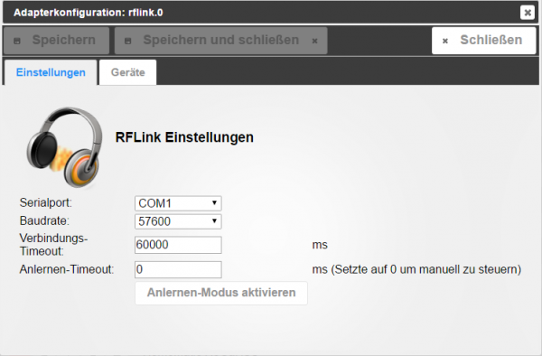
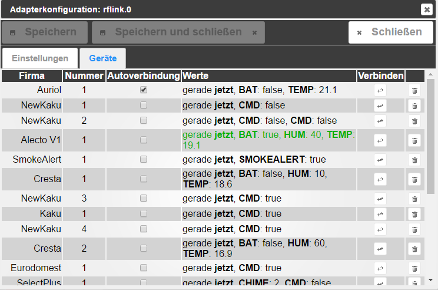

## Bedienungsanleitung

Die Hardware kann man entwider selbst bauen aus Mega2560 + RF Transmitter + RF Receiver bauen oder [hier](http://www.nemcon.nl/blog2/wiring) kann man finden wo man es kaufen kann und wie bauen. Dort kann man auch die [Firmware](http://www.nemcon.nl/blog2/download) als hex dafür finden.   

## Einstellungen

 Die Port-Auswahl geht nur bei laufendem Adapter. Deswegen erst den Adapter starten und dann konfigurieren. (Bei der Installation wird der Adapter automatisch gestartet). Da der Adapter den seriellen port nutzt, muss ioBroker unter root Account laufen, sonst ist es nicht möglich auf seriellen Port zugreifen. Beim ersten Start sollte man "Anlernen-Modus" starten. Der Adapter wird 5 Minuten zuhören und alle Geräte die was gesendet haben in der Liste aufnehmen. 

 Danach wird sich "Anlernen-Modus" nach eingestellte Zeit ausschalten. Um manuell "Anlernen-Modus" steuern zu können muss der "Anlernen-Timeout" auf 0 gesetzt werden.  

## Wiederanlernen

Nach dem als Batterien gewechselt werden, bekommt der Sensor neue Adresse. Damit nach der Batteriewechsel  das Gerät immer noch im System unter gleichen Namen bleibt sollte er neu Verbunden werden. Dafür muss man den Knopf "Verbinden" gegenüber gewünschten Sensor drucken und den Sensor dazu bringen, dass er die Daten schnellstmöglich schickt. Normalerweise, gleich nach Batteriewechsel sendet das Gerät die Daten. Als das gerät neu verbunden wird erlischt der Knopf.  

## Auto Wiederanlernen

Falls im Äther nur eindeutige Geräte sind (unterschiedlicher Brand oder unterschiedlicher Typ) können die Sensoren automatisch angelernt werden. Dafür muss man Checkbox mit Autoverbindung aktivieren. Falls System nicht eindeutig das Gerät identifizieren kann, dann wird Checkbox automatisch deaktiviert.