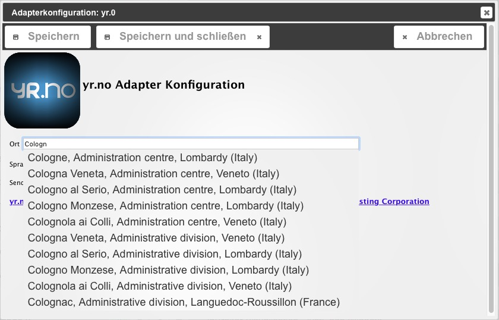
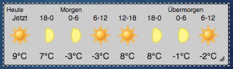

der yr-Adapter lädt Wettervorhersagen vom Server des norwegischen Anbieters _yr.no_ herunter und schreibt sie in Datenpunkte. Diese enthalten die wichtigsten Daten für den aktuellen und die folgenden 2 Tage.

## Konfiguration

### Ort

Hier werden die ersten Buchstaben des gewünschten Ortes eingegeben, bis der gewünschte Ort in der Auswahlliste auftaucht. Diesen dann anklicken. Es ist auch die deutsche Schreibweise möglich. Sollte der gewünschte Ort dann nicht auftauchen, bitte mit englischer Schreibweise versuchen.

### Sprache

Hier die Sprache eingeben, in der das _VIS-widget_ erscheinen soll. Mit Speichern und Schließen die Konfiguration abschließen In der Instanzen Admin Übersicht die Zeile mit dem yr-Adapter das Edit-Icon (Bleistift) anklicken, die Checkbox unter _aktiviert_ anhaken. Dann noch die Zeitplanung einstellen. Diese wird im Format eines Cronjobs angegeben, so bedeutet z.B.: `0,15,30,45 ****`, dass zu jeder Stunde hh:00; hh:15; hh:30; und hh:45 die Daten abgerufen werden. Anschließend mit dem Haken-Icon bestätigen.

* * *

## Bedienung

eine manuelle Bedienung des Adapters findet nicht statt. Anhand des Zeitschemas werden die Daten vom yr-Server heruntergeladen und in die Datenpunkte geschrieben. Eine Darstellung in [_ioBroker.vis_](http://www.iobroker.net/?page_id=2754&lang=de) erfolgt mit Widget - yr.no Weather. Das Widget stellt den Inhalt des Datenpunktes `yr.0.forecast.html` dar. 

 **Tipp:** In der Kategorie _Support/Videos_ gibt es ein [Video](http://www.iobroker.net/?page_id=2387&lang=de) zu diesem Adapter.