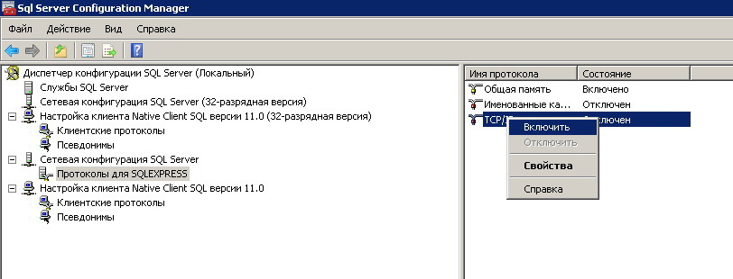
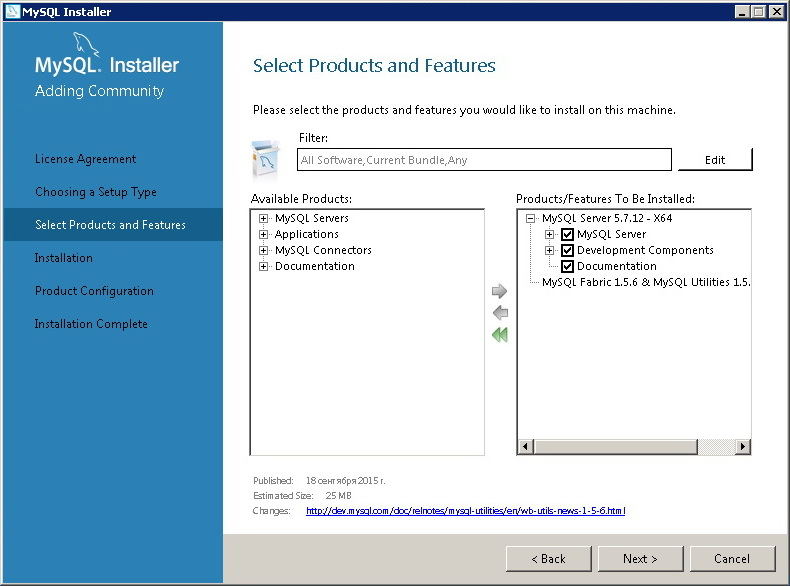
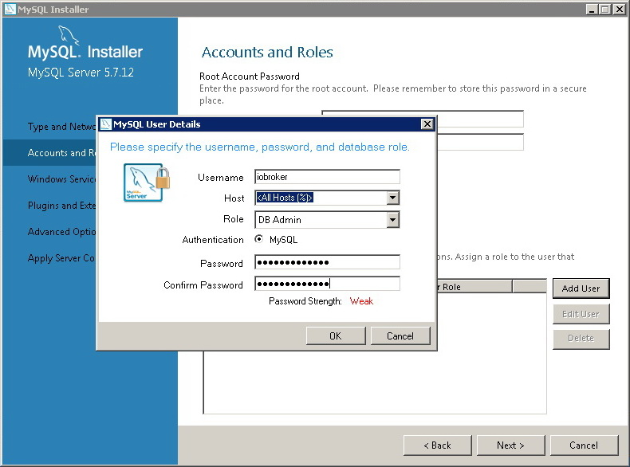

## Description

The SQL adapter allows you to write the states of variables into different databases located either on a local host server or a remote server. This adapter can write data and employ a query to retrieve archivable data. The query has direct access to an optimized and operational database with scripts, adapters, external software and the structure of ioBroker database. 

## Instructions

### Database Support

MS-SQL database. The server is installed on Windows operating system. To test the database MS SQL Server Express must be downloaded first. For management and administration it’s necessary to download install MS SQL Management Studio (which only works on Windows OS). SQLite database. SQLite-embedded cross-platform DB, which has a wide range of SQL functionality. When SQLite process requires a database, it can read and write files directly from database on a hard drive. Therefore, SQlite engine is not an isolated process, which lets program operates on its own, but it’s inseparable from its linked library and the engine is its main component. This solution has some pros (speed, simplicity in use) and also cons (only small projects are maintainable, transactions size is quite limited). For management administration there is a number of tools, for example phpSQLLiteAdmin (running a Web-server is required, e.g. Apache). MySQL database is an open source database management system (DBMS). It is distributed with GNU Public License or with a commercial license from (Oracle Corporation). DB supports cross platforms, such as Linux OS, Windows etc. For management administration there’s a great choice of tools, for example phpMyAdmin( running a Web Server is required) or HeidiSQL. PostgreSQL database. PostgreSQL is a cross-platform object-relational open source DB.

## Installation and settings

### MS-SQL database

As an example we use DB MS SQL Express 2014, from the [Microsoft](https://www.microsoft.com/en-us/download/details.aspx?id=42299) site to install (choose between -x32 or -x64), and if necessary, install MS SQL Management Studio.  During installation we choose the named database instance (by default), SQL-server browser is changed to **Auto** and in Server Configuration we choose the **Mixed Mode** (SQL server authentication and Windows authentication) typing in the password for the user **sa**.  To allow the connection to the port 1443, one needs:

*   Go to **SQL Server Configuration Manager** then Protocols for SQLExpress and enable TCP/IP, input the port number 1443 to all TCP Port fields. Restart the server to activate the new settings.
*   Set the Windows Browser for incoming connections TCP port 1443:

[

 [

  Now let us install the adapter SQL into ioBroker system by pressing the plus button in the line of adapter **SQL History** (storage group) in the folder **Adapters** with Web-interface. Now we move to the Property **Adapter Configuration**, then run the instance of sql.0 adapter (if there are different instances, they will have different names) and apply the **Settings. **Then:

*   choosing the type of DB- **MS-SQL**
*   input the name or IP-host address from the installed DB
*   write the port 1443,
*   indicate the user name sa and password, which we used during the installation of MS SQL 2014 Express
*   if it is necessary, we change the parameter **Minimal Internal ms **(minimal interval of writing data to db)
*   if it is necessary, we change the parameter **Time of retention in the database **(time of retention of data erases the old data)
*   we press the button **Save and close**, the adapter restarts itself. Now we may check our connection to DB.

   In order to check the new entry to DB, we can set the archiving of some variable, for example, let us look at the variables of host ioBroker (CPU load, memory etc). To do this, choose **Object** tab in the top left corner then press the button **Show System objects**, in the table we look for a group system.host.host’s name. we open the list and customize the history storage for the chosen elements (the last button to the right):

*   Click **enabled** option in a group **sql.0**
*   the rest of settings can be left by default
*   then we press **Save and close **button

  [

 [

 Then sometime later, we can open the same variable settings (for example, **system.adapter.admin.0.memRss**) and go to the **table** tab. There you can see the archived elements in the DB. [

 It is possible to install **MS SQL Management Studio** and check the archived data on it. [

 One should also mention the [limitations](img/cc645993%28v_sql.120%29.aspx) of free version of **MS SQL Express 2014** (and consider it when one projects system ioBroker): Maximum computation power, used with 1 installation: no more than 1 CPU and 4 cores. Maximum memory size in use: up to 1 Gb Maximum size of relational database: 10 Gb

### SQlite database

As it has been mentioned before, SQLite is rather quick and easy DB. Let us consider setting of storage of variable history in the current DB on Linux host. No need to install additional packages. If we plan to work with DB through a console, we can install the package **sqlite3**: `$ sudo apt-get update` `$ sudo apt-get install sqlite3` The setup is very simple: 

*   DB type is **SQLite3**
*   **File for SQLite** we leave the settings by default (stored as _**/opt/iobroker/iobroker-data/sqlite/sqlite.db**_), but we can write own path, for example _**/home/user/Dbs/sqlit.db **_(absolute),
*   If necessary, we change the parameter **Minimal interval ms **(the minimal interval of saving the data in to database).
*   If necessary, we change the parameter **Time of storage in the table** (time of storage of data in the table, old data will be erased)
*   Press **Save and close**, adapter restarts

[

 In order to check if the new values are truly added to Db,  one can set up the archiving of a variable or a group of variables(look at the example above **MS SQL Express**); To check the values being kept in the DB, one should open the tab **Table** in the tab history settings or open db file with a special program, for example **SQLite Expert Personal**. [

 

### MySQL database

In the beginning, one has to install a server **DB MySQL**. As an example, let us consider the installation of mysql-server on the host ioBroker (linux Debian8) on a separate PC with the Windows OS. **Installation of Linux Debian 8** is very simple, one should enter the commands of updates of list of packages and installation of DB server: `$ sudo apt-get update` `$ sudo apt-get install mysql-server mysql-client` During the installation one should enter the password of Super user BD root. To work with BD ioBroker it is important to create new user and give him privileges, so do this we enter the following in console mode: `$ mysql -u root -p` How we enter MySQL through console (the root password should be used) `$ mysql> CREATE USER 'iobroker'@'%' IDENTIFIED BY 'iobrokermysql';` Now create **iobroker** user and allow to work with any hosts (incoming connections) and a password iobrokermysql (change it to your own) `$ mysql> GRANT ALL PRIVILEGES ON *.* TO 'iobroker'@'%';` And we grant the privilege to a new user `$ mysql> FLUSH PRIVILEGES;`

Apply the settings.

Now install SQL adapter , if it is not installed, and optimize it:

*   Choosing DB Type: **MySQL**,
*   **MySQL server** is installed on the same PC, so **host** settings will be **localhost**,
*   default port: 0,
*   show the name of the created user **iobroker** and a password, which we created adding the new user (in this case **iobrokemysql**)
*   if it is needed, we change the parameter **Minimal interval ms **(minimal interval for saving the data in DB)
*   if it is needed we change the parameter **Time of database storage** (period of storage, the old data is erased)
*   press the button **Save and close**, then the adapter restarts. Now we can check the linking to DB

[

 We can check the content of db in a tab **Table** in another tab history settings of a variable or link to db with a special app, for example, **HeidiSQL**. [

  [

 **The Windows OS installation** is not very hard. We install MySQL server on the Windows machine, to do that, the user should download the installation package from [mysql.com](http://dev.mysql.com/downloads/) It is **MySQL** server and if desired, administration program (Download **MySQL Workbench**) First, **MySQL** server should be installed manually, choosing its components (the server and its tools) [

 [

 Add the user **iobroker** given the option to connect from any host **All Hosts (%)**, role of **DB Admin** with a password, for example, **iobrokermysql**. Also, it is important to install the password for the super user **root**. [

  Let us install SQL-adapter , if it hasn’t been installed, and optimize it.

*   Choosing the DB type: **MySQL**
*   Server MySQL is installed on another PC with Windows OS, that is why in a host setting we indicate the **IP-address** of this PC
*   Port is zero as a default value.
*   Now we show the name of user **iobroker** and a password which we typed in while adding a new user (**iobrokermysql** is in this example)
*   If it is needed we change the parameter **Minimal Interval ms**(minimal interval of writing data into DB)
*   If it is necessary we change the **Time of storage in DB **(period of data storage, old data is removed)
*   Press the button **Save and close**, the adapter restarts itself. Now we can check the connection to DB.

[

 In order to check if there are new entries into a database, we can set to archiving of some variable or a group of variables. (look at the above example **MS SQL Express**). To check the entry in the database we can go to a **Table** tab in the history settings for a variable or link to db with a special program, **HeidiSQL** for example or install it in addition to MySQL package MySQL Workbench, it has GUI as its component. [

  [

 

### PostgreSQL database

As an example of work with this DB we consider the installation on host with ioBroker, i.e. we will relate to db through localhost. To do this on Linux System PC that has ioBroker we do the following: `$ sudo apt-get update` Renew the list of packages. `$ sudo apt-get install postgresql-9.1` Install the server db(the current version 9.1), tighten up the dependencies. Now we can tune up the db server. `$ sudo su postgres -c psql postgres` Using the main account into administration console of db. `postgres=# ALTER USER postgres WITH PASSWORD 'security';` `postgres=# q` To begin with we should reinstall the administrator password **postgres** of db server, instead of **security** we will write our own password. Then we exit the console of db. The commands above change the administration of db, we can do the same with linux user **postgres**: `$ sudo passwd -d postgres` `$ sudo su postgres -c passwd` Create new Unix-password for postgres user(after the last commands we should input the password two times, in terms of security it can’t be the same as the password of user postgres of the same db ) `$ su postgres` Log in to the system as postgres user(a password is required) `$ createuser -sdrP iobroker` Create the user iobroker, set the password for it. Now edit the configuration files: file **/etc/postgresql/9.1/main/postgresql.conf**

*   Allow TCP/IP connection localhost, delete the symbol of comment # before the line **#listen_addresses = 'localhost'**, if we need to allow a connection from any host, we set the value ‘*’,
*   Строка **#port = 5432 **maybe commented, but we should delete a symbol # in the new line.

file **/etc/postgresql/9.1/main/pg_hba.conf**

*   If the connection is done from another PC, we can add after the line **host all all 127.0.0.1/32 md5** добавить **host all all IP-подсеть md5. **

`$ sudo service postgresql restart` Restart of service postgresql to save the changes Now we set up adapter SQL if it is not installed and configure it.

*   choosing the database  - **PostgreSQL**,
*   The server db is installed on the same machine, so the host settings will be localhost,
*   the default port value is set to zero,
*   give the name of a created user **iobroker **and password, which we had adding new user,
*   If it is needed we change the parameter **Minimal Interval ms **(minimal interval of writing data into DB)
*   If it is necessary we change the **Time of storage in DB **(period of data storage, old data is removed)
*   Press the button **Save and close**, the adapter restarts itself. Now we can check the connection to DB.

[

 In order to check if there are new entries into a database, we can set to archiving of some variable or a group of variables. (look at the above example **MS SQL Express**). To check the entry in the database we can go to a **Table** tab in the history settings for a variable or link to db with a special program, for example pgAdmin III (for Windows) [

  

## The structure of DB Tables

By default the name of created DB is **iobroker**, but we can change it in the settings.

### Table _sources_

In this table there is a list of the adapter instances, which add new entries in DB (state.from)

<table style="border-color: #404040; width: 30%;" border="2" cellspacing="1" cellpadding="2">

<tbody>

<tr>

<td style="text-align: center; width: 11%;">**DB**</td>

<td style="text-align: center; width: 31.2427%;">**Name in query**</td>

</tr>

<tr>

<td style="width: 11%;">MS-SQL</td>

<td style="width: 31.2427%;">iobroker.dbo.sources</td>

</tr>

<tr>

<td style="width: 11%;">MySQL</td>

<td style="width: 31.2427%;">iobroker.sources</td>

</tr>

<tr>

<td style="width: 11%;">PostgreSQL</td>

<td style="width: 31.2427%;">sources</td>

</tr>

<tr>

<td style="width: 11%;">SQLite</td>

<td style="width: 31.2427%;">sources</td>

</tr>

</tbody>

</table>

Structure:

<table style="border-color: #404040;" border="2" cellspacing="1" cellpadding="2">

<thead>

<tr>

<th>Field</th>

<th>Type</th>

<th>Description</th>

</tr>

</thead>

<tbody>

<tr>

<td>id</td>

<td>INTEGER NOT NULL PRIMARY KEY IDENTITY(1,1)</td>

<td>unique ID</td>

</tr>

<tr>

<td>name</td>

<td>varchar(255) / TEXT</td>

<td>The name of adapter instance, which adds new signatures</td>

</tr>

</tbody>

</table>

Tip: In db MS-SQL uses varchar(255), in other cases TEXT

### Table _datapoints_

In this table there is a list of archived variables(IDS).

<table style="border-color: #404040; width: 30%;" border="2" cellspacing="1" cellpadding="2">

<thead>

<tr>

<th style="text-align: center;">DB</th>

<th style="text-align: center;">Name in query</th>

</tr>

</thead>

<tbody>

<tr>

<td>MS-SQL</td>

<td>iobroker.dbo.datapoints</td>

</tr>

<tr>

<td>MySQL</td>

<td>iobroker.datapoints</td>

</tr>

<tr>

<td>PostgreSQL</td>

<td>datapoints</td>

</tr>

<tr>

<td>SQLite</td>

<td>datapoints</td>

</tr>

</tbody>

</table>

Structure:

<table style="border-color: #404040;" border="2" cellspacing="1" cellpadding="2">

<thead>

<tr>

<th>Field</th>

<th>Type</th>

<th>Description</th>

</tr>

</thead>

<tbody>

<tr>

<td>id</td>

<td>INTEGER NOT NULL PRIMARY KEY IDENTITY(1,1)</td>

<td>unique ID</td>

</tr>

<tr>

<td>name</td>

<td>varchar(255) / TEXT</td>

<td>ID of variable, for example **system.host.vm32test.load**</td>

</tr>

<tr>

<td>type</td>

<td>INTEGER</td>

<td> variable type (0 - number, 1 - string, 2 - boolean)</td>

</tr>

</tbody>

</table>

Tip: In db MS-SQL uses varchar(255), in other cases TEXT

### Table _ts_number_

The meaning of variable **number**. **ts** means "time rows".

<table style="border-color: #404040; width: 30%;" border="2" cellspacing="1" cellpadding="2">

<thead>

<tr>

<th style="text-align: center;">DB</th>

<th style="text-align: center;">Name in query</th>

</tr>

</thead>

<tbody>

<tr>

<td>MS-SQL</td>

<td>iobroker.dbo.ts_number</td>

</tr>

<tr>

<td>MySQL</td>

<td>iobroker.ts_number</td>

</tr>

<tr>

<td>PostgreSQL</td>

<td>ts_number</td>

</tr>

<tr>

<td>SQLite</td>

<td>ts_number</td>

</tr>

</tbody>

</table>

Структура:

<table style="border-color: #404040;" border="2" cellspacing="1" cellpadding="2">

<thead>

<tr>

<th style="text-align: center;">Field</th>

<th style="text-align: center;">Type</th>

<th style="text-align: center;">Description</th>

</tr>

</thead>

<tbody>

<tr>

<td>id</td>

<td>INTEGER</td>

<td>**ID** of variable from the table ****Datapoints****</td>

</tr>

<tr>

<td>ts</td>

<td>BIGINT / INTEGER</td>

<td>Time in a format TS.  We can convert using new Date(ts)</td>

</tr>

<tr>

<td>val</td>

<td>REAL</td>

<td>value</td>

</tr>

<tr>

<td>ack</td>

<td>BIT/BOOLEAN</td>

<td> confirmation: 0 - not ack, 1 - ack</td>

</tr>

<tr>

<td>_from</td>

<td>INTEGER</td>

<td>**ID** of adapter instance from the table **Sources**</td>

</tr>

<tr>

<td>q</td>

<td>INTEGER</td>

<td>Quality sign . Possible meaning and explanation you can look here</td>

</tr>

</tbody>

</table>

Tip: In db MS- SQL BIT is used, in others DB BOOLEAN SQLite we use type INTEGER for time TS, but in others DB-BIGINT

### Table _ts_string_

The meaning of variable of type **string**.

<table style="border-color: #404040; width: 30%;" border="2" cellspacing="1" cellpadding="2">

<thead>

<tr>

<th style="text-align: center;">DB</th>

<th style="text-align: center;">Name in query</th>

</tr>

</thead>

<tbody>

<tr>

<td>MS-SQL</td>

<td>iobroker.dbo.ts_string</td>

</tr>

<tr>

<td>MySQL</td>

<td>iobroker.ts_string</td>

</tr>

<tr>

<td>PostgreSQL</td>

<td>ts_string</td>

</tr>

<tr>

<td>SQLite</td>

<td>ts_string</td>

</tr>

</tbody>

</table>

Structure:

<table style="border-color: #404040;" border="2" cellspacing="1" cellpadding="2">

<thead>

<tr style="height: 44px;">

<th style="text-align: center; height: 44px;">Field</th>

<th style="text-align: center; height: 44px;">Type</th>

<th style="text-align: center; height: 44px;">Description</th>

</tr>

</thead>

<tbody>

<tr style="height: 40px;">

<td style="height: 40px;">id</td>

<td style="height: 40px;">INTEGER</td>

<td style="height: 40px;">

<table style="width: 595px; height: 69px;">

<tbody>

<tr style="height: 37.1836px;">

<td style="height: 37.1836px; width: 585px;">ID of variable from the table **Datapoints**</td>

</tr>

</tbody>

</table>

</td>

</tr>

<tr style="height: 24px;">

<td style="height: 24px;">ts</td>

<td style="height: 24px;">BIGINT</td>

<td style="height: 24px;">**Time** in a format TS. We can convert using ****new Date(ts)****</td>

</tr>

<tr style="height: 24px;">

<td style="height: 24px;">val</td>

<td style="height: 24px;">TEXT</td>

<td style="height: 24px;">value</td>

</tr>

<tr style="height: 24.3662px;">

<td style="height: 24.3662px;">ack</td>

<td style="height: 24.3662px;">BIT/BOOLEAN</td>

<td style="height: 24.3662px;">confirmation: 0 - not ack, 1 - ack</td>

</tr>

<tr style="height: 24px;">

<td style="height: 24px;">_from</td>

<td style="height: 24px;">INTEGER</td>

<td style="height: 24px;">ID of an adapter instance from **Sources**</td>

</tr>

<tr style="height: 24px;">

<td style="height: 24px;">q</td>

<td style="height: 24px;">INTEGER</td>

<td style="height: 24px;">Quality mark. Possible meaning and interpretation should look up here.</td>

</tr>

</tbody>

</table>

Tip: In db MS- SQL BIT is used, in others DB BOOLEAN SQLite we use type INTEGER for time TS, but in others DB-BIGINT

### Table _ts_bool_

The meaning of entries of Boolean **type**.

<table style="border-color: #404040; width: 30%;" border="2" cellspacing="1" cellpadding="2">

<thead>

<tr>

<th style="text-align: center;">DB</th>

<th style="text-align: center;">Name in query</th>

</tr>

</thead>

<tbody>

<tr>

<td>MS-SQL</td>

<td>iobroker.dbo.ts_bool</td>

</tr>

<tr>

<td>MySQL</td>

<td>iobroker.ts_bool</td>

</tr>

<tr>

<td>PostgreSQL</td>

<td>ts_bool</td>

</tr>

<tr>

<td>SQLite</td>

<td>ts_bool</td>

</tr>

</tbody>

</table>

Structure:

<table style="border-color: #404040;" border="2" cellspacing="1" cellpadding="2">

<thead>

<tr>

<th style="text-align: center;">Field</th>

<th style="text-align: center;">Type</th>

<th style="text-align: center;">Description</th>

</tr>

</thead>

<tbody>

<tr>

<td>id</td>

<td>INTEGER</td>

<td>**ID** of variable from the table ****Datapoints****</td>

</tr>

<tr>

<td>ts</td>

<td>BIGINT</td>

<td>**Time** in a format TS**.** You can convert using new ****Date(ts)****</td>

</tr>

<tr>

<td>val</td>

<td>BIT/BOOLEAN</td>

<td>Value</td>

</tr>

<tr>

<td>ack</td>

<td>BIT/BOOLEAN</td>

<td>Confirmation: 0 - not ack, 1 - ack</td>

</tr>

<tr>

<td>_from</td>

<td>INTEGER</td>

<td>ID of adapter instance from the table **Sources**</td>

</tr>

<tr>

<td>q</td>

<td>INTEGER</td>

<td>Quality mark. Possible meaning and interpretation should look up here</td>

</tr>

</tbody>

</table>

Tip: In db MS- SQL BIT is used, in others DB BOOLEAN SQLite we use type INTEGER for time TS, but in other cases DB-BIGINT

## Usage

### User queries

User can implement different queries (taking into account the db structure and table entries) from the adapter or automatization script. For example, choose in the log the query result “choosing all the data from the table **datapoints**” from db, linked to an adapter instance **sql.0**   `sendTo('sql.0', 'query', 'SELECT * FROM datapoints', function (result) {` `  if (result.error) {` `    console.error(result.error);` `  } else {` `  // show result` `    console.log('Rows: ' + JSON.stringify(result.result));` `  }` `});` Another example, retrieve the entries of the last hour for ID = system.adapter.admin.0.memRss: `sendTo('sql.0', 'query', 'SELECT id FROM datapoints WHERE name="system.adapter.admin.0.memRss"', function (result) {` `  if (result.error) {` `    console.error(result.error);` `  } else {` `  // show result` `    console.log('Rows: ' + JSON.stringify(result.result));` `    var now = new Date();` `    now.setHours(-1);` `    sendTo('sql.0', 'query', 'SELECT * FROM ts_number WHERE ts >= ' + now.getTime() + ' AND id=' + result.result[0].id, function (result) {` `      console.log('Rows: ' + JSON.stringify(result.result));` `    });` `  }` `});`

### Using the function  getHistory

In addition to user queries we can use a system function **getHistory**, for example: `var end = new Date().getTime();` `sendTo('sql.0', 'getHistory', {` `  id: 'system.adapter.admin.0.memRss',` `  options: {` `    start: end - 3600000,` `    end: end,` `    aggregate: 'm4' // or 'none' to get raw values` `  }` `}, function (result) {` `  for (var i = 0; i < result.result.length; i++) {` `    console.log(result.result[i].id + ' ' + new Date(result.result[i].ts).toISOString());` `  }` `});`

### Graphic presentation of history data

In the system there are adapters, which can draw the charts variable changes, relying on db entries. For example, adapter **Flot** can effectively manipulate the output of graphic information, draw several time rows on one page and insert the graphics in iframe of a visual adapter **VIS**.