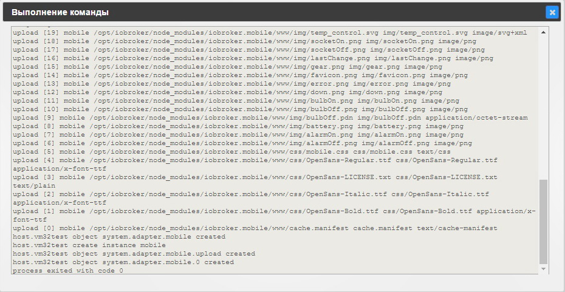

## Описание

## Информация

## Установка

Установка осуществляется на вкладке **Драйвера** странички [администрирования](http://www.iobroker.net/?page_id=3800&lang=ru) системы. В группе драйверов **Визуализация** находим строчку с названием **Mobile UI** и нажимаем кнопку со значком плюса в этой строке справа. [

 На экране появится всплывающее окно установки драйвера, в конце установки оно автоматически закроется. [

 Если все прошло удачно, на вкладке **Настройка драйверов** появится строка **mobile.0** с установленным экземпляром драйвера. Особых настроек драйвер не имеет, можно открыть приложение в новой вкладке/страничке и приступить к созданию проекта. 