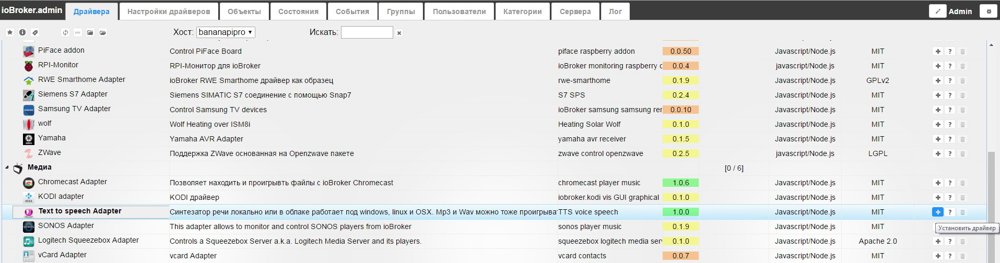
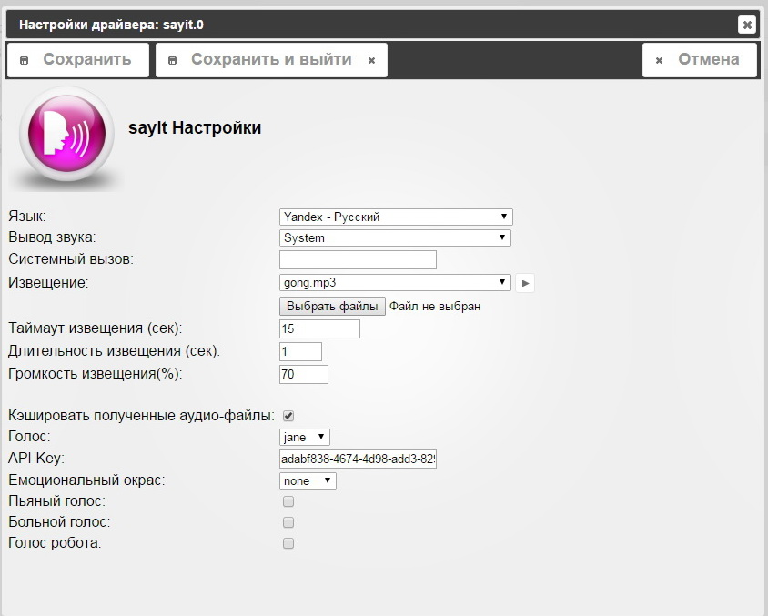
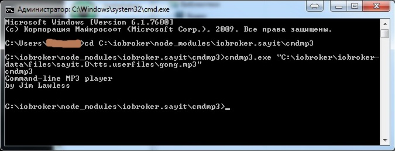
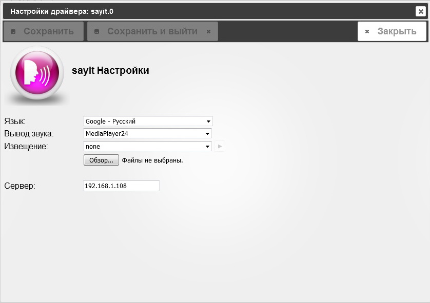
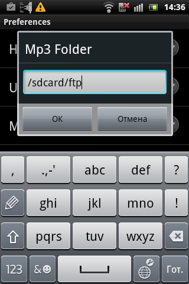

## Описание

Драйвер **Sayit** (Text to speech Adapter) используется для конвертации текстовой информации в слова, фразы, предложения в виде аудио-файлов и последующего вывода звука локально на сервере (с помощью звуковой карты) или с помощью различных устройств и ПО в локальной сети.

## Информация

На данный момент драйвер поддерживает следующие text-to-speech сервисы:

*   Голосовой движок Google. Используется неофициальная возможность сервиса translator по произношению переведенного текста. Эту возможность в будущем могут прикрыть, поэтому лучше воспользоваться сервисами, описанными ниже.
*   Сервис Yandex [SpeechKit Cloud](https://tech.yandex.ru/speechkit/cloud/doc/dg/concepts/about-docpage/), [синтез](https://tech.yandex.ru/speechkit/cloud/doc/dg/concepts/speechkit-dg-tts-docpage/) речи. Чтобы воспользоваться этим сервисом, необходимо зарегистрироваться и получить [бесплатно](https://tech.yandex.ru/speechkit/cloud/doc/intro/faq/concepts/about-docpage/#q4_30) API-ключ в [кабинете](https://developer.tech.yandex.ru/) разработчика.
*   Сервис Amazon [Speech Cloud](https://www.ivona.com/us/for-business/speech-cloud/). Для использования этого сервиса надо так же зарегистрировать Development Account и получить [бесплатный](https://www.ivona.com/us/for-business/speech-cloud/#faq1) Access Key.

Для нормальной работы сервисов сервер ioBroker должен иметь доступ в сеть Internet, так как обработка фразы и получение готового аудио-файла происходит на серверах соответствующей компании. В работе драйвера используется кэш, т. е. для повторного вывода уже запрошенного аудио-файла не требуется интернет, данные берутся из кэша. Драйвер позволяет выводить звук с помощью следующих устройств и ПО:

*   WEB-браузер - текст будет воспроизводиться прямо через браузер с открытой страничкой драйвера VIS. Эта функция поддерживается почти в каждом браузере для Desktop и несколькими мобильными версиями.
*   Home24- MediaPlayer - текст отправляется на устройство с ОС Android с установленной программой [Home24 - MediaPlayer](http://www.home-24.net/index.php?page=sites/home.php&app=media). В этом случае звуковой файл создается средствами движка Android text to speech. Порт для соединения по-умолчанию 50000 и не может быть изменен. Русский язык в таком режиме работы драйвера не поддерживается, как и работа с кэшем.
*   Home24 - MediaPlayer and FTP Server - аудио-файлы так же воспроизводятся с помощью программы  [Home24 - MediaPlayer](http://www.home-24.net/index.php?page=sites/home.php&app=media), установленной на Android-устройстве. Однако файлы генерируются с помощью сервиса, настроенного в драйвере sayit и копируются на указанное Android-устройство по FTP (необходима установка программы FTP-доступа к ресурсам Android, к примеру [FTPServer](https://play.google.com/store/apps/details?id=lutey.FTPServer)). Именно эта папка указывается в настройках программы  Home24 - MediaPlayer в качестве источника.
*   Системный вывод - генерируемые файлы настроенного text-to-speech движка воспроизводятся средствами операционной системы, в которой работает ioBroker. Поддерживаются ОС Windows ([cmdmp3.exe](https://lawlessguy.wordpress.com/2015/06/27/update-to-a-command-line-mp3-player-for-windows/)) Mac OSx (/usr/bin/afplay) и Linux (mpg321).
*   Windows engine - текст воспроизводится средствами ОС Windows. Необходимо настроить text to speech движок как описано [здесь](http://windows.microsoft.com/en-us/windows/setting-speech-options#1TC=windows-7).
*   Sonos - воспроизведение аудио-файлов с помощью сетевых устройств [sonos](http://www.sonos.com/en-wo). Для работы драйвера sayit в этом режиме, необходимо убедиться, что в системе установлен драйвер** ioBroker simple web Adapter** и драйвер **SONOS Adapter**.
*   Chromecast - воспроизведение аудио-файлов с помощью устройств [Chromecast](http://www.google.com/intl/ru_ru/chrome/devices/chromecast/). Для работы драйвера sayit в этом режиме, необходимо убедиться, что в системе установлен драйвер** ioBroker simple web Adapter** и драйвер **Chromecast Adapter**.

Драйвер позволяет устанавливать в систему несколько экземпляров самого себя, то есть можно дифференцировать вывод звука в различных вариантах. К примеру:

*   экстренные сообщения выводить на колонки оповещения драйвером **sayit.0** **Linux - system;**
*   сообщения по запросу из системы визуализации VIS - **sayit.1** настройка **Browser** и вывод на устройство, где открыта страничка VIS;
*   сообщения о погоде, курсах валют, новостях - **sayit.2** на устройство **SONOS**, которое установлено на кухне, чтобы утром, за чашечкой ароматного кофе узнать, что творится в мире и как лучше одеться перед выходом на улицу))

## Установка

Установка осуществляется на вкладке **Драйвера** странички [администрирования](http://www.iobroker.net/?page_id=3800&lang=ru) системы. В группе драйверов **Медиа** находим строчку с названием **Text to speech Adapter** и нажимаем кнопку со значком плюса в этой строке справа. [

 На экране появится всплывающее окно установки драйвера, в конце установки оно автоматически закроется. [

 Если все прошло удачно, на вкладке **Настройка драйверов** появится строка **sayit.0 **с установленным экземпляром драйвера.  Стоит так же обратить внимание на то, что в зависимости от способа вывода звука, возможно понадобиться установить дополнительное ПО в систему (к примеру программу mpg321 для Linux) или добавить и настроить драйвера (к примеру драйвер для работы с устройствами Sonos или Chromecast). Об этом можно подробнее прочитать ниже.

## Настройка голосового движка

### Использование голосового движка Google

Используется неофициальная возможность сервиса translator по произношению переведенного текста. Эту возможность в будущем могут прикрыть, поэтому лучше воспользоваться сервисами Yandex или Amazon. Настройки простые, нет необходимости где либо регистрироваться и получать различные ключи/пароли. Система вещает женским голосом, работает распознавание текста (к примеру фраза "сейчас 08:45" будет произнесена как "сейчас восемь часов сорок пять минут"). Поддерживаются языки: Русский, Английский, Немецкий, Итальянский, Испанский, Французский. 

### Использование голосового движка Yandex SpeechKit

Чтобы воспользоваться движком Yandex, нужно получить API-ключ. Для этого регистрируемся на Яндексе (если уже зарегистрированы, то надо просто авторизоваться), переходим по [ссылке](https://developer.tech.yandex.ru/) в кабинет разработчика и там сразу предлагают создать API-ключ для пользования сервисами Яндекса. [

 Нажимаем кнопку **Получить ключ** и появляется форма, в которой предлагается ввести название проекта, для которого будет использоваться ключ и сервис. Вводим название и выбираем сервис **SpeechKit Cloud**. [

 Далее необходимо заполнить простую форму с некоторыми личными данными, указать типа проекта (коммерческий/личный) и, по желанию, оставить небольшое описание вашего проекта. Необходимо согласиться с условиями использования сервиса и нажать кнопку **Отправить**. [

 Через некоторое время, пока генерируется ключ, опять откроется личный кабинет и слева под надписью **Ваши API-ключи** можно будет увидеть полученный ключ. [

 Теперь открываем настройки драйвера и в поле **Язык** выбираем **Yandex-Русский**. Ниже появятся дополнительные настройки, в том числе поле, куда надо ввести полученный API-ключ. Остальные настройки интуитивно-понятны и не должны вызвать затруднений. Вывод звука (различные способы - см. ниже). [

 Для проверки работы, открываем вкладку **Объекты** на странице администрирования ioBroker, раскрываем дерево объектов экземпляра драйвера **sayit.0**, находим переменную **sayit.0.tts.text** и справа щелкаем в строке **Значение**. Появится поле для ввода и кнопки подтвердить (галочка) и отменить (крестик). Вводим в поле текст для тестирования и нажимаем кнопку с галочкой. [

 Через некоторое время из динамиков должен появиться звук извещения (файл gong.mp3) а затем и запрошенная фраза. На вкладке **Лог** можно убедиться в отсутствии/наличии ошибок. 

### Использование голосового движка Amazon Speech Cloud

Для использования движка Amazon Speech Cloud нужно получить Access Key и Secret Key. Для этого регистрируемся на [сайте проекта](https://www.ivona.com/us/for-business/speech-cloud/) - ссылка Sign up: [

 Выбираем создание нового аккаунта, вводим емайл. [

 Затем еще придется ввести некоторые личные данные. [

 После успешной регистрации, переходим в личном кабинете по ссылке [Credentials](https://www.ivona.com/us/account/speechcloud/credentials) и нажимаем кнопку Generate new credentials. [

 На экране появится окошко, в котором будут прописаны ключи, так же там есть ссылка для скачивания файла формата *.txt, где будет так же информация о сгенерированных ключах. Однако там же на странице имеется предупреждение "After creation or modification of credentials, please take into account it may take up to 30 minutes for changes to go live." Т.е. сразу после генерации ключей, нужно подождать около получаса перед пользованием сервиса. [

 Теперь открываем настройки драйвера и в поле **Язык** выбираем **Ivona-Русский - Татьяна**. Ниже появятся дополнительные настройки, в том числе два поля, куда надо ввести полученные ключи. Остальные настройки интуитивно-понятны и не должны вызвать затруднений. Вывод звука (различные способы - см. ниже). [

 Для проверки работы, открываем вкладку **Объекты** на странице администрирования ioBroker, раскрываем дерево объектов экземпляра драйвера **sayit.0**, находим переменную **sayit.0.tts.text** и справа щелкаем в строке **Значение**. Появится поле для ввода и кнопки подтвердить (галочка) и отменить (крестик). Вводим в поле текст для тестирования и нажимаем кнопку с галочкой. [

 Через некоторое время из динамиков должен появиться звук извещения (файл gong.mp3) а затем и запрошенная фраза. На вкладке **Лог** можно убедиться в отсутствии/наличии ошибок. [

 Через некоторое время можно посмотреть статистику запросов на сайте в [личном кабинете](https://www.ivona.com/us/account/speechcloud/status). 

## Настройка способа вывода звука

Теперь немного подробнее об остальных настройках. Предположим, был выбран голосовой движок, получена регистрация и ключи доступа (при необходимости), самое время заняться звуком. Существуют несколько настроек драйвера, которые не зависят от text-to-speech, а именно:

*   Вывод звука - способ вывода звука на усилитель (колонки). Подробно каждый способ описан [выше](http://www.iobroker.net/?page_id=4262&lang=ru#i-2), примеры рассмотрены [ниже](http://www.iobroker.net/?page_id=4262&lang=ru#__Windows_8211_System).
*   Системный вызов - данная настройка пригодится, если не устраивает программа, которая используется в системе по-умолчанию для воспроизведения: cmdmp3.exe (Windows) и mpg321 (Linux). К примеру, ioBroker устанавливается на ПК с ОС Linux, и в системе уже есть установленный и настроенный проигрыватель медиа-контента, предположим что это mplayer . Если в строку системный вызов вписать команду запуска этого плеера, то воспроизведение аудио-файлов будет не с помощью mpg321, а mplayer.
*   Извещение. Перед произношением фразы можно сначала проиграть некоторый звуковой файл, короткий - буквально несколько секунд по длительности. Сам файл можно выбрать из списка, а можно загрузить свой (если предложенные не нравятся) и тут же проверить как он звучит (имеется кнопочка play). Если выбрали конкретный файл из списка или загрузили свой, то ниже будут доступны еще 3 настройки.
*   Таймаут извещения в секундах. Это временной интервал, в течении которого драйвер не будет вновь проигрывать звук извещения, если текстовые фразы идут одна за другой. Т.е., предположим, драйвер выдал в колонки "звук извещения"... "На улице 23 градуса тепла" и через интервал, менее данной настройки, надо произнести другую фразу "внимание! есть движение по камере №1" - в этом случае перед второй фразой звука извещения уже не будет.
*   Длительность извещения в секундах - это примерное время звучания файла извещения, рекомендуется установить на секунду больше реального времени звучания, чтобы потоки не наложились или сделать микшитрование, как описано [здесь](http://www.iobroker.net/?page_id=4268&lang=ru#i-8) (Linux).
*   Громкость извещения в % - соответственно громкость, с которой будет проигрываться файл извещения (чтобы сделать тише или громче основной громкости драйвера).
*   Кэшировать полученные аудио-файлы - если эта опция установлена, то драйвер будет хранить в кэше проигранные ранее аудио-файлы. Если надо будет проиграть фразу, которая уже когда то выводилась, то драйвер возьмет файл из кэша, соответственно не будет задействован голосовой движок (можно сэкономить на количестве запросов или эксплуатировать систему без интернета, один раз прогнав все возможные фразы).

### Настройка вывода звука Windows - System

Если система ioBroker установлена на ОС Windows, то, чтобы настроить вывод звука как **System**, не нужно производить дополнительных настроек или устанавливать дополнительные программы. В составе дистрибутива ioBroker уже идет плеер для воспроизведения файлов ***.mp3** из командной строки - [cmdmp3.exe](https://lawlessguy.wordpress.com/2015/06/27/update-to-a-command-line-mp3-player-for-windows/). Исполнительный файл находится в папке ioBroker по пути ...\node_modules\iobroker.sayit\cmdmp3\cmdmp3.exe. Можно проверить, как он работает и работает ли вообще, для этого надо запустить командную строку (Пуск - Выполнить - cmd.exe - Enter), переместиться в папку с исполняемым файлом командой **cd** и запустить его с указанием пути к файлу *.mp3 (к примеру gong.mp3, который идет в составе драйвера sayit). [

 Если звук в колонках слышен, то значит все отлично, драйвер sayit должен работать с такой настройкой хорошо. Можно применить другой плеер для воспроизведения аудио-файлов, к примеру [VLC](img/), тогда в поле **системный вызов** нужно прописать команду запуска плеера для подхвата пути к файлу ***.mp3** и настроить его на автоматическое завершение работы после воспроизведения (чтобы драйвер sayit не плодил процессы vlc.exe в системе).

### Настройка вывода звука Linux - System

Для работы драйвера **sayit** в ОС Linux с настройкой **System** используется консольный плеер **mpg321**, поэтому для начала его нужно установить: `root@bananapipro:/# apt-get update` `root@bananapipro:/# apt-get install mpg321` После установки, его работу можно проверить, для этого в консоли набираем команду запуска плеера и затем пишем путь к файлу *.mp3 (к примеру gong.mp3): `root@bananapipro:/# mpg321 /opt/iobroker/iobroker-data/files/sayit.0/tts.userfiles/gong.mp3` `High Performance MPEG 1.0/2.0/2.5 Audio Player for Layer 1, 2, and 3.` `Version 0.3.2-1 (2012/03/25). Written and copyrights by Joe Drew,` `now maintained by Nanakos Chrysostomos and others.` `Uses code from various people. See 'README' for more!` `THIS SOFTWARE COMES WITH ABSOLUTELY NO WARRANTY! USE AT YOUR OWN RISK!` `Directory: /opt/iobroker/iobroker-data/files/sayit.0/tts.userfiles` `Playing MPEG stream from gong.mp3 ...` `MPEG 1.0 layer III, 128 kbit/s, 44100 Hz joint-stereo` `ALSA lib pcm.c:2239:(snd_pcm_open_noupdate) Unknown PCM cards.pcm.front` `[0:01] Decoding of gong.mp3 finished.` Если звук в колонках слышен, то значит все отлично, драйвер sayit должен работать с такой настройкой. Можно применить другой плеер для воспроизведения аудио-файлов, к примеру mplayer, тогда в поле **системный вызов** нужно прописать команду запуска плеера для подхвата пути к файлу ***.mp3** (просто прописать **mplayer**) и настроить его на автоматическое завершение работы после воспроизведения (чтобы драйвер sayit не плодил процессы в системе). Возможно, возникнут проблемы с наложением работы плеера разных экземпляров драйвера sayit или других процессов, в таком случае, можно настроить микширование, как описано в [этой статье](http://www.iobroker.net/?page_id=4268&lang=ru#i-8).

### Настройка вывода звука Browser

Если активировать эту настройку, то вывод звука будет производиться на устройстве, где в браузере (поддерживают почти все версии Desktop и несколько мобильных) открыто приложение VIS. К примеру, ioBroker установлен на плату BananaPi под Armbian, а страничка VIS открыта на компьютере с ОС Winsows в браузере Mozilla FireFox. Если драйвер sayit настроить на вывод настройкой Browser, то звук будет выводиться через звуковую карту ПК с ОС Windows. [

 Драйвер имеет еще одну настройку - **ID браузера**. Здесь можно оставить значение по-умолчанию FFFFFFFF (8xF), в таком случае, звук будет воспроизводиться на всех устройствах, где открыта страничка VIS. Можно указать ID конкретного браузера, его можно посмотреть в режиме редактирования VIS на вкладке **Инструменты**. Если в настройках указать конкретный ID, то звук будет слышен только на том устройстве,  на котором в браузере с указанным ID открыта страничка VIS. [

 

### Настройка вывода звука Home24 - Mediaplayer

Если выбрана настройка вывода звука MediaPlayer24, то текст будет отправляется на устройство с ОС Android в установленную программу [Home24 - MediaPlayer](http://www.home-24.net/index.php?page=sites/home.php&app=media). можно скачать в [PlayMarket](https://play.google.com/store/apps/details?id=com.home24.mediaplayer) В этом случае звуковой файл создается средствами движка Android text to speech. Порт для соединения по-умолчанию 50000 и не может быть изменен. Русский язык в таком режиме работы драйвера не поддерживается, как и работа с кэшем!!! В настройках драйвера указать способ вывода звука - MediaPlayer24 и IP-адрес Android-устройства с установленной программой. Настройка Язык (как и выбранный тип движка) значения не имеет. [

 На Android-устройстве нужно установить программу Home24 - Mediaplayer и настроить движок text to speech на работу с определенным языком (английский или немецкий). Запустить и в настройках (preferences) установить галочку HTTP service on startup. [

 В самой программе внизу в секции Log можно контролировать работу приложения и драйвера - должны отображаться запросы на воспроизведения отправленного текста. 

### Настройка вывода звука Home24 - Mediaplayer c FTP-сервером

Чтобы вышеописанный способ вывода звука работал с русским языком, была создана настройка с использованием FTP-сервера. Драйвер **sayit** с помощью выбранного и настроенного голосового движка запрашивает аудио-файл, затем по FTP копирует его на Android-устройство, в свою очередь на этом устройстве программа **Home24 - Mediaplayer** следит за файлами в папке, настроенной в FTP-сервере, если появляется файл - воспроизводит его - все просто... Для настройки сначала советуем установить на Android-устройство FTP-сервер, к примеру программу [FTPServer](https://play.google.com/store/apps/details?id=lutey.FTPServer). Создать папку, к примеру **/sdcard/ftp**, и настроить FTP-сервер на работу с ней с указанием имени пользователя (andrey, к примеру), пароля (123, к примеру), FTP-порта (20001, к примеру) и WiFi-сети (Su17), с которой разрешены входящие подключения. [

 Затем запустить (если не установлена, то установить как описано выше) **Home24 - Mediaplayer **и настроить на работу с папкой FTP-сервера. [

 Теперь можно настроить драйвер sayit (указав настройки голосового движка, звука извещения и FTP-сервера на Android-устройстве): [

 Все, можно проверить. В логе программы **Home24 - Mediaplayer **будут появляться записи о воспроизведении файлов say.mp3\. Драйвер sayit отправляет на FTP-сервер файл с одним и тем же названием, то есть просто подменяет старый на новый, **Home24 - Mediaplayer **видит обновление и проигрывает. 

## Работа с объектами экземпляра драйвера

После установки, драйвер создает несколько переменных: 

*   cachetext - Фраза для кэширования, может быть использована без интернета. Например, ввести здесь вручную "Нет интернета", если пинг на google.com отрицательный, напишите "Нет интернета" на "tts.text" и он её проиграет. Конечно, кэш должен быть включен.
*   mp3 - путь к файлу, который должен быть воспроизведен при запросе от SONOS или Browser. По-умолчанию: `http://IP-адрес:8082/state/sayit.0.tts.mp3`
*   playing - **true**, если текст в настоящее время проигрывается и **false**, если нет. Поддерживается только для ОС Windows и режима воспроизведения System
*   text - в эту переменную записывать текст для воспроизведения
*   volume - громкость относительная (0...100%) с которой будут произноситься фразы

Переменная **text** поддерживает расширенный синтаксис - язык/движок и громкость можно задать прямо в тексте. Можно использовать для мультиязычных Text2Speech движков. Например, если драйвер настроен "Google - English", можно в фразе для произношения задать префикс **ru;** и заставить использовать русский язык. Или "ru;75; погода хорошая" - фраза будет произнесена на русском языке и с громкостью 75%.

## Использование

Для примера, можно рассмотреть скрипт проговаривания времени.

*   проговаривает время в будни с 7:00 до 23:00,
*   в будни громкость выставляется в 23:00 в 70%
*   выходные с 9:30 по 23:00 и в 23:00 громкость уменьшается до 70%
*   пару фраз утром и перед выходом на работу

Для начала, нужно установить драйвер [Javascript/Coffescript Script Engine](https://github.com/ioBroker/ioBroker.javascript) (если он не установлен в системе), затем на страничке администрирования системы переключиться на вкладку **Скрипты**. Выбрать группу **common** (к примеру, или создать свою) и нажать кнопку **Новый скрипт**. Переименовать его в, скажем, **sayTimeNow**.  Далее в окно редактирования скрипта скопировать следующий текст: `schedule("*/10 7-23 * * *", function () {` `  var idSayIt = "sayit.0.tts.text";` `   var date = new Date();` `   var day = date.getDay(); // 0-воскр. 6-суббота` `   var hour = date.getHours();` `   var min = (date.getMinutes()<10?'0':'') + date.getMinutes(); // если минута меньше 10, то добавляем 0` `   var volume = 100;` `   if(hour == 23) volume = 80;` `    // Проговариваем время по будням в 00 минут` `    if((day >= 1 && day <= 5) && min == "00"){` `      if(hour == 7){` `        // Если 7:00, то желаем доброго утра` `        setState (idSayIt, volume+';Доброе утро!');` `       } else {` `       // Проговариваем каждый час` `       setState (idSayIt, volume+';'+hour+':'+min);` `     }` `     log('Будни '+day);` `     // В 7:40, проговариваем, что пора выходить` `  }else if ((day >= 1 && day <= 5) && (hour == 7 && min == 40)){` `     setState (idSayIt, volume+';'+hour+':'+min+' Пора выходить на работу!');` `     // Проговариваем время по выходным начиная с 9:30` `   }else if((day == "0" || day == 6 ) && ((hour == 9 && min == 30) || (hour >= 10 && min == "00"))){` `     setState (idSayIt, volume+';'+hour+':'+min);` `     log('Выходной '+day);` `   }` `});` После редактирования текста под свои нужды (можно использовать как заготовку или попробовать этот), нажать кнопку запуска скрипта. Внизу в поле **Лог** должны появиться сообщения вида: `17:58:18.954 [info] javascript.0 Start javascript script.js.common.sayTimeNow` `17:58:18.956 [info] javascript.0 script.js.common.sayTimeNow: registered 0 subscriptions and 1 schedule` Они обозначают, что драйвер **javascript.0** запустил скрипт **sayTimeNow** на исполнение, в этом скрипте зарегистрировано  подписок - 0, заданий cron - 1. Все! Теперь в соответствии с условиями скрипта с помощью драйвера sayit система будет проговаривать текущее время и иногда позволять себе другие фразы))