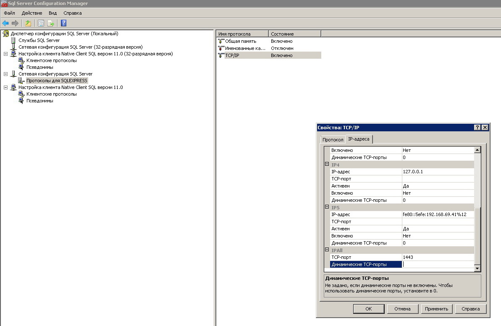
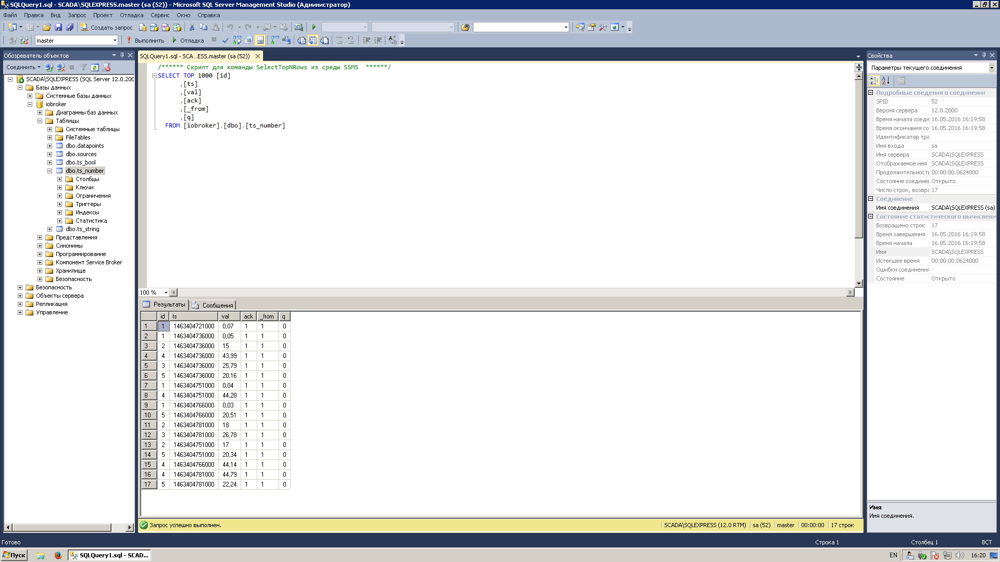

## Описание

Драйвер SQL позволяет сохранять состояние переменных в различные базы данных, которые могут находится как на локальной машине (хосте) так и на удаленной. Драйвер позволяет не только сохранять данные, но и выполнять запросы на получение архивных данных. Конечно же имеется возможность осуществлять запросы напрямую к настроенной и работающей БД из скриптов, адаптеров, внешних программ, используя информацию о структуре БД ioBroker.

## Поддерживаемые базы данных

**MS-SQL база данных.** Сервер устанавливается на Windows-машину. Для тестирования можно скачать версию MS SQL Server Express. Для управления и администрирования можно скачать и установить MS SQL Management Studio (версия только для Windows). **SQLite база данных.** SQLite — это встраиваемая кроссплатформенная БД, которая поддерживает достаточно полный набор команд SQL. В SQLite процесс, который хочет обратиться к базе данных, читает и пишет непосредственно из файлов базы данных на жестком диске. То есть движок SQLite не является отдельно работающим процессом, с которым взаимодействует программа, а предоставляет библиотеку, с которой программа компонуется и движок становится составной частью программы. Такое решение имеет ряд плюсов (быстродействие, простота в настройке и использовании) и минусов (использование в основном в небольших проектах, ограничения на размеры транзакций). Для управления и администрирования имеются множество утилит, к примеру phpSQLiteAdmin (требуется запущенный WEB-сервер). **MySQL база данных.** MySQL — свободная система управления базами данных(СУБД). Распространяется под GNU General Public License или под коммерческой лицензией (Oracle Corporation). БД кроссплатформенная и может быть установлена на ОС Linux, Windows и пр. Для управления и администрирования есть большой выбор инструментов, к примеру phpMyAdmin (требуется запущенный WEB-сервер) или HeidiSQL. **PostgreSQL** база данных. PostgreSQL — это кроссплатформенная объектно-реляционная СУБД с открытым исходным кодом.

## Установка и настройка

### База данных MS-SQL

Для примера используем БД MS SQL Express 2014, для этого необходимо скачать с сайта [microsoft](https://www.microsoft.com/ru-ru/download/details.aspx?id=42299) необходимые файлы установки самой БД (выбрать версию х32-х64) и, при необходимости, программы **MS SQL Management Studio**. [

 При установке необходимо указать именованный экземпляр БД (оставим по-умолчанию), тип запуска **Обозреватель SQL Server** изменить на **Авто **и указать **смешанный режим** проверки подлинности (указав пароль для пользователя **sa**).  Чтобы разрешить входящие подключения по порту 1443, необходимо:

*   в **Диспетчере конфигурации SQL Server 2014** включить TCP/IP протокол для экземпляра сервера и прописать порт 1443 для всех IP (после этого обязательно перезапустить сервер для применения новых настроек),
*   настроить брандмауэр Windows для входящих подключений TCP порт 1443.

[

 [

  Теперь устанавливаем драйвер SQL в систему ioBroker, щелкнув кнопку с плюсом в строчке адаптера **SQL History** (группа хранилище) на вкладке **Драйвера** WEB-интерфейса. Перемещаемся на вкладку **Настройки драйверов**, запускаем только что установленный экземпляр драйвера **sql.0** (если имеются другие экземпляры, то имя может отличаться) и нажимаем кнопку **Настроить**, далее:

*   выбираем тип БД - **MS - SQL**,
*   вводим имя или IP-адрес хоста с установленной БД,
*   прописываем порт 1443,
*   указываем имя пользователя **sa** и пароль, который мы вводили на этапе установки MS SQL 2014 Express,
*   при необходимости изменяем параметр **Минимальный интервал ms** (минимальный интервал записи данных в БД),
*   при необходимости изменяем параметр **Время хранения в базе** (время хранения данных, старые данные удаляются),
*   нажимаем кнопку Сохранить и выйти, драйвер перезапускается. Теперь можно проверить подключение к БД.

[

  Чтобы проверить, добавляются ли записи в БД, можно настроить архивирование какой нибудь переменной, к примеру рассмотрим переменные работы хоста ioBroker (нагрузку ЦП, память и пр.). Для этого на вкладке **Объекты** в верхнем левом углу нажимаем кнопку **Показать системные объекты**, в таблице ищем группу **system.host.имя_хоста**, раскрываем список и настаиваем хранение истории для выбранных переменных (кнопка в строке крайняя справа):

*   ставим галочку **активно** в группе **sql.o**,
*   остальные настройки можно оставить по-умолчанию,
*   нажимаем кнопку **Сохранить**.

[

 [

 Через некоторое время можно открыть эту же настройку переменной (к примеру, **system.host.vm32test.load**) и перейти на вкладку **Таблица** - там отобразятся архивные значения из БД. [

 Можно установить программу MS SQL Management Studio и проверить наличие архивных данных в ней. [

 Еще необходимо упомянуть об [ограничениях](img/cc645993%28v_sql.120%29.aspx) бесплатной версии MS SQL Express 2014 (и учитывать их при проектировании системы ioBroker):

*   Максимальная вычислительная мощность, используемая одним экземпляром - не более одного CPU и 4-х ядер,
*   Максимальный объем используемой памяти (ОЗУ) - ограничение 1Гб,
*   Максимальный размер реляционной базы данных - 10Гб.

### База данных SQLite

Как уже писалось выше, SQLite довольно быстрая и простая БД. Рассмотрим настройку хранения истории переменных ioBroker в данной БД на хосте Linux. Никаких дополнительных пакетов устанавливать не надо. Если планируется работа с БД через консоль, можно установить пакет sqlite3: `$ sudo apt-get update` `$ sudo apt-get install sqlite3` Настройка очень простая: 

*   тип БД выбираем **SQLite3**,
*   **файл для SQLite** оставляем значение по-умолчанию (хранится по пути /opt/iobroker/iobroker-data/sqlite/sqlite.db), но можно прописать свой путь, к примеру /home/user/DBs/sqlite.db (абсолютный),
*   при необходимости изменяем параметр **Минимальный интервал ms** (минимальный интервал записи данных в БД),
*   при необходимости изменяем параметр **Время хранения в базе** (время хранения данных, старые данные удаляются),
*   нажимаем кнопку Сохранить и выйти, драйвер перезапускается.

[

 Чтобы проверить, добавляются ли записи в БД, можно настроить архивирование какой нибудь переменной или группы переменных (см. пример выше [MS SQL Express](http://www.iobroker.net/?page_id=3903&lang=ru#_MS-SQL)). Проверить запись в БД можно на вкладке **Таблица** настроек истории для переменной или открыть файл БД специальной программой, к примеру SQLite Expert Personal. [

 

### База данных MySQL

Для начала необходимо установить сервер БД MySQL. Для примера рассмотрим установку mysql-server на хост с ioBroker (linux Debian 8) и на отдельную машину с ОС Windows. **Установка под Linux Debian 8** очень простая, для этого необходимо в консоли набрать команды обновления списка пакетов и установки сервера БД: `$ sudo apt-get update` `$ sudo apt-get install mysql-server mysql-client` Во время установки необходимо ввести пароль суперпользователя БД root. Для работы с БД ioBroker необходимо создать нового пользователя и наделить его полномочиями, для этого в консоли выполняем команды: `$ mysql -u root -p` Вход в управление MySQL через консоль (запросит пароль root) `$ mysql> CREATE USER 'iobroker'@'%' IDENTIFIED BY 'iobrokermysql';` Создаем пользователя **iobroker** с разрешениями для работы с любыми хостами (входящие соединения) и паролем **iobrokermysql** (изменить на свой). `$ mysql> GRANT ALL PRIVILEGES ON *.* TO 'iobroker'@'%';` Даем полные привилегии только что созданному пользователю. `$ mysql> FLUSH PRIVILEGES;` Применяем настройки. Теперь устанавливаем драйвер SQL, если он еще не установлен и настраиваем:

*   выбираем тип БД - **MySQL**,
*   сервер MySQL установлен на этой же машине, поэтому X**ост** настройка будет **localhost**,
*   порт - значение по-умолчанию - **0**,
*   указываем имя созданного пользователя **iobroker** и пароль, который мы вводили на этапе добавления пользователя (в данном примере iobrokermysql),
*   при необходимости изменяем параметр **Минимальный интервал ms** (минимальный интервал записи данных в БД),
*   при необходимости изменяем параметр **Время хранения в базе** (время хранения данных, старые данные удаляются),
*   нажимаем кнопку Сохранить и выйти, драйвер перезапускается. Теперь можно проверить подключение к БД.

[

 Чтобы проверить, добавляются ли записи в БД, можно настроить архивирование какой нибудь переменной или группы переменных (см. пример выше [MS SQL Express](http://www.iobroker.net/?page_id=3903&lang=ru#_MS-SQL)). Проверить запись в БД можно на вкладке **Таблица** настроек истории для переменной или подключиться к БД специальной программой, к примеру HeidiSQL. [

  [

 **Установка под Windows **так же совсем не сложная. Сервер MySQL устанавливаем на отдельной машине (под Windows), для этого скачиваем установочные файлы с сайта [mysql.com](http://dev.mysql.com/downloads/) сам MySQL сервер и, при желании, программу администрирования (Download MySQL Workbench). Сначала устанавливаем MySQL-сервер в ручную выбрав компоненты (сам сервер и набор утилит). [

 [

 Добавим пользователя **iobroker** с возможностью подключаться с любого хоста **All Hosts (%)**, роль **DB Admin** и паролем, к примеру, iobrokermysql. Так же необходимо установить пароль для супер-пользователя **root**. [

  Теперь устанавливаем драйвер SQL, если он еще не установлен и настраиваем:

*   выбираем тип БД - **MySQL**,
*   сервер MySQL установлен на другой машине с ОС Windows, поэтому X**ост** настройка будет **IP-адрес **этого ПК,
*   порт - значение по-умолчанию - **0**,
*   указываем имя созданного пользователя **iobroker** и пароль, который мы вводили на этапе добавления пользователя (в данном примере iobrokermysql),
*   при необходимости изменяем параметр **Минимальный интервал ms** (минимальный интервал записи данных в БД),
*   при необходимости изменяем параметр **Время хранения в базе** (время хранения данных, старые данные удаляются),
*   нажимаем кнопку Сохранить и выйти, драйвер перезапускается. Теперь можно проверить подключение к БД.

[

 Чтобы проверить, добавляются ли записи в БД, можно настроить архивирование какой нибудь переменной или группы переменных (см. пример выше [MS SQL Express](http://www.iobroker.net/?page_id=3903&lang=ru#_MS-SQL)). Проверить запись в БД можно на вкладке **Таблица** настроек истории для переменной или подключиться к БД специальной программой, к примеру HeidiSQL или установить как дополнение вместе с MySQL пакет MySQL Workbench, в его составе есть GUI. [

  [

 

### База данных PostgreSQL

Для примера работы с этой БД рассмотрим установку на хост с ioBroker, т.е. будем обращаться к БД через localhost. Для этого на Linux-машине с ioBroker выполним  следующие команды: `$ sudo apt-get update` Обновим список пакетов. `$ sudo apt-get install postgresql-9.1` Установим сервер БД (текущая версия 9.1), подтянем зависимости. Теперь настроим сервер БД. `$ sudo su postgres -c psql postgres` Войдем под главной учетной записью в консоль администрирования БД. `postgres=# ALTER USER postgres WITH PASSWORD 'security';` `postgres=# \q` Для начала переустановим пароль администратора **postgres** сервера БД, вместо **security** напишите свой пароль. Далее выходим из консоли администрирования БД. Команды выше изменяют пароль администратора самой БД, теперь необходимо сделать тоже самое с linux пользователем **postgres**: `$ sudo passwd -d postgres` `$ sudo su postgres -c passwd` Создаем новый UNIX-пароль для пользователя postgres (после последние команды надо ввести два раза пароль, в целях безопасности он не должен совпадать с паролем пользователя postgres самой БД). `$ su postgres` Осуществим логин в систему под пользователем postgres (запросит пароль). `$ createuser -sdrP iobroker` Создадим пользователя iobroker, зададим для него пароль. Теперь подредактируем файлы конфигурации: Файл **/etc/postgresql/9.1/main/postgresql.conf**

*   Разрешим TCP/IP соединения localhost, для этого удалим символ комментария **#** перед строкой **#listen_addresses = 'localhost'**, если надо разрешить подключение с любого хоста, задаем значение **'*'**,
*   Строка **#port = 5432 **так же может быть закоментирована, надо удалить символ **#** в начале строки

Файл **/etc/postgresql/9.1/main/pg_hba.conf**

*   Если подключение будет производиться с другой машины, можно ниже строчки **host all all 127.0.0.1/32 md5** добавить **host all all IP-подсеть md5. **

`$ sudo service postgresql restart` Рестарт сервиса postgresql для применения изменений. Теперь устанавливаем драйвер SQL, если он еще не установлен и настраиваем:

*   выбираем тип БД - **PostgreSQL**,
*   сервер БД установлен на этой же машине, поэтому X**ост** настройка будет **localhost**,
*   порт - значение по-умолчанию - **0**,
*   указываем имя созданного пользователя **iobroker** и пароль, который мы вводили на этапе добавления пользователя,
*   при необходимости изменяем параметр **Минимальный интервал ms** (минимальный интервал записи данных в БД),
*   при необходимости изменяем параметр **Время хранения в базе** (время хранения данных, старые данные удаляются),
*   нажимаем кнопку Сохранить и выйти, драйвер перезапускается. Теперь можно проверить подключение к БД.

[

 Чтобы проверить, добавляются ли записи в БД, можно настроить архивирование какой нибудь переменной или группы переменных (см. пример выше [MS SQL Express](http://www.iobroker.net/?page_id=3903&lang=ru#_MS-SQL)). Проверить запись в БД можно на вкладке **Таблица** настроек истории для переменной или подключиться к БД специальной программой, к примеру pgAdmin III (для Windows). [

  

## Структура БД ioBroker

По-умолчанию, название создаваемой базы данных **iobroker**, но его можно изменить в настройках.

### Таблица _sources_

В этой таблице список экземпляров (instances) драйверов, которые добавляют записи в БД (state.from).

<table style="border-color: #404040; width: 30%;" border="2" cellspacing="1" cellpadding="2">

<tbody>

<tr>

<td style="text-align: center; width: 11%;">**DB**</td>

<td style="text-align: center; width: 31.2427%;">**Name in query**</td>

</tr>

<tr>

<td style="width: 11%;">MS-SQL</td>

<td style="width: 31.2427%;">iobroker.dbo.sources</td>

</tr>

<tr>

<td style="width: 11%;">MySQL</td>

<td style="width: 31.2427%;">iobroker.sources</td>

</tr>

<tr>

<td style="width: 11%;">PostgreSQL</td>

<td style="width: 31.2427%;">sources</td>

</tr>

<tr>

<td style="width: 11%;">SQLite</td>

<td style="width: 31.2427%;">sources</td>

</tr>

</tbody>

</table>

Структура:

<table style="border-color: #404040;" border="2" cellspacing="1" cellpadding="2">

<thead>

<tr>

<th>Field</th>

<th>Type</th>

<th>Description</th>

</tr>

</thead>

<tbody>

<tr>

<td>id</td>

<td>INTEGER NOT NULL PRIMARY KEY IDENTITY(1,1)</td>

<td>Уникальный ID</td>

</tr>

<tr>

<td>name</td>

<td>varchar(255) / TEXT</td>

<td>Название экземпляра адаптера, которые добавляет записи</td>

</tr>

</tbody>

</table>

Примечание: В БД MS-SQL используется varchar(255), в остальных TEXT

### Таблица _datapoints_

В этой таблице список архивируемых переменных (IDs).

<table style="border-color: #404040; width: 30%;" border="2" cellspacing="1" cellpadding="2">

<thead>

<tr>

<th style="text-align: center;">DB</th>

<th style="text-align: center;">Name in query</th>

</tr>

</thead>

<tbody>

<tr>

<td>MS-SQL</td>

<td>iobroker.dbo.datapoints</td>

</tr>

<tr>

<td>MySQL</td>

<td>iobroker.datapoints</td>

</tr>

<tr>

<td>PostgreSQL</td>

<td>datapoints</td>

</tr>

<tr>

<td>SQLite</td>

<td>datapoints</td>

</tr>

</tbody>

</table>

Структура:

<table style="border-color: #404040;" border="2" cellspacing="1" cellpadding="2">

<thead>

<tr>

<th>Field</th>

<th>Type</th>

<th>Description</th>

</tr>

</thead>

<tbody>

<tr>

<td>id</td>

<td>INTEGER NOT NULL PRIMARY KEY IDENTITY(1,1)</td>

<td>Уникальный ID</td>

</tr>

<tr>

<td>name</td>

<td>varchar(255) / TEXT</td>

<td>ID переменной, например **system.host.vm32test.load**</td>

</tr>

<tr>

<td>type</td>

<td>INTEGER</td>

<td>Тип переменной (0 - number, 1 - string, 2 - boolean)</td>

</tr>

</tbody>

</table>

Примечание: В БД MS-SQL используется varchar(255), в остальных TEXT

### Таблица _ts_numbers_

Значения переменных типа **number**. **ts** означает "временные ряды" (time series).

<table style="border-color: #404040; width: 30%;" border="2" cellspacing="1" cellpadding="2">

<thead>

<tr>

<th style="text-align: center;">DB</th>

<th style="text-align: center;">Name in query</th>

</tr>

</thead>

<tbody>

<tr>

<td>MS-SQL</td>

<td>iobroker.dbo.ts_number</td>

</tr>

<tr>

<td>MySQL</td>

<td>iobroker.ts_number</td>

</tr>

<tr>

<td>PostgreSQL</td>

<td>ts_number</td>

</tr>

<tr>

<td>SQLite</td>

<td>ts_number</td>

</tr>

</tbody>

</table>

Структура:

<table style="border-color: #404040;" border="2" cellspacing="1" cellpadding="2">

<thead>

<tr>

<th style="text-align: center;">Field</th>

<th style="text-align: center;">Type</th>

<th style="text-align: center;">Description</th>

</tr>

</thead>

<tbody>

<tr>

<td>id</td>

<td>INTEGER</td>

<td>ID переменной из таблицы **Datapoints**</td>

</tr>

<tr>

<td>ts</td>

<td>BIGINT / INTEGER</td>

<td>Время в формате TS. Можно конвертировать с помощью **new Date(ts)**</td>

</tr>

<tr>

<td>val</td>

<td>REAL</td>

<td>Значение</td>

</tr>

<tr>

<td>ack</td>

<td>BIT/BOOLEAN</td>

<td>Подтверждение: 0 - not ack, 1 - ack</td>

</tr>

<tr>

<td>_from</td>

<td>INTEGER</td>

<td>ID экземпляра драйвера из таблицы **Sources**</td>

</tr>

<tr>

<td>q</td>

<td>INTEGER</td>

<td>Знак качества. Возможные значения и расшифровку можно посмотреть  [здесь](https://github.com/ioBroker/ioBroker/blob/master/doc/SCHEMA.md#states)</td>

</tr>

</tbody>

</table>

Примечание: В БД MS-SQL используется BIT, в остальных БД BOOLEAN. SQLite используется тип INTEGER для времени TS, в остальных БД - BIGINT.

### Таблица _ts_strings_

Значения переменных типа **string**.

<table style="border-color: #404040; width: 30%;" border="2" cellspacing="1" cellpadding="2">

<thead>

<tr>

<th style="text-align: center;">DB</th>

<th style="text-align: center;">Name in query</th>

</tr>

</thead>

<tbody>

<tr>

<td>MS-SQL</td>

<td>iobroker.dbo.ts_string</td>

</tr>

<tr>

<td>MySQL</td>

<td>iobroker.ts_string</td>

</tr>

<tr>

<td>PostgreSQL</td>

<td>ts_string</td>

</tr>

<tr>

<td>SQLite</td>

<td>ts_string</td>

</tr>

</tbody>

</table>

Структура:

<table style="border-color: #404040;" border="2" cellspacing="1" cellpadding="2">

<thead>

<tr>

<th style="text-align: center;">Field</th>

<th style="text-align: center;">Type</th>

<th style="text-align: center;">Description</th>

</tr>

</thead>

<tbody>

<tr>

<td>id</td>

<td>INTEGER</td>

<td>ID переменной из таблицы **Datapoints**</td>

</tr>

<tr>

<td>ts</td>

<td>BIGINT</td>

<td>Время в формате TS. Можно конвертировать с помощью **new Date(ts)**</td>

</tr>

<tr>

<td>val</td>

<td>TEXT</td>

<td>Значение</td>

</tr>

<tr>

<td>ack</td>

<td>BIT/BOOLEAN</td>

<td>Подтверждение: 0 - not ack, 1 - ack</td>

</tr>

<tr>

<td>_from</td>

<td>INTEGER</td>

<td>ID экземпляра драйвера из таблицы **Sources**</td>

</tr>

<tr>

<td>q</td>

<td>INTEGER</td>

<td>Знак качества. Возможные значения и расшифровку можно посмотреть  [здесь](https://github.com/ioBroker/ioBroker/blob/master/doc/SCHEMA.md#states)</td>

</tr>

</tbody>

</table>

Примечание: В БД MS-SQL используется BIT, в остальных БД BOOLEAN. SQLite используется тип INTEGER для времени TS, в остальных БД - BIGINT.

### Таблица _ts_bool_

Значения переменных типа **boolean**.

<table style="border-color: #404040; width: 30%;" border="2" cellspacing="1" cellpadding="2">

<thead>

<tr>

<th style="text-align: center;">DB</th>

<th style="text-align: center;">Name in query</th>

</tr>

</thead>

<tbody>

<tr>

<td>MS-SQL</td>

<td>iobroker.dbo.ts_bool</td>

</tr>

<tr>

<td>MySQL</td>

<td>iobroker.ts_bool</td>

</tr>

<tr>

<td>PostgreSQL</td>

<td>ts_bool</td>

</tr>

<tr>

<td>SQLite</td>

<td>ts_bool</td>

</tr>

</tbody>

</table>

Структура:

<table style="border-color: #404040;" border="2" cellspacing="1" cellpadding="2">

<thead>

<tr>

<th style="text-align: center;">Field</th>

<th style="text-align: center;">Type</th>

<th style="text-align: center;">Description</th>

</tr>

</thead>

<tbody>

<tr>

<td>id</td>

<td>INTEGER</td>

<td>ID переменной из таблицы **Datapoints**</td>

</tr>

<tr>

<td>ts</td>

<td>BIGINT</td>

<td>Время в формате TS. Можно конвертировать с помощью **new Date(ts)**</td>

</tr>

<tr>

<td>val</td>

<td>BIT/BOOLEAN</td>

<td>Значение</td>

</tr>

<tr>

<td>ack</td>

<td>BIT/BOOLEAN</td>

<td>Подтверждение: 0 - not ack, 1 - ack</td>

</tr>

<tr>

<td>_from</td>

<td>INTEGER</td>

<td>ID экземпляра драйвера из таблицы **Sources**</td>

</tr>

<tr>

<td>q</td>

<td>INTEGER</td>

<td>Знак качества. Возможные значения и расшифровку можно посмотреть  [здесь](https://github.com/ioBroker/ioBroker/blob/master/doc/SCHEMA.md#states)</td>

</tr>

</tbody>

</table>

Примечание: В БД MS-SQL используется BIT, в остальных БД BOOLEAN. SQLite используется тип INTEGER для времени TS, в остальных БД - BIGINT.

## Использование

### Пользовательские запросы

Пользователь может выполнять различные запросы (принимая в учет [структуру БД](http://www.iobroker.net/?page_id=3903&lang=ru#_ioBroker) и записи в таблицах) из драйвера или скрипта автоматизации. К примеру, отобразить в логе результат запроса "выбрать все данные из таблицы **datapoints**" из БД, привязанной к экземпляру драйвера **sql.0**: `sendTo('sql.0', 'query', 'SELECT * FROM datapoints', function (result) {` `  if (result.error) {` `    console.error(result.error);` `  } else {` `  // show result` `    console.log('Rows: ' + JSON.stringify(result.result));` `  }` `});` Еще пример, получить записи за последний час для ID = system.adapter.admin.0.memRss: `sendTo('sql.0', 'query', 'SELECT id FROM datapoints WHERE name="system.adapter.admin.0.memRss"', function (result) {` `  if (result.error) {` `    console.error(result.error);` `  } else {` `  // show result` `    console.log('Rows: ' + JSON.stringify(result.result));` `    var now = new Date();` `    now.setHours(-1);` `    sendTo('sql.0', 'query', 'SELECT * FROM ts_number WHERE ts >= ' + now.getTime() + ' AND id=' + result.result[0].id, function (result) {` `      console.log('Rows: ' + JSON.stringify(result.result));` `    });` `  }` `});`

### Использование функции **getHistory**

Дополнительно к пользовательским запросам можно использовать системную функцию **getHistory**, к примеру: `var end = new Date().getTime();` `sendTo('sql.0', 'getHistory', {` `  id: 'system.adapter.admin.0.memRss',` `  options: {` `    start: end - 3600000,` `    end: end,` `    aggregate: 'm4' // or 'none' to get raw values` `  }` `}, function (result) {` `  for (var i = 0; i < result.result.length; i++) {` `    console.log(result.result[i].id + ' ' + new Date(result.result[i].ts).toISOString());` `  }` `});`

### Графическое представление исторических данных

В составе системы есть драйвера, которые могут выводить графики изменения переменных от времени на экран, с учетом записей в БД. К примеру, драйвер [Flot](http://www.iobroker.net/?page_id=4034&lang=ru) - позволяет гибко настраивать вывод графической информации, рисовать несколько временных рядов на одной странице и [встраивать](http://www.iobroker.net/?page_id=4034&lang=ru#i-6) графику в iframe драйвера визуализации VIS.