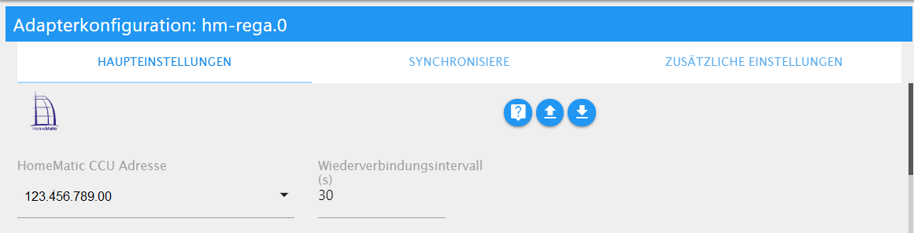
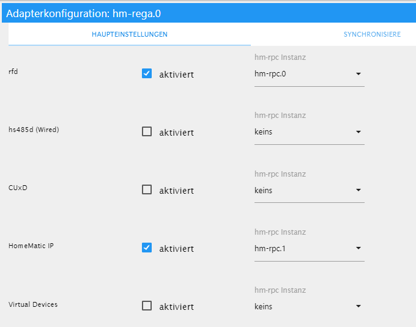

 
HomeMatic ReGaHSS
=================

Homematic
---------

Homematic ist das Smart Home System von eQ-3, das die umfassende Steuerung
unterschiedlichster Funktionen mithilfe von Szenarien (von einfach bis komplex)
in Haus oder Wohnung ermöglicht.

Die Geräte beinhaltet Produkte zur Licht-, Rollladen- und Heizungssteuerung,
Gefahrenmelder, Sicherheitssensoren und Produkte zur Wetterdatenmessung. Die
Funkkommunikation vereinfacht dabei das Nachrüsten. In Neubauten können
Drahtbus-Komponenten eingesetzt werden.

Adapter Homematic ReGaHss
-------------------------

Dieser Adapter stellt eine Verbindung zur Homematic Logikschicht „ReGaHSS“ her.
Er synchronisiert Klarnamen, Systemvariablen, Räume, Gewerke und Programme
zwischen Homematic und ioBroker.

Falls mehrere Zentralen in ioBroker eingebunden werden sollen, ist für jede
Zentrale eine eigene Instanz zu installieren und konfigurieren.

Mit der Installation von ReGaHSS wird auch eine Instanz von „Homematic RPC“
installiert, die konfiguriert und aktiv sein muss.

Eine Instanz dieses Adapters kann bis zu 5 unterschiedliche Instanzen des
Homematic RPC Adapters verwalten, die verschiedene Dienste zur Verfügung stellen
(jeder Dienst benötigt eine eigene RPC-Instanz):

-   rfd (CCU-Funkdienst für Standardkomponenten)

-   hs485d (Wired) (für Drahtbus-Komponenten)

-   CuxD (Zusatzsoftware zur Bereitstellung einer universellen Schnittstelle)

-   Homematic IP (IP-gestützte Komponenten)

-   Virtual Devices

### Voraussetzungen vor Installation

-   Homematic Gateway (CCU/CCU2/CCU3 …) *oder*

-   Funkmodul mit passender Software (piVCCU(*x)*, RaspberryMatic o.ä.)

Installation
------------

Eine Instanz des Adapters wird über die ioBroker Admin-Oberfläche installiert.

Nach Abschluss der Installation öffnet sich automatisch das
Konfigurationsfenster.

Vor der eigentlichen Konfiguration sollte die (zusammen mit diesem Adapter
erstellte) Instanz des HM-RPC-Adapters konfiguriert (s. hier) oder bei Bedarf
weitere HM-RPC-Instanzen angelegt werden.

Konfiguration
-------------

   
*Auswahlmenü*

Im oberen Auswahlmenü können drei verschiedenen Bereiche ausgewählt werden:

### Bereich Haupteinstellungen

   
*Basiseinstellungen des Adapters*

In diesem Bereich werden die grundlegenden Einstellungen vorgenommen.

Im Pulldown-Menü kann die IP-Adresse der CCU ausgewählt werden; auch der
Wiederverbindungsintervall (Standard 30 sec) kann vom User angepasst werden.

  
*Dienste und zugehörige Instanzen*

Danach werden die erforderlichen Dienste aktiviert und mit der passenden
HM-RPC-Instanz verknüpft.

Polling

Wenn aktiviert, erfolgt die regelmäßige Abfrage der RegaHSS-Daten von der CCU,
die sich nach dem im Feld Intervalle eingestellten Sekunden richtet. Der
Intervall sollte nicht zu niedrig eingestellt werden, da ein zu häufiges
Abfragen zum Absturz der CCU führen kann.

Trigger

Um die aktiven Abfragen von ioBroker an den RegaHSS zu minimieren, kann auf der
CCU innerhalb eines Programms auch ein Trigger die Daten bei Änderung pushen.
Dafür kann eine virtuelle Taste der CCU genutzt werden, die in einem
CCU-Programm ausgelöst wird. Standardmäßig ist dies die Taste
BidCosRF.50.PRESS_SHORT (s. Beispielprogramm).

### Bereich Synchronisiere

Hier kann der User festlegen, welche Information von der CCU in ioBroker
übernommen werden. Es werden dann die entsprechenden Objekte und Datenpunkte in
ioBroker angelegt.
