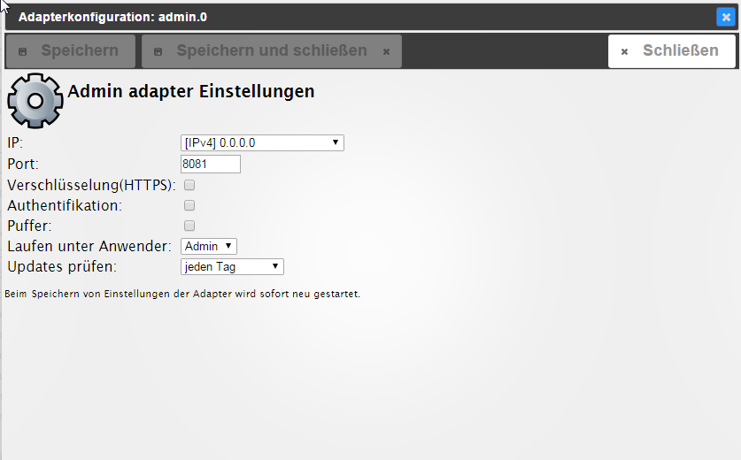

## ausführliche Beschreibung

Der Adapter admin dient der Bedienung der gesamten ioBroker-Installation. Er stellt ein Webinterface zur Verfügung. Dieses wird unter der `<IP-Adresse des Servers>:8081` aufgerufen. Dieser Adapter wird direkt bei der Installation von ioBroker angelegt.

Über das vom Adapter zur Verfügung gestellte GUI können u.a. folgenden Funktionen abgerufen werden:

*   Installation weiterer Adapter
*   Zugriff auf Objektübersicht
*   Zugriff auf die Zustandsübersicht der Objekte
*   Zugriff auf Benutzer und Gruppen Administration
*   Zugriff auf das Logfile
*   Verwaltung der Hosts

## Installation

Dieser Adapter wird direkt bei der Installation von ioBroker angelegt eine manuelle Installation ist nicht notwendig

## Konfiguration

#### IP

Hier wird die IP-Adresse unter der der Adapter erreichbar ist eingegeben. Verschiedene Ipv4 und Ipv6 Möglichkeiten stehen zur Auswahl. 
**Default ist 0.0.0.0\. Dies darf nicht verändert werden!**

#### Port

Hier wird der Port, unter der der Administrator aufgerufen werden kann eingestellt. Falls auf dem Server mehrere Webserver laufen muss dieser Port angepasst werden, damit es nicht zu Problemen wegen doppelter Portvergabe kommt.

#### Verschlüsselung

Soll das sichere Protokoll https verwendet werden ist hier ein Haken zu setzen.

#### Authentifikation

Soll eine Authentifizierung erfolgen ist hier ein Haken zu setzen.

## Bedienung

Über den Webbrowser die folgende Seite aufrufen: 

`<IP-Adresse des Servers>:8081`

## Reiter

Die Hauptseite des Administrators besteht aus mehreren Reitern. In der Grundinstallation werden die Reiter wie in der Abbildung angezeigt. Über das Bleistift-Icon rechts oben (1) können nach der Installation zusätzlicher Adapter weitere Reiter hinzugefügt werden. Dort können auch Reiter deaktiviert werden um eine besser Übersicht zu erhalten.

Ausführliche Informationen sind in den Seiten hinterlegt, die über die Überschriften verlinkt sind.

### [Adapter](admin/tab-adapters.md)

Hier werden die verfügbaren und installierten Adapter angezeigt und verwaltet.

### [Instanzen](admin/tab-instances.md)

Hier werden die bereits über den Reiter Adapter installierten Instanzen aufgelistet und können entsprechend konfiguriert werden.

### [Objekte](admin/tab-objects.md)

Die verwalteten Objekte (z.B. die Geräte/Variablen/Programme der CCU). Hier können Objekte angelegt und gelöscht werden. 
Über die _Pfeil hoch_ und _Pfeil runter_ Knöpfe können ganze Objektstrukturen hoch- oder runtergeladen werden. 
Ein weiterer Knopf ermöglicht die Anzeige der Expertenansicht.

Werden Werte in roter Schrift angezeigt, sind sie noch nicht bestätigt (`ack = false`).

### [Zustände](admin/tab-states.md)

Die aktuellen Zustände der Objekte.

### [Ereignisse](admin/tab-events.md)

Eine Liste der laufenden Aktualisierung der Zustände.

### [Gruppen](admin/tab-groups.md)

Hier werden die angelegten Usergruppen angelegt und die Rechte verwaltet

### [Benutzer](admin/tab-users.md)

Hier können Benutzer angelegt und zu den bestehenden Gruppen hinzugefügt werden.

### [Aufzählungen](admin/tab-enums.md)

Hier werden die Favoriten, Gewerke und Räume aus der Homematic-CCU aufgelistet.

### [hosts](admin/tab-hosts.md)

Informationen über den Rechner, auf dem ioBroker installiert ist. 
Hier kann die aktuelle Version des js-Controllers upgedated werden. 
Liegt eine neue Version vor, erscheint die Beschriftung des Reiters in grüner Farbe.

### [Log](admin/tab-log.md)

Hier wird das log angezeigt

Im Reiter Instanzen kann bei den einzelnen Instanzen der zu loggende Loglevel eingestellt werden. 
In dem Auswahlmenü wird der anzuzeigende Mindest-Loglevel ausgewählt. 
Sollte ein Error auftreten, erscheint die Beschriftung des Reiters in roter Farbe.

Nach der Installation zusätzlicher Adapter können noch weitere Reiter über das 
Bleistift-Icon oben rechts (1) aktiviert werden. Die Beschreibung dieser 
Reiter befindet sich bei dem entsprechenden Adapter.

### [Systemeinstellungen](admin/tab-system.md)

In dem sich hier öffnenden Menü werden Einstellungen wie Sprache, Zeit- und Datumsformat sowie 
weitere systemweite Einstellungen getätigt. 

 

Auch die Repositorien und Sicherheitseinstellungen können hier eingestellt werden. 
Eine tiefergehende Beschreibung ist über den Link in dem Titel dieses Abschnitts zu erreichen.

## Changelog
### 4.0.0 (2020-01-15)
* (Apollon77) upgrade all dependencies, especially socketio to current version! This might break ipad 1/2 devices

### 3.7.9 (2020-01-28)
* (bluefox) The log downloading was fixed

### 3.7.8 (2020-01-26)
* (bluefox) The disabling of custom settings was corrected

### 3.7.5 (2019-12-29)
* (bluefox) Added the filter of the running instances
* (bluefox) The incompatible adapters will be hidden

### 3.7.1 (2019-11-20)
* (bluefox) Easy admin configuration was implemented

### 3.6.12 (2019-11-04)
* (ldittmar) Add repo check to popup messages
* (ldittmar) Update Controller-Update info page
* (Apollon77) update deps

### 3.6.11 (2019-10-16)
* (bluefox) Fixed login of non-admin user

### 3.6.10 (2019-10-11)
* (ldittmar) Add NPM version and OS check to popup messages
* (bluefox) Log paths were sanitized
* (bluefox) NPM packages were updated

### 3.6.7 (2019-09-24)
* (ldittmar) Add Node.JS version check to popup messages

### 3.6.6 (2019-09-18)
* (SchumyHao) Update Chinese translation
* (tmikulski) Update translations.json

### 3.6.5 (2019-09-02)
* (ldittmar) Fix anoying popups from info adapter

### 3.6.4 (2019-06-03)
* (bluefox) Update nodejs recommendation message and check to recommend nodejs 10

### 3.6.3 (2019-06-02)
* (bluefox) Added deleteFile internal function (required for lovelace)
* (bluefox) Added yaml editor (required for lovelace)
* (bluefox) try to fix auto-fill option
* (dobis) Update italian translations

### 3.6.2 (2019-05-05)
* (bluefox) Added onSave handler for custom dialogs

### 3.6.1 (2019-04-18)
* (ldittmar) Better integration for ioBroker.info (1.3.7)
* (ldittmar) Update Gulp to v4
* (ldittmar) Update materialize-css to v 1.0.0

### 3.6.0 (2018-11-08)
* (foxriver76) New update states added in info channel
* (foxriver76) Take respect to async when creating info states
* (SchumyHao) Added chinese translations

### 3.5.10 (2018-09-22)
* (bluefox) Disable too many debug outputs

### 3.5.9 (2018-09-12)
* (bluefox) The log output problem was fixed

### 3.5.8 (2018-09-03)
* (bluefox) Google map was replaces with "open street map"

### 3.5.7 (2018-08-30)
* (bluefox) Edit of the table entries in configuration dialog was corrected.

### 3.5.6 (2018-08-22)
* (bluefox) Import and export of the instance configuration was implemented.

### 3.5.5 (2018-08-21)
* (bluefox) Fix upload of files

### 3.5.3 (2018-08-18)
* (bluefox) Dropdown was fixed on touch devices
* (bluefox) Speedup build of instances

### 3.5.1 (2018-08-11)
* (bluefox) Error in custom settings was fixed

### 3.5.0 (2018-08-03)
* (bluefox) Editing of enums was changed
* (bluefox) Logo was updated
* (bluefox) The function icons were added

### 3.4.9 (2018-07-17)
* (bluefox) Support of the custom login screen background
* (bluefox) show tooltip about refresh on instances page
* (bluefox) Destroy tabs after they left

### 3.4.8 (2018-07-17)
* (bluefox) fix error with add new enum
* (bluefox) try to fix error with custom settings
* (bluefox) place all titles at the top in the config
* (bluefox) add expert mode to common
* (bluefox) allow edit of enum's names in many languages

### 3.4.7 (2018-06-25)
* (bluefox) add getInterfaces function
* (bluefox) save scroll position for some tables
* (bluefox) add info about "filtered out"

### 3.4.6 (2018-06-18)
* (bluefox) Minor GUI fixes

### 3.4.5 (2018-06-12)
* (bluefox) Minor GUI fixes

### 3.4.4 (2018-06-04)
* (bluefox) add touch support for draggable and droppable
* (bluefox) edit raw value and not escaped in selectID.js
* (bluefox) allow edit of empty names in selectID.less
* (bluefox) add change with ack=true to selectID
* (bluefox) fix select for admin3 in configuration dialog
* (bluefox) add autocomplete for configs
* (bluefox) fix enums

### 3.4.3 (2018-05-13)
* (bluefox) The button in selectID was fixed
* (bluefox) disk info was added
* (bluefox) The filter in table mode on adapter tab was showed
* (bluefox) memAvailable for RAM monitoring is used
* (bluefox) fix select problem in config dialog
* (bluefox) added the asking about unsaved scripts

### 3.4.2 (2018-05-04)
* (BuZZy1337) fix wrong height calculation in select id dialog

### 3.4.1 (2018-05-03)
* (bluefox) fix wait popup
* (bluefox) fix button name in config dialog
* (BuZZy1337) escape html from log entries
* (bluefox) fix objects counter
* (BuZZy1337) show current Tab in Page-Title
* (BuZZy1337) escape HTML Tags from selectID.js
* (bluefox) GUI bugfixes
* (BuZZy1337) Fix: Unable to scroll trough Dropdown on Touchscreens
* (BuZZy1337) Enhancement: Show current Tab in Pagetitle

### 3.4.0 (2018-04-23)
* (bluefox) show error about not activated admin for cloud
* (bluefox) handle mutlilanguage names
* (bluefox) show number of objects
* (BuZZy1337) always addChips when input blurs
* (bluefox) fix select ID dialog for old styles
* (bluefox) add states view for object tab

### 3.3.9 (2018-04-12)
* (bluefox) The user and groups deletion was corrected
* (bluefox) Force using of socket.io 2.1.0

### 3.3.8 (2018-04-10)
* (bluefox) Hosts selection is improved

### 3.3.7 (2018-04-10)
* (bluefox) small UI corrections

### 3.3.5 (2018-03-25)
* (bondrogeen) info for server redesigned
* (bondrogeen) hosts list redesigned
* (bluefox) small UI corrections

### 3.3.4 (2018-03-17)
* (bluefox) small UI corrections

### 3.3.3 (2018-03-15)
* (bluefox) small UI corrections

### 3.3.1 (2018-03-11)
* (bluefox) Corrections for scenes
* (bluefox) move from socket.io 2.0.4 to 1.5.1 because of bug
* (bluefox) small fix for hosts

### 3.3.0 (2018-03-10)
* (bluefox) Overview page was added
* (bluefox) Many bugs were fixed

### 3.2.4 (2018-03-04)
* (bluefox) Adjust layout on mobile devices

### 3.2.1 (2018-03-03)
* (bluefox) Many UI fixes

### 3.2.0 (2018-02-09)
* (bluefox) The select ID dialog was fixed

### 3.1.12 (2018-02-05)
* (bondrogeen) Configuration dialog updated
* (bondrogeen) Open menu button is fixed

### 3.1.11 (2018-02-04)
* (bluefox) Connection LED fixed

### 3.1.10 (2018-02-02)
* (bluefox) update material CSS
* (bluefox) fix permission error
* (bluefox) fix filter of adapters

### 3.1.7 (2018-01-31)
* (bluefox) Fixing the role selection
* (bluefox) It runs even in IE10

### 3.1.6 (2018-01-30)
* (bluefox) Fixes for Firefox and MS-EDGE

### 3.1.2 (2018-01-25)
* (bluefox) GUI corrections

### 3.0.12 (2018-01-19)
* (bluefox) Old configuration dialogs fixed
* (bluefox) convert strings to booleans by object edit
* (DeepCoreSystem) Updates in english, german and french translations
* (bluefox) buttons layout fixed
* (bluefox) event fixes

### 3.0.11 (2018-01-11)
* (DeepCoreSystem) French update
* (bluefox) fix error with empty ID
* (bluefox) add sort by "recently updated"
* (ldittmar) add readme and issues viewer

### 3.0.10 (2018-01-06)
* (bluefox) Update indication
* (ldittmar) Use jQuery3
* (AlCalzone) German translations

### 3.0.7 (2018-01-01)
* (soef) update instances, objects and other lists
* (bluefox) rewrite interface with materialize

### 2.0.11 (2017-10-23)
* (bluefox) Configurable event update disable threshold

### 2.0.10 (2017-10-22)
* (soef) added use of delete-key in the objects view

### 2.0.8 (2017-10-12)
* (soef) fix quickEdit: number with boolean value

### 2.0.7 (2017-10-11)
* (soef) Sort option added to object view

### 2.0.5 (2017-10-06)
* (bluefox) Show the history charts if the web server has the https option on too

### 2.0.3 (2017-08-13)
* (bluefox) Fix user access rights for sendToHost

### 2.0.2 (2017-08-12)
* (bluefox) Add the editing of the default access rights

### 2.0.1 (2017-08-07)
* (bluefox) Allow access via iobroker.pro
* (bluefox) Add node.js version recommendation

### 1.8.3 (2017-07-24)
* (bluefox) allow access on tmp directory

### 1.8.0 (2017-06-02)
* (bluefox) split into modules

### 1.7.6 (2017-06-01)
* (bluefox) Fix edit of the enum name

### 1.7.5 (2017-05-20)
* (bluefox) catch error if translated object is not text
* (bluefox) update selectID.js
* (bluefox) do not open configuration dialog for instances with no config
* (Steiger04) select multiple auch bei data-name="[eigner-name]"

### 1.7.3 (2017-03-25)
* (bluefox) fix license dialog
* (bluefox) change color of tooltip text
* (ykuendig) update german translation
* (bluefox) add docs

### 1.7.2 (2017-03-15)
* (bluefox) add statistics selector for no-city
* (bluefox) support of discovery by first start

### 1.7.1 (2017-03-11)
* (apollon77) fix save button functionality
* (ykuendig) Update german translations
* (bluefox) patch repositories to support stable

### 1.7.0 (2017-03-08)
* (bluefox) fix log
* (bluefox) show jQuery button for role button
* (apollon77) update testing setup.js
* (bluefox) fix wetty loading
* (bluefox) fix add/delete tabs
* (bluefox) implement hints for configuration dialog
* (bluefox) redirect if IP address changes
* (bluefox) add tooltip instruction
* (bluefox) wizard support
* (bluefox) fix acl error
* (bluefox) fix license agree button

## License

The MIT License (MIT)

Copyright (c) 2014-2020 bluefox <dogafox@gmail.com>