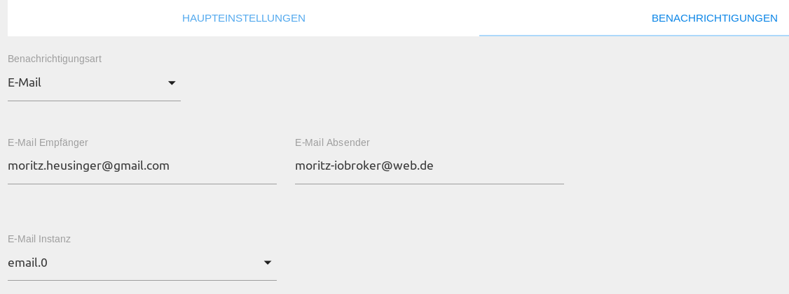
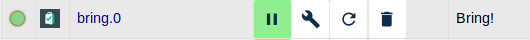
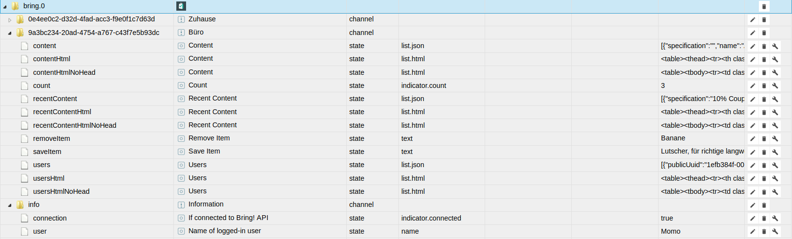

# Bring! Adapter

Der Bring! Adapter ermöglicht die Einbindung aller Bring! Einkaufslisten eines Nutzers.

## Überblick

### Bring!
Bei Bring! handelt es sich um eine Applikation für mobile Endgeräte sowie Web-App, um Einkaufslisten kollaborativ zu 
nutzen. So kann im Haushalt gemeinsam eine Einkaufsliste genutzt werden und wird automatisch mit den anderen Mitgliedern
der Liste synchronisiert.

### Bring! Adapter
Der Bring! Adapter findet nach Anmeldung mittels E-Mail Adresse und Passwort des Bring! Accounts automatisch alle Listen
des entsprechenden Nutzers. 
<br/>
Der Adapter legt automatisch alle Listen in Form von Channels an und bietet neben der Darstellung der Liste als JSON 
sowie HTML auch die Möglichkeit neue Gegenstände auf die Liste zu setzen und zu entfernen.

## Voraussetzungen vor der Installation
Es muss ein Bring! Account existieren und eine Internetverbindung bestehen. Ein Bring! Account kann über die mobile 
Applikation auf dem Smartphone angelegt werden.

## Installation
Eine Instanz des Adapters wird über die ioBroker Admin-Oberfläche installiert. 
Die ausführliche Anleitung für die dazu notwendigen Installatonschritte kann hier (TODO:LINK) nachgelesen werden.
<br/><br/>
Nach Abschluss der Installation einer Adapterinstanz öffnet sich automatisch ein Konfigurationsfenster.

## Konfiguration


<span style="color:grey">*Tab Haupteinstellungen*</span>

| Feld         | Beschreibung |                                                                       
|:-------------|:-------------|
|E-Mail Adresse|E-Mail Adresse des Bring! Accounts|
|Passwort|Passwort des zugehörigen Accounts|

<span style="color:grey">*Tab Benachrichtigungen*</span>

Falls es gewünscht ist, Benachrichtigungen per Mail zu erhalten, kann dies im Tab __Benachrichtigungen__ konfiguriert 
werden. Bei Betätigung des `messageTrigger` Buttons einer Liste, wird diese Liste an die konfigurierten Empfänger versendet.

| Feld         | Beschreibung |                                                                       
|:-------------|:-------------|
|Benachrichtigungsart|Art der Benachrichtigung (E-Mail, Pushover, Telegram|
|E-Mail Empfänger|Empfänger der Mail|
|Telegram Empfänger|Empfänger der Telegram Nachricht|
|E-Mail Absender|Absender Adresse der E-Mail|
|Device ID (optional)| Pushover Device ID des Empfängers|
|E-Mail/Pushover/Telegram Instanz|Instanz zum Versenden der Nachricht|

Nach Abschluss der Konfiguration wird der Konfigurationsdialog mit `SPEICHERN UND SCHLIEßEN` verlassen. 
Dadurch efolgt im Anschluß ein Neustart des Adapters.

## Instanzen
Die Installation des Adapters hat im Bereich `Instanzen` eine aktive Instanz des Bring! Adapters angelegt.
<br/><br/>
<span style="color:grey">  
*Erste Instanz*</span>

Auf einem ioBroker Server können mehrere Bring! Adapter Instanzen angelegt werden. 
Sollen mehrere Accounts von einem ioBroker Server synchronisiert werden, sollte 
je Account eine Instanz angelegt werden.
<br/><br/>
Ob der Adapter aktiviert oder mit der Bring! API verbunden ist, wird mit der Farbe des Status-Feldes der 
Instanz verdeutlicht. Zeigt der Mauszeiger auf das Symbol, werden weitere Detailinformationen dargestellt. 

## Objekte des Adapters
Im Bereich `Objekte` werden in einer Baumstruktur alle vom Adapter im Account 
erkannten Listen aufgeführt. 

<span style="color:grey">  
*Objekte des Bring! Adapters*</span>

Jeder Datenpunkt ist mit seinem zugehörigen Datentyp sowie seinen Berechtigungen aufgehführt. 
Berechtigungen können lesend (R) sowie schreibend (W) sein. Jeder Datenpunkt kann mindestens gelesen (R) werden, während
andere ebenfalls beschrieben werden können. Zur Suche nach einem bestimmten Datenpunkt empfiehlt sich die Suche mittels 
der Tastenkombination "STRG + F".

### Channel: info
* info.connection

    |Datentyp|Berechtigung|                                                                       
    |:---:|:---:|
    |boolean|R|

   *Read-only boolean Wert, der aussagt ob die Verbindung zur API hergestellt ist.*
   
* info.user

    |Datentyp|Berechtigung|                                                                       
    |:---:|:---:|
    |string|R|

   *Read only string. Beinhaltet den Namen des eingeloggten Nutzers*
   
### Einkaufslisten
Für jede Einkaufsliste wird ein Channel mit den folgenden Objekten angelegt:

* *list*.content / *list*.contentHtml/NoHead

    |Datentyp|Berechtigung|                                                                       
    |:---:|:---:|
    |string|R|

   *Read only json/html string formatiert als Liste, bzw. HTML Tabelle.
   Beinhaltet die Gegenstände die aktuell auf der Einkaufsliste stehen.
   Die NoHead HTML Tabellen sind ohne HTML Header.*
   
* *list*.recentContent / *list*.recentContentHtml/NoHead

    |Datentyp|Berechtigung|                                                                       
    |:---:|:---:|
    |string|R|

    *Read only json/html string formatiert als Liste, bzw. HTML Tabelle.
   Beinhaltet die Gegenstände die kürzlich auf der Einkaufsliste standen.
   Die NoHead HTML Tabellen sind ohne HTML Header.*
   
* *list*.removeItem

    |Datentyp|Berechtigung|                                                                       
    |:---:|:---:|
    |string|R/W|

   *Mit diesem State kann ein Gegenstand von der Einkaufsliste entfernt werden. 
   Der State wird bestätigt, sobald das Kommando von der Bring! API bestätigt wurde.*
   
* *list*.moveToRecentContent

    |Datentyp|Berechtigung|                                                                       
    |:---:|:---:|
    |string|R/W|

   *Mit diesem State kann ein Gegenstand zur recentContent Liste bewegt bzw. hinzugefügt werden. 
   Der State wird bestätigt, sobald das Kommando von der Bring! API bestätigt wurde.*
   
* *list*.saveItem

    |Datentyp|Berechtigung|                                                                       
    |:---:|:---:|
    |string|R/W|

   *Erlaubt das hinzufügen eines Gegenstandes zur Einkaufsliste. Durch das folgende Schema, können zusätzliche
   Spezifikationen mitgegeben werden:* 
   
   ```Apple, 2.50 $, the green ones```
   
   *Hierbei wird alles nach dem ersten Komma, als Spezifikation gewertet und erscheint in der App unter dem Gegenstand. 
   Der State wird bestätigt, sobald das Kommando von der Bring! API bestätigt wurde.*
    
* *list*.users / *list*.usersHtml/NoHead

    |Datentyp|Berechtigung|                                                                       
    |:---:|:---:|
    |string|R|

    *Read only json/html string formatiert als Liste, bzw. HTML Tabelle.
   Beinhaltet alle Nutzer die derzeit Mitglied der Liste sind.
   Die NoHead HTML Tabellen sind ohne HTML Header.*
   
* *list*.count

    |Datentyp|Berechtigung|                                                                       
    |:---:|:---:|
    |number|R|

   *Read only number, welcher anzeigt, wie viele Gegenstände sich derzeit auf der Einkaufsliste befinden.*
   
* *list*.messageTrigger

    |Datentyp|Berechtigung|                                                                       
    |:---:|:---:|
    |button|R/W|
    
    *Bei Betätigung des Buttons, wird eine Nachricht mittels Pushover, E-Mail und/oder Telegram and die konfigurierten
     Instanzen versendet, welche die aktuelle Einkaufsliste enthält.*
     
* *list*.enumSentence

    |Datentyp|Berechtigung|                                                                       
    |:---:|:---:|
    |string|R|
    
    *Nur lesbarer String, welcher eine Auflistung der aktuellen Gegenstände in sprechbarer Form enthält. 
    Eignet sich z. B. zur Sprachausgabe via Sprachassistenten.*
    
* *list*.translation

    |Datentyp|Berechtigung|                                                                       
    |:---:|:---:|
    |string|R|
    
    *Nur lesbarer JSON-String, der ein Wörterbuch zur Übersetzung der schweizerischen Namen in die Listensprache darstellt.

## Changelog
### 1.7.7 (2020-12-12)
* (foxriver76) fix potential crash on `pollAllLists` function

### 1.7.6 (2020-12-05)
* (foxriver76) we now use a unique name for widget rendering function to avoid conflicts
* (foxriver76) if we cannot render widget immediately we try again after one second (see #57)

### 1.7.4 (2020-12-04)
* (foxriver76) we now render the widget immediately

### 1.7.3 (2020-10-26)
* (foxriver76) bring module now returns real errors instead of strings, handle them correct

### 1.7.2 (2020-04-23)
* (foxriver76) fixed potential issue on rendering widget

### 1.7.1 (2020-02-13)
* (foxriver76) we are now using AES-256-CBC as encryption

### 1.6.8 (2019-12-31)
* (foxriver76) ensure compatibility with older browsers

### 1.6.6 (2019-11-21)
* (foxriver76) improved error handling in widget

### 1.6.5 (2019-09-22)
* (foxriver76) re-auth when bearer token is no longer valid

### 1.6.3 (2019-08-28)
* (foxriver76) fixed bug which only allowed one registered event handler
* (foxriver76) by using obj with wid instead of var because vis handles global variables of widgets global
* (foxriver76) now more bring widgets can be used in one vis project
* (foxriver76) bump version of textFit to 2.3.1 -> 2.4.0 and use minified version

### 1.6.2 (2019-08-04)
* (foxriver76) also use translations for enumSentence and notifiations (e. g. email)

### 1.6.1 (2019-07-13)
* (foxriver76) fixed bug, that prevent html states and other from being set

### 1.6.0 (2019-07-12)
* (foxriver76) get translations according to list language
* (foxriver76) translations will be stored in datapoint
* (foxriver76) use bring-node-api at least 1.2.1
* (foxriver76) widget now uses configured language
* (foxriver76) bugfixes and optimizations in front- and backend

### 1.4.0 (2019-06-07)
* (foxriver76) use textFit to fit text to one line in widget
* (foxriver76) internal reworks on widget

### 1.3.4
* (foxriver76) add possibility to use this widget multiple times on same page

### 1.3.3
* (foxriver76) also change height and div sizes according to users specification
* (foxriver76) when item is on recent list and added by text input it is now instantly removed from recent list

### 1.3.2
* (foxriver76) enable configuration of width for items in widget

### 1.3.1
* (foxriver76) api module outsourced

### 1.3.0
* (foxriver76) added widget
* (foxriver76) add possibility to move items to recentContent

### 1.2.1
* (foxriver76) uri encode login request because it can contain special character

### 1.2.0
* (foxriver76) added state which contains a speakable enumeration of each shopping list

### 1.1.0
* (foxriver76) add possibility to send messages
* (foxriver76) respect in app list renaming / recreate channel on name change

### 1.0.0
* (foxriver76) stable release
   
### 0.0.10
* (foxriver76) set info.connection state to false, when cannot get data
   
### 0.0.9
* (foxriver76) also update no head states on normal polling
* (foxriver76) fix bug where polling could grow exponentially
* (foxriver76) fix unhandled error when no internet connection

### 0.0.8
* (foxriver76) add html states w/o header
* (foxriver76) minor fixes
   
### 0.0.7
* (foxriver76) fixed a potential memory leak by setTimeout functions

### 0.0.6
* (foxriver76) add equivalent html states for json states
* (foxriver76) add counter for every list

### 0.0.4
* (foxriver76) fix when login fails

### 0.0.3
* (foxriver76) initial release

## License
The MIT License (MIT)

Copyright (c) 2019-2020 Moritz Heusinger <moritz.heusinger@gmail.com>

Permission is hereby granted, free of charge, to any person obtaining a copy
of this software and associated documentation files (the "Software"), to deal
in the Software without restriction, including without limitation the rights
to use, copy, modify, merge, publish, distribute, sublicense, and/or sell
copies of the Software, and to permit persons to whom the Software is
furnished to do so, subject to the following conditions:

The above copyright notice and this permission notice shall be included in
all copies or substantial portions of the Software.

THE SOFTWARE IS PROVIDED "AS IS", WITHOUT WARRANTY OF ANY KIND, EXPRESS OR
IMPLIED, INCLUDING BUT NOT LIMITED TO THE WARRANTIES OF MERCHANTABILITY,
FITNESS FOR A PARTICULAR PURPOSE AND NONINFRINGEMENT. IN NO EVENT SHALL THE
AUTHORS OR COPYRIGHT HOLDERS BE LIABLE FOR ANY CLAIM, DAMAGES OR OTHER
LIABILITY, WHETHER IN AN ACTION OF CONTRACT, TORT OR OTHERWISE, ARISING FROM,
OUT OF OR IN CONNECTION WITH THE SOFTWARE OR THE USE OR OTHER DEALINGS IN
THE SOFTWARE.