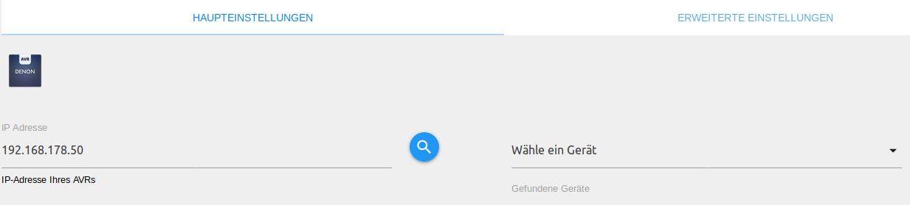
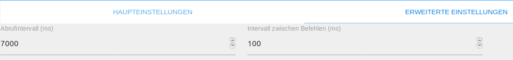

# DENON/Marantz AV-Receiver Adapter

Der DENON Adapter ermöglicht die Einbindung eines AV-Receivers des Herstellers DENON oder Marantz in das ioBroker System.

## Überblick

### DENON AV-Receiver
Bei DENON und Marantz AV-Receivern handelt es sich um AV-Receiver der Mittel bis Oberklasse. Unterstützt wird regulär mindestens
5.1 Surround Sound. So ist es möglich Boxen und Subwoofer unterschiedlicher Hersteller in das Multimediasystem einzubinden. 
<br/>
Ebenfalls sind die meisten neueren Geräte netzwerkfähig, wodurch diese neben den klassischen Eingangssignalen auch Internetradio, 
Serverdateien und via Bluetooth oder Netzwerk gestreamte Dateien wiedergeben können.

### DENON Adapter
Der DENON Adapter findet automatisch kompatible DENON und Marantz AV-Receiver, die sich im gleichen Netzwerksubnetz wie
der ioBroker befinden.
<br/>
Der Adapter legt automatisch alle für das jeweilige Modell verüfgbaren Befehle und Stati in Form von Objekten an. 
Ein Großteil der Stati kann ebenfalls ausgelesen werden, wie z. B. die aktuelle Laustärke, der Eingangskanal und viele mehr.
Durch geziehltes Beschreiben oder Lesen der angelegten Objekten kann deren Status geändert und 
damit Aktionen ausgelöst oder auch abgefragt werden. 

## Voraussetzungen vor der Installation
Bevor der Adapter mit einem AV-Receiver kommunizieren kann, sollte sichergestellt werden, dass der AV-Receiver korrekt
konfiguriert ist. Ebenfalls muss der AV-Receiver über eine aktive Netzwerkverindung verfügen.

1. Durch das Drücken der "SETUP" Taste auf der Fernbedienung, öffnet sich das Menü auf dem Onscreen-Display (OSD) sowie auf dem
angeschlossenen Videoausgangs-Gerät.
2. Anschließend muss der Menüpunkt "Netzwerk" und anschließend der Punkt "Einstellungen" gewählt werden.
3. Die Parameter sollten wie folgt konfiguriert werden:

   *DHCP: EIN (Diese Einstellung sollte genutzt werden, wenn es einen DHCP Server (z. B. FRITZ!Box) im lokalen Netzwerk gibt)*
  
   *IP-Adresse: Wenn DHCP ausgeschaltet ist, muss eine IP-Adresse konfiguriert werden.*
  
   *Subnetz Maske: Subnetzmaske muss nur konfiguriert werden wenn DHCP ausgeschaltet wurde.*
  
   *Standardgateway: Die Adresse des Gateways sollte konfiguirert werden, falls DHCP ausgeschaltet wurde.*
  
   *Prim. DNS-Server: Nicht konfigurieren.*
  
   *Second DNS: Nicht konfigurieren.*
  
   *Proxy: AUS*
  
4. Durch Drücken des Punktes "Speichern" werden die Einstellungen übernommen
5. Der "SETUP" Knopf auf der Fernbedienung muss erneut gedrückt werden
6. Nun sollte in das Menü "Netzwerk" navigiert werden und anschließend "Netzwerk-Strg" geäwhlt werden.
7. Der konfigurierebare Parameter sollte auf "Immer ein" gestellt werden.

## Installation
Eine Instanz des Adapters wird über die ioBroker Admin-Oberfläche installiert. 
Die ausführliche Anleitung für die dazu notwendigen Installatonschritte kann hier (TODO:LINK) nachgelesen werden.
<br/><br/>
Nach Abschluss der Installation einer Adapterinstanz öffnet sich automatisch ein Konfigurationsfenster.

## Konfiguration

### Fenster "Haupteinstellungen"
<span style="color:grey">*Admin Oberfläche*</span>

| Feld         | Beschreibung |                                                                       
|:-------------|:-------------|
|IP Adresse    |Hier soll die IP-Adresse des gewünschten AV-Receivers eingegeben werden. Alternativ können Geräte im Netzwerk durch Klick auf die Lupe gesucht und anschließend im Dropdown Menü selektiert werden.|

### Fenster "Erweiterte Einstellungen"
<span style="color:grey">*Admin Oberfläche*</span>

| Feld         | Beschreibung |                                                                       
|:-------------|:-------------|
|Abrufintervall|Hiermit kann festgelegt werden, wie oft der Adapter manche Objekte aktualisiert. Die meisten Objekte werden bei einer Änderung automatisch aktualisiert. Der voreingestellte Wert hat sich als geeignet erwiesen.|
|Intervall zwischen Befehlen|Hier kann festgelegt werden, wie lange der Adapter zwischen Befehlen wartet. Sollte ein älterer AV-Receiver genutzt werden und Probleme mit dem Adapter auftreten, kann es sinnvoll sein, diesen Wert zu erhöhen (z. B. auf 200 ms).|

Nach Abschluss der Konfiguration wird der Konfigurationsdialog mit `SPEICHERN UND SCHLIEßEN` verlassen. 
Dadurch efolgt im Anschluß ein Neustart des Adapters.

## Instanzen
Die Installation des Adapters hat im Bereich `Instanzen` eine aktive Instanz des DENON Adapters angelegt.
<br/><br/>
<span style="color:grey">  
*Erste Instanz*</span>

Auf einem ioBroker Server können mehrere DENON Adapter Instanzen angelegt werden. Jedoch kann ein AV-Receiver nur mit 
einem ioBroker Server gleichzeitig verbunden sein. Sollen mehrere Geräte von einem ioBroker Server gesteuert werden, sollte 
je AV-Receiver eine Instanz angelegt werden.
<br/><br/>
Ob der Adapter aktiviert oder mit dem AV-Receiver verbunden ist, wird mit der Farbe des Status-Feldes der 
Instanz verdeutlicht. Zeigt der Mauszeiger auf das Symbol, werden weitere Detailinformationen dargestellt. 

## Objekte des Adapters
Im Bereich `Objekte` werden in einer Baumstruktur alle vom Adapter im AVR erkannten
Funktionalitäten aufgelistet. Zusätzlich wird auch noch 
darüber informiert, ob die Kommunikation mit dem AVR reibungslos erfolgt.

<span style="color:grey">  
*Objekte des DENON Adapters*</span>

Nachfolgend werden die Objekte in States und Buttons unterteilt. 
Jeder Datenpunkt ist mit seinem zugehörigen Datentyp sowie seinen Berechtigungen aufgehführt. 
Berechtigungen können lesend (R) sowie schreibend (W) sein. Jeder Datenpunkt kann mindestens gelesen (R) werden, während
andere ebenfalls beschrieben werden können. Zur Suche nach einem bestimmten Datenpunkt empfiehlt sich die Suche mittels 
der Tastenkombination "STRG + F".

### Buttons
Der Adapter erstellt die folgenden Buttons:

#### Channel: zoneMain / zone2 / zone3

* zoneMain.playPause

   *Wiedergeben und pausieren von Musik von den Quellen: Bluetooth, Online, USB/iPod.*
   
* zoneMain.play

   *Wiedergeben von Musik von den Quellen: Bluetooth, Online, USB/iPod.*
   
* zoneMain.pause

   *Pausieren von Musik von den Quellen: Bluetooth, Online, USB/iPod.*

* zoneMain.skipMinus

   *Springe zum nächsten Titel.*
   
   *Hinweis: Dieser State ist auf HEOS-fähigen Geräten nicht voll funktionsfähig.*

* zoneMain.skipPlus

   *Springe zum vorherigen Titel.*
   
   *Hinweis: Dieser State ist auf HEOS-fähigen Geräten nicht voll funktionsfähig.*

* zoneMain.volumeDown / zone2.volumeDown / zone3.volumeDown

   *"Leiser"-Knopf für die Zonen: Main Zone / Zone2 / Zone3.*
   
* zoneMain.volumeUp / zone2.volumeUp / zone3.volumeUp

   *"Lauter"-Knopf für die Zonen: Main Zone / Zone2 / Zone3.*
   
* zoneMain.equalizerBassUp / zone2.equalizerBassUp / zone3.equalizerBassUp

   *Diser Knopf erhöht das Bass Level der jeweiligen Zone.*
   
   *Bass und Treble Einstellungen können nur vorgenommen werden, wenn "Dyn EQ" ausgeschaltet sowie "Tone Control"
   eingeschaltet ist.*
   
* zoneMain.equalizerBassDown / zone2.equalizerBassDown / zone3.equalizerBassDown

   *Diser Knopf verringert das Bass Level der jeweiligen Zone.*
   
   *Bass und Treble Einstellungen können nur vorgenommen werden, wenn "Dyn EQ" ausgeschaltet sowie "Tone Control"
    eingeschaltet ist.*
   
* zoneMain.equalizerTrebleUp / zone2.equalizerTrebleUp / zone3.equalizerTrebleUp

   *Diser Knopf erhöht das Treble Level der jeweiligen Zone.*
   
   *Bass und Treble Einstellungen können nur vorgenommen werden, wenn "Dyn EQ" ausgeschaltet sowie "Tone Control"
    eingeschaltet ist.*
   
* zoneMain.equalizerTrebleDown / zone2.equalizerTrebleDown / zone3.equalizerTrebleDown

   *Diser Knopf verringert das Treble Level der jeweiligen Zone.*
   
   *Bass und Treble Einstellungen können nur vorgenommen werden, wenn "Dyn EQ" ausgeschaltet sowie "Tone Control"
    eingeschaltet ist.*
   
#### Channel: settings
   
* settings.subwooferLevelDown / settings.subwooferTwoLevelDown

   *Verringert das Subwoofer Level.*
   
* settings.subwooferLevelUp / settings.subwooferTwoLevelUp

   *Erhöht das Subwoofer Level.*
   
* settings.containmentAmountDown

   *Verrinert die Menge an Audyssey LFC. Dieser Button wird nur erstellt, wenn er vom AVR unterstützt wird*

* settings.containmentAmountUp

   *Erhöht die Menge an Audyssey LFC. Dieser Button wird nur erstellt, wenn er vom AVR unterstützt wird*
   
* settings.cursorUp / settings.cursorDown / settings.cursorLeft / settings.cursorRight

   *Simuliert die Pfeiltasten der Fernbedienung.*
   
* settings.enter

   *Simuliert den "Enter"-Knopf der Fernbedienung.*
	
* settings.return

   *Simuliert den "RETURN" oder "BACK" Knopf der Fernbedienung.*
   
* settings.option

   *Simuliert den "Option"-Knopf der Fernbedienung.*
   
* settings.info

   *Simuliert den "Info"-Knopf der Fernbedienung.*

### States
Die folgenden States werden vom Adapter angelegt:

#### Channel: info

* info.connection

    |Datentyp|Berechtigung|
    |:---:|:---:|
    |boolean|R|

   *Nur lesbarer Indikator, der true ist, wenn der ioBroker mit dem AVR verbunden ist.*
   
* info.friendlyName

    |Datentyp|Berechtigung|
    |:---:|:---:|
    |string|R|

   *Nur lesbarer String, der den Netzwerknamen des AVR's beinhaltet.*

* info.onlinePresets

    |Datentyp|Berechtigung|
    |:---:|:---:|
    |string|R|

    *String im JSON Array Format, welcher die derzeit gespeicherten Online-Favoriten je Id enthält.
    Der Name je Sender ist hierbei auf 20 Zeichen begrenzt. Um den
    derzeitigen Sender auf eine Id zu speichern kann settings.savePreset genutzt werden. Das Abspielen
    eines Favoritenkanals erfolgt durch den settings.loadPreset State.*
   
#### Channel: zoneMain / zone2 / zone3
   
* zoneMain.volume / zone2.volume / zone3.volume

    |Datentyp|Berechtigung|                                                                       
    |:---:|:---:|
    |number|R/W|

   *Number Wert der die derzeitige Lautstärke der jeweiligen Zone (Main Zone / Zone2 / Zone 3 )repsäentiert. 
   Durch beschreiben des Wertes wird der AVR auf die jeweilige Lautstärke gestellt. 
   Es existiert ein zusätzlicher State pro Zone, der den dB Wert enthält z. B. zoneMain.VolumeDB*
   
   *Der Bereich reicht von 0 zu 98 (eventuell niedriger durch die konfigurierte maximumVolume), wobei 80 = 0 dB*
   
   *Beispiel:*
   
    ```javascript
    setState('denon.0.zoneMain.volume', 45.5); // Setzt die Lautstärke der Main Zone auf 45.5
    ```
   
* zoneMain.maximumVolume

    |Datentyp|Berechtigung|                                                                       
    |:---:|:---:|
    |number|R|

   *Nur lesbarer Wert, der die maximal mögliche Lautstärke repräsentiert, wobei 80 = 0 dB. 
   Es existiert ein zusätlicher State maximumVolumeDB, welcher die maximal mögliche Laustärle in dB darstellt.*
   
* zoneMain.muteIndicator / zone2.muteIndicator / zone3.muteIndicator

    |Datentyp|Berechtigung|                                                                       
    |:---:|:---:|
    |boolean|R/W|

   *Boolscher Wert, welcher true liefert wenn die Main Zone / Zone2 / Zone3 stumm geschaltet ist, sonst false. 
   Durch setzen des States kann die entsprechende Zone stumm geschaltet werden.*
   
   *Beispiel:*
   
    ```javascript
    setState('denon.0.zoneMain.muteIndicator', true); // Schaltet die Main Zone stumm
    ```
   
* zoneMain.powerZone / zone2.powerZone / zone3.powerZone

    |Datentyp|Berechtigung|                                                                       
    |:---:|:---:|
    |boolean|R/W|

   *Boolscher Wert, welcher true ist, wenn die jeweilige Zone eingeschalten ist.
   Die jeweilige Zone kann mit diesem State ein- und ausgeschaltet werden*
   
* zoneMain.selectInput / zone2.selectInput / zone3.selectInput

    |Datentyp|Berechtigung|                                                                       
    |:---:|:---:|
    |string|R/W|

   *Der string Wert beinhaltet die aktuelle Eingangsquelle. Dieser kann hierbei ebenfalls gesetzt werden. Die Key-Value 
   Liste ist wie folgt aufgebaut:*
   
   *0: 	PHONO*
   
   *1: 	CD*
   
   *2: 	TUNER*
   
   *3: 	DVD*
   
   *4: 	BD*
   
   *5: 	TV*
   
   *6: 	SAT/CBL*
   
   *7: 	MPLAY*
   
   *8: 	GAME*
   
   *9: 	NET*
   
   *10:	SPOTIFY*
   
   *11:	LASTFM*
   
   *12:	IRADIO*
   
   *13:	SERVER*
   
   *14:	FAVORITES*
   
   *15:	AUX1*
   
   *16:	AUX2*
   
   *17:	AUX3*
   
   *18:	AUX4*
   
   *19:	AUX5*
   
   *20:	AUX6*
   
   *21:	AUX7*

   *22: BT*

   *23: USB*
   
   *Hinweis: Nicht jede Eingangsquelle ist auf jedem Modell verfügbar. Falls der AVR über zusätzliche Eingangsquellen
    verfügt, werden diese der Liste angefügt, sobald diese erkannt wurden.*
   
   *Beispiel:*
   
   ```javascript
    setState('denon.0.zoneMain.selectInput', '5'); // Selects TV as input for Main Zone
   ```

* zoneMain.quickSelect / zone2.quickSelect / zone3.quickSelect

    |Datentyp|Berechtigung|                                                                       
    |:---:|:---:|
    |number|R/W|
   
    *Steuert die "QuickSelect" bzw. "SmartSelect" Tasten des AVR's an. Nummern zwischen 1 und 5 für 
    Main Zone / Zone2 / Zone3 sind möglich.*
   
* zoneMain.sleepTimer / zone2.sleepTimer / zone3.sleepTimer

    |Datentyp|Berechtigung|                                                                       
    |:---:|:---:|
    |number|R/W|

   *Number Wert um den Sleep Timer zu setzen und zu lesen. Der Wert wird entsprechend, dem in den 
   erweiterten Einstellungen konfigurierebarem Abfrageintervall aktualisiert.*
   
* zoneMain.iconURL

    |Datentyp|Berechtigung|                                                                       
    |:---:|:---:|
    |string|R|

   *Beinhaltet einen Link zum Cover des aktuell abgespielten Senders oder Musikstücks.*
   
   *Hinweis: Dieser State ist auf HEOS-fähigen Geräten nicht verfügbar.*
   
* zoneMain.equalizerBass / zone2.equalizerBass / zone3.equalizerBass
    
    |Datentyp|Berechtigung|                                                                       
    |:---:|:---:|
    |number|R/W|

   *Number Wert welcher das aktuelle Bass Level der jeweiligen Zone repräsentiert. Der Wertebereich liegt von -6 bis +6 dB.*
   
   *Bass und Treble Einstellungen können nur vorgenommen werden, wenn "Dyn EQ" ausgeschaltet sowie "Tone Control"
    eingeschaltet ist.*
   
* zoneMain.equalizerTreble / zone2.equalizerTreble / zone3.equalizerTreble

    |Datentyp|Berechtigung|                                                                       
    |:---:|:---:|
    |number|R/W|

   *Number Wert welcher das aktuelle Treble Level der jeweiligen Zone repräsentiert. Der Wertebereich liegt von -6 bis +6 dB.*
   
   *Bass und Treble Einstellungen können nur vorgenommen werden, wenn "Dyn EQ" ausgeschaltet sowie "Tone Control"
    eingeschaltet ist.*
    
* zoneMain.channelVolumeFrontLeft / zone2.channelVolumeFrontLeft / zone3.channelVolumeFrontLeft / ...

   |Data type|Permission|                                                                       
   |:---:|:---:|
   |number|R/W|
   
   *Number wert welcher die derzeitige Kanallautstärke der Box darstellt. Jede Box hat einen separaten State. Die
   Einstellungen sind für den derzeitigen Select Input Modus wirksam und können von -12 dB bis + 12 dB justiert werden.*
   
#### Channel: display

* display.displayContent

    |Datentyp|Berechtigung|                                                                       
    |:---:|:---:|
    |string|R|
   
   *Nur lesbarer string, welcher den Inhalt des Onscreen-Displays enthält. Es gibt neun States, nummeriert von 0 - 9.*
   
   *Hinweis: Dieser State ist auf HEOS-fähigen Geräten nicht verfügbar.*
   
* display.brightness

    |Datentyp|Berechtigung|                                                                       
    |:---:|:---:|
    |string|R/W|

   *String Wert, welcher die Displayheligkeit des Onscreen-Display repräsentiert.
   Mit dem State kann diese ebenfalls gestuert werden. Die Key-Value Liste ist wie folgt aufgebaut:*
   
   *0: Off --> turns display off*
   
   *1: Dark --> turns display dark*
   
   *2: Dimmed --> turns display dimmed*
   
   *3: Bright --> turns display bright*
   
   *Beispiel:*
   
   ```javascript
   setState('denon.0.display.brightness', '3'); // Stellt die Helligkeit des Onscreen-Displays auf das Maximum
   ```
#### Channel: settings

* settings.powerSystem

    |Datentyp|Berechtigung|                                                                       
    |:---:|:---:|
    |boolean|R/W|
   
   *Boolscher Wert, welcher true ist, falls der AVR eingeschaltet ist, sonst false. Der AVR kann ebenfalls durch setzen 
   des States ein- und ausgeschaltet werden.*
   
* settings.surroundMode

    |Datentyp|Berechtigung|                                                                       
    |:---:|:---:|
    |string|R/W|

   *Der string Wert beinhaltet den derzeitigen Surround Mode. Dieser kann ebenfalls durch die folgende Key-Value Liste
   gesteuert werden:*
   
   *0:	STEREO*
   
   *1:	VIRTUAL*
   
   *2:	VIDEO GAME*
   
   *3:	MCH STEREO*
   
   *4:	DTS SURROUND*
   
   *5:	DOLBY DIGITAL*
   
   *6:	MOVIE*
   
   *7:	MUSIC*
   
   *8:	DIRECT*
   
   *9:	PURE DIRECT*
   
   *10:	AUTO*
   
   *11:	GAME*
   
   *12:	AURO3D*
   
   *13:	AURO2DSURR*
   
   *14:	WIDE SCREEN*
   
   *15:	SUPER STADIUM*
   
   *16:	ROCK ARENA*
   
   *17:	JAZZ CLUB*
   
   *18:	CLASSIC CONCERT*
   
   *19:	MONO MOVIE*
   
   *20:	MATRIX*
   
   *Hinweis: Nicht jeder Surround Mode ist auf jedem Modell verfügbar.*
   
   *Beispiel:*
   
   ```javascript
   setState('denon.0.settings.surroundMode', '3'); // Setze Multi Channel Stereo als Surround Mode
   ```
* settings.lfeAmount

    |Datentyp|Berechtigung|                                                                       
    |:---:|:---:|
    |number|R/W|

    *Höhe deszusätzlichen  Subwoofer Signals das an die Speaker weitergeleitet wird in dB. 
    Bereich von 0 dB bis -10 dB möglich. Wobei 10 = -10 dB.*
    
* settings.expertCommand

    |Datentyp|Berechtigung|                                                                       
    |:---:|:---:|
    |string|R/W|

   *Mittels dem experten Kommando können eigene Befehle an den AVR gesendet werden. Eine Übersicht kann in [AVR-Control-Protocol.pdf](media/AVR-Control-Protocol.pdf)
   gefunden werden.*
   
   *Beispiel:*
   
    ```javascript
    setState('denon.0.settings.expertCommand', 'ECOON'); // Schaltet den ECO Mode für die Main Zone ein 
    ```
  
* settings.expertReadingPattern

    |Datentyp|Berechtigung|                                                                       
    |:---:|:---:|
    |string|R/W|
    
    *Wenn spezielle Daten des AVR's abgegeriffen werden sollen und in `settings.expertReadingResult` gespeichert werden sollen,
    muss in diesen State eine Regex übergeben werden. Die RegEx wird einem RegEx Konstruktor übergeben und sollte keine 
    `/` am Anfang oder Ende enthalten. Es wird empfohlen die RegEx mit einem geeigneten [RegEx tester](https://regexr.com/)
    zu validieren.*
    
    *Beispiel:*
    
    ```javascript
    setState('denon.0.settings.expertReadingPattern', '(MV.+)|(SSINFAISFSV.+)');

* settings.expertReadingResult

    |Datentyp|Berechtigung|                                                                       
    |:---:|:---:|
    |string|R|
    
    *Eingehende Daten, die der RegEx in `settings.expertReadingPattern` entsprechen, werden in diesen State geschrieben.*

* settings.outputMonitor

    |Datentyp|Berechtigung|                                                                       
    |:---:|:---:|
    |string|R/W|

   *Setzt den Ausgangsmonitor für den AVR. Dieser State ist nur verfügbar wenn das Modell über zwei HDMI Ausgänge verfügt. 
   Der State kann durch die folgende Key-Value Liste gesetzt werden:*
   
   *0: AUTO --> Auto detection of monitor*
   
   *1: 1 --> Outputs signal to monitor 1*
   
   *2: 2 --> Outputs signal to monitor 2*
   
  *Beispiel:*
  
   ```javascript
   setState('denon.0.settings.outputMonitor', '2'); // Leitet das Videosignal zu Monitor 2
   ```
   
* settings.videoProcessingMode

    |Datentyp|Berechtigung|                                                                       
    |:---:|:---:|
    |string|R/W|

   *Der Video Processing Mode kann durch diesen State ausgelesen und gesetzt werden. 
   Der State wird nur erstellt, wenn er vom AVR unterstützt wird. Die States können durch die folgende Key-Value Liste
   gesteuert werden:*
   
   *0: AUTO*
   
   *1: GAME*
   
   *2: MOVIE*
   
   *Beispiel:*
 
    ```javascript
    setState('denon.0.settings.videoProcessingMode', '2'); // Setzt den Video Processing Mode auf "MOVIE"
    ```
   
* settings.centerSpread

    |Datentyp|Berechtigung|                                                                       
    |:---:|:---:|
    |boolean|R/W|

   *Boolscher Wert der true ist, wenn Center Spread aktiviert ist, sonst false. 
   Mittels diesem State kann Center Spread an und aus geschaltet werden.*
   
* settings.dynamicEq

    |Datentyp|Berechtigung|                                                                       
    |:---:|:---:|
    |boolean|R/W|

   *Boolscher Wert welcher true ist, wenn Dynamic EQ aktiviert ist. Dynamic EQ kann hiermit ein- und ausgeschaltet werden.*

* settings.subwooferLevelState

    |Datentyp|Berechtigung|                                                                       
    |:---:|:---:|
    |boolean|R/W|

   *Boolscher Wert, der aussagt ob Änderungen am Subwoofer Level gemacht werden können. Diese Einstellung kann hiermit
   gesetzt werden.*

* settings.subwooferLevel / settings.subwooferTwoLevel

    |Datentyp|Berechtigung|                                                                       
    |:---:|:---:|
    |number|R/W|

   *Number Wert, welcher das aktuelle Subwoofer Level repräsentiert. Der Wert ist in einem Bereich von -12 bis 
   12 (-12 dB bis +12 dB).
   Der subwooferTwoLevel state ist nur verfügbar, wenn dies vom AVR unterstützt wird..*
   
* settings.audysseyLfc

    |Datentyp|Berechtigung|                                                                       
    |:---:|:---:|
    |boolean|R/W|

   *Boolscher Wert, welcher aussagt ob Audyssey Low Frequency Containment aus- oder eingeschaltet ist.
   Der State wird nur erstellt, wenn er vom AVR unterstützt wird.*
   
* settings.containmentAmount

    |Datentyp|Berechtigung|                                                                       
    |:---:|:---:|
    |number|R/W|
	
   *Number Wert um die Menge an Low Frequency Containment auszulesen und zu steuern. 
   Der Wert kann zwischen 1 und 7 liegen. Der State wird nur erstellt, wenn er vom AVR unterstüzt wird.*
   
* settings.multEq

    |Datentyp|Berechtigung|                                                                       
    |:---:|:---:|
    |string|R/W|

   *String Wert, um die MultEQ Funktion des AVR's zu steuern. Hierbei kann folgende Key-Value Liste genutzt werden:*
   
   *0: OFF*
              
   *1: AUDYSSEY*
                	
   *2: BYP.LR*
   
   *3: FLAT*
      
   *4: MANUAL*
   
* settings.dynamicVolume

    |Datentyp|Berechtigung|                                                                       
    |:---:|:---:|
    |string|R/W|

   *String Wert um die Dynamic Volume Funktion des AVR's zu steuern. Hierbei wird auf folgende Key-Value 
   Liste zurückgegriffen:*
   
   *0: OFF --> turns Dynamic Volume off*
   
   *1: LIT --> turns Dynamic Volume to light*
   
   *2: MED --> turns Dynamic Volume to medium*
   
   *3: HEV --> turns Dynamic Volume to heavy*
   
* settings.referenceLevelOffset

    |Datentyp|Berechtigung|                                                                       
    |:---:|:---:|
    |string|R/W|

   *String Wert um die ReferenceLeveLOffset Funktion des AVR's zu steuern. Basierend auf folgender Key-Value Liste:
   
   *0: 	0 dB*
   
   *5:	5 dB*
   
   *10:	10 dB*
   
   *15: 15 dB*
   
   *Beispiel:*
   
    ```javascript
    setState('denon.0.settings.referenceLevelOffset', '5'); // Setzt das Reference Level Offset auf 5 dB
    ```
    
* settings.pictureMode

    |Datentyp|Berechtigung|                                                                       
    |:---:|:---:|
    |string|R/W|

   *String Wert um die Picture Mode Direct Change Funktion des AVR's auszulesen und zu steuern. 
   Der State wird nur erstellt, wenn er vom AVR unterstützt wird.*
   
   *Die folgenden Werte können als String gesetzt werden:*
   
   *'Off'* 
   
   *'Standard'*
   
   *'Movie'*
   
   *'Vivid'*
   
   *'Stream'*
    
   *'Custom'*
   
   *'ISF Day'*
   
   *'ISF Night'*
   
   *Beispiel:*
   
   ```javascript
   setState('denon.0.settings.pictureMode', 'Standard'); // Setzt den  Picture Mode Direct Change auf Standard
   ```
   
* settings.toneControl

    |Datentyp|Berechtigung|
    |:---:|:---:|
    |boolean|R/W|
    
   *Boolscher Wert, welcher true ist, wenn Änderungen an den Bass und Treble States möglich sind. Diese Funktion kann hiermit 
   ebenfalls gesteuert werden.*
   
   *Der State kann nur genutzt werden, wenn Dyn EQ ausgeschaltet ist.*
   
* settings.setupMenu

    |Datentyp|Berechtigung|
    |:---:|:---:|
    |boolean|R/W|

   *Boolscher Indikator, welcher true ist, wenn das Setup Menü derzeit geöffnet ist.
   Durch setzen des States, kann das Menü geöffnet und geschlossen werden.*

* settings.savePreset

    |Datentyp|Berechtigung|
    |:---:|:---:|
    |number|R/W|

   *Number Wert, welcher auf eine Id von info.onlinePresets gesetzt werden kann. Entsprechend wird der aktuelle Sender auf eine Id entsprechend dem
   gesetzten Number Wert gespeichert. Hierbei können nur Id's welche in info.onlinePresets enthalten sind, genutzt werden. Dieser State
   erhält kein acknowledge, selbst dann nicht, wenn er erfolgreich durchgeführt wurde.
   Durch das Prüfen des info.onlinePresets States, kann getestet werden ob der Befehl erfolgreich war.*

* settings.loadPreset

    |Datentyp|Berechtigung|
    |:---:|:---:|
    |number|R/W|

   *Number Wert, welcher auf eine in info.onlinePresets enthaltene Id gesetzt werden kann.
   Hierdurch wird der entsprechende Favoriten-Sender wiedergegeben.
   Dieser State erhält kein acknowledge, selbst dann nicht, wenn er erfolgreich durchgeführt wurde.*
   
 ### Weitere States
Da manche AV-Receiver, wie z. B. der DENON POA-3012CI eine andere Logik nutzen, gibt es für diese unterschiedliche States.
Die folgenden States sind äquivalent zu den oben genannten: settings.powerSystem, settings.expertCommand, display.brightness
und info.connection. Zusätzlich werden die folgenden States für jede Zone 2-12 (gerade) erstellt:
 
 * zoneX.speakerOneVolume / zoneX.speakerTwoVolume
 
     |Data type|Permission|
     |:---:|:---:|
     |number|R/W|
     
     *Number Wert, welcher die Lautstärke des AVR's repräsentiert. Wenn der operationMode auf 'BRIDGED' steht,
     werden die Speaker abhängig voneinander gesteuert.
     
 * zoneX.selectInputOne / zoneX.selectInputTwo
 
     |Data type|Permission|
     |:---:|:---:|
     |string|R/W|
     
     *Key value Paar, welche den Eingangskanal des jeweiligen Speakers repräsentiert. 
     Wenn der operationMode auf 'BRIDGED' steht, werden die Speaker abhängig voneinander gesteuert.*
     
     *Die folgenden States sind möglich:*
     
     *'0': 'BUS L'*
     
     *'1': 'BUS R'*
     
     *'2': 'BUS M'*
     
     *'3': 'AUX'*
     
 * zoneX.operationMode
 
     |Data type|Permission|
     |:---:|:---:|
     |string|R/W|
     
     *Key value Paar, welches den Operation Mode des AVR's darstellt. 
     Wenn der operationMode auf 'BRIDGED' steht, werden die Speaker abhängig voneinander gesteuert.*
     
     *Die folgenden States sind möglich:*
         
     *'0': 'NORMAL'*
         
     *'1': 'BRIDGED'*
     
 * zoneX.lowCutFilterSpeakerOne / zoneX.lowCutFilterSpeakerTwo
 
     |Data type|Permission|
     |:---:|:---:|
     |boolean|R/W|
     
     *Boolscher Wert, welcher aussagt, ob der Low Cut Filter für den Speaker eingeschaltet ist. 
     Wenn der operationMode auf 'BRIDGED' steht, werden die Speaker abhängig voneinander gesteuert.*
     
 * zoneX.zoneTurnOnModeChange
 
     |Data type|Permission|
     |:---:|:---:|
     |string|R/W|
     
     *Key value Paar, welcher den Zone Turn On Mode des AVR's darstellt. Der AVR kann durch diesen
     State gesteuert werden.
     
     *Die folgenden States sind möglich:*
     
     *'0': 'Constant'*
     
     *'1': 'Trigger in'*
     
     *'2': 'Audio signal'*
     
     *'3': 'Off'*
     
 * zoneX.triggerInput
     
     |Data type|Permission|
     |:---:|:---:|
     |boolean|R/W|
     
     *Boolscher Wert um den Trigger Input der Zone zu aktivieren oder zu deaktivieren.*
     
 * zoneX.audioSignalInput
 
     |Data type|Permission|
     |:---:|:---:|
     |boolean|R/W|
     
     *Boolscher Wert um den Audio Signal Input der jeweiligen Zone zu aktivieren oder zu deaktivieren.*

## Changelog
### 1.10.0 (2021-01-17)
* (foxriver76) auto-detect selectInput of all zones

### 1.9.4 (2021-01-03)
* (foxriver76) added missing rear height speaker states
* (foxriver76) revert the last added options because they are not working as intended
* (foxriver76) no longer remove digits and spaces from surroundMode response

### 1.9.2 (2021-01-03)
* (foxriver76) added some missing options for surroundMode

### 1.9.1 (2020-12-03)
* (foxriver76) prevent writing in destroyed socket on adapter unload
* (foxriver76) add subwoofer states for main zone
* (foxriver76) internal optimizations

### 1.8.1 (2020-11-29)
* (foxriver76) added states for atmos speakers `channelVolumeSurroundDolbyRight/Left` and `channelVolumeFrontDolbyLeft/Right`
* (foxriver76) fixed bug with setting channelVolume of other zones than main
* (foxriver76) added states `channelVolumeFrontHeightRight/Left` and `channelVolumeSurroundHeightLeft/Right`

### 1.7.7 (2020-04-28)
* (foxriver76) fixed timing issue which could lead to state creation procedure triggered more than once

### 1.7.5 (2020-04-21)
* (foxriver76) better error handling

### 1.7.4 (2020-04-01)
* (foxriver76) fix potential timeout issues

### 1.7.2 (2020-01-08)
* (foxriver76) another fix for DENON Picool to keep connection alive when turned off

### 1.7.1 (2019-11-19)
* (foxriver76) added ability to read desired data by expertReading states

### 1.6.1 (2019-10-08)
* (foxriver76) fixed bug with selectInput for zone2 and 3

### 1.6.0
* (foxriver76) added new state settings.lfeAmount

### 1.5.1
* (foxriver76) fix to detect DENON Ceol

### 1.5.0
* (foxriver76) added channel volumes for zone2 + 3
* (foxriver76) other optimizations
* (foxriver76) support of DENON POA-3012CI and similar AVRs
* (foxriver76) create db volumes everytime

### 1.3.2
* (foxriver76) compact mode compatibility added

### 1.2.7
* (foxriver76) make sure states are never set before creation
* (foxriver76) minor fixes and improvements

### 1.2.6
* (foxriver76) only updating sleep timer and quick select on change
* (foxriver76) using promises wherever possible
* (foxriver76) minor improvements

### 1.2.4
* (foxriver76) fix verbose logging on network issues
* (foxriver76) as long as connection error stays the same, logging happens on debug

### 1.2.3
* (foxriver76) add missing usb to selectInput for all zones

### 1.2.2
* (foxriver76) use adapter core

### 1.2.1
* (foxriver76) info.onlinePresets converted to JSON array to work properly with widgets

### 1.2.0
* (foxriver76) added info.onlinePresets which is a JSON string containing all presets
* (foxriver76) settings.savePreset and loadPreset to save and load presets according to the info.onlinePresets

### 1.1.0
* (foxriver76) added Bluetooth as select input (BT)

### 1.0.0
* (foxriver76) formal version increment

### 0.6.0
* (foxriver76) fix that enables Marantz receiver to use the quickSelect functionality
* (foxriver76) quick select is now acknoledged
* (foxriver76) remove old quick select buttons

### 0.5.0
* (foxriver76) added possibility to control channelVolume per speaker for Main Zone
* (foxriver76) new states added to readme and documentation

### 0.4.4
* (foxriver76) fix bug where picture mode command was sent as undefined

### 0.4.3
* (foxriver76) fallback for advanced settings
* (foxriver76) fix double reconnection when AVR closes the socket
* (foxriver76) fix a problem where callback for pictureMode is called to early

### 0.4.2
* (foxriver76) pictureMode role fixed

### 0.4.1
* (foxriver76) added picture mode direct change

### 0.3.9
* (foxriver76) only create containment amount, audyssey lfc, subwoofer two level if supproted
* (foxriver76) readme updated

### 0.3.8
* (foxriver76) add state to control center spread
* (foxriver76) readme updated
* (foxriver76) addded video processing mode control
* (foxriver76) optimizations and minor fixes

### 0.3.7
* (foxriver76) minor code optimization
* (foxriver76) fixes on readme
* (foxriver76) logging undhandled commands on debug

### 0.3.6
* (foxriver76) fixed displayState non-readable chars for old AVRs
* (foxriver76) fixes on readme
* (foxriver76) capital chars in mainZone volumeUp/down names, are now lowercase

### 0.3.5
* (foxriver76) removed isPlaying state, because not working properly
* (foxriver76) update readme

### 0.3.4
* (foxriver76) fix that HEOS does not create http and display content related states

### 0.3.3
* (foxriver76) added state for setup button
* (foxriver76) added cursors and remote control buttons
* (foxriver76) readme update

### 0.3.2
* (foxriver76) Added isPlaying state for non-HEOS AVR's, thanks to bluefox
* (foxriver76) Added link to cover for non-HEOS AVR's
* (foxriver76) displayContent, isPlaying, coverURL will only be generated for non-HEOS
* (foxriver76) Updated readme

### 0.3.1
* (foxriver76) Added placeholder ip in config gui
* (foxriver76) fixed volume in db for main zone

### 0.3.0
* (bluefox & foxriver76) Names and roles were refactored
* (bluefox) Discovery added
* (foxriver76) Update Readme
* (foxriver76) Implemented separate Play & Pause button
* (bluefox & foxriver76) Internal improvements

### 0.2.4
* (foxriver76) prevent adapter from doing more than one reconnect attempt at the same time
* (foxriver76) improved stability
* (foxriver76) update readme

### 0.2.3
* (foxriver76) added possibility to handle states in dB additional
* (foxriver76) minor changes

### 0.2.2
* (foxriver76) removed unneeded files
* (foxriver76) state lists are now of type string due to better compatibility
* (foxriver76) optimized matching for state lists
* (foxriver76) some state lists can be set by the value additionaly to the key

### 0.2.1
* (foxriver76) small bug fixes on connection error handling
* (foxriver76) improvements on module size

### 0.2.0
* (foxriver76) preparations for offical repository

### 0.1.9
* (foxriver76) improved stability
* (foxriver76) improved fault tolerance on volume (e. g. for use as smart device)

### 0.1.8
* (foxriver76) adapter sepcific connection error handling
* (foxriver76) minor reconnect fix

### 0.1.7
* (foxriver76) subwoofer level is now in dB
* (foxriver76) added control of treble, bass and tone control state
* (foxriver76) readme updated

### 0.1.6
* (foxriver76) connection stability improvements
* (foxriver76) some parameter settings added
* (foxriver76) readme updated

### 0.1.5
* (foxriver76) sleep timer for every zone
* (foxriver76) admin2 compatibility
* (foxriver76) minor fixes

### 0.1.4
* (foxriver76) HEOS bug fix (timeout)
* (foxriver76) new state for custom commands (expertCommand)
* (foxriver76) enhanced readme

### 0.1.3
* (foxriver76) bug fixes for Zone3
* (foxriver76) new state for main zone power
* (foxriver76) minor other improvements

### 0.1.2
* (foxriver76) Performance optimization
* (foxriver76) Faster display update
* (foxriver76) More appropriate reconnect intervall

### 0.1.1
* (foxriver76) new readme for npm

### 0.1.0
* (foxriver76) handling up to three zones
* (foxriver76) handling display content
* (foxriver76) setting display brightness

### 0.0.1
* (foxriver76) initial release

## License
The MIT License (MIT)

Copyright (c) 2018-2020 Moritz Heusinger <moritz.heusinger@gmail.com>

Permission is hereby granted, free of charge, to any person obtaining a copy
of this software and associated documentation files (the "Software"), to deal
in the Software without restriction, including without limitation the rights
to use, copy, modify, merge, publish, distribute, sublicense, and/or sell
copies of the Software, and to permit persons to whom the Software is
furnished to do so, subject to the following conditions:

The above copyright notice and this permission notice shall be included in
all copies or substantial portions of the Software.

THE SOFTWARE IS PROVIDED "AS IS", WITHOUT WARRANTY OF ANY KIND, EXPRESS OR
IMPLIED, INCLUDING BUT NOT LIMITED TO THE WARRANTIES OF MERCHANTABILITY,
FITNESS FOR A PARTICULAR PURPOSE AND NONINFRINGEMENT. IN NO EVENT SHALL THE
AUTHORS OR COPYRIGHT HOLDERS BE LIABLE FOR ANY CLAIM, DAMAGES OR OTHER
LIABILITY, WHETHER IN AN ACTION OF CONTRACT, TORT OR OTHERWISE, ARISING FROM,
OUT OF OR IN CONNECTION WITH THE SOFTWARE OR THE USE OR OTHER DEALINGS IN
THE SOFTWARE.