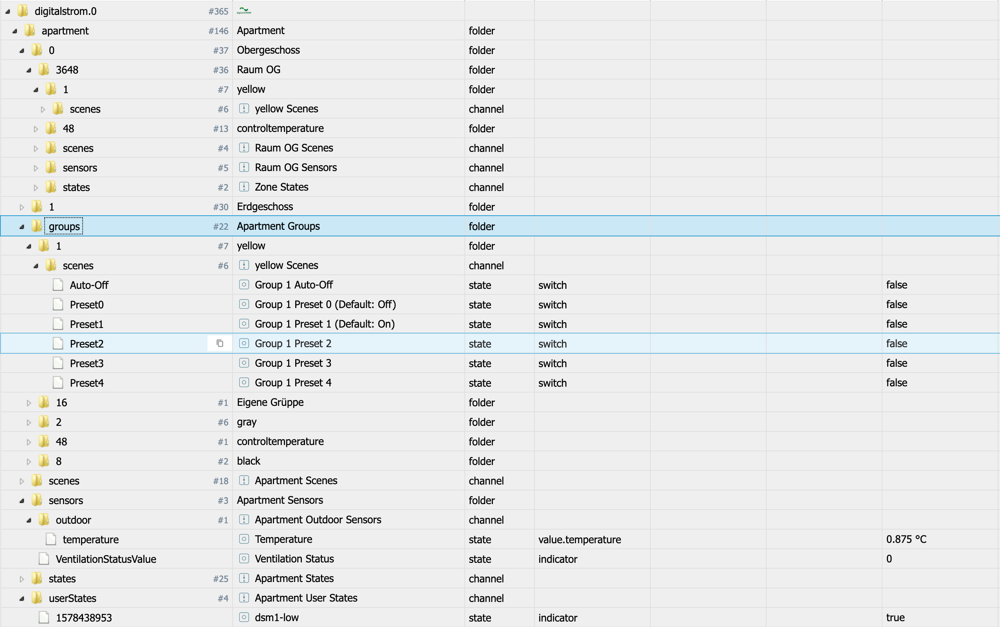
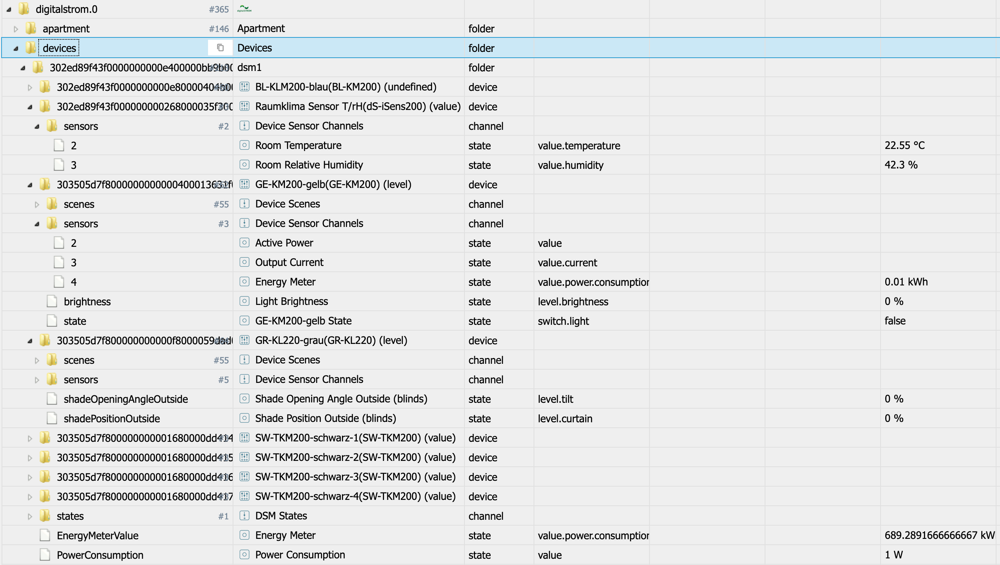

# IoBroker.digitalstrom
** Dieser Adapter verwendet Sentry-Bibliotheken, um Ausnahmen und Codefehler sowie neue Geräteschemata automatisch an mich als Entwickler zu melden. ** Weitere Details siehe unten!

## Digitalstrom Adapter für ioBroker
Unterstützung für Digitalstrom-Geräte über DSS

## Installation
Bitte installieren Sie den Adapter wie gewohnt über die Admin-Benutzeroberfläche.

Sobald der Adapter offiziell freigegeben ist, ist er im Repo und kann einfach ausgewählt werden.

Während der Testphase oder zum Testen neuerer Versionen (siehe relevante Forenthreads) können Sie den Adapter auch direkt von GitHub installieren, indem Sie https://github.com/ioBroker/ioBroker.digitalstrom als URL verwenden. Bitte benutzen Sie dazu die Admin "Custom Install" Option.

## Verwendung
Nach der Installation des Adapters und dem Erstellen einer Instanz wird der Admin-Dialog angezeigt.
Zunächst müssen Sie Ihre DSS-IP / Ihren Hostnamen eingeben. Dann können Sie wählen, ob Sie bereits ein App-Token im DSS-Webinterface manuell erstellt haben oder nicht.
Wenn Sie kein App-Token haben, geben Sie einfach Ihren Benutzernamen und Ihr Passwort ein, um ein App-Token automatisch abzurufen.

Zusätzlich zu den Authentifizierungseinstellungen (siehe oben) können Sie die folgenden Einstellungen an Ihre Bedürfnisse anpassen:

* **Datenabrufintervall** Dies ist das Intervall, in dem die "Energiezähler" -Daten von Ihren DSM-Geräten abgefragt werden. Standard 60er Jahre. Sie können 0 einstellen, wenn Sie die Engerymeter-Daten nicht abrufen möchten.
* **Szenenvoreinstellungswerte verwenden** Das Digitalstrom-System ist nicht wirklich so konzipiert, dass die tatsächlichen Ausgabewerte der Geräte jederzeit verfügbar sind, und funktioniert am besten mit Szenen. Für Licht und Shader / Blinds sind einige Ausgabewerte für viele der verfügbaren Szenen definiert. Der Adapter kennt sie und wenn diese Einstellung aktiv ist, versucht der Adapter, diese Werte nachzuschlagen, wenn eine Szene ausgelöst wird, und setzt diese Werte direkt auf die Zustände. Die realen Werte werden verzögert abgefragt. Diese Methode liefert möglicherweise falsche Werte, wenn lokale Prioritäten gesetzt / verwendet werden!
* **Geräteausgangswerte aktiv anfordern** Der Adapter initialisiert alle Geräteausgangswerte beim Start und auch nach Szenen, die für ein Gerät wirksam sind. Es gibt Verzögerungen, aber tatsächlich werden alle diese Nachrichten über den Digitalstrom-Bus gesendet. Wenn dies für Sie problematisch ist, können Sie versuchen, diese Funktion zu deaktivieren.

Nach der Bereitstellung eines App-Tokens und dem Speichern der Einstellungen wird der Adapter automatisch neu gestartet.

Wenn die Daten korrekt sind, liest der Adapter die Apartment- und Gerätestruktur aus und erstellt sie als ioBroker-Objekte. Dies kann einige Zeit dauern (abhängig von der Anzahl der Geräte und Stockwerke / Zonen / Gruppen und der Leistung Ihres Systems einige Sekunden). Bitte haben Sie Geduld. Und das meine ich auch so ... Mehrere tausend Objekte sind hier leicht zu erreichen! Gib dem Adapter bitte Zeit!

Danach abonniert der Adapter mehrere DSS-Ereignisse, um über Aktionen im System benachrichtigt zu werden.

Die Adapter-Statusanzeige wird grün und als Info-Protokoll wird "Status abonniert ..." angezeigt. Danach ist alles fertig und Sie können z.

* Szenen für Wohnung, Zonen, Gruppen oder Geräte setzen / rückgängig machen
* Status und Sensorwerte lesen; Für Zonen ist es auch möglich, Sensorwerte zu verschieben
* siehe die Werte für Binäreingänge, Sensoren, Tasten und Ausgänge

## Zustands- und Objektstruktur
Der Adapter bietet zwei Datenstrukturen. Die Wohnungsstruktur mit Etagen, Zonen (Räumen) und Gruppen und zusätzlich die Struktur der Stromkreise / dSMs und der angeschlossenen Geräte mit ihren Detaildaten.

In den Strukturen sind verschiedene "Datentypen" enthalten:

* Szenen: Szenen werden als Schalter implementiert. Wenn Sie den Wert tro auf "true" setzen, wird ein "callScene" -Befehl für diese Szene gesendet. Ein Wert von "false" sendet einen "undoScene" -Befehl für diese Szene. Der DSS-Server muss entscheiden, ob "undo" ein gültiger Befehl ist. Wenn eine callScene oder undoScene als Ereignis vom DSS-Server ausgelöst wird, wird die entsprechende Szene mit ack = true auf "true" oder "false" gesetzt
* Zustände: Zustände aus dem System und benutzerdefinierte Zustände über das Addon werden angezeigt und sind schreibgeschützt
* Sensorwerte werden bei Auslösung durch ein Ereignis aktualisiert und können teilweise auch geändert werden - Änderungen werden mit einem "pushSensorValue" an den Server gesendet und es liegt an dem Server, ob der Wert akzeptiert wird! Dies ist hauptsächlich für Temperatur- oder Luftfeuchtigkeitswerte relevant

*

### Apartment Objekt und Zustände

Für die Wohnung wird eine Struktur mit "Etage". "Zone" mit den folgenden Unterstrukturen innerhalb dieser erstellt:

* Pro Gerätegruppe wird ein Unterordner mit den verfügbaren Gruppenszenen erstellt
* Szenen für diese Zone
* Staaten für diese Zone
* Sensorwerte für diese Zone

Auf Apartment-Ebene sind alle Gerätegruppen mit ihren Szenen verfügbar.

Auf Apartmentebene sind auch Sensoren (auch Außenwerte), Zustände und Benutzerzustände enthalten.

### Geräteobjekte und -zustände

Die Geräte sind mit "circuit / dSM". "DeviceID" strukturiert und die Unterstruktur enthält:

* Geräteszenen werden nur für dieses Gerät ausgelöst
* Gerätesensoren, wenn vom System gemeldet. Werte können also leer sein
* Die Ausgabewerte (z. B. Status / Helligkeit für Lichter und Position / Winkel für Jalousien) befinden sich direkt unter dem Gerät. Derzeit haben nur Lichter und Jalousien eine definierte Funktionalität.
* Schaltflächen und Binäreingänge werden ebenfalls durch Status dargestellt und sind schreibgeschützt

## Bekannte Probleme / Systemdesigneffekte
* Das DSS-System arbeitet hauptsächlich mit Szenen und nicht mit realen Gerätewerten. Außerdem ist das Abrufen der realen Werte sehr langsam, da sie über den Bus abgerufen werden müssen.
* Werte sind möglicherweise leer, wenn sie nicht vom System gemeldet wurden
* Binäreingänge wurden "blind" richtig umgesetzt, da ich solche Geräte nicht besitze. Deshalb freue ich mich über ein paar Logs / Reports mit Binäreingabegeräten :-)
* Das Lesen und Schreiben von aussagekräftigen Ausgangswerten ist nur für Ligh (Gelb) - und Shade / Blind (Grau) -Geräte implementiert.
* Ich hatte bisher keine Chance zu überprüfen, wie sich das System mit vDCs verhält. Also brauche ich hier Protokolle und Details, um es hinzuzufügen
* Lüftung und Temperaturmanagement / Geräte sind ebenfalls nicht vollständig implementiert ... was macht hier Sinn?

## So melden Sie Probleme und Funktionsanforderungen
Bitte benutzen Sie dazu GitHub.

Stellen Sie den Adapter am besten auf den Debug-Protokollmodus ein (Instanzen -> Expertenmodus -> Spaltenprotokollstufe). Dann holen Sie sich bitte die Protokolldatei von der Festplatte (Unterverzeichnis "log" im ioBroker-Installationsverzeichnis und nicht von Admin, da Admin die Zeilen schneidet). Wenn Sie es nicht in der GitHub-Ausgabe bereitstellen möchten, können Sie es mir auch per E-Mail senden (iobroker@fischer-ka.de). Fügen Sie dem betreffenden GitHub-Problem eine Referenz hinzu UND beschreiben Sie, was zu welchem Zeitpunkt im Protokoll angezeigt wird.

## Was ist Sentry und was wird den Servern gemeldet?
Sentry.io ist eine Möglichkeit für Entwickler, sich einen Überblick über Fehler in ihren Anwendungen zu verschaffen. Und genau das ist in diesem Adapter implementiert.

Wenn der Adapter abstürzt oder ein anderer Codefehler auftritt, wird diese Fehlermeldung, die auch im ioBroker-Protokoll angezeigt wird, an unseren eigenen Sentry-Server gesendet, der in Deutschland gehostet wird. Wenn Sie der iobroker GmbH erlaubt haben, Diagnosedaten zu sammeln, ist auch Ihre Installations-ID (dies ist nur eine eindeutige ID **ohne** zusätzliche Informationen über Sie, E-Mail, Namen oder dergleichen) enthalten. Auf diese Weise kann Sentry Fehler gruppieren und anzeigen, wie viele eindeutige Benutzer von einem solchen Fehler betroffen sind. All dies hilft mir, fehlerfreie Adapter bereitzustellen, die im Grunde nie abstürzen.

## Changelog

### 1.0.0 (2020-01-31)
* (Apollon77) bump version to 1.0.0
* (Apollon77) update dependecies
* (Apollon77) change default loglevel to info

### 0.5.5 (2020-01-29)
* (Apollon77) fix smaller errors
* (Apollon77) send Sentry reports to own server

### 0.5.0 (2020-01-19)
* (Apollon77) add buttons for more device types (also vDC) and try to detect button triggers

### 0.4.10 (2020-01-19)
* (Apollon77) state changes added
* (Apollon77) Fixed shade position control

### 0.4.9 (2020-01-18)
* (Apollon77) add unknown weather sensor "windgust"
* (Apollon77) change handling of Input types
* (Apollon77) Fix controlling of shaders 

### 0.4.7 (2020-01-17)
* (Apollon77) fix error when writing vdc output values

### 0.4.6 (2020-01-17)
* (Apollon77) fix missing datatypes for some states (mainly sensors and output values)

### 0.4.5 (2020-01-17)
* (Apollon77) fix error in sentry reporting

### 0.4.4 (2020-01-17)
* (Apollon77) fix error (Sentry IOBROKER-DIGITALSTROM-7)

### 0.4.2 (2020-01-16)
* (Apollon77) fix wrong scene state updates if same scene is triggered twice
* (Apollon77) also trigger scene update for all groups if scene was called on zone or to all zones and groups when done on apartment

### 0.4.1 (2020-01-16)
* (Apollon77) also add basic scenes to room groups

### 0.4.0 (2020-01-15)
* (Apollon77) add userActions as states and allow to trigger the actions

### 0.3.3 (2020-01-15)
* (Apollon77) fixes for scene lists
* (Apollon77) add some special szenes to more groups 

### 0.3.2 (2020-01-14)
* (Apollon77) fixes for adapter start

### 0.3.1 (2020-01-14)
* (Apollon77) fixes
* (Apollon77) make sure to initialize scenes, states and sensors really on startup - values will be overwritten if delivered with ack=true!
* (Apollon77) add all Presets (0-44) to Room/Zone and Group states 
* (Apollon77) also for unknown device types try to initialize output value IF only one is there (assuming it is offset/index 0!) Please check and report back!
* (Apollon77) make some initial processing async to block eventLoop less

### 0.3.0 (2020-01-14)
* (Apollon77) further optimize (lower) delays and timeouts, please give feedback!
* (Apollon77) add "stateId" State for each scenes folder with the scene number. This is updated with the scenes and also controllable.
* (Apollon77) scenes will not be cleared at the beginning and initialized with the "lastSceneId" returned from DSS; initialization may take some seconds longer!
* (Apollon77) update dependencies
* (Apollon77) increase loglevel of some "invalid cases" to warn to better see if they happen
* (Apollon77) fix handling of binaryInput events

### 0.2.2 (2020-01-13)
* (Apollon77) optimize event subscription logic and timeouts (should prevent "error 500 cases", now tries to resubscribe)

### 0.2.1 (2020-01-13)
* (Apollon77) optimize brightness handling
* (Apollon77) optimize error and reconnection handling

### 0.2.0 (2020-01-12)
* (Apollon77) initial official testing release (still GitHub)

### 0.1.x
* (Apollon77) initial release and finalization

## License
MIT License

Copyright (c) 2020 Apollon77 <iobroker@fischer-ka.de>

Permission is hereby granted, free of charge, to any person obtaining a copy
of this software and associated documentation files (the "Software"), to deal
in the Software without restriction, including without limitation the rights
to use, copy, modify, merge, publish, distribute, sublicense, and/or sell
copies of the Software, and to permit persons to whom the Software is
furnished to do so, subject to the following conditions:

The above copyright notice and this permission notice shall be included in all
copies or substantial portions of the Software.

THE SOFTWARE IS PROVIDED "AS IS", WITHOUT WARRANTY OF ANY KIND, EXPRESS OR
IMPLIED, INCLUDING BUT NOT LIMITED TO THE WARRANTIES OF MERCHANTABILITY,
FITNESS FOR A PARTICULAR PURPOSE AND NONINFRINGEMENT. IN NO EVENT SHALL THE
AUTHORS OR COPYRIGHT HOLDERS BE LIABLE FOR ANY CLAIM, DAMAGES OR OTHER
LIABILITY, WHETHER IN AN ACTION OF CONTRACT, TORT OR OTHERWISE, ARISING FROM,
OUT OF OR IN CONNECTION WITH THE SOFTWARE OR THE USE OR OTHER DEALINGS IN THE
SOFTWARE.