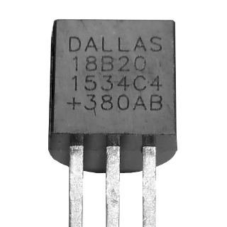

# ioBroker.ds18b20

Der Adapter `ds18b20` ermöglicht die direkte Einbindung von 1-Wire Temperatursensoren des Typs DS18B20 in ioBroker.

Es wird eine entsprechende Hardware mit Unterstützung für den 1-Wire Bus benötigt (z.B. Raspberry Pi) und der 1-Wire Bus muss auf dem System funktionsfähig eingerichtet sein (Sensoren unter `/sys/bus/w1/devices/` aufgelistet).


## Features

* Auslesen des aktuellen Temperaturwertes
* Automatische Erkennung der angeschlossenen Sensoren
* Fehlererkennung beim Abfragen der Sensoren (Checksumme, Kommunikationsfehler, Gerät getrennt)
* Abfrageintervall pro Sensor anpassbar
* Rundung und Umrechnung des gemessenen Wertes pro Sensor anpassbar


## Installation

Der Adapter kann er über die URL `https://github.com/crycode-de/ioBroker.ds18b20.git` installiert werden.


## Konfiguration

In der Adapterkonfiguration kann der **Standardabfrageintervall** für alle Sensoren in Millisekunden festgelegt werden. Das Minimum ist 500.

In einer Tabelle können die einzelnen Sensoren händisch oder über *Sensoren suchen* hinzugefügt werden.


Die **Adresse** ist dabei die 1-Wire Adresse/ID des Sensors und bestimmt zugleich das die Objekt-ID.
Ein Sensor mit der Adresse `28-0000077ba131` bekommt beispielsweise die Objekt-ID `ds18b20.0.sensors.28-0000077ba131`.

Der **Name** ist zur Identifizierung des Sensors frei wählbar.

Es kann für jeden Sensor ein extra **Abfrageintervall** in Millisekunden festgelegt werden.
Wird das Feld leer gelassen, so gilt der Standardabfrageintervall.
Das Minimum ist 500.

Die **Einheit** bestimmt die im ioBroker-Objekt hinterlegte Einheit zu dem Wert.
Standardmäßig ist dies `°C`.

Über **Faktor** und **Offset** ist es möglich den vom Sensor gelesenen Wert nach der Formel `Wert = (Wert * Faktor) + Offset` anzupassen.

Die **Dezimalstellen** geben an, auf wie viele Stellen nach dem Komma der Wert gerundet wird.
Die Rundung erfolgt nach der Berechnung mit Faktor und Offset.

**Null bei Fehler** legt fest, wie mit Fehlern beim Lesen des Sensors verfahren werden soll.
Ist die Option gesetzt, dann werden `null`-Werte bei Fehlern in den State des Sensors geschrieben.
Ohne diese Option wird bei Fehlern der State nicht aktualisiert.


### Umrechnung von `°C` in `°F`

Damit die gemessenen Temperaturen vom Adapter in `°F` zurückgegeben werden, müssen als Faktor `1.8` und als Offset `32` verwendet werden.


## Aktionen

Über ein Schreiben in den State `ds18b20.0.actions.readNow` ist es möglich das sofortige Lesen von allen oder einem bestimmten Sensor anzustoßen.

Um ein sofortiges Lesen aller Sensors anzustoßen muss in den State das Schlüsselwort `all` geschrieben werden.

Soll nur ein bestimmter Sensor gelesen werden, so muss die Adresse oder die ioBroker Objekt-ID des Sensors in den State geschrieben werden.


## Verwendung in Skripten

Es ist möglich dem Adapter Befehle zum lesen der Sensordaten oder zum Suchen nach Sensoren zu senden.

### `readNow`

Über den Befehl `readNow` wird ein sofortiges Abfragen von allen oder einem bestimmten Sensor angestoßen.
Zum Abfragen aller Sensoren kann der Nachrichtenteil leer gelassen, oder der String `all` verwendet werden.
Zum Lesen eines bestimmten Sensors muss der Nachrichtenteil auf die Adresse oder die ioBroker-ID des Sensors gesetzt werden.

Der Befehl `readNow` gibt keine Daten zurück. Er stößt nur das sofortige Auslesen der Sensoren an.

```js
sendTo('ds18b20.0', 'readNow');
sendTo('ds18b20.0', 'readNow', '28-0000077ba131');
```

### `read`

Über den `read` Befehl kann ein einzelner Sensor gelesen werden.
Als Nachrichtenteil muss die Adresse oder ioBroker Objekt-ID des zu lesenden Sensors angegeben werden.
Der gelesene Wert kann über eine Callback-Funktion weiterverarbeitet werden.

```js
sendTo('ds18b20.0', 'read', '28-0000077ba131', (ret) => {
    log('ret: ' + JSON.stringify(ret));
    if (ret.err) {
        log(ret.err, 'warn');
    }
});
```

### `search`

Der `search` Befehl führt eine Suche nach aktuell angeschlossenen 1-Wire Sensoren durch und gibt die Adressen der gefundenen Sensoren über eine Callback-Funktion zurück.

```js
sendTo('ds18b20.0', 'search', {}, (ret) => {
    log('ret: ' + JSON.stringify(ret));
    if (ret.err) {
        log(ret.err, 'warn');
    } else {
        for (let s of ret.sensors) {
            log('Sensor: ' + s);
        }
    }
});
```


## Adapter-Informationen

Über den `ds18b20.*.info.connection` State stellt jede Adapterinstanz eine Information bereit, ob alle konfigurierten Sensoren Daten liefern.
Wenn das jeweils letzte Lesen von allen Sensoren erfolgreich war, ist dieser State `true`.
Sobald einer der Sensoren einen Fehler aufweist, ist dieser State `false`.

## Changelog
### 1.0.1 (2019-10-01)
* (Peter Müller) Type changed to hardware, Renamed command, Added missing documentation

### 1.0.0 (2019-09-09)
* (Peter Müller) initial release

## License

Copyright (c) 2019 Peter Müller <peter@crycode.de>

### MIT License

Permission is hereby granted, free of charge, to any person obtaining
a copy of this software and associated documentation files (the
"Software"), to deal in the Software without restriction, including
without limitation the rights to use, copy, modify, merge, publish,
distribute, sublicense, and/or sell copies of the Software, and to
permit persons to whom the Software is furnished to do so, subject to
the following conditions:

The above copyright notice and this permission notice shall be
included in all copies or substantial portions of the Software.

THE SOFTWARE IS PROVIDED "AS IS", WITHOUT WARRANTY OF ANY KIND,
EXPRESS OR IMPLIED, INCLUDING BUT NOT LIMITED TO THE WARRANTIES OF
MERCHANTABILITY, FITNESS FOR A PARTICULAR PURPOSE AND
NONINFRINGEMENT. IN NO EVENT SHALL THE AUTHORS OR COPYRIGHT HOLDERS BE
LIABLE FOR ANY CLAIM, DAMAGES OR OTHER LIABILITY, WHETHER IN AN ACTION
OF CONTRACT, TORT OR OTHERWISE, ARISING FROM, OUT OF OR IN CONNECTION
WITH THE SOFTWARE OR THE USE OR OTHER DEALINGS IN THE SOFTWARE.