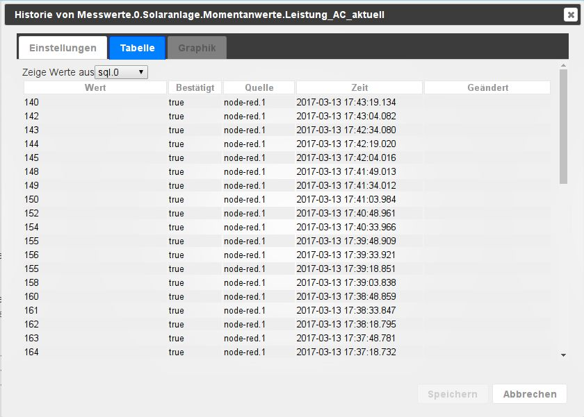

* * *

## Konfiguration

### DB-Einstellungen

Hier werden die Einstellungen, die beim Anlegen der influxDB gemacht wurden eingegeben, damit der ioBroker-Server Zugriff auf diese Datenbank erhält. 

#### Host

Hostname oder IP des Datenbank Servers.

#### Port

hier wird der Port eingegeben über den die Datenbank auf dem Host zu erreichen ist.

#### Protocol

Hier wird angegeben ob der Zugriff auf die Datenbank per einfachem http oder gesichertem https durchgeführt werden soll

#### Login

Der Besitzer der Datenbank (User) unter dessen ID die Daten aufgezeichnet werden sollen

#### Passwort

Dieses ist das Passwort des angegebenen Users in der SQL-Datenbank. Zur Sicherheit muss dieses Passwort im folgenden Feld wiederholt eingegeben werden.

#### Aufrunden auf

Angabe der Nachkommastellen mit denen Zahlen gespeichert werden sollen.

#### Schreibaktionen sammeln

Der hier eingegeben Wert bestimmt wieviele neue Daten vorliegen sollen, bevor wieder in die Datenbank geschrieben werden soll. Je höher der Wert, desto seltener wird in die DB geschrieben, desto höher ist aber der Datenverlust bei Ausfall des Adapters. Eine 0 sorgt für sofortigen Eintrag in die DB. Dementsprechend bedeutet die Eingabe "0": Sofortiges Schreiben in die Datenbank. Dies erhöht die Last auf der Datenbank und im Adapter.

#### Schreibintervall

Wird hier ein Wert eingegeben werden die Daten bereits nach der vorgegebenen Zeit in Sekunden in die Datenbank geschrieben, auch wenn die im letzten Punkt eingestellte Anzahl von Daten noch nicht erreicht ist.

### Default Einstellungen für Zustände

Diese Einstellungen geben die Werte vor, die bei der Konfiguration des Loggings der einzelnen Datenpunkte als Vorgabe genutzt werden sollen. 

#### Nur Änderungen aufzeichnen

Ist diese Checkbox angehakt müssen aufeinanderfolgende Daten unterschiedliche Werte haben damit sie aufgezeichnet werden. Sendet ein Sensor, z.B. mehrfach die gleiche Temperatur wird dies nicht aufgezeichnet, erst bei einer Änderung wird wieder eine Datensatz angelegt.

#### gleiche Werte aufzeichnen

sollen bei gleichem Wert von Zeit zu Zeit trotzdem diese (unveränderten) Werte gespeichert werden, kann hier eine Zeitspanne in Sekunden festgelegt werden, wie häufig dieses geschehen soll. Dementsprechend bedeutet die Eingabe 0, dass kein doppelter Wert gespeichert werden soll.

#### Minimale Abweichung vom letzten Wert

sollen bei ständig wechselnden Werten trotzdem diese (geänderten) Werte nicht gespeichert werden, kann hier ein Mindestwert festgelegt werden, den sich der Wert ändern muss, damit wieder ein neuer Wert gespeichert wird. Dies ist beispielsweise bei Strommesssteckdosen sinnvoll, bei dem nicht jede leichte Veränderung geloggt werden soll. Dementsprechend bedeutet die Eingabe 0, dass jeder Wert gespeichert werden soll.

#### Speichern als

Wenn nötig kann hier der Datentyp festgelegt werden mit dem die Daten gespeichert werden sollen. Dies sollte nur vor der ersten Aktivierung durchgeführt werden.

 In einer InfluxDB wird der Datentyp mit dem ersten Datensatz festgelegt und muss danach identisch bleiben.

#### Storage Vorhaltezeit

Legt fest, wie lange die Werte gespeichert werden sollen (unendlich, 2 Jahre, 1 Jahre, …, 1 Tag). 

#### Entprellzeit (ms)

Schutz vor zu häufigen Änderungen eines Wertes. Dies ist der Mindestabstand in Millisekunden bis wieder ein Wert geschrieben wird.

* * *

## Einstellungen für Datenpunkte

Die Einstellungen für die zu loggenden Datenpunkte werden in dem Reiter „Objekte“ bei dem entsprechenden Datenpunkt durchgeführt.  Dazu wählt man ganz rechts in der Spalte das Zahnradsymbol zu dem gewünschten Datenpunkt aus. Das Konfigurationsmenü öffnet sich: 

### Aktiviert

Logging des Datenpunktes aktivieren Nur Änderungen aufzeichnen: Es werden nur Werte gespeichert, wenn sich der Wert des Datenpunktes ändert. Das spart Speicherplatz.Eine sinnvolle Nutzung ergibt sich, wenn man vorher über die Filterfelder in dem Tabellenheader die Datenpunkte so filtert, dass man z.B. nur die „State“ Datenpunkte herausfiltert, um sie dann zu loggen 

1.  die Ansicht als Liste ohne Gruppierung anzeigen lassen
2.  den oder die Filterbegriffe eingeben
3.  alle gefilterten Datenpunkte zum loggen auswählen
    1.  Das Konfigurationsmenü für die Einstellungen der log-Parameter öffnet sich
4.  Das loggen für alle gefilterten Datenpunkte auf einmal aktivieren
    1.  Weitere Parameter wie „nur Änderungen“ und Vorhaltezeit für alle gefilterten Datenpunkte einheitlich auswählen
5.  Die Änderungen speichern

* * *

## **Bedienung**

Wählt man in der Titelzeile unter Historie "mit" oder "influxdb.0" aus, werden nur noch Datenpunkte mit Logging angezeigt.  Ein Klick auf das Zahnradsymbol öffnet die geloggten Daten:  Im Reiter Table werden die Daten tabellarisch angezeigt.  Im Reiter Chart kann bei installiertem Rickshaw-Adapter eine Verlaufsgrafik angezeigt werden.

* * *

## Installation einer influxDB Datenbank

Die Beschreibung einer Installation einer influxDB-Datenbank folgt.

## Changelog

### 1.9.1 (2020-07-22)
* (Apollon77) crash prevented (Sentry IOBROKER-INFLUXDB-E)

### 1.9.0 (2020-07-21)
* (Apollon77) Optimize handling in case of write errors and host unavailabilities

### 1.8.8 (2020-07-18)
* (Apollon77) Some errors prevented
* (Apollon77) Set timeouts for influxdb connections to make sure connectioens do not run forever

### 1.8.7 (2020-05-14)
* (bluefox) added command to read supported features

### 1.8.6 (2020-05-11)
* (Apollon77) make sure disabling of datapoints while starting adapter do not crash adapter (Sentry IOBROKER-INFLUXDB-7)
* (Apollon77) Make sure all start values are processed correctly
* (Apollon77) More checks to make sure to not crash when states are disabled while data are processed (Sentry IOBROKER-INFLUXDB-8)

### 1.8.5 (2020-05-08)
* (bluefox) set default history if not yet set

### 1.8.4 (2020-05-02)
* (Apollon77) make sure disabling of datapoints do not crash adapter (Sentry IOBROKER-INFLUXDB-4)

### 1.8.3 (2020-04-29)
* (Apollon77) Fix pot crash case when deleting objects while saving values (Sentry) 

### 1.8.2 (2020-04-19)
* __Requires js-controller >= 2.0.0__
* (Apollon77) removed usage of adapter.objects
* (Apollon77) check if objects have changed and ignore unchanged
* (Apollon77) Add Sentry for Error Reporting with js-controller 3.0
* (Apollon77) Make sure value undefined is ignored

## License

The MIT License (MIT)

Copyright (c) 2015-2020 bluefox, apollon77

Permission is hereby granted, free of charge, to any person obtaining a copy
of this software and associated documentation files (the "Software"), to deal
in the Software without restriction, including without limitation the rights
to use, copy, modify, merge, publish, distribute, sublicense, and/or sell
copies of the Software, and to permit persons to whom the Software is
furnished to do so, subject to the following conditions:

The above copyright notice and this permission notice shall be included in
all copies or substantial portions of the Software.

THE SOFTWARE IS PROVIDED "AS IS", WITHOUT WARRANTY OF ANY KIND, EXPRESS OR
IMPLIED, INCLUDING BUT NOT LIMITED TO THE WARRANTIES OF MERCHANTABILITY,
FITNESS FOR A PARTICULAR PURPOSE AND NONINFRINGEMENT. IN NO EVENT SHALL THE
AUTHORS OR COPYRIGHT HOLDERS BE LIABLE FOR ANY CLAIM, DAMAGES OR OTHER
LIABILITY, WHETHER IN AN ACTION OF CONTRACT, TORT OR OTHERWISE, ARISING FROM,
OUT OF OR IN CONNECTION WITH THE SOFTWARE OR THE USE OR OTHER DEALINGS IN
THE SOFTWARE.