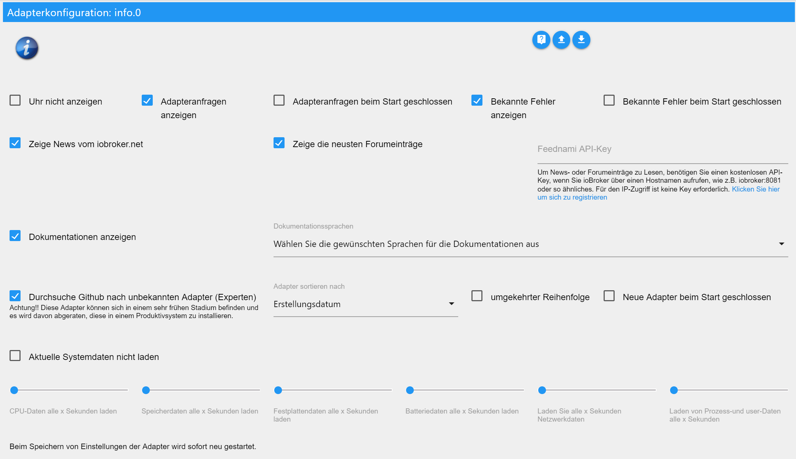
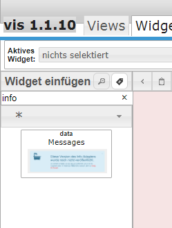
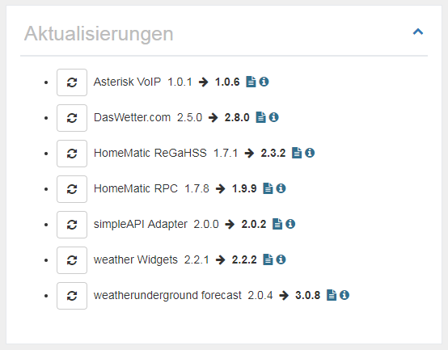
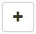
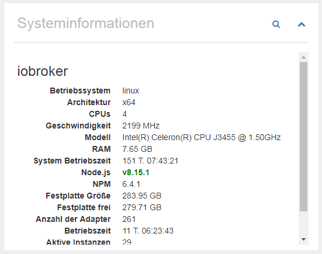
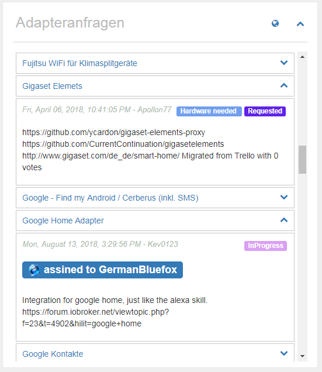
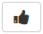

# Admin

Der Info Adapter wurde entwickelt um verschiedene Informationen zum System, über ioBroker und relevante Themen dem User zur Verfügung zu stellen. Der Anwender soll eine Übersicht aller Interessanten und wichtigen Daten erhalten und das ioBroker-Team wird die Möglichkeit gegeben, dem User noch schneller zu kontaktieren, falls wichtige Infos vorhanden sind.

# Installation


Um das Info Fenster im Tab-Reiter zu sehen, müssen Sie nach der Installation es zuerst im Admin als Sichtbar anhaken. Dazu klicken Sie in der Admin-Fenster oben Links auf dem nach unten zeigenden Dreieck und wählen im Menü "Info" aus.

# Konfiguration

<p align="center">
    
</p>

* **Uhr nicht anzeigen** - Um die Uhr oben Links auszublenden.
* **Events ausblenden** - Eventkalender wird nicht angezeigt
* **Adapteranfragen anzeigen** - Zeigt den Panel mit den Adapteranfragen an.
    * **Adapteranfragen beim Start geschlossen** - Das Panel mit der Adapteranfragen, ist beim Start des Info Fensters geschlossen.
* **Bekannte Fehler anzeigen** - Zeigt den Panel mit bekannten Fehler und Wünsche für installierte Adaptern an.
    * **Bekannte Fehler beim Start geschlossen** - Das Panel mit der bekannten Fehlern, ist beim Start des Info Fensters geschlossen.

* **Zeige News vom iobroker.net** - Zeigt den Panel mit den offiziellen ioBroker Nachrichten an. 
* **Zeige die neusten Forumeinträge** - Zeigt den Panel mit den letzten Forumeinträge an.
* **Feednami API-Key** - Wenn Sie ioBroker über einen Hostnamen aufrufen, wie z.B. iobroker:8081 oder so ähnliches, müssen Sie sich kostenlos bei Feednami anmelden, um eine entsprechende API Key zu bekommen. Für den Zugriff über eine IP-Adresse ist das nicht nötig.

* **Dokumentationen anzeigen** - Zeigt den Button für die Dokumentationen an.
    * **Wählen Sie die gewünschten Sprachen für die Dokumentationen aus** - Auswahl der Sprachen die bei den Dokumentationen berücksichtigt werden sollen. (Möglicherweise muss man rechts der Bezeichnung klicken, damit was ausgewählt wird - Standard -> eingestellte Sprache + englisch)

* **Durchsuche Github nach unbekannten Adapter (Experten)** - Zeigt den Panel mit der Suche nach nicht offiziell freigegebenen Adaptern im Github.
    * **Adapter sortieren nach** - Sortiert das Ergebnis der Suche nach Name, Erstellungsdatum oder letztes Update.
    * **umgekehrter Reihenfolge** - Kehrt die Reihenfolge der Ergebnisse um.
    * **Neue Adapter beim Start geschlossen** - Das Panel mit den unbekannten Adapter, ist beim Start des Info Fensters geschlossen.

* **GitHub persönliches Zugriffstoken** - Um direkt aus ioBroker neue Issues oder Adapteranfragen im Github anlegen zu können, benötigt man ein Token, der im Github jederzeit generiert werden kann. Dafür wird ein Github Account benötigt.
Um den Token zu bekommen, melden Sie sich auf Github an, klicken oben rechts auf den Benutzer-Icon, gehen auf "Settings", dann auf "Developer settings" > "Personal access tokens". Dort klickt man auf "Generate new token", gibt ein beliebigen Namen unter "Token description" und wählt als "Scope", "repo" aus. Danach bekommt man ein Token und trägt diesen im ioBroker ein. Eine genauere Anleitung auf englisch findet ihr [hier](https://help.github.com/en/articles/creating-a-personal-access-token-for-the-command-line).
 

* **Aktuelle Systemdaten nicht laden** - Die aktuellen Daten zum System werden nicht zyklisch geladen.
    * **CPU-Daten alle x Sekunden laden** - Die CPU Daten werden zyklisch alle 1 bis 10 Sekunden geladen. (0 ist aus - Standard 3)
    * **Speicherdaten alle x Sekunden laden** - Die Speicherdaten werden zyklisch alle 1 bis 10 Sekunden geladen. (0 ist aus - Standard 3)
    * **Festplattendaten alle x Sekunden laden** - Die Festplattendaten werden zyklisch alle 1 bis 10 Sekunden geladen. (0 ist aus - Standard 8)
    * **Batteriedaten alle x Sekunden laden** - Die Batteriedaten werden zyklisch alle 1 bis 10 Sekunden geladen. (0 ist aus - Standard 8)
    * **Netzwerkdaten alle x Sekunden laden** - Die Netzwerkdaten werden zyklisch alle 1 bis 10 Sekunden geladen. (0 ist aus - Standard 3)
    * **Laden von Prozess- und Nutzerdaten alle x Sekunden** - Die Prozess- und Nutzerdaten werden zyklisch alle 1 bis 10 Sekunden geladen. (0 ist aus - Standard 8)
    
Bei Windows System sollten die zyklische Ladevorgänge der Systemdaten nicht zu schnell passieren, denn dies Verursacht eine beachtliche Belastung des Systems. Die Standardwerten wurden so ausgewählt, dass es bei den meisten Systeme ohne Probleme laufen sollte.

# Info Tab

Der Info Tab enthält verschiedene Informationen zu Ihrem System und zum ioBroker. Der Tab ist in verschiedene Blöcke unterteilt, die individuell angepasst werden können. Fast alle Blöcke können mit einem Klick auf  zu bzw. aufgeklappt werden.

## Uhr


Die Uhr hat keine besondere Funktion (ich habe mir aber Mühe gegeben) und kann jederzeit in der Konfiguration ausgeschaltete werden.

## Github-Leiste


Um diese Leiste sehen zu können, braucht man erst ein Github Account und muss ein Token in der Konfiguration angeben. Weitere Informationen dazu, finden Sie in der [Konfigurationsberscheibung](#konfiguration), unter "GitHub persönliches Zugriffstoken".

Zur Zeit hat man die Möglichkeit selbst erstellte Issues, zugewiesene Issues und Repositories die entweder beobachtet werden oder mit einem Stern markiert wurden zu sehen.

Mit einem Klick auf , können eventuell vorhandene Kommentare zum Issue angezeigt werden. Der button erscheint nur, wenn Kommentare vohanden sind. Die Gesamtanzahl der Kommentare werden in der Sprechblase vor dem Titel des Issues dargestellt.

## Meldungen


Um wichtige Meldungen bezüglich ioBroker, schnell an den User zu senden, wurde die Möglichkeit erschaffen Meldungen zu erstellen. Diese Meldungen erscheinen NUR, wenn bestimmte Voraussetzungen zutreffen. Es werden also keine Meldungen über einem Adapter angezeigt, wenn dieser nicht installiert ist. So wird sichergestellt, dass NUR die User gewarnt werden, die auch vom Problem betroffen sind.

Die Meldungen können mit einem Klick, rechts oben auf  geschlossen werden, erscheienen aber wieder sobald der Info-Tab wieder neu geladen wird, solange das Problem noch besteht.

Für die Nutzung der Meldungen mit andere Adaptern z.B Javascript, Telegramm, Alexa usw., werden diese schon gefiltert im Objekt "newsfeed_filtered", als ein Array von Objekten gespeichert.

Beispiel:
```javascript
const messages = JSON.parse(getState('info.0.newsfeed_filtered').val);
messages.forEach(message => {
    const title = message.title;
    const text = message.content;
    const created = new Date(message.created);
    console.log(created + " " + title + " " + text);
});
```

### Meldungen (VIS-Widget)


Für die Meldungen wurde extra ein VIS Widget erstellt, der ebenfalls nur erscheint, wenn die Meldungen den User betreffen. Wenn keine Meldungen existieren, wird auch nichts angezeigt, so dass man für die Meldungen kein extra Platz auf der VIS Oberfläche einberechnen muss, sondern es einfach z.B. in der Mitte des Bildschirms plazieren.

## Dokumentation


Wir haben eine Liste mit wichtigen Links zusammengestellt. Diese findet ihr als aufklappbare Liste, indem ihr auf dem Button oben rechts "Dokumentation" klickt. Sollte der Button nicht sichtbar sein, stellen Sie sicher, dass der entsprechende Punkt in der Konfiguration angehakt ist.

Die einzelnen Links werden in verschiedene Kategorien gespeichert: Community, Dokumentation, News, Blog, Video-Wiedergabeliste, Entwicklung und Andere

Für die Richtigkeit und Vollständigkeit externer Links kann keine Garantie übernommen werden. Wenn Links fehlen oder falsch sind, senden Sie uns bitte eine E-Mail an uns.

## Aktualisierungen


Wenn es neue Versionen eines Adapters veröffentlicht wird und Sie diesen auch installiert haben, wird es in dieser Liste erscheinen.

Von hier aus kann mit einem Klick auf  direkt aktualisiert werden. 
Wenn Sie mit der Maus über  fahren, sehen Sie die wichtigsten Neuerungen seit Ihrer Version. 
Mit einem Klick auf , wird die komplette Beschreibung des Adapters angezeigt.

Wenn der Host - also JS-Controller - veraltet ist, dann erscheint eine extra Box unterhalb von "Neue Adapter" mit der Meldung, dass man den Host updaten sollte. 

## Neue Adapter


Hier werden alle neue und offiziell freigegebene Adapter der letzten 60 Tage angezeigt.

Von hier aus kann mit einem Klick auf  den neuen Adapter direkt installiert werden.
Mit einem Klick auf , wird die komplette Beschreibung des Adapters angezeigt.

<br>

## Systeminformationen


Hier werden die Systeminformationen des ioBroker-Systems angezeigt. Bei Multihost-Systeme werden natürlich auch die Informationen der anderen Hosts angezeigt. Diese Daten kommen aus dem js-controller. 

Als Info werden folgenden Daten (pro Host) bereitgestellt:

- Betriebssystem (linux, win32, darwin, android, aix, freebsd, openbsd oder sunos)
- Architektur (arm, arm64, ia32, mips, mipsel, ppc, ppc64, s390, s90x, x32 und x64)
- CPUs (Anzahl der Kerne)
- Geschwindigkeit (Prozessorgeschwindigkeit)
- Modell (Prozessor Modell)
- RAM (ungefähren Gesamtspeicher)
- System Betriebszeit (Wie lange läuft das System schon)
- Node.js (Die Node.js Version - sollte es eine neuere Geben oder Ihre Version veraltet sein, steht diese Information auch hier)
- NPM (NPM Version)
- Festplatte Größe (Größe der Festplatte wo sich ioBroker befindet)
- Festplatte frei (Wieviel Platz davon ist noch frei)
- Anzahl der Adapter (Wie viele Adaptern gibt wurden bis jetzt für ioBroker freigegeben)
- Betriebszeit (Wie lange läuft der ioBroker, ohne Neustart)
- Aktive Instanzen (Wie viele Adapter-Instanzen laufen gerade auf diesen Host)
- Hostname (Name des Hosts)

```
Sollten Informationen fehlen, dann sollte eine aktuelle Version des JS-Controllers installiert werden.
Das ist der Datenbestand des JS-Controllers v1.5.7.
```

Mit einem Klick auf , werden detaillierte Informationen zum Hauptsystem angezeigt.

### Systeminformationen (Detailansicht)


Hier werden sehr viele Informationen über das Hausptsystems angezeigt und als Objekt gespeichert. Diese können dann auch ganz bequem von Ihnen verwendet werden. Die meisten Daten werden nur beim ersten Laden des Adapters gelesen und gespeichert, denn diese ändern sich nicht so ohne weiteres.

Einige Daten werden aber auch zyklisch aktualisiert. Wie oft das passiert, kann in der Konfiguration eingestellt werden.

Bedenke, dass nicht alle Information in jeden Betriebssystem zur Verfügung steht, was dazu führen kann, dass manche Informationen nicht angezeigt werden können.

#### System

Hier werden die Hardwaredaten angezeigt - Motherboard, Bios, Gehäuse usw...

#### Software

Unter Software findet man Daten zum Betriebssystem, installierte Software, laufende Prozesse und eingeloggte Nutzer.

#### Zentralprozessor

Hier findet man Daten alle zum CPU wie Geschwindigkeit, Auslastung und Temperatur.

**Probleme mit Windows:** Um die Temperatur eines Windows Systems zu erkennen, wird wmic verwendet. In manchen fälle muss wmic mit Administratorrechten ausgeführt werden. Wenn Sie also keine Werte erhalten, versuchen Sie es erneut mit den entsprechenden Berechtigungen auszuführen. Wenn Sie immer noch keine Werte erhalten, unterstützt Ihr System diese Funktion möglicherweise nicht.

**Probleme mit Linux:** In einigen Fällen müssen Sie das Linux-Sensor-Paket installieren, um die Temperatur messen zu können, z.B. auf DEBIAN-basierten Systemen durch Ausführen von:

```
$ sudo apt-get install lm-sensors
```

#### Hauptspeicher

Hier sind alle Daten zum Hauptspeicher wie freie Speicher oder Daten zum RAM Riegel.

#### Festplatten

Alle Daten zu Festplatten, Partitionen, Raids und Roms.

**Probleme mit Linux:** UM in der Lage sein den S.M.A.R.T. Status unter Linux sehen zu können, müssen Sie die smartmontools installieren. Auf DEBIAN-basierten Linux-Distributionen können Sie es installieren, indem Sie Folgendes ausführen:

```
$ sudo apt-get install smartmontools
```

#### Grafik

Hier werden Daten zum Controller oder Monitor angezeigt, wenn vorhanden/unterstützt.

#### Netzwerk

Alle Daten zu den Netzwerkverbindungen.

#### Batterie

Alle Daten zu der Batterie, falls eine vorhanden ist.

**Probleme mit Windows:** Um den Batteriezustand eines Windows Systems zu erkennen, wird wmic verwendet. In manchen fälle muss wmic mit Administratorrechten ausgeführt werden. Wenn Sie also keine Werte erhalten, versuchen Sie es erneut mit den entsprechenden Berechtigungen auszuführen. Wenn Sie immer noch keine Werte erhalten, unterstützt Ihr System diese Funktion möglicherweise nicht.

## Adapteranfragen


Alle Adapter Anfragen wurden in im Github als Issue aufgenommen. Jeder der sich irgendwas wünscht, kann sein Wünsch hier eintragen und jeder der Entwickeln kann, kann sich dann ein Issue aussuchen und daraus ein Adapter entwickeln.

In dieser Auflistung wird ein Titel angezeigt und mit einem Klick auf , werden dann genauere Informationen sichtbar. Oben Links wann der Wunsch erstellt wurde, rechts den aktuellen Status und unten eine genaue Beschreibung. Sollte ein Entwickler sich den Wunsch ausgesucht haben, dann wird diese hier als "assined to" ausgewiesen.

Mit einem Klick auf , kommt ihr direkt zu Github und könnt dort eigene Wünsche hinzufügen.
Wenn man auf dem Titel eine Wunsches klickt, landet man direkt auf dem Wunsch bei Github und kann ggf. dafür Stimmen. Wünsche mit viele Stimmen werden natürlich bevorzugt behandelt. 

Das Panel "Adapteranfragen" kann in der Konfiguration ausgeblendet werden oder beim Laden im zugeklappten Zustand angezeigt werden.

### Neue Adapteranfragen stellen

Um eine neue Anfrage zu erstellen, braucht man erst ein Github Account und muss ein Token in der Konfiguration angeben. Weitere Informationen dazu, finden Sie in der [Konfigurationsberscheibung](#konfiguration), unter "GitHub persönliches Zugriffstoken".


Wenn man auf  klickt, erscheint ein Fenster wo man die Möglichkeit hat einem Titel und eine Beschreibung zum Adapterwunsch zu erstellen. 

Wählen Sie als Titel stets ein klaren und kurzen Begriff wie zum Beispiel "Panasonic TV". Dann beschreiben Sie Ihre wünsche so genau wie möglich. 
Sollten schon bekannten APIs zum Produkt existieren, schreiben Sie diese auch dazu. 
Jede Information, die dem Entwickler hilfreich sein könnte, erhöht die Wahrscheinlichkeit, dass der entsprechende Adapter schnell entwickelt wird. Wenn möglich, bitte alles auf englisch zu schreiben, 
denn einige Entwickler kommen aus dem Ausland und sind eure Landessprache wahrscheinlich nicht mächtig.

Mit einem Klick auf "Neue Anfrage einreichen", wird ein Issue auf Github angelegt. Nun können Sie links auf dem blauen Button klicken, um direkt zum Issue zu gelangen oder das fenster einfach schließen.

### Für Adapteranfragen abstimmen

Mit einem Github Account kann man auch direkt für Adapteranfragen abstimmen, indem man auf  klickt. Wenn es funktioniert hat, wird der Button grün. Jeder kann nur eine Stimme abgeben. Die Gesamtanzahl der Stimmen wird im Objekt vor dem Titel dargestellt.

In der Übersicht werden Adapteranfragen, für die Sie abgestimmt haben, grün dargestellt und Anfragen die jünger als 1 Monat sind blau.

## Meine Adapter


Natürlich sind keine Adapter Fehlerfrei und manche Anwender haben vielleicht auch Erweiterungsideen dazu. Hier wird alles gesammelt, was zu den installierten Adapter bekannt ist. Man kann diese Liste auch nutzen, um zu erfahren ob ein Fehler dass man eben gefunden hat, auch dem Entwickler bekannt ist, denn nur bekannte Fehler können auch behoben werden.

Mit einem Klick auf , rechts vom Adapternamen, öffnet sich die Liste der bekannten Probleme/Wünsche. Diese können ebenfalls geöffnet werden, wo man dann eine genaue Beschreibung dazu findet. 

Wenn man auf dem Namen des Adapters klickt, lanndet man direkt auf der Issues-Liste auf Github und kann ggf. ein neuen Fehler oder Erweiterungswunsch eintragen.
Klickt man auf den Titel eines Issues, landet man direkt bei der Meldung auf Github und kann ggf. dem entwickler weitere Informationen dazu, als Kommentar hinterlegen.
Mit einem Klick auf , können eventuell vorhandene Kommentare zum Issue angezeigt werden. Der button erscheint nur, wenn Kommentare vohanden sind. Die Gesamtanzahl der Kommentare werden in der Sprechblase vor dem Titel des Issues dargestellt.

Das Panel "Probleme und Fehler" kann in der Konfiguration ausgeblendet werden oder beim Laden im zugeklappten Zustand angezeigt werden.

### Wünsche oder Fehler melden

Wenn man ein Adapter aufklappt, hat man die Möglichkeit mit einem Klick auf  einem neuen Fehler zu melden oder Verbesserungsvorschlag zu machen. Voraussetzung dafür ist ein Github Account und ein eigetragenen Token in der Konfiguration. Weitere Details diesbezüglich findet ihr unter [Konfigurationsbeschreibung](#Konfiguration) > "GitHub persönliches Zugriffstoken".


Beim Klick bekommt man die Möglichkeit ein Verbesserungsvorschlag (blau) oder einem Fehler/Bug (rot) zu erstellen. Bei beide Möglichkeiten könnt ihr ein Titel und eine Beschreibung eingeben.


Beim Titel solltet ihr eine klare und kurze Beschreibung des Problems geben. Bei der BEschreibung sollte ihr nicht mit Informationen sparsam sein. Jedes Detail kann dem Entwickler helfen das Problem oder Wunsch schneller umzusetzen. Wenn möglich, bitte alles auf englisch zu schreiben, 
denn einige Entwickler kommen aus dem Ausland und sind eure Landessprache wahrscheinlich nicht mächtig.

Mit einem Klick auf "Neue Anfrage einreichen", wird ein Issue auf Github angelegt. Nun können Sie links auf dem blauen Button klicken, um direkt zum Issue zu gelangen oder das fenster einfach schließen.

### Adapter als Favourit markieren

Entwickler opfern sehr viel Freizeit, um Adaptern für euch zu entwickeln. Hier habt ihr die Möglichkeit, vorausgesetzt ein Guthub Token wurde eingegeben, mit einem Klick auf , sich für die Arbeit kurz zu bedanken. Jeder kann nur eine Stimme abgeben. Die Gesamtanzahl der Stimmen werden im Objekt vor dem Titel dargestellt.

In der Übersicht werden Adapter, für die Sie abgestimmt haben, grün dargestellt.

## ioBroker-Adapter auf Github


Die Anzahl der offiziellen Adaptern für ioBroker ist inzwischen schon beachtlich. Es gibt aber natürlich auch noch viel mehr Adaptern, die im Netz verfügbar sind. Diese werden hier gesucht und angezeigt.

Wenn man mit einem Klick auf  den Panel aufklappt, wird hier die komplette Beschreibung zum Adapter angezeigt.

Das Panel "ioBroker-Adapter auf Github" kann in der Konfiguration ausgeblendet werden oder beim Laden im zugeklappten Zustand angezeigt werden. Man kann auch die Reihenfolge der Sortierung anpassen.

```
ACHTUNG!!! Möglicherweise befinden sich diese Adapter in einem noch sehr frühen Entwicklungsstadium.
Diese sollten nicht auf ein Produktivsystem installiert werden.
Jede Installation erfolgt auf eigene Gefahr!
```

## News


Hin un wieder werden offizielle News vom ioBroker Team veröffentlicht. Hier werden diese dann angezeigt.

Mit einem Klick auf , kommt man direkt zur offizielle ioBroker Seite.

Die News werde ohne Probleme angezeigt, wenn man auf ioBroker per IP oder mit localhost:8081 zugreift. Nutz man aber ein Hostnamen wie meinhaus.de:8081, muss man sich eine kostenlose API-Key bei Feednami besorgen. Um sich dort zu registrieren, klicken Sie [hier](https://toolkit.sekando.com/docs/en/setup/hostnames) und folgen den Anweisungen.

## Forum


Hier werden die neusten Einträge des Forums in der ausgewählten Sprache angezeigt. Sollte kein Forum in der Sprache geben, dann werden Daten aud dem englischen Forum angezeigt.

Mit einem Klick auf , kommt man direkt zum Forum.

Forumeinträge werde ohne Probleme angezeigt, wenn man auf ioBroker per IP oder mit localhost:8081 zugreift. Nutz man aber ein Hostnamen wie meinhaus.de:8081, muss man sich eine kostenlose API-Key bei Feednami besorgen. Um sich dort zu registrieren, klicken Sie [hier](https://toolkit.sekando.com/docs/en/setup/hostnames) und folgen den Anweisungen.

## Changelog
<!-- ### __WORK IN PROGRESS__ -->

### 1.7.11 (2020-11-30)
* (Apollon77) fix crash case (Sentry IOBROKER-INFO-1F)
* Add Weblate translations

### 1.7.10 (2020-11-09)
* (Apollon77) fix crash case (Sentry IOBROKER-INFO-13)

### 1.7.9 (2020-11-01)
* (bluefox) Corrected socket.io in widget

### 1.7.8 (2020-09-17)
* (bluefox) Fixed words.js in widget

### 1.7.7 (2020-07-25)
* (Apollon77) Prevented a crash case (Sentry IOBROKER-INFO-K)

### 1.7.6 (2020-07-14)
* (Apollon77) Update systeminformation and other deps
* (Apollon77) Check for axios existance and exit adapter if not existing to prevent crashes (Sentry IOBROKER-INFO-C)
* (ldittmar) UUID Hash with SHA256

### 1.7.5 (2020-06-08)
* (ldittmar) Check UUID for messages
* (ldittmar) New field for test messages

### 1.7.4 (2020-06-01)
* (Apollon77) Update systeminformation and other deps
* (ldittmar) Added full S.M.A.R.T data. To be able to detect S.M.A.R.T. status on Linux you need to install smartmontools >= 7.0

### 1.7.2 (2020-05-07)
* (ldittmar) Update systeminformation library
* (ldittmar) Messages can be hidden
* (ldittmar) Show subnet mask for ip4 and ip6 

### 1.7.1 (2020-04-29)
* (ldittmar) Update systeminformation library
* (ldittmar) Check instance active for messages

### 1.7.0 (2020-04-16)
* (Apollon77) IMPORTANT: Supported version minimum nodejs 10
* (Apollon77) add Sentry error reporting and update dependencies
* (Apollon77) remove usage of objects directly to prevent js-controller 3.0 warnings
* (Apollon77) update dependencies
* (Apollon77) fix some crashes
* (Apollon77) fix compact mode

### 1.6.0 (2020-04-08)
* (SchumyHa) update Chinese bbs rss url
* (ldittmar) Tabs were added to config
* (ldittmar) Update translations
* (bluefox) Widget corrected in edit mode

### 1.5.7 (2019-11-12)
* (ldittmar) add event vis widget

### 1.5.6 (2019-11-05)
* (ldittmar) Add Repo check for popup
* (ldittmar) Fix dp type

### 1.5.5 (2019-10-12)
* (ldittmar) Add NPM and OS check for popup

### 1.5.4 (2019-09-25)
* (ldittmar) add event calendar

### 1.5.2 (2019-09-24)
* (ldittmar) show comments for adapter requests
* (ldittmar) show closed adapter requests
* (ldittmar) check node version for messages

### 1.4.3 (2019-09-09)
* (ldittmar) change systeminformation call interval
* (ThomasBahn) News problem fixed
* (ldittmar) Update systeminformation library
* (badenbaden) Fixed russian spelling 

### 1.4.1 (2019-08-01)
* (bluefox) Removed default socket.io

### 1.3.7 (2019-04-17)
* (ldittmar) better integration to admin adapter

### 1.3.5 (2019-04-12)
* (ldittmar) add likes for Adapters
* (ldittmar) show comments for issues

### 1.3.4 (2019-04-10)
* (ldittmar) my issues and my repos
* (ldittmar) change Github API V3 to API V4
* (ldittmar) vote for adapter requests

### 1.3.2 (2019-04-06)
* (SchumyHao) Update Chinese translation
* (ldittmar) create Github issues
* (ldittmar) create new adapter requests

### 1.3.1 (2019-04-03)
* (ldittmar) charts for cpu and memory
* (ldittmar) filtered news object added

### 1.3.0 (2019-03-29)
* (ldittmar) better system information
* (ldittmar) documentation in all languages
* (ldittmar) some fixes

### 1.2.7 (2019-03-17)
* (ldittmar) little fixes
* (ldittmar) unknown adapters search new design
* (ldittmar) better design for PC monitor
* (ldittmar) unknown adapters show more information
* (ldittmar) stable version

### 1.2.5 (2019-03-14)
* (ldittmar) show adapter requests
* (ldittmar) show bugs and issues
* (ldittmar) display important links
* (ldittmar) show important popup news
* (ldittmar) vis widget for popup news

### 1.1.3 (2019-01-03)
* (ldittmar) compact mode compatibility added
* (ldittmar) add chinese support
* (ldittmar) add new forum support
* (ldittmar) add chinese forum support
* (ldittmar) move to iobroker-community-adapters

### 1.0.2 (2018-11-30)
* (ldittmar) fixed problems with Node version info in multi-host system

### 1.0.1 (2018-11-27)
* (ldittmar) search for new adapters on Github
* (ldittmar) check for Node.js update
* (ldittmar) https problems with news and forum data solved
* (ldittmar) polish added as language

### 1.0.0 (2018-11-25)
* (ldittmar) full compatibility to Admin 3.x
* (ldittmar) clock can be disabled

### 0.1.0 (2018-01-02)
* (ldittmar) compatibility to Admin 3.x / beta release

### 0.0.6 (2017-12-11)
* (ldittmar) some fixes / install and update implemented

### 0.0.4 (2017-12-08)
* (ldittmar) some fixes and design correction
* (ldittmar) show information about adapters (update/new)
* (ldittmar) show system information

### 0.0.1 (2017-11-23)
* (ldittmar) initial commit

## License
The MIT License (MIT)

Copyright (c) 2017 - 2020 ldittmar <iobroker@lmdsoft.de>

Permission is hereby granted, free of charge, to any person obtaining a copy
of this software and associated documentation files (the "Software"), to deal
in the Software without restriction, including without limitation the rights
to use, copy, modify, merge, publish, distribute, sublicense, and/or sell
copies of the Software, and to permit persons to whom the Software is
furnished to do so, subject to the following conditions:

The above copyright notice and this permission notice shall be included in
all copies or substantial portions of the Software.

THE SOFTWARE IS PROVIDED "AS IS", WITHOUT WARRANTY OF ANY KIND, EXPRESS OR
IMPLIED, INCLUDING BUT NOT LIMITED TO THE WARRANTIES OF MERCHANTABILITY,
FITNESS FOR A PARTICULAR PURPOSE AND NONINFRINGEMENT. IN NO EVENT SHALL THE
AUTHORS OR COPYRIGHT HOLDERS BE LIABLE FOR ANY CLAIM, DAMAGES OR OTHER
LIABILITY, WHETHER IN AN ACTION OF CONTRACT, TORT OR OTHERWISE, ARISING FROM,
OUT OF OR IN CONNECTION WITH THE SOFTWARE OR THE USE OR OTHER DEALINGS IN
THE SOFTWARE.