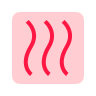
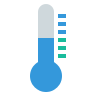

# IoBroker.iqontrol
** Tests: **

| Linux / Mac / Windows: | Browserübergreifende Überprüfung: |
| --- | --- |

\ **Wenn es Ihnen gefällt, ziehen Sie bitte eine Spende in Betracht:**

[![paypal] (https://www.paypalobjects.com/en_US/DK/i/btn/btn_donateCC_LG.gif)](https://www.paypal.com/cgi-bin/webscr?cmd=_s-xclick&hosted_button_id=LDHZMNPXKRX2N&source=url)

****

## Iqontrol Adapter für ioBroker
Schnelle Web-App zur Visualisierung.


\


\


\


\


Läuft in jedem Browser.
Einfach einzurichten, obwohl es vollständig anpassbar und reaktionsschnell ist.

> **Dieser Adapter verwendet Sentry-Bibliotheken, um Ausnahmen und Codefehler automatisch an die Entwickler zu melden.** Weitere Details und Informationen zum Deaktivieren der Fehlerberichterstattung finden Sie unter [Sentry-Plugin-Dokumentation](https://github.com/ioBroker/plugin-sentry#plugin-sentry)! Sentry Reporting wird ab js-controller 3.0 verwendet.

## Zum Startbildschirm hinzufügen
Sie können es als Web-App auf Homescreen speichern und es sieht aus und fühlt sich an wie eine native App: 

## Du brauchst...
* Knoten 10 oder höher
* Web-Adapter mit einer Instanz, auf der dasselbe Protokoll (http oder https) wie der Admin-Adapter ausgeführt wird. Socket.IO ist auf "integriert" und "Web-Sockets erzwingen" deaktiviert
    * Wenn dies im Widerspruch zu anderen Adaptern steht, fügen Sie einfach eine weitere Instanz mit den oben genannten Einstellungen hinzu - iQontrol durchsucht die passende passende Webadapterinstanz und verwendet sie für die Kommunikation
* Für die Verbindung über *iobroker.pro-Cloud* sollten sowohl der Administrator- als auch der Webadapter auf http (nicht https) eingestellt sein.

* Wenn Probleme auftreten, lesen Sie bitte den Abschnitt [Fehlerbehebung] (# Fehlerbehebung) am Ende dieser Readme-Datei

## Forum
Besuchen Sie [iobroker Forum](https://forum.iobroker.net/topic/22039/neuer-adapter-visualisierung-iqontrol).

## Wie benutzt man
** Haben Sie keine Angst vor den vielen Optionen, die Sie haben. ** Die meisten Dinge funktionieren sofort. Sie *können* müssen aber nicht alle Konfigurationsmöglichkeiten nutzen, die iQontrol bietet! Beginnen Sie einfach so:

* Erstellen Sie Ansichten.

Sie können Ansichten als eine Art Seite betrachten.

* Erstellen Sie dann Geräte in diesen Ansichten.

Geräte haben eine Rolle, die die Funktion des Geräts bestimmt, welche Symbole verwendet werden und so weiter.
Abhängig von dieser Rolle können Sie mehrere Status mit dem Gerät verknüpfen. Diese geben dem Gerät seine Funktionalität.
Wenn Sie als Rolle "Mit anderer Ansicht verknüpfen" auswählen, können Sie Links zu anderen Ansichten erstellen. Ich schlage vor, Links zu anderen Ansichten mit demselben Hintergrund wie die verknüpfte Ansicht zu skinnen.
Sie können auch versuchen, mit der Autocreate-Funktion ein vorhandenes Gerät aus dem iobroker-Objektbaum auszuwählen. Autocreate versucht, die Rolle herauszufinden und so viele Zustände wie möglich zuzuordnen.

* Anschließend können Sie eine Symbolleiste erstellen, die als Fußzeile angezeigt wird.

Symbolleisteneinträge sind Links zu Ansichten.
Der erste Symbolleisteneintrag ist Ihre 'Home-View', mit der beim Start geladen wird.

* Um alles zu einem ausgefallenen Stil zu machen, können Sie Ihre eigenen Bilder hochladen.

Sie können Ihre Bilder als Hintergrundbilder für Ansichten oder für Geräte verwenden.
Bilder im Ordner '/ usericons' können als Symbole für Geräte verwendet werden.
Die kostenlosen Demo-Hintergrundbilder stammen von www.pexels.com.

### Verwenden Sie Autocreate
* Auf der Registerkarte "Ansichten" finden Sie eine Schaltfläche "Ansichten erstellen"
* Wenn Sie ioBroker-Aufzählungen wie Räume oder Funktionen gut gepflegt haben, können Sie mit dieser Funktion automatisch Ansichten mit den in diesen Aufzählungen aufgeführten Geräten erstellen
* Beachten Sie, dass aufgrund der großen Anzahl unterschiedlicher Adapter und Geräte im ioBroker-univese die Autokrationsfunktion nicht alle Geräte zu 100% korrekt warten kann. Möglicherweise müssen Sie einige Einstellungen von Hand überarbeiten, um die besten Ergebnisse zu erzielen. Autocreate bietet Ihnen jedoch einen guten Ausgangspunkt, um in Sekundenschnelle Ihre eigene Visualisierung zu erstellen.

## URL-Parameter
* Das Frontend wird über `` http [s]: // <URL oder IP von iobroker>: <Port des Webadapters> / iqontrol / index.html`` aufgerufen
    * `` <Port des Webadapters> `` ist normalerweise 8082
* Um eine angegebene Instanz zu öffnen, können Sie `` namespace = iqontrol. <Instanznummer> `` als URL-Parameter hinzufügen
* Um eine angegebene Ansicht zu öffnen, können Sie als URL-Parameter "renderView = <viewID>" hinzufügen.
    * `` <viewID> `` muss wie `` iqontrol. <Instanznummer> .Views. <Ansichtsname> `` formatiert sein
* Hinweis: Hierbei wird zwischen Groß- und Kleinschreibung unterschieden!
* Um eine angegebene Ansicht als Homepage zu öffnen, können Sie `` home = <viewID> `` als URL-Parameter hinzufügen. Dadurch wird auch die verknüpfte Ansicht des ersten Symbolleisteneintrags geändert!
    * `` <viewID> `` muss wie `` iqontrol. <Instanznummer> .Views. <Ansichtsname> `` formatiert sein
* Hinweis: Hierbei wird zwischen Groß- und Kleinschreibung unterschieden!
* Um einen bestimmten Dialog beim Laden der Seite zu öffnen, können Sie als URL-Parameter `` openDialog = <deviceID> `` hinzufügen
    * `` <GerätID> `` muss wie `` iqontrol. <Instanznummer> .Views. <Ansichtsname> .Geräte. <Gerätennummer> `` formatiert werden, wobei `` <Gerätennummer> `` beginnt bei 0 (das erste Gerät in einer Ansicht ist also Gerätenummer 0)
* Hinweis: Hierbei wird zwischen Groß- und Kleinschreibung unterschieden!
* Verwenden Sie die folgenden Parameter, um die Rückgabe nach Zeiteinstellungen festzulegen oder zu überschreiben:
* `` returnAfterTimeTreshold =<time in seconds> `` um die Zeit einzustellen, nach der die Zielansicht aufgerufen wird. Verwenden Sie `` 0``, um die Rückgabe nach Zeit zu deaktivieren.
* `` returnAfterTimeDestiationView = <viewID> ``, um die Ansicht festzulegen, die nach dem Schwellenwert aufgerufen wird. Wenn nicht angegeben, wird die Startansicht verwendet.
* Diese Optionen sind hilfreich, wenn Sie iQontrol von einem an der Wand montierten Tablet aus aufrufen, das nach der Verwendung automatisch zur Startansicht zurückkehren sollte

**Beispiel:**

* `` https://192.168.1.1: 8082 / iqontrol / index.html? namespace = iqontrol.1 & home = iqontrol.1.Views.Living-Room``
    * Groß- und Kleinschreibung beachten

## Icons und Hintergrundbilder
* Sie können die eingebauten Bilder oder die unter der Registerkarte "Bilder" hochgeladenen Bilder oder eine beliebige kostenlose URL verwenden
* Sie können auch eine Variable in der Bild-URL verwenden. Dies kann beispielsweise für Wettervorhersagen nützlich sein. Verwenden Sie dieses Muster:
    * `` path / to / firstloaded.png | anotherpath / to / {iobrokerstate | fallback} .png``
    * Beispiel: `` ./../ iqontrol.meta / userimages / demo / Flasche.jpg | ./../ iqontrol.meta / userimages / demo / {javascript.0.myimage | whitestone} .jpg``
* Dies lädt `` ./../ iqontrol.meta / userimages / demo / Bottle.jpg``, wenn Sie die Ansicht öffnen
* Sobald der Status von "javascript.0.myimage" vom Server abgerufen wird, wird das Bild durch "./../ iqontrol.meta / userimages / demo / XXX.jpg" ersetzt, wobei " `XXX`` ist der Wert von` `javascript.0.myimage``
* Wenn `` javascript.0.myimage`` keinen Wert hat, wird der Fallback `` whitestone`` verwendet (die Verwendung des Fallbacks ist optional)

### Fortschrittsbalken
* Es ist möglich, SVG-Definitionen in Kombination mit Variablen anstelle von Bilddateien zu verwenden, um Fortschrittsbalken anzuzeigen
* Es stehen integrierte Vew-Vorlagen zur Auswahl, Sie können jedoch auch eigene SVGs erstellen

 

* Weitere Informationen finden Sie unter [Wiki] (https://github.com/sbormann/ioBroker.iqontrol/wiki/Progress-Bars)

## Gerätenamen
* Genau wie Variablen in Bild-URLs können Sie Variablen in Gerätenamen verwenden. Die Syntax ist fast dieselbe:
    * `` Text beim Laden | Text nach dem Laden von {iobrokerstate | fallback} ``
* Kann den iobrokerstate zusätzlich in eckige Klammern setzen, dann wird der einfache Wert ohne seine Einheit verwendet: `` Text beim Laden | Text nach dem Laden von {[iobrokerstate] | fallback} ``
    * Beispiel: `` Wetter wird geladen | Wetter: {javascript.0.weather | Keine Wetterdaten gefunden} ``
* Dies zeigt "Wetter wird geladen", wenn Sie die Ansicht öffnen
* Sobald der Status von "javascript.0.weather" vom Server abgerufen wird, wird der Text durch "Weather: XXX" ersetzt, wobei "XXX" der Wert von "javascript.0" ist .wetter``
* Wenn `` javascript.0.weather`` keinen Wert hat, wird der Fallback `` Keine Wetterdaten gefunden`` verwendet (die Verwendung des Fallbacks ist optional)

## Popup-Nachrichten
* Jede Instanz erstellt den Status "iqontrol.x.Popup.Message"
* Wenn Werte an diesen Status übergeben werden, wird eine Popup-Nachricht (oder ein Toast) angezeigt
* Sie können HTML-Tags verwenden, um den Nachrichtentext zu formatieren
* Es gibt einige zusätzliche Status für die weitere Anpassung des angezeigten Popups (diese müssen festgelegt werden, bevor der Nachrichtendatenpunkt festgelegt wird):
    * `` Dauer``: Dies ist die Zeit in ms, in der die Nachricht angezeigt wird. Wenn auf 0 gesetzt, muss die Nachricht bestätigt werden
    * `` ClickedValue`` und `` ClickedDestinationState``: Wenn der Benutzer auf das Popup klickt, wird der Wert von `` ClickedValue`` an `` iqontrol.x.Popup.POPUP_CLICKED`` und, falls angegeben, zusätzlich gesendet zum Datenpunkt in `` ClickedDestinationState``
        * Wenn kein Wert angegeben ist, wird `` true`` verwendet
    * `` ButtonNames``: Hier können Sie eine durch Kommas getrennte Liste von Schaltflächen angeben, die am unteren Rand des Popups angezeigt wird (zum Beispiel "OK, Abort").
        * `` ButtonValues`` und `` ButtonDestinationStates``: Dies sind durch Kommas getrennte Wertelisten, die an `` iqontrol.x.Popup.BUTTON_CLICKED`` und, falls angegeben, zusätzlich zum Datenpunkt in `` ButtonDestinationStates` gesendet werden `, wenn der Benutzer auf die entsprechende Schaltfläche klickt
* Anstelle eines Datenpunkts können Sie die Befehle `` COMMAND: renderView`` und `` COMMAND: openDialog`` als ButtonDestinationState verwenden, um eine Ansicht zu rendern oder einen Dialog zu öffnen
* Der ButtonValue gibt dann die Ansicht bzw. Dialog und muss im Format `` iqontrol. <Instanznummer> .Views. <Ansichtsname> `` resp. `` Iqontrol. <Instanznummer> .Views. <Ansichtsname> .Geräte. <Gerätenummer> `` wobei `` <Gerätenummer> `` bei 0 beginnt (das erste Gerät in einer Ansicht ist also Gerät Nummer 0)
* Wenn Sie nur einen Wert verwenden (anstelle einer durch Kommas getrennten Liste), wird dieser Wert für alle Schaltflächen verwendet
* Wenn Sie `` ButtonValues`` leer lassen, wird der Name der Schaltfläche verwendet
* Wenn Sie nur einen Zielstatus verwenden (anstelle einer durch Kommas getrennten Liste), wird dieser Status für alle Schaltflächen verwendet
        * `` ButtonCloses``: Dies ist eine durch Kommas getrennte Liste von Booleschen Werten (`` true`` / `` false``), die angeben, ob das Popup geschlossen werden soll, wenn die entsprechende Schaltfläche gedrückt wird
* Alternativ können Sie diese Werte über den Befehl sendTo mit den Parametern `` PopupMessage``, `` PopupDuration``, `` PopupClickedValue`` usw. festlegen
    * Beispiel: `` sendTo ("iqontrol", "send", {PopupMessage: 'Dies ist meine Nachricht', PopupDuration: 2500, PopupClickedValue: 'messageConfirmed'}); ``
* Sie können blockly auch Nachrichten an iQontrol senden

 

## Widgets
* Jede Kachel hat einen BACKGROUND_URL- und einen BACKGROUND_HTML-Datenpunkt
* Hier können Sie einen Link (über BACKGROUND_URL) zu einer Website definieren oder direkten HTML-Code (über BACKGROUND_HTML) platzieren, der als Hintergrund der Kachel angezeigt wird
* Dies gibt Ihnen die Möglichkeit, (interaktive) Inhalte in eine Kachel zu platzieren (wie Uhren, FLOT-Diagramme, Tabellen, Wettervorhersagen usw.)
* Standardmäßig werden Mausereignisse auf diesen Inhalt gerichtet (daher können Sie nicht mehr auf die Kachel selbst klicken). Sie können dies jedoch mit der Option "Mausereignisse auf die Kachel anstatt auf den Inhalt von BACKGROUND_URL / HTML lenken" deaktivieren.
* iQontrol bietet eine Geräterolle "Widget" mit einigen vordefinierten Optionen, die hauptsächlich verwendet werden, wenn eine Website als Widget angezeigt wird. Sie können jedoch mit jeder anderen Rolle das gleiche Ergebnis erzielen, indem Sie die Geräteoptionen ordnungsgemäß ändern.


### PostMessage-Communication (nur für Experten)
* Technisch gesehen wird der Inhalt von BACKGROUND_URL / HTML in ein HTML-Element namens iframe eingefügt, bei dem es sich um eine Website innerhalb einer Website handelt
* Durch Aktivieren der Option "PostMessage-Kommunikation für BACKGROUND_URL / HTML zulassen" können Sie die PostMessage-Kommunikation zwischen der Website in diesem Iframe und iQontrol selbst aktivieren
* Um Befehle an iQontrol zu senden, können Sie den folgenden Javascript-Befehl verwenden: `` window.parent.postMessage (message, "*"); ``
    * `` message`` ist ein Javascript-Objekt im Format `` {Befehl: Befehl, stateId: stateId, Wert: Wert} ``
    * Folgende Nachrichtenbefehle werden unterstützt:
        * `` {Befehl: "setWidgetState", stateId: <widgetStateId>, Wert: <value>} ``
* Dadurch wird der ioBroker-Status `` iqontrol. <Instanz> .Widgets. <widgetStateId> `` auf den Wert `` <Wert> `` gesetzt (`` <Wert> `` kann eine Zeichenfolge, eine Zahl oder ein Boolescher Wert oder ein sein Objekt wie `` {val: <Wert>, ack: true | false} ``)
        * `` {Befehl: "getWidgetState", stateId: <widgetStateId>} ``
* Dadurch sendet iQontrol den Wert des ioBroker-Status `` iqontrol. <Instanz> .Widgets. <widgetStateId> `` (siehe unten, wie die Antwortnachricht empfangen wird).
        * `` {Befehl: "getWidgetStateSubscribed", stateId: <widgetStateId>} ``
* Dadurch sendet iQontrol den Wert des ioBroker-Status `` iqontrol. <Instanz> .Widgets. <widgetStateId> `` jetzt und jedes Mal, wenn sich sein Wert ändert (siehe unten, wie die Antwortnachrichten empfangen werden).
        * `` {Befehl: "setWidgetDeviceState", stateId: <widgetDeviceState>, Wert: <Wert>} ``
* Dadurch wird der ioBroker-Datenpunkt, der den Geräten STATE `` <widgetDeviceState> `` (zum Beispiel der Datenpunkt, der LEVEL zugewiesen ist) zugewiesen wird, auf den Wert `` <Wert> `` (`` <Wert> `gesetzt `kann eine Zeichenfolge, eine Zahl oder ein Boolescher Wert oder ein Objekt wie` `{val: <Wert>, ack: true | false}` `) sein
        * `` {Befehl: "getWidgetDeviceState", stateId: <widgetDeviceState>} ``
* Dadurch sendet iQontrol den Wert des ioBroker-Datenpunkts, der den Geräten STATE `` <widgetDeviceState> `` zugewiesen ist (z. B. den Datenpunkt, der LEVEL zugewiesen ist; siehe unten, wie die Antwortnachricht empfangen wird).
        * `` {Befehl: "setState", stateId: <stateId>, Wert: <value>} ``
* Dadurch wird der ioBroker-Status `` <stateId> `` auf den Wert `` <value> `` gesetzt (`` <value> `` kann eine Zeichenfolge, eine Zahl oder ein Boolescher Wert oder ein Objekt wie `` {val: <sein Wert>, ack: true | false} ``)
        * `` {Befehl: "getState", stateId: <stateId>} ``
* Dies führt dazu, dass iQontrol den Wert des ioBroker-Status "<stateId>" sendet (siehe unten, wie die Antwortnachricht empfangen wird).
        * `` {Befehl: "getStateSubscribed", stateId: <stateId>} ``
* Dadurch sendet iQontrol den Wert des ioBroker-Status "<stateId>" jetzt und jedes Mal, wenn sich sein Wert ändert (siehe unten, wie die Antwortnachrichten empfangen werden).
        * `` {Befehl: "renderView", Wert: <viewID>} ``
* Dadurch wird iQontrol angewiesen, eine Ansicht zu rendern, wobei `` <viewID> `` wie `` iqontrol. <Instanznummer> .Views. <Ansichtsname> `` formatiert werden muss (Groß- und Kleinschreibung beachten)
        * `` {Befehl: "openDialog", Wert: <Geräte-ID>} ``
* Dadurch wird iQontrol angewiesen, ein Dialogfeld zu öffnen, in dem `` <GerätID> `` wie `` iqontrol. <Instanznummer> .Views. <Ansichtsname> .devices. <Gerätennummer> `` formatiert werden muss Dabei beginnt `` <Gerätenummer> `` bei 0 (das erste Gerät in einer Ansicht ist also Gerätenummer 0).
* Um Nachrichten von iQontrol zu empfangen, müssen Sie einen Ereignis-Listener für das Ereignis "message" mit dem Javascript-Befehl `` window.addEventListener ("message", receivePostMessage, false); `` registrieren
    * Die Funktion "receivePostMessage" empfängt das Objekt "event"
* `` `Event.data`` enthält die Nachricht von iqontrol, die ein Objekt wie das folgende sein wird:
* event.data = `` {Befehl: "getState", stateId: <stateId>, Wert: <stateObject>} `` - Dies ist die Antwort auf einen getState-Befehl oder einen getStateSubsribed-Befehl und gibt Ihnen den tatsächlichen ` `<Wert>` `-Objekt des ioBroker-Status`` <stateId>` `
* `` <stateObject> `` selbst ist ein Objekt wie

			````javascript
			event.data.value = {
				val: <value (rounded)>,
				unit: "<unit>",
				valFull: <value (not rounded)>,
				plainText: "<clear text of val, for example taken from valuelist>",
				min: <minimum>,
				max: <maximum>,
				valuelist: {<object with possible values and corresponding clear text>},
				targetValues: {<target value list>},
				ack: <true|false>,
				readonly: <true|false>,
				custom: {<object with custom settings>},
				from: "<source of state>",
				lc: <timestamp of last change>,
				ts: <timestamp of last actualization>,
				q: <quality of signal>,
				role: "<role of state>",
				type: "<string|number|boolean>"
			}
			````

* Um iQontrol anzuweisen, einen WidgetState unter `` iqontrol. <Instanz> .Widgets`` zu generieren, können Sie ein Meta-Tag im Kopfbereich der Widget-Website verwenden:
* Syntax: ``<meta name="widget-datapoint" content="WidgetName.StateName" data-type="string" data-role="text" /> ``
* Sie können den Datenpunkt weiter konfigurieren, indem Sie die Attribute Datentyp (der auf Zeichenfolge, Zahl oder Boolescher Wert eingestellt werden kann), Datenrolle, Datenname, Datenmin, Datenmaximum, Datendef. Und Dateneinheit verwenden
    * Der entsprechende Datenpunkt wird erst dann erstellt, wenn die Widget-Website einem Gerät als URL oder BACKGROUND_URL hinzugefügt wird
* Das gleiche Konzept kann für den URL / HTML-Status verwendet werden, mit dem eine Website im Dialogfeld eines Geräts angezeigt wird
* Um ein Symbol für Ihr Widget zu erstellen, platzieren Sie eine PNG-Datei mit demselben Dateinamen wie das Widget im Widgets-Verzeichnis
* Siehe unten für ein Beispiel Widget-Website:

<details><summary>Beispiel-Widget-Website anzeigen, die als Widget mit postMessage-Kommunikation angezeigt werden soll:</summary>

* Sie können den folgenden HTML-Code verwenden und ihn in den BACKGROUND_HTML-Status eines Widgets kopieren (das dann als "Konstante" konfiguriert werden muss).
* Alternativ können Sie diesen Code als HTML-Datei in das Unterverzeichnis / userwidgets hochladen und auf BACKGROUND_URL-State verweisen (der dann auch als "Konstante" konfiguriert werden muss).
* Aktivieren Sie die Option "PostMessage-Kommunikation für BACKGROUND_URL / HTML zulassen".
* Es wird gezeigt, wie eine bidirektionale Kommunikation zwischen der Website und iQontrol erfolgt

````html
<!doctype html>
<html>
<head>
	<meta http-equiv="Content-Type" content="text/html; charset=UTF-8"/>
	<meta name="widget-datapoint" content="postMessageTest.test" data-type="string" data-role="text" />
	<meta name="widget-description" content="This is a test widget. To get the WidgetDeviceState-Functions working, please set a valid iobroker-datapoint for STATE. (C) by Sebastian Bormann"/>
	<meta name="widget-urlparameters" content="title/postMessageTest/Please enter a title">
	<meta name="widget-options" content="{'noZoomOnHover': 'true', 'hideDeviceName': 'true', 'sizeInactive': 'xwideIfInactive highIfInactive', 'iconNoPointerEventsInactive': 'true', 'hideDeviceNameIfInactive': 'true', 'hideStateIfInactive': 'true', 'sizeActive': 'xwideIfActive highIfActive', 'bigIconActive': 'true', 'iconNoPointerEventsActive': 'true', 'hideDeviceNameIfActive': 'true', 'hideStateIfActive': 'true', 'sizeEnlarged': 'fullWidthIfEnlarged fullHeightIfEnlarged', 'bigIconEnlarged': 'true', 'iconNoPointerEventsEnlarged': 'false', 'noOverlayEnlarged': 'true', 'hideDeviceNameIfEnlarged': 'true', 'hideStateIfEnlarged': 'true', 'popupAllowPostMessage': 'true', 'backgroundURLAllowPostMessage': 'true', 'backgroundURLNoPointerEvents': 'false'}"/>
 	<title>iQontrol postMessageTest</title>
</head>
<body>
	<br><br>
	<h3><span id="title">postMessageTest</span><h3>
	<button onclick="getWidgetState('postMessageTest.test')">getWidgetState postMessageTest.test</button><br>
	<button onclick="getWidgetStateSubscribed('postMessageTest.test')">getWidgetStateSubscribed postMessageTest.test</button><br>
	<button onclick="setWidgetState('postMessageTest.test', 'Hello world')">setWidgetState postMessageTest.test to 'Hello world'</button><br>
  	<br>
	<button onclick="getWidgetDeviceState('STATE')">getWidgetDeviceState STATE</button><br>
	<button onclick="getWidgetDeviceStateSubscribed('STATE')">getWidgetDeviceStateSubscribed STATE</button><br>
	<button onclick="setWidgetDeviceState('STATE', 'Hello world')">setWidgetDeviceState STATE to 'Hello world'</button><br>
  	<br>
	<button onclick="getState('system.adapter.admin.0.cpu')">getState system.adapter.admin.0.cpu</button><br>
	<button onclick="getStateSubscribed('system.adapter.admin.0.uptime')">getStateSubscribed system.adapter.admin.0.uptime</button><br>
	<button onclick="setState('iqontrol.0.Popup.Message', 'Hey, this is a test Message')">setState popup message</button><br>
  	<br>
	<button onclick="renderView('iqontrol.0.Views.Home')">renderView 'Home'</button><br>
	<button onclick="openDialog('iqontrol.0.Views.Home.devices.0')">openDialog 1st device on 'Home'</button><br>
	<br><hr>
	message sent: <span id="messageSent">-</span><br>
	<br><hr>
	message received: <span id="messageReceived">-</span><br>
	<br><hr>
	this means: <span id="thisMeans">-</span><br>
	<br><hr>
    <script type="text/javascript">
		var countSend = 0;
		var countReceived = 0;

		//Set title from UrlParameter
		document.getElementById('title').innerHTML = getUrlParameter('title') || "No Title set";

		//getWidgetState
		function getWidgetState(stateId){
			sendPostMessage("getWidgetState", stateId);
		}

		//getWidgetStateSubscribed (this means, everytime the state changes, an update will be received)
		function getWidgetStateSubscribed(stateId){
			sendPostMessage("getWidgetStateSubscribed", stateId);
		}

		//setWidgetState
		function setWidgetState(stateId, value){
			sendPostMessage("setWidgetState", stateId, value);
		}


		//getWidgetDeviceState
		function getWidgetDeviceState(stateId){
			sendPostMessage("getWidgetDeviceState", stateId);
		}

		//getWidgetDeviceStateSubscribed (this means, everytime the state changes, an update will be received)
		function getWidgetDeviceStateSubscribed(stateId){
			sendPostMessage("getWidgetDeviceStateSubscribed", stateId);
		}

		//setWidgetDeviceState
		function setWidgetDeviceState(stateId, value){
			sendPostMessage("setWidgetDeviceState", stateId, value);
		}


		//getState
		function getState(stateId){
			sendPostMessage("getState", stateId);
		}

		//getStateSubscribed (this means, everytime the state changes, an update will be received)
		function getStateSubscribed(stateId){
			sendPostMessage("getStateSubscribed", stateId);
		}

		//setState
		function setState(stateId, value){
			sendPostMessage("setState", stateId, value);
		}


		//renderView
		function renderView(viewId){
			sendPostMessage("renderView", null, viewId);
		}

		//openDialog
		function openDialog(deviceId){
			sendPostMessage("openDialog", null, deviceId);
		}

		// +++++ Default Functions +++++
		//getUrlParameter
		function getUrlParameter(name) {
			name = name.replace(/[\[]/, '\\[').replace(/[\]]/, '\\]');
			var regex = new RegExp('[\\?&]' + name + '=([^&#]*)');
			var results = regex.exec(location.search);
			return results === null ? null : decodeURIComponent(results[1].replace(/\+/g, ' '));
		};

		//send postMessages
		function sendPostMessage(command, stateId, value){
			countSend++;
			message = { command: command, stateId: stateId, value: value };
			document.getElementById('messageSent').innerHTML = countSend + " - " + JSON.stringify(message);
			window.parent.postMessage(message, "*");
		}

		//receive postMessages
		window.addEventListener("message", receivePostMessage, false);
		function receivePostMessage(event) { //event = {data: message data, origin: url of origin, source: id of sending element}
			countReceived++;
			if(event.data) document.getElementById('messageReceived').innerHTML = countReceived + " - " + JSON.stringify(event.data);
			if(event.data && event.data.command) switch(event.data.command){
				case "getState":
				if(event.data.stateId && event.data.value && event.data.value.val){
					document.getElementById('thisMeans').innerHTML = "Got State " + event.data.stateId + " with value " + event.data.value.val;
				}
				break;
			}
		}
	</script>
</body>
</html>
````

</ Details>

### Weitere Konfiguration von Widgets
* Es gibt zusätzliche Meta-Tags, die Sie im Kopfbereich Ihrer Widget-Website verwenden können, um das Verhalten des Widgets zu konfigurieren:
* 'Widget-Beschreibung'
* Syntax: ``<meta name="widget-description" content="Please see www.mywebsite.com for further informations. (C) by me"/> ``
* Der Inhalt wird angezeigt, wenn Sie das Widget als URL oder BACKGROUND_URL auswählen oder wenn Sie ein Widget automatisch erstellen
* 'Widget-URL-Parameter'
* Syntax: ``<meta name="widget-urlparameters" content="parameter/default value/description;parameter2/default value2/description2"/> ``
* Der Benutzer wird nach diesen Parametern gefragt, wenn er das Widget als URL oder BACKGROUND_URL auswählt oder ein Widget automatisch erstellt
* Alle diese Parameter werden der Widget-Website über eine URL-Parameter-Zeichenfolge (wie `` widget.html? Parameter = value & parameter2 = value2``) mitgeteilt.
* Sie können diese Einstellungen in Ihrer Widget-Website verwenden, indem Sie die URL-Parameter mit einer Funktion wie der folgenden anfordern:

			````javascript
			function getUrlParameter(name) {
				name = name.replace(/[\[]/, '\\[').replace(/[\]]/, '\\]');
				var regex = new RegExp('[\\?&]' + name + '=([^&#]*)');
				var results = regex.exec(location.search);
				return results === null ? null : decodeURIComponent(results[1].replace(/\+/g, ' '));
			};
			````

* 'Widget-Optionen'
* Syntax: ``<meta name="widget-options" content="{'noZoomOnHover': 'true', 'hideDeviceName': 'true'}"/> ``
* Im erweiterbaren Abschnitt unten finden Sie die möglichen Optionen, die von diesem Meta-Tag konfiguriert werden können

<details><summary>Zeigen Sie mögliche Optionen an, die mit dem Meta-Tag &#39;Widget-Optionen&#39; konfiguriert werden können:</summary>

* Symbole:
* `ʻIcon_on`` (Symbol an):
* Standard: ""
* `ʻIcon_off`` (Symbol aus):
* Standard: ""
* Gerätespezifische Optionen:
* `` noVirtualState`` (Verwenden Sie keinen virtuellen Datenpunkt für STATE (Schalter ausblenden, wenn STATE leer ist)):
* Mögliche Werte: "true" | "false"
* Standard: "false"
* Allgemeines:
* `` readonly`` (Readonly):
* Mögliche Werte: "true" | "false"
* Standard: "false"
* `` `InvertUnreach`` (Invert UNREACH (benutze verbunden statt nicht zu erreichen)):
* Mögliche Werte: "true" | "false"
* Standard: "false"
* `` AdditionalControlsSectionType`` (Aussehen von ADDITIONAL_CONTROLS):
* Mögliche Werte: "keine" | "zusammenklappbar" | "zusammenklappbar offen"
* Standard: "zusammenklappbar"
* `` AdditionalControlsCaption`` (Beschriftung für ADDITIONAL_CONTROLS):
* Standard: "Zusätzliche Steuerelemente"
* `` AdditionsInfoSectionType`` (Aussehen von ADDITIONAL_INFO):
* Mögliche Werte: "keine" | "zusammenklappbar" | "zusammenklappbar offen"
* Standard: "zusammenklappbar"
* `` AdditionsinfoCaption`` (Beschriftung für ADDITIONAL_INFO):
* Standard: "Zusätzliche Informationen"
* BATTERIE Leeres Symbol:
* `` batterieAktivzustand`` (Zustand):
* Mögliche Werte: "" | "bei" | "af" | "eqt" | "eqf" | "eq" | "ne" | "gt" | "ge" | "lt" | "le"
* Standard: ""
* `` batterieActiveConditionValue`` (Bedingungswert):
* Standard: ""
* Fliesenverhalten (allgemein):
* `` clickOnIconOpensDialog`` (Klicken Sie auf das Symbol, um den Dialog zu öffnen (anstatt umzuschalten)):
* Mögliche Werte: "true" | "false"
* Standard: "false"
* `` noZoomOnHover`` (Zoom-Effekt beim Hover deaktivieren):
* Mögliche Werte: "true" | "false"
* Standard: "true"
* `` hideDeviceName`` (Gerätename ausblenden):
* Mögliche Werte: "true" | "false"
* Standard: "true"
* Kachelverhalten bei inaktivem Gerät:
* `` sizeInactive`` (Größe der Kachel, wenn das Gerät inaktiv ist):
* Mögliche Werte: "| "|" xhighIfInactive "|" wideIfInactive highIfInactive "|" xwideIfInactive highIfInactive "|" wideIfInactive xhighIfInactive "|" xwideIfInactive xhighIfInactive "|" fullWidthIfInactive Aspekt-1-1IfInactive "|" fullWidth 2IfInactive "|" fullWidthIfInactive Aspekt-16-9IfInactive "|" fullWidthIfInactive Aspekt-21-9IfInactive "|" fullWidthIfInactive fullHeightIfInactive "|"
* Standard: "xwideIfInactive highIfInactive"
* `` bigIconInactive`` (Großes Symbol anzeigen, wenn Gerät inaktiv ist):
* Mögliche Werte: "true" | "false"
* Standard: "false"
* `` SiliconNoPointerEventsInactive`` (Mausereignisse für das Symbol ignorieren, wenn das Gerät inaktiv ist):
* Mögliche Werte: "true" | "false"
* Standard: "false"
* `` noOverlayInactive`` (Überlagerung der Kachel entfernen, wenn das Gerät inaktiv ist):
* Mögliche Werte: "true" | "false"
* Standard: "true"
* `` hideBackgroundURLInactive`` (Hintergrund vor BACKGROUND_URL / HTML ausblenden, wenn das Gerät inaktiv ist):
* Mögliche Werte: "true" | "false"
* Standard: "false"
* `` hideDeviceNameIfInactive`` (Gerätenamen ausblenden, wenn das Gerät inaktiv ist):
* Mögliche Werte: "true" | "false"
* Standard: "false"
* `` hideStateIfInactive`` (Status ausblenden, wenn das Gerät inaktiv ist):
* Mögliche Werte: "true" | "false"
* Standard: "true" * ``
* `` hideDeviceIfInactive`` (Gerät ausblenden, wenn es inaktiv ist):
* Mögliche Werte: "true" | "false"
* Standard: "false" * ``
* Kachelverhalten bei aktivem Gerät:
* `` sizeActive`` (Größe der Kachel, wenn das Gerät aktiv ist):
* Mögliche Werte: "" | "engIfAktiv kurzIfAktiv" | "schmalIfAktiv" | "schmalIfAktiv hochIfAktiv" | "engIfAktiv xhighIfAktiv" | "kurzIfAktiv" | "kurzIfAktiv breitIfAktiv" | "kurzIfAktiv xweitIfAktiv" "|" xhighIfActive "|" wideIfActive highIfActive "|" xwideIfActive highIfActive "|" wideIfActive xhighIfActive "|" xwideIfActive xhighIfActive "|" fullWidthIfActive Aspekt-1-1IfActive "|" fullWid- 2IfActive "|" fullWidthIfActive-Aspekt-16-9IfActive "|" fullWidthIfActive-Aspekt-21-9IfActive "|" fullWidthIfActive fullHeightIfActive "|"
* `` bigIconActive`` (Großes Symbol anzeigen, wenn Gerät aktiv ist):
* Mögliche Werte: "true" | "false"
* Standard: "false"
* `ʻIconNoPointerEventsActive`` (Mausereignisse für das Symbol ignorieren, wenn das Gerät aktiv ist):
* Mögliche Werte: "true" | "false"
* Standard: "false"
* `` noOverlayActive`` (Überlagerung der Kachel entfernen, wenn das Gerät aktiv ist):
* Mögliche Werte: "true" | "false"
* Standard: "true"
* `` hideBackgroundURLActive`` (Hintergrund vor BACKGROUND_URL / HTML ausblenden, wenn das Gerät aktiv ist):
* Mögliche Werte: "true" | "false"
* Standard: "false"
* `` hideDeviceNameIfActive`` (Gerätenamen ausblenden, wenn das Gerät aktiv ist):
* Mögliche Werte: "true" | "false"
* Standard: "false"
* `` hideStateIfActive`` (Status ausblenden, wenn das Gerät aktiv ist):
* Mögliche Werte: "true" | "false"
* Standard: "false"
* `` hideDeviceIfActive`` (Gerät ausblenden, falls es aktiv ist):
* Mögliche Werte: "true" | "false"
* Standard: "false"
* Fliesenverhalten bei vergrößertem Gerät:
* `` sizeEnlarged`` (Größe der Kachel, wenn das Gerät vergrößert ist):
* Mögliche Werte: "" | "schmal, wenn vergrößert" | "schmal, vergrößert, vergrößert" | "schmal, vergrößert, vergrößert" | "|" xhighIfEnlarged "|" wideIfEnlarged highIfEnlarged "|" xwideIfEnlarged highIfEnlarged "|" wideIfEnlarged xhighIfEnlarged "|" xwideIfEnlarged xhighIfEnlarged "|" fullWidthIfEnlarged aspekt 1-1IfEnlarged "|" fullWidthIfEnlarged aspekt 4-3IfEnlarged "|" fullWidthIfEnlarged Aspekt-3- 2Wenn vergrößert "|" fullWidthIfEnlarged Aspekt-16-9IfEnlarged "|" fullWidthIfEnlarged Aspekt-21-9IfEnlarged "|" fullWidthIfEnlarged fullHeightIfEnlarged "|"
* `` bigIconEnlarged`` (Großes Symbol anzeigen, wenn das Gerät vergrößert ist):
* Mögliche Werte: "true" | "false"
* Standard: "true"
* `` `iconNoPointerEventsEnlarged`` (Mausereignisse für das Symbol ignorieren, wenn das Gerät vergrößert ist):
* Mögliche Werte: "true" | "false"
* Standard: "false"
* `` noOverlayEnlarged`` (Überlagerung der Kachel entfernen, wenn das Gerät vergrößert ist):
* Mögliche Werte: "true" | "false"
* Standard: "false"
* `` tileEnlargeStartEnlarged`` (Kachel wird beim Start vergrößert):
* Mögliche Werte: "true" | "false"
* Standard: "false"
* `` tileEnlargeShowButtonInactive`` (Vergrößerungsschaltfläche anzeigen, wenn das Gerät inaktiv ist):
* Mögliche Werte: "true" | "false"
* Standard: "true"
* `` tileEnlargeShowButtonActive`` (Vergrößerungsschaltfläche anzeigen, wenn Gerät aktiv ist):
* Mögliche Werte: "true" | "false"
* Standard: "true"
* `` tileEnlargeShowInPressureMenuInactive`` (Vergrößern im Menü anzeigen, wenn das Gerät inaktiv ist):
* Mögliche Werte: "true" | "false"
* Standard: "true"
* `` tileEnlargeShowInPressureMenuActive`` (Vergrößern im Menü anzeigen, wenn das Gerät aktiv ist)
* Mögliche Werte: "true" | "false"
* Standard: "true"
* `` sichtbarkeitBackgroundURLEnlarged`` (Sichtbarkeit des Hintergrunds von BACKGROUND_URL / HTML, wenn das Gerät vergrößert ist):
* Mögliche Werte: "" | "visibleIfEnlarged" | "hideIfEnlarged"
* Standard: ""
* `` hideDeviceNameIfEnlarged`` (Gerätenamen ausblenden, wenn das Gerät vergrößert ist):
* Mögliche Werte: "true" | "false"
* Standard: "false"
* `` hideStateIfEnlarged`` (Status ausblenden, wenn das Gerät vergrößert ist):
* Mögliche Werte: "true" | "false"
* Standard: "false"
* `` hideIconEnlarged`` (Symbol ausblenden, wenn das Gerät vergrößert ist):
* Mögliche Werte: "true" | "false"
* Standard: "false"
* Bedingungen für eine aktive Kachel:
* `` tileActiveStateId`` (Status-ID (leer = STATE / LEVEL wird verwendet)):
* Standard: ""
* `` tileActiveCondition`` (Bedingung):
* Mögliche Werte: "" | "bei" | "af" | "eqt" | "eqf" | "eq" | "ne" | "gt" | "ge" | "lt" | "le"
* Standard: ""
* `` tileActiveConditionValue`` (Bedingungswert):
* Standard: ""
* Zeitstempel:
* `` `AddTimestampToState`` (Zeitstempel zum Status hinzufügen):
* Mögliche Werte: "" | "SA" | "ST" | "STA" | "SE" | "SEA" | "SE" | "SE.A" | "Se" | "SeA" | "STE" | "STEA" | "STE" | "STE.A" | "STe" | "STeA" | "T" | "TA" | "TE" | "TEA" | "TE." | "TE.A" | "Te" | "TeA" | "E" | "EA" | "E." | "EA" | "e" | "eA" | "N"
* Standard: "N"
* `` showTimestamp`` (Zeitstempel im Dialog anzeigen):
* Mögliche Werte: "" | "ja" | "nein" | "immer" | "nie"
* Standard: ""
* URL / HTML:
* `` popupWidth`` (Breite [px] für URL / HTML-Box):
* Standard: ""
* `` popupHeight`` (Höhe [px] für URL / HTML-Box):
* Standard: ""
* `` popupFixed`` (Behoben (nicht in der Größe veränderbar)):
* Mögliche Werte: "true" | "false"
* Standard: "false"
* `` `OpenURLExternal`` (URL in neuem Fenster öffnen (anstatt als Feld im Dialogfeld angezeigt zu werden)):
* Mögliche Werte: "true" | "false"
* Standard: "false"
* `` popupAllowPostMessage`` (PostMessage-Kommunikation für URL / HTML zulassen):
* Mögliche Werte: "true" | "false"
* Standard: "false"
* `` backgroundURLAllowPostMessage`` (PostMessage-Kommunikation für BACKGROUND_URL / HTML zulassen):
* Mögliche Werte: "true" | "false"
* Standard: "false"
* `` backgroundURLNoPointerEvents`` (Direkte Mausereignisse auf die Kachel anstatt auf den Inhalt von BACKGROUND_URL / HTML):
* Mögliche Werte: "true" | "false"
* Standard: "false"

</ Details>

<details><summary>Zeigen Sie eine Beispiel-Widget-Website, die eine Karte mit den oben genannten Einstellungen erstellt:</summary>

* Sie können den folgenden HTML-Code als HTML-Datei in das Unterverzeichnis / userwidgets hochladen und auf BACKGROUND_URL-State verweisen (der dann als "Konstante" konfiguriert werden muss).
* Beim Hinzufügen des Widgets wird eine Beschreibung angezeigt
* Dann werden Sie gefragt, ob Sie die enthaltenen Optionen anwenden möchten
* Es werden drei Datenpunkte erstellt, um die Position der Karte zu steuern: iqontrol.x.Widgets.Map.Posision.latitude, .altitude und .zoom

````html
<!doctype html>
<html style="width: 100%; height: 100%; margin: 0px;">
<head>
	<meta http-equiv="Content-Type" content="text/html; charset=UTF-8"/>
	<meta name="widget-description" content="This is a map widget, please provide coordinates at iqontrol.x.Widgets.Map.Posision. (C) by Sebastian Bormann"/>
	<meta name="widget-options" content="{'noZoomOnHover': 'true', 'hideDeviceName': 'true', 'sizeInactive': 'xwideIfInactive highIfInactive', 'iconNoPointerEventsInactive': 'true', 'hideDeviceNameIfInactive': 'true', 'hideStateIfInactive': 'true', 'sizeActive': 'fullWidthIfActive fullHeightIfActive', 'bigIconActive': 'true', 'iconNoPointerEventsActive': 'true', 'hideDeviceNameIfActive': 'true', 'hideStateIfActive': 'true', 'sizeEnlarged': 'fullWidthIfEnlarged fullHeightIfEnlarged', 'bigIconEnlarged': 'true', 'iconNoPointerEventsEnlarged': 'false', 'noOverlayEnlarged': 'true', 'hideDeviceNameIfEnlarged': 'true', 'hideStateIfEnlarged': 'true', 'popupAllowPostMessage': 'true', 'backgroundURLAllowPostMessage': 'true', 'backgroundURLNoPointerEvents': 'false'}"/>
	<meta name="widget-datapoint" content="Map.Position.latitude" data-type="number" data-role="value.gps.latitude" />
	<meta name="widget-datapoint" content="Map.Position.longitude" data-type="number" data-role="value.gps.longitude" />
	<meta name="widget-datapoint" content="Map.Position.zoom" data-type="number" data-role="value.zoom" />
	<link rel="stylesheet" href="https://unpkg.com/leaflet@1.7.1/dist/leaflet.css" integrity="sha512-xodZBNTC5n17Xt2atTPuE1HxjVMSvLVW9ocqUKLsCC5CXdbqCmblAshOMAS6/keqq/sMZMZ19scR4PsZChSR7A==" crossorigin=""/>
	<script src="https://unpkg.com/leaflet@1.7.1/dist/leaflet.js" integrity="sha512-XQoYMqMTK8LvdxXYG3nZ448hOEQiglfqkJs1NOQV44cWnUrBc8PkAOcXy20w0vlaXaVUearIOBhiXZ5V3ynxwA==" crossorigin=""></script>
	<title>Simple iQontrol Map Widget</title>
</head>
<body style="width: 100%; height: 100%; margin: 0px;">
	<div id="mapid" style="width: 100%; height: 100%; margin: 0px;"></div>
	<script type="text/javascript">
		//Declarations
		var mapPositionLatitude;
		var mapPositionLongitude;
		var mapPositionZoom;
		var mymap = false;

		//Subscribe to WidgetDatapoints now
		sendPostMessage("getWidgetStateSubscribed", "Map.Position.latitude");
		sendPostMessage("getWidgetStateSubscribed", "Map.Position.longitude");
		sendPostMessage("getWidgetStateSubscribed", "Map.Position.zoom");

		//Initialize map (if all three parameters mapPositionLatitude, mapPositionLongitude and mapPositionZoom were received)
		if(mapPositionLatitude != null && mapPositionLongitude != null && mapPositionZoom != null){
			console.log("Init map: " + mapPositionLatitude + "|" + mapPositionLongitude + "|" + mapPositionZoom);
			mymap = L.map('mapid').setView([mapPositionLatitude, mapPositionLongitude], mapPositionZoom);
			L.tileLayer('https://{s}.tile.openstreetmap.org/{z}/{x}/{y}.png', {
				'attribution':  'Kartendaten &copy; <a href="https://www.openstreetmap.org/copyright">OpenStreetMap</a> Mitwirkende',
				'useCache': true
			}).addTo(mymap);
		};

		//Reposition map
		function repositionMap(){
			console.log("Reposition map: " + mapPositionLatitude + "|" + mapPositionLongitude + "|" + mapPositionZoom);
			if(mymap) mymap.setView([mapPositionLatitude, mapPositionLongitude], mapPositionZoom); else console.log("   Abort, map not initialized yet");
		}

		//send postMessages
		function sendPostMessage(command, stateId, value){
			message = { command: command, stateId: stateId, value: value };
			window.parent.postMessage(message, "*");
		}

		//receive postMessages
		window.addEventListener("message", receivePostMessage, false);
		function receivePostMessage(event){ //event = {data: message data, origin: url of origin, source: id of sending element}
			if(event.data && event.data.command) switch(event.data.command){
				case "getState":
				if(event.data.stateId && event.data.value) switch(event.data.stateId){
					case "Map.Position.latitude":
					console.log("Set latitude to " + event.data.value.val);
					mapPositionLatitude = parseFloat(event.data.value.val) || 0;
					if(mymap) repositionMap();
					break;

					case "Map.Position.longitude":
					console.log("Set longitude to " + event.data.value.val);
					mapPositionLongitude = parseFloat(event.data.value.val) || 0;
					if(mymap) repositionMap();
					break;

					case "Map.Position.zoom":
					console.log("Set zoom to " + event.data.value.val);
					mapPositionZoom = parseFloat(event.data.value.val) || 0;
					if(mymap) repositionMap();
					break;
				}
				break;
			}
		}
	</script>
</body>
</html>
````

</ Details>

<details><summary>Zeigen Sie ein erweitertes Beispiel:</summary>

* Sie können den folgenden HTML-Code als HTML-Datei in das Unterverzeichnis / userwidgets hochladen und auf BACKGROUND_URL-State verweisen (der dann als "Konstante" konfiguriert werden muss).
* Beim Hinzufügen des Widgets wird eine Beschreibung angezeigt
* Ein URL-Parameter für Ihren Titel wird abgefragt
* Dann werden Sie gefragt, ob Sie die enthaltenen Optionen anwenden möchten
* Eine Reihe von Datenpunkten wird erstellt, um die Position der Karte zu steuern und bevorzugte Positionen festzulegen

````html
<!doctype html>
<html style="width: 100%; height: 100%; margin: 0px;">
<head>
	<meta http-equiv="Content-Type" content="text/html; charset=UTF-8"/>
	<meta name="widget-description" content="This is a map widget, please provide coordinates at iqontrol.x.Widgets.Map. (C) by Sebastian Bormann"/>
	<meta name="widget-urlparameters" content="title/My Map/Please enter a title for your map">
	<meta name="widget-options" content="{'noZoomOnHover': 'true', 'hideDeviceName': 'true', 'sizeInactive': 'xwideIfInactive highIfInactive', 'iconNoPointerEventsInactive': 'true', 'hideDeviceNameIfInactive': 'true', 'hideStateIfInactive': 'true', 'sizeActive': 'fullWidthIfActive fullHeightIfActive', 'bigIconActive': 'true', 'iconNoPointerEventsActive': 'true', 'hideDeviceNameIfActive': 'true', 'hideStateIfActive': 'true', 'sizeEnlarged': 'fullWidthIfEnlarged fullHeightIfEnlarged', 'bigIconEnlarged': 'true', 'iconNoPointerEventsEnlarged': 'false', 'noOverlayEnlarged': 'true', 'hideDeviceNameIfEnlarged': 'true', 'hideStateIfEnlarged': 'true', 'popupAllowPostMessage': 'true', 'backgroundURLAllowPostMessage': 'true', 'backgroundURLNoPointerEvents': 'false'}"/>

	<meta name="widget-datapoint" content="Map.Position.latitude" data-type="number" data-role="value.gps.latitude" />
	<meta name="widget-datapoint" content="Map.Position.longitude" data-type="number" data-role="value.gps.longitude" />
	<meta name="widget-datapoint" content="Map.Position.zoom" data-type="number" data-role="value.zoom" />

	<meta name="widget-datapoint" content="Map.Favorites.0.Position.latitude" data-type="number" data-role="value.gps.latitude" />
	<meta name="widget-datapoint" content="Map.Favorites.0.Position.longitude" data-type="number" data-role="value.gps.longitude" />
	<meta name="widget-datapoint" content="Map.Favorites.0.name" data-type="string" data-role="text" />
	<meta name="widget-datapoint" content="Map.Favorites.0.icon-url" data-type="string" data-role="url" />

	<meta name="widget-datapoint" content="Map.Favorites.1.Position.latitude" data-type="number" data-role="value.gps.latitude" />
	<meta name="widget-datapoint" content="Map.Favorites.1.Position.longitude" data-type="number" data-role="value.gps.longitude" />
	<meta name="widget-datapoint" content="Map.Favorites.1.name" data-type="string" data-role="text" />
	<meta name="widget-datapoint" content="Map.Favorites.1.icon-url" data-type="string" data-role="url" />

	<meta name="widget-datapoint" content="Map.Favorites.2.Position.latitude" data-type="number" data-role="value.gps.latitude" />
	<meta name="widget-datapoint" content="Map.Favorites.2.Position.longitude" data-type="number" data-role="value.gps.longitude" />
	<meta name="widget-datapoint" content="Map.Favorites.2.name" data-type="string" data-role="text" />
	<meta name="widget-datapoint" content="Map.Favorites.2.icon-url" data-type="string" data-role="url" />

	<meta name="widget-datapoint" content="Map.Favorites.3.Position.latitude" data-type="number" data-role="value.gps.latitude" />
	<meta name="widget-datapoint" content="Map.Favorites.3.Position.longitude" data-type="number" data-role="value.gps.longitude" />
	<meta name="widget-datapoint" content="Map.Favorites.3.name" data-type="string" data-role="text" />
	<meta name="widget-datapoint" content="Map.Favorites.3.icon-url" data-type="string" data-role="url" />

	<meta name="widget-datapoint" content="Map.Favorites.4.Position.latitude" data-type="number" data-role="value.gps.latitude" />
	<meta name="widget-datapoint" content="Map.Favorites.4.Position.longitude" data-type="number" data-role="value.gps.longitude" />
	<meta name="widget-datapoint" content="Map.Favorites.4.name" data-type="string" data-role="text" />
	<meta name="widget-datapoint" content="Map.Favorites.4.icon-url" data-type="string" data-role="url" />

	<meta name="widget-datapoint" content="Map.Favorites.5.Position.latitude" data-type="number" data-role="value.gps.latitude" />
	<meta name="widget-datapoint" content="Map.Favorites.5.Position.longitude" data-type="number" data-role="value.gps.longitude" />
	<meta name="widget-datapoint" content="Map.Favorites.5.name" data-type="string" data-role="text" />
	<meta name="widget-datapoint" content="Map.Favorites.5.icon-url" data-type="string" data-role="url" />

	<meta name="widget-datapoint" content="Map.Favorites.6.Position.latitude" data-type="number" data-role="value.gps.latitude" />
	<meta name="widget-datapoint" content="Map.Favorites.6.Position.longitude" data-type="number" data-role="value.gps.longitude" />
	<meta name="widget-datapoint" content="Map.Favorites.6.name" data-type="string" data-role="text" />
	<meta name="widget-datapoint" content="Map.Favorites.6.icon-url" data-type="string" data-role="url" />

	<meta name="widget-datapoint" content="Map.Favorites.7.Position.latitude" data-type="number" data-role="value.gps.latitude" />
	<meta name="widget-datapoint" content="Map.Favorites.7.Position.longitude" data-type="number" data-role="value.gps.longitude" />
	<meta name="widget-datapoint" content="Map.Favorites.7.name" data-type="string" data-role="text" />
	<meta name="widget-datapoint" content="Map.Favorites.7.icon-url" data-type="string" data-role="url" />

	<meta name="widget-datapoint" content="Map.Favorites.8.Position.latitude" data-type="number" data-role="value.gps.latitude" />
	<meta name="widget-datapoint" content="Map.Favorites.8.Position.longitude" data-type="number" data-role="value.gps.longitude" />
	<meta name="widget-datapoint" content="Map.Favorites.8.name" data-type="string" data-role="text" />
	<meta name="widget-datapoint" content="Map.Favorites.8.icon-url" data-type="string" data-role="url" />

	<meta name="widget-datapoint" content="Map.Favorites.9.Position.latitude" data-type="number" data-role="value.gps.latitude" />
	<meta name="widget-datapoint" content="Map.Favorites.9.Position.longitude" data-type="number" data-role="value.gps.longitude" />
	<meta name="widget-datapoint" content="Map.Favorites.9.name" data-type="string" data-role="text" />
	<meta name="widget-datapoint" content="Map.Favorites.9.icon-url" data-type="string" data-role="url" />
	<link rel="stylesheet" href="https://unpkg.com/leaflet@1.7.1/dist/leaflet.css" integrity="sha512-xodZBNTC5n17Xt2atTPuE1HxjVMSvLVW9ocqUKLsCC5CXdbqCmblAshOMAS6/keqq/sMZMZ19scR4PsZChSR7A==" crossorigin=""/>
	<script src="https://unpkg.com/leaflet@1.7.1/dist/leaflet.js" integrity="sha512-XQoYMqMTK8LvdxXYG3nZ448hOEQiglfqkJs1NOQV44cWnUrBc8PkAOcXy20w0vlaXaVUearIOBhiXZ5V3ynxwA==" crossorigin=""></script>
	<title>iQontrol Map Widget</title>
</head>
<body style="width: 100%; height: 100%; margin: 0px;">
	<div id="mapid" style="width: 100%; height: 100%; margin: 0px;"></div>
	<div id="title" style="position: absolute; top: 3px; right: 15px; z-index: 1000; font-size: smaller; font-family: helvetica; text-shadow: 0px 0px 3px white;"></div>
	<script type="text/javascript">
	//Declarations
	var mapPositionLatitude;
	var mapPositionLongitude;
	var mapPositionZoom;
	var mapFavorites = [];
	var mapMarkers = [];
	var mapMarkerIcons = [];
	var mymap = false;

	//Set title from UrlParameter
	document.getElementById('title').innerHTML = getUrlParameter('title') || "";

	//Subscribe to WidgetDatapoints now
	sendPostMessage("getWidgetStateSubscribed", "Map.Position.latitude");
	sendPostMessage("getWidgetStateSubscribed", "Map.Position.longitude");
	sendPostMessage("getWidgetStateSubscribed", "Map.Position.zoom");
	for(var i=0; i<10; i++){
		mapFavorites[i] = {};
		sendPostMessage("getWidgetStateSubscribed", "Map.Favorites." + i + ".Position.latitude");
		sendPostMessage("getWidgetStateSubscribed", "Map.Favorites." + i + ".Position.longitude");
		sendPostMessage("getWidgetStateSubscribed", "Map.Favorites." + i + ".name");
		sendPostMessage("getWidgetStateSubscribed", "Map.Favorites." + i + ".icon-url");
	}

	//Initialize and Reposition map
	function repositionMap(){
		console.log("Reposition map: " + mapPositionLatitude + "|" + mapPositionLongitude + "|" + mapPositionZoom);
		if(mymap){
			mymap.setView([mapPositionLatitude, mapPositionLongitude], mapPositionZoom);
		} else {
			if(mapPositionLatitude != null && mapPositionLongitude != null && mapPositionZoom != null){
			console.log("Init map: " + mapPositionLatitude + "|" + mapPositionLongitude + "|" + mapPositionZoom);
				mymap = L.map('mapid', {tap: false}).setView([mapPositionLatitude, mapPositionLongitude], mapPositionZoom);
				L.tileLayer('https://{s}.tile.openstreetmap.org/{z}/{x}/{y}.png', {
					'attribution':  'Kartendaten &copy; <a href="https://www.openstreetmap.org/copyright">OpenStreetMap</a>',
					'useCache': true
				}).addTo(mymap);
			}
		}
	}

	//Set Favorites Markers
	function favoritesMarkers(favoritesIndex){
		if(mapMarkers[favoritesIndex]){
			mapMarkers[favoritesIndex].setLatLng([mapFavorites[favoritesIndex].latitude, mapFavorites[favoritesIndex].longitude]);
		} else {
			if(mapFavorites[favoritesIndex].latitude != null && mapFavorites[favoritesIndex].longitude != null && mapFavorites[favoritesIndex].name != null && mapFavorites[favoritesIndex].iconUrl != null){
				if(mapFavorites[favoritesIndex].iconUrl != "") {
					mapMarkers[favoritesIndex] = L.marker([mapFavorites[favoritesIndex].latitude, mapFavorites[favoritesIndex].longitude], {icon: mapMarkerIcons[favoritesIndex]}).addTo(mymap).bindPopup(mapFavorites[favoritesIndex].name);
				} else {
					mapMarkers[favoritesIndex] = L.marker([mapFavorites[favoritesIndex].latitude, mapFavorites[favoritesIndex].longitude]).addTo(mymap).bindPopup(mapFavorites[favoritesIndex].name);
				}
			}
		}
	}

	//Set Favorites Markers Name
	function favoritesMarkersName(favoritesIndex){
		if(mapMarkers[favoritesIndex]) mapMarkers[favoritesIndex].setPopupContent(mapFavorites[favoritesIndex].name); else favoritesMarkers(favoritesIndex);
	}

	 //Set Farovites Markers Icon
	function favoritesMarkersIcon(favoritesIndex){
		if(mapFavorites[favoritesIndex].iconUrl != "") {
			mapMarkerIcons[favoritesIndex] = L.icon({
				iconUrl: mapFavorites[favoritesIndex].iconUrl,
				iconSize:		[32, 32], // size of the icon
				shadowSize:		[32, 32], // size of the shadow
				iconAnchor:		[16, 16], // point of the icon which will correspond to marker's location
				shadowAnchor:	[16, 16], // the same for the shadow
				popupAnchor:	[0, 0]    // point from which the popup should open relative to the iconAnchor
			});
		} else {
			mapMarkerIcons[favoritesIndex] = L.Icon.Default.prototype;
		}
		if(mapMarkers[favoritesIndex]) mapMarkers[favoritesIndex].setIcon(mapMarkerIcons[favoritesIndex]); else favoritesMarkers(favoritesIndex);
	}

	//send postMessages
	function sendPostMessage(command, stateId, value){
		message = { command: command, stateId: stateId, value: value };
		window.parent.postMessage(message, "*");
	}

	//receive postMessages
	window.addEventListener("message", receivePostMessage, false);
	function receivePostMessage(event) { //event = {data: message data, origin: url of origin, source: id of sending element}
		if(event.data && event.data.command) switch(event.data.command){
			case "getState":
				if(event.data.stateId && event.data.value) switch(event.data.stateId){
					case "Map.Position.latitude":
						console.log("Set latitude to " + event.data.value.valFull);
						mapPositionLatitude = parseFloat(event.data.value.valFull) || 0;
						repositionMap();
					break;

					case "Map.Position.longitude":
						console.log("Set longitude to " + event.data.value.valFull);
						mapPositionLongitude = parseFloat(event.data.value.valFull) || 0;
						repositionMap();
					break;

					case "Map.Position.zoom":
						console.log("Set zoom to " + event.data.value.valFull);
						mapPositionZoom = parseFloat(event.data.value.valFull) || 0;
						repositionMap();
					break;

					default:
					if(event.data.stateId.substring(0, 14) == "Map.Favorites."){
						var favoritesIndex = parseInt(event.data.stateId.substring(14,15));
						switch(event.data.stateId.substring(16)){
							case "Position.latitude":
							console.log("Set mapFavorite " + favoritesIndex + " latitude to " + event.data.value.valFull);
							mapFavorites[favoritesIndex].latitude = parseFloat(event.data.value.valFull) || 0;
							favoritesMarkers(favoritesIndex);
							break;

							case "Position.longitude":
							console.log("Set mapFavorite " + favoritesIndex + " longitude to " + event.data.value.valFull);
							mapFavorites[favoritesIndex].longitude = parseFloat(event.data.value.valFull) || 0;
							favoritesMarkers(favoritesIndex);
							break;

							case "name":
							console.log("Set mapFavorite " + favoritesIndex + " name to " + event.data.value.val);
							mapFavorites[favoritesIndex].name = event.data.value.val || null;
							favoritesMarkersName(favoritesIndex);
							break;

							case "icon-url":
							console.log("Set mapFavorite " + favoritesIndex + " iconUrl to " + event.data.value.val);
							mapFavorites[favoritesIndex].iconUrl = event.data.value.val || "";
							favoritesMarkersIcon(favoritesIndex);
							break;
						}
					}
				}
			break;
		}
	}

	//GetUrlParameter
	function getUrlParameter(name) {
		name = name.replace(/[\[]/, '\\[').replace(/[\]]/, '\\]');
		var regex = new RegExp('[\\?&]' + name + '=([^&#]*)');
		var results = regex.exec(location.search);
		return results === null ? null : decodeURIComponent(results[1].replace(/\+/g, ' '));
	};
	</script>
</body>
</html>
````

</ Details>

## Beschreibung der Rollen und zugehörigen Zustände
Jedes Gerät hat eine Rolle, die die Funktion des Geräts definiert. Jede Rolle generiert eine Reihe von Zuständen, die mit einem entsprechenden iobroker-Zustand verknüpft werden können.
Wenn Sie die Auto-Create-Funktion verwenden, können Sie ein vorhandenes Gerät aus dem iobroker-Objektbaum auswählen. Autocreate versucht, die Rolle herauszufinden und so viele Zustände wie möglich zuzuordnen.
Dies funktioniert nur bei bekannten Geräten. Für unbekannte Geräte und um Geräten erweiterte Funktionen zu bieten, können Sie sie manuell über die Schaltfläche (+) - hinzufügen oder die Geräte bearbeiten, die durch die automatische Erstellung erstellt wurden.
Klicken Sie auf den Stift hinter dem Gerät, um die Rolle und den Status eines Geräts zu bearbeiten. Nachfolgend finden Sie eine kurze Beschreibung der Rollen und der verwendeten Zustände:

### Ändern der Datenpunktkonfiguration
Sie können die Konfiguration von Datenpunkten über das Schraubenschlüsselsymbol hinter einem Datenpunkt im Gerätekonfigurationsdialog oder auf der Registerkarte "Objekte" von iobroker ändern. Hier kannst du:

* Readonly-Flag setzen
* Invert-Flag setzen
* Confirm-Flag setzen (zwingt den Benutzer zur Bestätigung, bevor eine Änderung in einen Datenpunkt geschrieben wird)
* PIN-Code festlegen (zwingt den Benutzer, diesen PIN-Code einzugeben, bevor eine Änderung in einen Datenpunkt geschrieben wird - aber Vorsicht: Dies ist nur von geringer Sicherheit, da die PIN im Frontend überprüft wird! Verwenden Sie eine Nummer, um einen Vollbildmodus anzuzeigen -pin-pad, wenn nach Code gefragt wird)
* Ändern Sie die Einheit des Datenpunkts, getrennt nach Null-, Singular- und Pluralwerten
* Ändern Sie min und max des Datenpunkts
* Legen Sie die Schritte fest, die ein Level-Schieberegler ausführt, wenn er erhöht / verringert wird
* Ändern Sie den Typ des Datenpunkts
* Ändern Sie die Rolle des Datenpunkts
* Legen Sie eine Zielwert-ID fest, bei der es sich um eine Datenpunkt-ID handelt, in die Zielwerte geschrieben werden (wenn Sie unterschiedliche Datenpunkte für den tatsächlichen und den Zielwert haben).
* Festlegen oder Ändern einer Werteliste
    * Fügen Sie optional eine Option zur Werteliste hinzu, um freien Text einzugeben
* Legen Sie eine Zielwertliste fest:
    * Zusätzlich zur Zielwert-ID können Sie verschiedene Datenpunkt-IDs und Zielwerte für verschiedene Schlüssel definieren (Schlüssel sind mögliche Werte des ursprünglichen Datenpunkts).
  *Sie können auch den Platzhalter ``* `` in den Schlüsseln und in den Zielwerten verwenden
* Beispiel:
* Schlüssel: `` TuneIn-Playlist: *``, Zieldatenpunkt-ID: `` alalexa2.0.Echo-Devices.XYZ.Music-Provider.TuneIn-Playlist``, Zielwert: ``* ``
* Wenn der Benutzer "TuneIn-Playlist: Ambient" eingibt, wird der Wert "Ambient" in "Alxa2.0.Echo-Devices.XYZ.Music-Provider.TuneIn-Playlist" geschrieben

  

### Allgemeine Zustände:
#### STATE und LEVEL
Fast alle Rollen haben einen **STATE** - und / oder einen **LEVEL** - Status. In den meisten Fällen stellt dies die Hauptfunktion des Geräts dar. Sie können ihm iobroker-Zustände der folgenden Typen zuweisen:

* *boolean* - Wenn möglich, wird es in einen sinnvollen Text wie "Ein / Aus", "Geöffnet / Geschlossen" oder ähnliches übersetzt. Wenn Sie auf das Symbol einer Kachel klicken, wird versucht, den Booleschen Wert umzuschalten (z. B. um ein Licht ein- oder auszuschalten). Wenn es nicht schreibgeschützt ist, wird im Dialog ein Kippschalter generiert
* *Nummer* - wird mit der entsprechenden Einheit angezeigt und generiert einen Schieberegler im Dialog
* *string* - Ein anzuzeigender Text
* *Werteliste* - Der ausgewählte Wert wird angezeigt. Wenn es nicht schreibgeschützt ist, wird im Dialogfeld ein Dropdown-Menü generiert
    * Technisch gesehen ist eine * Werteliste * ein Wert mit einer entsprechenden Übersetzungsliste, die im Objekt 'common.custom.iqontrol. <Instanz> .states', 'native.states' oder 'common.states' des Datenpunkts definiert ist ::

````
"native": {
    "states": {"true": "Text for true", "false": "Text for false"},
    ...
}
````

    * Sie können Ihre eigene Werteliste erstellen, indem Sie den Datenpunkt ändern (Schraubenschlüsselsymbol hinter dem Datenpunkt auf der Registerkarte Objekte von iobroker, siehe oben).
* iQontrol zeigt unter folgenden Umständen eine definierte Werteliste als Dropdown-Feld im Dialogfeld an:
* Wenn der Typ 'Zahlen' ist und die Werteliste genau so viele Einträge enthält wie Schritte zwischen min- und max des Datenpunkts oder
* Wenn der Typ 'boolean' ist, die Rolle jedoch nicht 'switch' oder
* wenn der Typ 'string' oder ist
* wenn "Option zur Eingabe von Freitext hinzufügen" aktiviert ist
* Ob die Gerätekachel als aktiv oder inaktiv angezeigt wird, wird ebenfalls aus dem STATE- oder LEVEL-Datenpunkt ermittelt. Darüber hinaus können Sie das Verhalten im Optionsbereich 'Bedingungen für eine aktive Kachel' frei anpassen. Sie können sogar einen anderen externen Datenpunkt festlegen, der den Status der Kachel bestimmt

Allerdings macht nicht jeder Typ für jede Rolle Sinn. So ist beispielsweise der ZUSTAND eines Schalters in den meisten Fällen ein Boolescher Wert, um zwischen Ein und Aus umgeschaltet werden zu können. Möglicherweise wird eine Zeichenfolge angezeigt, der Schalter ist jedoch nicht funktionsfähig.

#### Weitere allgemeine Zustände:
* **INFO_A** und **INFO_B** *Array* - Ein Array von Datenpunkten und Symbolen, die zyklisch oben rechts auf der Kachel angezeigt werden
* **ADDITIONAL_CONTROLS** *array* - Ein Array von Datenpunkten, die zusätzliche Steuerelemente definieren, die im Info-Dialog angezeigt werden
* **ADDITIONAL_INFO** *array* - Ein Array von Datenpunkten, das am unteren Rand des Info-Dialogs angezeigt wird
* **URL** CONSTANT oder DATAPOINT *string* - Diese URL wird als Iframe im Dialogfeld geöffnet
* **HTML** CONSTANT oder DATAPOINT *string* - Dieses Markup wird im iframe angezeigt, wenn kein URL-Datenpunkt angegeben ist
* **BACKGROUND_URL** CONSTANT oder DATAPOINT *string* - Diese URL wird als Hintergrund der Gerätekachel angezeigt. Es wird über den Hintergrundbildern platziert, aber Sie können es so konfigurieren, dass es ausgeblendet wird, wenn die Kachel aktiv oder inaktiv ist. Bitte schauen Sie sich den Widget-Abschnitt dieses Handbuchs genauer an
* **BACKGROUND_HTML** CONSTANT oder DATAPOINT *string* - Dieses Markup wird als Hintergrund der Gerätekachel angezeigt, wenn kein BACKGROUND_URL angegeben ist
* **BATTERIE** *Boolescher Wert* - wenn wahr oder *Zahl* - wenn weniger als 10%, wird ein kleines Symbol für leere Batterie angezeigt
    * Sie können das Verhalten des Batteriesymbols im Optionsbereich 'BATTERY Empty Icon' weiter anpassen.
* **ERROR** *boolean* - Wenn true, wird ein kleines Ausrufezeichen angezeigt
* **UNREACH** *boolean* - Wenn true, wird ein kleines WLAN-Symbol angezeigt
    * Das Verhalten kann im Abschnitt "Allgemein" der Optionen umgekehrt werden (verwenden Sie "Verbunden" anstelle von "Nicht erreichbar").
* **ENLARGE_TILE** *boolean* - Wenn true, wird die Kachel als vergrößert festgelegt. Sie können dies überschreiben, indem Sie auf die Schaltfläche Vergrößern / Verkleinern klicken. Jedes Mal, wenn sich der Status von ENLARGE_TILE ändert, übernimmt es erneut die Kontrolle über den Status der Kachelvergrößerung. Wenn die Rolle von ENLARGE_TILE *button* ist, wird bei jeder Statusänderung der Vergrößerungsstatus umgeschaltet

### Link zu anderer Ansicht:
* Hat keine weiteren Zustände
* Die **Linked-View-Eigenschaft** wird direkt geöffnet

### Schalter:
* **STATE** *boolean* - Anzeigen und Ein- / Ausschalten
* **POWER** *number* - Stromverbrauch, der in der oberen rechten Ecke klein angezeigt wird

### Taste:
* **STATE** *any* - jede gewünschte Art von Zustand
* **SET_VALUE** CONSTANT *string* - Dies ist eine Konstante (kein verknüpfter Iobroker-Status!), Die dem STATE zugewiesen wird, wenn die Taste gedrückt wird
* **OFF_SET_VALUE** CONSTANT *string* - Dies ist eine Konstante (kein verknüpfter Iobroker-Status!). Wenn definiert, wird STATE nach der in den Optionen definierten Zeit oder 100 ms auf diesen Wert zurückgesetzt

### Licht:
Jedes Licht kann einen oder beide der folgenden Zustände haben:

* **STATE** *boolean* - show und set on / off-state
* **LEVEL** *number* - Zeigt den Lichtpegel an und stellt ihn ein

Optional können Sie folgende Zustände definieren:

* Für farbige LEDs (HSB-Farbraum):
  * **HUE** * number * - Farbe des Lichts von 0-360 ° (Farbtonformat)
  * **SÄTTIGUNG** * Zahl * - Lichtsättigung (von Weiß zu reiner Farbe)
  * **COLOR_BRIGHTNESS** * number * - die Helligkeit der farbigen LEDs (wenn Sie einen LEVEL-Status und keine weißen LEDs haben, wird dies ignoriert, da die Helligkeit vollständig von LEVEL gesteuert wird)
* Für weiße LEDs:
  * **CT** * Zahl * - Farbtemperatur des Lichts, wenn es zwei Weißtöne hat
  * **WHITE_BRIGHTNESS** * number * - die Helligkeit der weißen LEDs (wenn Sie einen LEVEL-Status und keine farbigen LEDs haben, wird dies ignoriert, da die Helligkeit vollständig von LEVEL gesteuert wird)
* Alternative Farbräume:
  * **ALTERNATIVE_COLORSPACE_VALUE** * string * oder * number * (abhängig vom gewählten Farbraum) - der Wert des alternativen Farbraums

    Wenn Ihr Gerät die Verwendung von HUE, SATURATION und COLOR_BRIGHTNESS (HSB / HSV-Farbraum) nicht unterstützt, können Sie verschiedene alternative Farbräume verwenden. In den Geräteoptionen können Sie einen der folgenden Farbräume auswählen:

    * **RGB** / **# RGB** Anstelle von HUE, SATURATION und COLOR_BRIGHTNESS können Sie das RGB-Format (hex) verwenden, optional mit dem führenden '#'
    * **RGBW** / **# RGBW** Anstelle von HUE, SATURATION, COLOR_BRIGHTNESS und WHITE_BRIGHTNESS können Sie das RGBW-Format (hex) verwenden, optional mit führendem '#'
    * **RGBWWCW** / **# RGBWWCW** / **RGBCWWW** / **# RGBCWWW** Anstelle von HUE, SATURATION, COLOR_BRIGHTNESS, CT und WHITE_BRIGHTNESS können Sie das RGBWWCW- oder RGBCWWW-Format (hex) verwenden , WW = warmweiß, CW = kaltweiß), optional mit führendem '#'
    * **RGB (nur Farbton)** / **# RGB (nur Farbton)** Anstelle von HUE können Sie auch das RGB-Format (nur Farbton) (hex) verwenden, optional mit dem führenden '#'. In diesem speziellen Fall akzeptiert das RGB-Format nur reine gesättigte Farben des Farbton-Farbkreises. Mischweiß ist nicht erlaubt
    * **Farbton für Milight** Dies ist der Farbtonwert für Milight-Geräte, wobei ein anderer Ausgangspunkt im Farbton-Farbkreis verwendet wird:

````
tHue = modulo(66 - (hue / 3.60), 100) * 2.55;
modulo(-3.60 * (MilightHue/2.55 - 66), 360);
on modulo(n, m){ return ((n % m) + m) %m; }
````

Beachten Sie: Die Konvertierung in einen alternativen Farbraum erfolgt über das Frontend und ist daher nur aktiv, wenn iQontrol irgendwo geöffnet ist. Daher können Sie es nicht als Konverter für Farbräume verwenden. Um Konversationsschleifen zu vermeiden, wird empfohlen, entweder die ursprünglichen Farbraum-Datenpunkte (HUE, SATURATION, COLOR_BRIGHTNESS, CT, WHITE_BRIGHTNESS) *oder* den alternativen Farbraum-Datenpunkt zu verwenden, um diese Datenpunkte *zu ersetzen*

* Effektmodus:
  * **EFFECT** * Werteliste * - der zu spielende Effekt
* **EFFECT_NEXT** *boolean* - Wenn auf true gesetzt, wird der nächste Effekt abgespielt (als Alternative für Geräte, die die EFFECT-Werteliste nicht unterstützen).
* **EFFECT_SPEED_UP** / **EFFECT_SPEED_DOWN** *boolean* - Wenn dieser Wert auf true gesetzt ist, wird der Effekt beschleunigt / verringert
* Verschiedenes:
  * **POWER** * number * - Stromverbrauch, der in der oberen rechten Ecke klein angezeigt wird

### Ventilator:
* **STATE** *boolean* - Anzeigen und Ein- / Ausschalten
* **LEVEL** *number* oder *value-list* - die Lüftergeschwindigkeit
* **POWER** *number* - Stromverbrauch, der in der oberen rechten Ecke klein angezeigt wird

### Thermostat:
* **SET_TEMPERATURE** *Nummer* - Zieltemperatur
* **TEMPERATUR** *Zahl* - Die tatsächliche Temperatur wird in der oberen rechten Ecke klein angezeigt
* **FEUCHTIGKEIT** *Zahl* - Die tatsächliche Luftfeuchtigkeit wird in der oberen rechten Ecke klein angezeigt
* **CONTROL_MODE** *Werteliste* - Anzeige und Einstellung des Modus des Thermostats
* **WINDOW_OPENING_REPORTING** *boolean* - Wenn true, wird ein kleines geöffnetes Fenster angezeigt
* **VALVE_STATES** Array von Namen und Nummern - Zeigt die Öffnung der Ventile an, die dem Thermostat zugeordnet sind

### Homematischer Thermostat:
Zusätzlich zum normalen Thermostat können Sie Folgendes definieren:

* **PARTY_TEMPERATURE** *string* - speziell formatierter String zum Definieren des Party- oder Feiertagsmodus von homematischen Thermostaten
* **BOOST_STATE** *number* - Zeigt die verbleibende Boost-Zeit von homematischen Thermostaten an

### Temperatursensor, Feuchtigkeitssensor:
* **STATE** *number* - Temperatur oder Luftfeuchtigkeit, die im unteren Teil des Geräts angezeigt werden
* **TEMPERATUR** *Zahl* - Temperatur, die in der oberen rechten Ecke klein angezeigt wird
* **FEUCHTIGKEIT** *Zahl* - Luftfeuchtigkeit, die in der oberen rechten Ecke klein angezeigt wird
* Die **Linked-View-Eigenschaft** wird direkt geöffnet

### Helligkeitssensor:
* **STATE** *number* - Helligkeit, die im unteren Teil des Geräts angezeigt wird
* **HELLIGKEIT** *Zahl* - Helligkeit, die in der oberen rechten Ecke klein angezeigt wird
* Die **Linked-View-Eigenschaft** wird direkt geöffnet

### Bewegungssensor:
* **STATE** *boolean* - Anzeige, ob eine Bewegung erkannt wird oder nicht
* Die **Linked-View-Eigenschaft** wird direkt geöffnet

### Tür, Fenster:
* **STATE** *boolean* - Anzeige, ob die Tür oder das Fenster geöffnet oder geschlossen ist
    * Alternativ können Sie eine * Werteliste * zuweisen, um zusätzliche Zustände wie 'gekippt' anzuzeigen (in den Fensteroptionen können Sie festlegen, welcher Text für geöffnet, geschlossen und gekippt steht, um das richtige Symbol anzuzeigen).
    * Sie können auch eine * Zeichenfolge * zuweisen, um Text wie "3 Fenster offen" oder "alles geschlossen" oder eine * Nummer * anzuzeigen.
* Die **Linked-View-Eigenschaft** wird direkt geöffnet

### Garagentor:
* **STATE** *boolean* - Anzeige, ob die Tür geöffnet oder geschlossen ist
    * Alternativ können Sie eine * Werteliste * zuweisen, um zusätzliche Zustände wie 'gekippt' anzuzeigen.
    * Sie können auch eine * Zeichenfolge * zuweisen, um Text wie "3 Türen offen" oder "Alle geschlossen" anzuzeigen.
* **TOGGLE** *boolean* - Zeigt einen 'Toggle'-Button an und wird auf true gesetzt, wenn gedrückt

### Tür mit Schloss:
* **STATE** *boolean* - Anzeige, ob die Tür geöffnet oder geschlossen ist (Tür- / Fensterkontakt)
* **LOCK_STATE** *boolean* - Anzeige und Steuerung, ob die Tür verriegelt oder entriegelt ist (Steuerung ist deaktiviert, wenn STATE wahr ist - weil Sie eine geöffnete Tür nicht verriegeln können)
* **LOCK_STATE_UNCERTAIN** *boolean* - Wenn true, wird der STATE in Kursivschrift angezeigt, um anzuzeigen, dass die genaue Position des Schlosses unbekannt ist
* **LOCK_OPEN** *boolean* - Wenn true festgelegt ist, wird die Tür vollständig geöffnet

### Blind:
* **LEVEL** *number* - Höhe des Blinden in Prozent
* **RICHTUNG** *Werteliste* - kann Stop, Up und Down sein. Die Werte für Stop, Up, Down und Unknown können konfiguriert werden
* **STOP** *boolean* - wird auf true gesetzt, wenn die Stop-Taste gedrückt wird
* **UP** / **DOWN** *boolean* - wird auf true gesetzt, wenn die Auf- / Ab-Taste gedrückt wird (für Geräte, die UP- und DOWN-Datenpunkte anstelle von oder zusätzlich zu LEVEL verwenden). Zusätzlich können Sie einen Wert über die Datenpunkte **UP_SET_VALUE** / **DOWN_SET_VALUE** definieren. Wenn definiert, wird dieser Wert anstelle von true gesendet, wenn die Auf- / Ab-Taste gedrückt wird
* **FAVORITE_POSITION** *boolean* - kann verwendet werden, um eine Lieblingsposition abzurufen. Wenn die Favoritentaste (Schaltflächenbeschriftung kann in den Geräteeinstellungen konfiguriert werden) gedrückt wird, wird true an diesen Datenpunkt gesendet. Zusätzlich können Sie einen Wert über den Datenpunkt **FAVORITE_POSITION_SET_VALUE** definieren. Wenn definiert, wird dieser Wert anstelle von true gesendet, wenn die Favoritentaste gedrückt wird
* **SLATS_LEVEL** *number* - Position der Lamellen in Prozent

### Feuersensor:
* **STATE** *boolean* - Wenn true, wird der Sensor als ausgelöst angezeigt
    * Alternativ können Sie eine * Werteliste * zuweisen, um zusätzliche Zustände wie 'manipuliert' anzuzeigen.
    * Sie können auch eine * Zeichenfolge * zuweisen, um Text wie "Feuer im Obergeschoss" anzuzeigen.
* Die **Linked-View-Eigenschaft** wird direkt geöffnet

### Hochwassersensor:
* **STATE** *boolean* - Wenn true, wird der Sensor als ausgelöst angezeigt
    * Alternativ können Sie eine * Werteliste * zuweisen, um zusätzliche Zustände wie 'manipuliert' anzuzeigen.
    * Sie können auch eine * Zeichenfolge * zuweisen, um Text wie "Flood in Upper Floor" anzuzeigen.
* Die **Linked-View-Eigenschaft** wird direkt geöffnet

### Alarm:
* **STATE** *boolean* - Wenn true, wird der Sensor als ausgelöst angezeigt
    * Alternativ können Sie eine * Werteliste * zuweisen, um zusätzliche Zustände wie 'manipuliert' anzuzeigen.
    * Sie können auch eine * Zeichenfolge * zuweisen, um Text wie "Feuer im Obergeschoss" anzuzeigen.
* **CONTROL_MODE** *Werteliste* - Betriebsmodus wie "Bewaffnet" und "Entwaffnet" auswählen
    * In den Geräteoptionen können Sie den Wert definieren, der die Deaktivierung darstellt, sodass das Darstellungssymbol angezeigt werden kann

### Batterie:
* **STATE** *number* - Batteriestand in Prozent
* **CHARGING** *boolean* - Wenn true, wird ein Ladesymbol angezeigt
* **POWER** *number* - Stromverbrauch, der in der oberen rechten Ecke klein angezeigt wird
* **VOLTAGE** *number* - Spannung, die in der oberen rechten Ecke klein angezeigt wird

### Wert:
* **STATE** *any* - jeder gültige Status, der angezeigt werden soll (siehe Abschnitt "Allgemeine Status")
* **LEVEL** *number* - erzeugt einen Schieberegler im Dialog

### Programm:
* **STATE** *boolean* - Wenn true festgelegt ist, wird das Programm gestartet

### Szene:
* **STATE** *boolean* - wird angezeigt, wenn die Szene aktiv ist. Abhängig von der Konfiguration der Szene (virtuelle Gruppe, Werte für falsch aktiviert oder deaktiviert festlegen) sendet der Umschaltbefehl true, false, min, 0, max oder 100. Es besteht die Möglichkeit, immer true zu senden (Umschalten deaktivieren). .

### Media-Player / Fernbedienung:
* **STATE** *string* - "play", "pause" oder "stop" oder *boolean* - true für play, false für stop
    * In den Geräteoptionen können Sie den Wert definieren, der Wiedergabe, Pause und Stopp darstellt
* **COVER_URL** *string* - URL zum Titelbild
* **KÜNSTLER, ALBUM, TITEL** *string* - selbsterklärend
* **TRACK_NUMBER** *Nummer* - selbsterklärend
* **PREV, REWIND, PLAY, PAUSE, STOP, FORWARD, NEXT** *boolean* - wird auf true gesetzt, wenn die entsprechende Taste gedrückt wird
* **SHUFFLE, MUTE, PLAY_EVERYWHERE, EJECT, POWER_SWITCH** *Boolescher* - Status für die entsprechende Funktion
* **REPEAT** *Boolescher* - Status für Wiederholungsfunktion oder *Zeichenfolge* - 3 Zustände können über die entsprechenden Optionen definiert werden: Wert für Aus, Alle wiederholen und Eins wiederholen
* **DAUER, VERLAUFEN** *Nummer* - Dauer und verstrichene Zeit des tatsächlichen Titels - wird verwendet, um eine Suchleiste anzuzeigen
* **VOLUME** *number* - für Lautstärkeregler
* **QUELLE, PLAYLIST** *Werteliste* - Auswahlmenü anzeigen, um eine Quelle oder einen Titel aus der Wiedergabeliste auszuwählen

##### Um eine *Universalfernbedienung* anzuzeigen, können Sie folgende Zustände definieren:
* **REMOTE_NUMBER** *string* - zeigt ein Nummernfeld an und gibt die entsprechende Nummer zurück, wenn auf eine Nummer geklickt wird
* **REMOTE_VOLUME_UP, REMOTE_VOLUME_UP, REMOTE_CH_UP, REMOTE_CH_DOWN** *string* - Zeigt Schaltflächen für Lautstärke hoch / runter und Kanal hoch / runter an und gibt 'volumeUp', 'volumeDown', 'chUp' oder 'chDown' zurück, falls zutreffend Taste gedrückt wird
* **REMOTE_PAD_DIRECTION, REMOTE_PAD_BACK, REMOTE_PAD_HOME, REMOTE_PAD_MENU** *string* - zeigt ein Trackpad für Navigation und Rückkehr
    * 'ok' wenn die Mitte des Pads angeklickt wird,
* 'left', 'right', 'up' oder 'down', wenn auf die Kanten des Pads geklickt oder das Pad in die entsprechende Richtung gewischt wird oder
* 'Zurück', 'Startseite' oder 'Menü *, wenn die entsprechenden Schaltflächen angeklickt werden
* Beachten Sie: Sie können die Zielwertliste (über das Schraubenschlüsselsymbol jedes Datenpunkts zugänglich) verwenden, um abhängig vom zurückgegebenen Wert eine Verknüpfung von einem Datenpunkt zu mehreren Datenpunkten herzustellen (siehe Abschnitt Ändern von Datenpunkten oben).
* **REMOTE_COLOR** *string* - zeigt farbige Schaltflächen an und gibt die entsprechende Farbe zurück ('rot', 'grün', 'gelb' oder 'blau'), wenn auf eine Farbe geklickt wird
* **REMOTE_ADDITIONAL_BUTTONS** *array* - ein Array von Schaltflächen. Der Name der Schaltfläche wird an die entsprechende Status-ID gesendet, wenn auf die Schaltfläche geklickt wird
* **REMOTE_HIDE_REMOTE** *boolean* - Wenn true, wird der gesamte Abschnitt der Fernbedienung ausgeblendet (z. B. um ihn nur anzuzeigen, wenn eine gültige Quelle ausgewählt ist).

### Pop-up:
* **STATE** *any* - kann verwendet werden, um weitere Informationen anzuzeigen

### Externer Link:
* **STATE** *any* - kann verwendet werden, um weitere Informationen anzuzeigen
* **URL** CONSTANT *string* - Diese URL wird geöffnet

### Widget:
Dieses Gerät verfügt über einige spezielle vordefinierte Größen- und Anzeigeeinstellungen, um eine Website anzuzeigen, die von **BACKGROUND_URL** als Widget definiert werden kann. Bei den Standardoptionen wird oben rechts eine kleine Vergrößerungsschaltfläche angezeigt.

* **STATE** *any* - SPECIAL: Wenn leer, wird ein virtueller Datenpunkt erstellt, sodass Sie auf das Symbol klicken können, um das Widget zu aktivieren und damit die Größe zu maximieren

****

## Fehlerbehebung
* Stellen Sie sicher, dass Sie den Abschnitt "Sie brauchen ..." oben auf dieser Seite erfüllt haben
* Wenn nach dem Update etwas nicht wie erwartet funktioniert, führen Sie die folgenden Schritte aus:
    * Starten Sie den Upload des Adapters:

    \
        

* Browser-Cache löschen
* Starten Sie ioBroker neu

### Wenn Sie weitere Probleme haben, geben Sie bitte das Protokoll von der Debugging-Konsole Ihres Browsers und Screenshots der fehlerhaften Zeile an:
* Starten Sie iQonrol mit der geöffneten Debugging-Konsole Ihres Browsers (meistens müssen Sie <kbd>F12</kbd> drücken, um es zu öffnen).
* Wechseln Sie zum Konsolenfenster und reproduzieren Sie den Fehler
* Suchen Sie im Konsolenfenster nach Nachrichten
* Wenn Fehler auftreten, wird die Nummer der Zeile aufgelistet, die den Fehler verursacht hat
* Bitte klicken Sie auf diese Zeilennummer und machen Sie einen Screenshot der fehlerhaften Zeile:

 

****

## Changelog

### 1.4.1 (2020-11-01)
* (sbormann) Fixed drag-sorting or tables and usage of comboboxes on mobile (touch) devices.
* (sbormann) Enhanced demo for new instances.
* (sbormann) Enhanced autocreate views function.

### 1.4.0 (2020-10-30)
* (sbormann) Added Autocreate views, which will help you create entire configurations out of ioBroker lists (for example rooms or functions).
* (sbormann) Added state ENLARGE_TILE, which can be used to trigger enlargement of tile via external datapoint.
* (sbormann) Enhanced dynamic zoom for BACKGROUND_URL/HTML to be more accurate when resizing the tile.
* (sbormann) Drag-Sort of lists should now work on touch devices too.

### 1.3.6 (2020-10-29)
* (sbormann) Added option for transparent background.
* (sbormann) Enhanced handling of temporary states for color lights.
* (sbormann) Added option for dynamic zoom for BACKGROUND_URL/HTML.
* (sbormann) Fixed creating of widget-datapoints.

### 1.3.5 (2020-10-27)
* (sbormann) Fix for line 6034 (capitalze).

### 1.3.4 (2020-10-27)
* (sbormann) Added clock widget.
* (sbormann) Added ability to create symbolic links instead of real copys of devices.
* (sbormann) Added options to hide INFO_A and INFO_B if device is inactive/active/enlarged.
* (sbormann) Added optional delay of cover reload for media.
* (sbormann) Added new size optione for tiles (full width with aspect ratio but limited to screen height).
* (sbormann) Added option to center tiles (options / tiles / general / tiles centered).
* (sbormann) Changed scrollbar layout.
* (sbormann) Fixed scrolling to top when clicking on a large dialog.
* (sbormann) Fixed colour lights if using alterntive_color_space.
* (sbormann) Added blank symbol.
* (sbormann) Removed up/down arrows from lists (because of sort-by-dragging not necessary any more and they broke symbolic links).
* (sbormann) Added option to apply padding to BACKGROUND_URL/HTML.
* (sbormann) Enhanced recognition of tilted state for windows.
* (sbormann) Added backup and restore of settings and userfiles (under options / backup and restore).

### 1.3.3 (2020-10-17)
* (sbormann) Fixed applying of widget-options for newly devices that havn't been saved before.
* (sbormann) Enhanced postMessage-Communication to deliver the complete stateObject if a state is requested.
* (sbormann) Added postMessage-Communication commands getWidgetDeviceState, getWidgetDeviceStateSubscribed and setWidgetDeviceState.
* (sbormann) Drop-Down-Menus in admin-page are now bigger.
* (sbormann) Added Autocreate Widget to devices tab.
* (sbormann) Added more meta-tags for widgets.

### 1.3.2 (2020-10-12)
* (sbormann) Added icons to REMOTE_ADDITIONAL_BUTTONS of remote control.
* (sbormann) Added REMOTE_CHANNELS to display channel buttons inside remote control.
* (sbormann) Enhanced positioning of dialog if URL/HTML is set.
* (sbormann) When writing data to an iframe replace encoded cr chars.
* (sbormann) Added option to remove overlay of tile, if device is enlarged.
* (sbormann) Added possibility to add and edit html/css/js files to folder /userwidgets.
* (sbormann) Withdrawn changes to blank icons (now they catch mouse events again) - but for that added an option to optionally ignore mouse events for icons.
* (sbormann) Added option which sections of remote are opened at start.
* (sbormann) Added new postMessage-communication options for widgets and allow widgets to create datapoints unter iqontrol.x.Widgets by using a meta-tag inside html-code.

### 1.3.1 (2020-10-04)
* (sbormann) Breaking change: completely removed presssure detection and replaced it by long clicks to open context menu.
* (sbormann) Blank icons don't catch mouse and touch-events any more.
* (sbormann) Added option to disable virtual datapoint (switch) for widgetes.
* (sbormann) Fixed url-parameter home.
* (sbormann) Added collapsible sections to device options.
* (sbormann) Enhanced channel detector for autocreate devices function.
* (sbormann) Enhanced dropdown-menus on admin-page to work better on mobile devices.

### 1.2.7 (2020-09-30)
* (sbormann) Added ADDITIONAL_CONTROLS as universal datapoint to define an array of additional control items that will be displayed inside dialog.
* (sbormann) Added possibility to renderViews and openDialogs via popup-buttons and postMessage-commands for iframes.
* (sbormann) Changed behaviour of url-parameter home (this will now also change the link of the first toolbar entry) and added new url-parameter renderView.

### 1.2.6 (2020-09-27)
* (sbormann) Scroll to element when deactivating fullScreen.
* (sbormann) Enhanced picture selection drop down and rearranged some images - maybe you need to clear cache to get this working.
* (sbormann) Added INFO_A and INFO_B to display additional informations in the tile.
* (sbormann) Added possibility to hide views name.
* (sbormann) Added possibility to upload html, css and js files and added drop down menu for these files for URL- and BACKGROUND_URL-State.
* (sbormann) Added option to hide icon, if device is enlarged.
* (sbormann) Added option set visibility of BACKGROUND_URL/HTML, if device is enlarged.

### 1.2.5 (2020-09-19)
* (sbormann) Fix for iOS 14 touch callout.
* (sbormann) Added option to show big icons if device is inactive, active or enlarged.
* (sbormann) Added forced reload to cover images.
* (sbormann) Added more tile sizes.
* (sbormann) Added options to hide device, name or state if inactive, active or enlarged.
* (sbormann) Added option direct mouse events to the tile instead to the content of BACKGROUND_URL/HTML.
* (sbormann) Added postMessage-Communication to allow widget-websites to send commands to iQontrol and receive messages from iQontrol.
* (sbormann) Added option to disable swiping.

### 1.2.4 (2020-09-14)
* (sbormann) Ignore readonly for enlarge.
* (sbormann) Always show enlarge button, if tile is enlarged.
* (sbormann) Enhanced some styles and marquee detection.
* (sbormann) Added url-parameter to open a specified dialog on loading the page.
* (sbormann) Changed the way cover images are loaded.
* (sbormann) Added option to start with new line for devices.
* (sbormann) Tiles with no link to other view now open dialog by default.
* (sbormann) Added mouse cursor styles depending on tile actions (open dialog, toggle, link to view, external link, ...).
* (sbormann) You can now chose caption and appearance (always visible, collapsible closed, collapsible opened) of ADDITIONAL_INFO.

### 1.2.3 (2020-09-07)
* (sbormann) Now it will be automatically scrolled to tile that is switched to Screen Size.
* (sbormann) New options to set tile size for an enlarged state, which can be toggled via a new enlarge-button and via the pressure menu (both needs to be turned on in options).
* (sbormann) Modified the widget-device to use the new enlarge-button and use a blank icon by default.

### 1.2.2 (2020-09-05)
* (sbormann) Enhanced TileActiveConditions to even work, if STATE is not defined.
* (sbormann) Added option to rename section 'Additional Buttons' for remote.
* (sbormann) Arrays like REMOTE_ADDITIONAL_BUTTONS are now sortable.
* (sbormann) Enhanced handling of BACKGROUND_URL/HTML.
* (sbormann) Added options to change caption of UP, STOP and DOWN for blinds.
* (sbormann) Disabled scrolling to top by reconnection.
* (sbormann) Added more tile size options (full width with different aspects and full screen).
* (sbormann) Fixed a bug where frontend could crash in endless loop.
* (sbormann) Added Widget to devices.

### 1.2.1 (2020-28-30)
* (sbormann) If STATE in Dialog contains (valid) HTML-Code, it is now rendered as HTML and - if state is not readonly - a HTML-Editor is shown.
* (sbormann) Added option to disable zoom-effect on mouse-over (for HTML-Widgets the zoom-effect may be disturbing).
* (sbormann) Remote is only shown, if one of the remote datapoints are defined.
* (sbormann) Added polyfil for older browsers for Array.from in shuffle.js.

### 1.2.0 (2020-28-29)
* (sbormann) Introducing different tile sizes, they can be configured in options for active and inactive state.
* (sbormann) Added BACKGROUND_URL and BACKGROUND_HTML as universal states to all devices, to display webpages as background of tiles (for FLOT, weather, security-cameras,...).
* (sbormann) Again better animations for shuffle.js.
* (sbormann) Reordered remote control sections.

### 1.1.15 (2020-08-27)
* (sbormann) Bugfixed shuffle.js (better animations, fixed hideIfInactive-Option).

### 1.1.14 (2020-08-24)
* (sbormann) Made HTML/URL-iFrame resizable (can be turned off by option).
* (sbormann) Bugfixing remote control.
* (sbormann) Added option to configure conditions for active battery-empty-icon.
* (sbormann) Dialog is now repositioned and bigger when phone is rotated to horizontal view.
* (sbormann) Breaking Change: Using now shuffle.js to reposition the tiles after resizing or orientation change. For now its only a nice effect, but this opens possibilities for future development with different tile-sizes.

### 1.1.13 (2020-08-23)
* (sbormann) Added option to remote to show vol and ch +/- inside pad.
* (sbormann) Fixed calculation of blind level.
* (sbormann) Fixed opening of external links.

### 1.1.12 (2020-08-21)
* (sbormann) Prevented selection of elements on long click for actual iOS version.
* (sbormann) Bugfixed tile active conditions for media.
* (sbormann) Renamed Media-Player to Media-Player / Remote-Control.
* (bluefox) The compatibility to socket.io 3.0.13 provided
* (sbormann) Prevented accidentally sorting of tables when clicking buttons.

### 1.1.11 (2020-08-21)
* (sbormann) Added option to define explicit conditions for a tile to be active.
* (sbormann) Added wrench icon to edit array dialog.

### 1.1.10 (2020-08-20)
* (sbormann) Added universal remote control including a track-pad to media-device.
* (sbormann) Device-Options are now sorted in categories.
* (sbormann) Collapsibles like additional informations are animated now.
* (sbormann) Added option for the device button to change the caption of the button in the dialog.
* (sbormann) Added option to open URL in new window instead of box inside dialog.
* (sbormann) Made toggeling of a state more fault tolerant if the type is not set correctly (iQontrol presumes now, it is a switch).

### 1.1.9 (2020-08-14)
* (sbormann) Enhanced popup with the ability to add buttons and confirmation messages.
* (sbormann) Fixed crash on some toolbar specifications.

### 1.1.8 (2020-08-02)
* (sbormann) Enhanced rendering of color-lights with alternative colorspace.
* (sbormann) Added rounded corners to iframe.
* (sbormann) Added sans-serif as standard font-family to iframe (may overwrite your settings - you can overwrite this by marking your own font-family css with '!important').
* (sbormann) Added sentry plugin.

### 1.1.7 (2020-07-28)
* (sbormann) Improved long press and forced touch handling.
* (sbormann) Added URL-Parameters returnAfterTimeDestiationView and returnAfterTimeTreshold.

### 1.1.6 (2020-07-24)
* (sbormann) Added some roles to recognize water and fire sensors more reliable.
* (sbormann) Added a block to blockly to send popup messages to iQontrol.
* (sbormann) Set option "Always use time instead of pressure" as standard - if you want to use ForcedTouch, disable this option.
* (sbormann) Updated some dependencies.

### 1.1.5 (2020-07-05)
* (sbormann) Made dialog movable by dragging title.
* (sbormann) Added LEVEL to fan.
* (sbormann) Fixed flickering of SVG-Background change on some devices.

### 1.1.4 (2020-07-03)
* (sbormann) Changed the way popup-iframes are created to allow execution of code inside them.
* (sbormann) Added the possibility to chose progressbars as icons and background-images for devices.
* (sbormann) Added progress-circle of remaining display-time to popup.

### 1.1.3 (2020-06-28)
* (sbormann) Added popup messagen (toast-messagen).
* (sbormann) Enhanced scenes to be able to toggle (added option to always send true, if you need the old behaviour).

### 1.1.2 (2020-06-21)
* (sbormann) Compatibility enhancements for repeat function of Media-Player.
* (sbormann) Made value-list and target-value-list sortable.
* (sbormann) Made sortable lists only draggable in y-axis.
* (sbormann) Added option to enter own value for value-lists.
* (sbormann) Added PLAY_EVERYWHERE to Media-Player.

### 1.1.1 (2020-06-16)
* (sbormann) Some fixes, styling and enhancements for Media-Player.
* (sbormann) Added option to hide play, pause and stop icon for Media-Player.
* (sbormann) Added function repeat one to Media-Player.
* (sbormann) Maquee is only restarting, if the value of a state has really changed.
* (sbormann) Fixed crash when some ids of linked views were missing.
* (sbormann) Added targetValues to custom configuration, which allows to send changes of a state to different target-datapoints.

### 1.1.0 (2020-06-13)
* (sbormann) Added Media-Player.

### 1.0.1 (2020-06-10)
* (sbormann) Fixed month for timestamps.
* (sbormann) You can now chose if values are linked states or constants.
* (sbormann) Added the ability to use variables in device-names.

### 1.0.0 (2020-06-01)
* (sbormann) Added a few captions to admin.
* (sbormann) Prevent pressure menu when scrolling and after opening menu.
* (sbormann) Corrected a few translations.

<details>
<summary>Older Changelog:</summary>

### 0.4.1 (2020-05-15)
* (sbormann) Added icons for toplight and tilted to window and enhanced window to recognize tilted position.
* (sbormann) Fixed crash when using some thermostats.
* (sbormann) New gulpfile and fixed translations.
* (sbormann) Further improvement of connection speed.
* (sbormann) Disabled context-menu on long/right-click.
* (sbormann) Revised pressure/forced touch and added option to always use time instead of pressure.

### 0.4.0 (2020-05-13)
* (sbormann) Major change using socket.io without conn.js which leads to a much faster initial connection.
* (sbormann) Improved loading and scrolling for popups.

### 0.3.7 (2020-05-06)
* (sbormann) Added more options to timestamp.

### 0.3.6 (2020-05-05)
* (sbormann) Added failback to variables
* (sbormann) Added option to add timestamp to state

### 0.3.5 (2020-04-26)
* (sbormann) Added variables to icons and backgroundimages (see readme)
* (sbormann) It is now possible to remove toolbar (the first view is then the home view)

### 0.3.3 (2020-04-19)
* (sbormann) Fixed device readonly for toggle state.
* (Sebastian Boramnn) Fixed devices with same name.
* (sbormann) Removed some old code from version <0.3.0.

### 0.3.2 (2020-04-19)
* (sbormann) Fixed loading toolbar with no entries on linked view.
* (sbormann) Fixed views with quotes in name.
* (sbormann) Fixed Flood-Sensor.

### 0.3.1 (2020-04-16)
* (sbormann) Breaking change: The complete configuration is no longer stored in ioBroker channels and states, but is fetched as one complete object, thus saving the configuration is much much faster than before.
* (sbormann) Views, devices and toolbar entries are now sortable via drag- and drop in the configuration dialog.
* (sbormann) After saving the configuration the instance ist now yellow until the configuration is completely written.
* (sbormann) Added invert UNREACH to device options.
* (sbormann) Added Flood-Sensor.
* (sbormann) Enhanced autocreation-feature by using ioBroker-Type-Detector by bluefox.
* (sbormann) Enhanced hue-lights when using alternative colorspace without white-values and changing ct.
* (sbormann) Enhanced hue-lights when using alternative colorspace to keep uppercase if needed.

### 0.2.20 (2020-04-08)
* (sbormann) If value for POWER is greater than 100, it is rounded without decimal places.
* (sbormann) Bugfixed invert-function with custom min and max.
* (sbormann) Added reload-link to loading page.
* (sbormann) Updated dependencies.

### 0.2.19 (2020-02-29)
* (sbormann) Updated dependencies.

### 0.2.18 (2020-02-29)
* (sbormann) Updated dependencies.

### 0.2.17 (2020-02-29)
* (sbormann) Added option to open dialog by clicking on tile for View, Window, Door, Fire, Temperatur, Humidity, Brightness and Motion.
* (sbormann) Added option to hide device, if it is inactive (handle with care, as you may not be able to switch it on again).

### 0.2.16 (2020-01-14)
* (sbormann) Fixed custom step for heating control.
* (sbormann) Fixed universal popup which was displayed, even when empty.

### 0.2.15 (2020-01-07)
* (sbormann) Added svg as possible image to upload.
* (sbormann) Made URL and HTML universal for nearly all devices, to display custom html code or content of an url inside the dialog (this could be used e.g. to display FLOT-graphs related to the device inside the dialog).
* (sbormann) Fixed disabled custom values with admin 3.7.6+ and js-controller <2.2.

### 0.2.14 (2019-11-12)
* (sbormann) Fixed icon-switching for thermostats.

### 0.2.13 (2019-10-23)
* (sbormann) Improved the return after time method.
* (Bluefox) Fixed translations in custom-dialog.

### 0.2.12 (2019-10-12)
* (sbormann) Improvement of homematic-thermostat for controler 2.0 compatiility.

### 0.2.11 (2019-10-07)
* (sbormann) Rewritten pincode-section to work with older browsers.
* (sbormann) Pincode now works for buttons as well.
* (sbormann) Modified the return after time function to work with older browsers.
* (sbormann) Fixed missing entrys in long pressure menus in iOS 13.

### 0.2.10 (2019-10-05)
* (Sebatian Bormann) Enhanced PIN-Code to view a num-pad when using an alphanumeric PIN.

### 0.2.9 (2019-10-02)
* (sbormann) Added optional PIN-Code to custom datapoint-configuration dialog (wrench icon).
* (sbormann) Added option to return to a view after a settable time of inactivity to settings.

### 0.2.8 (2019-09-27)
* (sbormann) Further improvement of index.js for controller 2.0 compatibility.

### 0.2.7 (2019-09-27)
* (sbormann) Fixed popup_width and popup_height.
* (sbormann) Further improvement of main.js and index.js for controller 2.0 compatibility.
* (sbormann) Added option showState for Button and Program.

### 0.2.6 (2019-09-24)
* (sbormann) Processing the plain text of values is now done after rounding a number value.
* (sbormann) Removed Icon_on for Button.
* (sbormann) Modified main.js for controler 2.0 compatibility.

### 0.2.5 (2019-09-22)
* (sbormann) Adjusted handling of pressure menu for iOS 13.
* (sbormann) Added Buffer for rendering a view while pressureMenue is beeing created.
* (sbormann) Added POWER and VOLTAGE to battery.

### 0.2.4 (2019-09-15)
* (sbormann) Further enhancement of control-mode handling for homematic-thermostat.
* (sbormann) Minor bugfixes.

### 0.2.3 (2019-09-15)
* (sbormann) Further enhancement of control-mode handling for homematic-thermostat.
* (sbormann) Added handling of alternative states-property-syntax.

### 0.2.2 (2019-09-14)
* (sbormann) Enhanced handling of control-mode for homematic-thermostat for more compatibility.
* (sbormann) Reduced rate of sending when moving slider for blinds and thermostats. 

### 0.2.1 (2019-09-07)
* (sbormann) Fixed crash of Backend (interchanged index_m.html and custom_m.html).

### 0.2.0 (2019-09-06)
* (sbormann) Added slats level to blind.

### 0.1.15 (2019-09-05)
* (sbormann) Added step to custom dialog, which allowes to define the resolution of value-sliders.
* (sbormann) Values with unit % and a range from min to max of 0-1 are now scaled to 0-100.
* (sbormann) Fixed conversion to alternative colorspace for hue lights.

### 0.1.14 (2019-09-01)
* (sbormann) Fixed missing dropdown-menus for images after sorting or adding items to tables.
* (sbormann) Level-Sliders will have a higher resolution for datapoints with small value ranges.

### 0.1.13 (2019-08-28)
* (sbormann) Fixed crash of frontend.
* (sbormann) Security updates.

### 0.1.12 (2019-08-28)
* (sbormann) Added width and height to options for popup.
* (sbormann) Added option to define free CSS-code to modify frontend.
* (sbormann) Infotext-values are now displayed as plain text or rounded if numbers.
* (sbormann) Added 'Close dialog after execution' to device options for scenes, programs and buttons.

### 0.1.11 (2019-08-26)
* (sbormann) Bugfix for chrome opacity transition bug.
* (sbormann) Added placeholder for default values for text inputs on options page.
* (sbormann) Added placeholder for default icon and blank icon to device options.
* (sbormann) Extended thermostat CONTROL_MODE by type switch.
* (sbormann) Fixed crash when using thermostat with setpoint an non homematic-devices.
* (sbormann) Added min and max to custom dialog.
* (sbormann) Now you can set none as a devices background image for active devices (formerly this was copied from inactive devices for backward-compatibility-reasons).
 
### 0.1.10 (2019-08-20)
* (sbormann) You can now define different units if value is zero or if value is one in custom dialog.
* (sbormann) When changing an image via the new drop-down, save button will be activated now.
* (Sebastian Boramnn) Added option, to remove overlay of tile, if device is active or inactive.
* (sbormann) Enhanced conversion function when converting booelan to number.
* (sbormann) Fixed renaming of image files (links to used images are now also correctly renamed).
* (sbormann) Fixed handling of spaces in image filenames.

### 0.1.9 (2019-08-18)
* (sbormann) Modified cache manifest to remove EISDIR-errors from log.
* (sbormann) Fixed toggle-entry in pressure menu.
* (sbormann) Added multiple file upload to images tab.
* (sbormann) Added check for dead links to other views when saving settings.
* (sbormann) You can now assign external urls to background images and icons (for example to add a weather-live-map).
* (sbormann) Removed options clickOnIconOpensDialog and clickOnTileToggles for Values and Programs as they are not switchable.
* (sbormann) Added OFF_SET_VALUE and the option 'Return to OFF_SET_VALUE after [ms]' to button.

### 0.1.8 (2019-08-11)
* (sbormann) Further improvements on connecting over iobroker.pro.
* (sbormann) COLOR_BRIGHTNESS and WHITE_BRIGHTNESS are now displayed, if LEVEL is not defined on hue lights.
* (sbormann) Added thumbnail-previews of fonts.
* (sbormann) Added clickOnIconOpensDialog and clickOnTileToggles to device options.

### 0.1.7 (2019-08-11)
* (sbormann) Added font-family, -size, -weight and -style to options for toolbar, headers, device-name, device-state and device-info-text.
* (sbormann) Added icon-size, icon-background-size and icon-background-corner-size to options for toolbar.

### 0.1.6 (2019-08-08)
* (sbormann) Next try to connect via iobroker.pro

### 0.1.5 (2019-08-06)
* (sbormann) Added validation to options.
* (sbormann) Extended alarm with CONTROL_MODE-datapoint and icons for disarmed, armed and triggered. 
* (sbormann) To save memory, only used states are saved in local memory (before all used AND all updated states were saved).
* (sbormann) Optimized socket-connectionLink to try to connect via iobroker.pro.

### 0.1.4 (2019-08-04)
* (sbormann) Optimized fading of tiles.
* (sbormann) Added toggle-button to blind, if no up/down button is defined.
* (sbormann) Added detection of protocol for socket in admin.
* (sbormann) Added confirm-flag inside custom datapoint configuration dialog to enable asking user to confirm before changing values.
* (sbormann) Added toggle-button to garage door.

### 0.1.3 (2019-08-01)
* (sbormann) Added seperate background image for active devices.
* (sbormann) Fixed background-options (color and opacity) for active and inactive device tiles.
* (sbormann) Added more space to views bottom.
* (sbormann) Fixed invert level for blinds.
* (sbormann) Organized options in collapsible layout.

### 0.1.2 (2019-07-29)
* (sbormann) Added FAVORITE_POSITION (with configurable button caption) and SET_VALUE for UP, DOWN and FAVORITE_POSITION to Blinds.
* (sbormann) Added 'No Icon' as option to icon configuration.
* (sbormann) Addes icon to 'Link to other view'.
* (sbormann) Added a bunch of new standard-icons.

### 0.1.1 (2019-07-28)
* (sbormann) Added usericons.

### 0.1.0 **stable** (2019-07-27)
* (sbormann) First stable release.
* (sbormann) Added show timestamp to device options to chose default behaviour and a small timestamp-icon in the dialog to show and hide timestamps.
* (sbormann) Fixed readonly handling of control mode for Homematic Thermostats.

### 0.0.49 (2019-07-27)
* (sbormann) Added common type and common role to custom dialog.
* (sbormann) Added pressure menu for toolbar.

### 0.0.48 (2019-07-25)
* (sbormann) Datapoint BATTERY can now be a level - the battery-empty-icon will be shown if value is less than 10%.
* (sbormann) Added additional colorspaces for hue lights (RGB, RGBW, RGBWWCW, RGBCWWW, Milight-Hue, RGB Hue Only).
* (sbormann) Added Garage Door.

### 0.0.47 (2019-07-22)
* (sbormann) Added targetValueId inside custom datapoint configuration dialog which allowes to have different datapoints vor actual value and for target value.
* (sbormann) Added invert-flag inside custom datapoint configuration dialog.

### 0.0.46 (2019-07-20)
* (sbormann) Added options to device configuration dialog.
* (sbormann) Added readonly-flag to device options.
* (sbormann) Added invert color temperature flag to device options for lights.
* (sbormann) Added invert flag to device options for blinds.

### 0.0.45 (2019-07-15)
* (sbormann) Devices are now zoomed to fit screen (configurable under options).

### 0.0.44
* (sbormann) Fixed incomplete loading of admin page with some settings.
* (sbormann) Added datapoint-configuration via custom-dialog.

### 0.0.43
* (sbormann) Changed initialization of socket.io to an asynchronous process to wait for connection before trying to use file-operations.
* (sbormann) Added general datapoint ADDITIONAL_INFO to display additional datapoints at the bottom of the info-dialog.
* (sbormann) Fixed value list type conflict.

### 0.0.42
* (sbormann) Adjusted pathes of demo-files.

### 0.0.41
* (sbormann) Major Change: The location of the uploaded userimages has changed, so the images can be accessed by backup-function of iobroker - the images will be moved to the new location automatically - please open admin-page for ALL instances and save the settings to adjust the filenames of used images automatically.
* (sbormann) Inverted colortemperature-scale for hue-lights (now it uses the mired-scale = micro reciprocal degree-scale instead of kelvin).
* (Ansgar Schulte) Added Up and Down Buttons to Blinds.
* (sbormann) When creating a directory it will be entered.
* (sbormann) Added Effect-Section to Light
* (sbormann) If a state is not set yet, a standard value will be used

### 0.0.40
* (sbormann) Appended missing conn.js in admin-folder.

### 0.0.39
* (sbormann) Now file-operations in admin should work (file and directory renaming and deleting).
* (sbormann) Added Image-Popup in admin.
* (sbormann) Renamed demo-images.

### 0.0.38
* (sbormann) Again changes to forced touch for gained compatibility.

### 0.0.37
* (sbormann) Some more little changes to forced touch.
* (sbormann) Added option to open a view via url by adding 'home=<viewId>' to url-parameters.

### 0.0.36
* (sbormann) Added compatibility for some android devices to forced touch.
* (sbormann) Changed the way hue and ct is displayed for better compatibility to some devices.

### 0.0.35
* (sbormann) Fixed crash of frontend, if a device has no role and added info to admin to chose a role.
* (sbormann) Removed filtering of states in select-id-dialog for autocreate.
* (sbormann) Further improvments of forced touch with force-indicator and hopefully a better compatibility with more devices.

### 0.0.34
* (sbormann) Added forced touch menu (press hard or press long on unsupported devices), which will give more room for extended features in future.
* (sbormann) Linked Views can now be set for all roles and are available in the dialog and by a forced touch.
* (sbormann) Added timestamp for Window, Door, Fire, Temperature, Humidity, Brightness and Motion.
* (sbormann) Fixed issure 49 (state for role switch if type is number).

### 0.0.33
* (sbormann) Added WINDOW_OPENING_REPORTING to thermostat and homematic-thermostat.
* (sbormann) Fixed marquee not always starting correctly.

### 0.0.32
* (sbormann) Added Battery.
* (sbormann) Heaters are displayed as inactive, if set-value is at its minimum.
* (sbormann) Added meta.user object to allow backup of user uploaded files via iobroker backup.
* (sbormann) Added check for existance of common.role before rendering view.

### 0.0.31
* (sbormann) Fixed some typos.
* (sbormann) Enhanced color-mixing of light with seperate brightness-datapoints for color and white.
* (sbormann) Rewritten rendering of view as praparation for further enhancements.
* (sbormann) Rewritten rendering of dialog as praparation for further enhancements.
* (sbormann) Added option to colorize Device-Texts.

### 0.0.30
* (sbormann) Fixed io-package.json

### 0.0.29
* (sbormann) changed parts of the code to be backward-compatible to older browsers like ie 11.
* (sbormann) Now its possible to define a value list for a data point under .native.states which will have a greater priority than a value list under .common.states. 
* (sbormann) Updated dependency for axios to 0.0.19 to fix a scurity issue.

### 0.0.28
* (sbormann) Added datapoint POWER to switch, fan and light.
* (sbormann) Fixed marquee for small info texts in the upper right corner at big screen sizes.
* (sbormann) Added more options for configuring header-colors and device-colors (experimental state). Text-color ist not configurable yet.

### 0.0.27
* (sbormann) Added marquee (scrolling text) for long states and device names (can be configured  in options). 
* (sbormann) Added more toolbar-options. 
* (sbormann) Enhanced handling of value lists. 
* (sbormann) Disabled swiping when dialog is opened.

### 0.0.26
* (sbormann) Added brightness to motion-sensor.
* (sbormann) Added options tab. You can now configure colors of toolbar.
* (sbormann) Fixed rendering of constants.
* (sbormann) Resized the demo-wallpapers for faster loading.

### 0.0.25
* (sbormann) Added motion-sensor.
* (sbormann) Added description, how the frontend works: [Operating Principle of Frontend](Operating%20Principle%20of%20Frontend.md).
* (sbormann) Added dialog for editing constants like SET_VALUE, URL or HTML.
* (sbormann) Changed the way arrays are stored.
* (sbormann) Added submit-button for values of type string.
* (sbormann) Added saturation to hue-lights.
* (sbormann) Better icons for color-temperature and brightness-sensor.

### 0.0.24
* (sbormann) Fixed jittering on Safari while scrolling (was related to Pull2Refresh).
* (sbormann) System language of iobroker will be loaded and used.

### 0.0.23
* (sbormann) Rewrote how constant values (instead of linkedStates) are handeled - this is a requirement for further development.
* (sbormann) Fixed Pull2Refresh on android devices / chrome.
* (sbormann) Added external links
* (sbormann) Added popups with iframes

### 0.0.22
* (watcherkb) Improved german translation.
* (BramTown) Improved german translation.
* (sbormann) Short after another coming reconnect-events (<5s) are ignored now.

### 0.0.21
* (sbormann) Added Pull2Refresh on mobile devices - reloads whole page when pulling down on homepage, otherwise only the acual view is reloaded.
* (sbormann) Improved reloading on reconnect (hoepefully to get it finally good working on iOS 12.2).

### 0.0.20
* (sbormann) New trial to get it working in iOS 12.2.

### 0.0.19
* (sbormann) Improved reloading of page in new PWA-Mode of iOS 12.2.

### 0.0.18
* (sbormann) Improved fetching of VALVE_STATES.
* (sbormann) Changed Button Icon.
* (sbormann) Added Loading-Spinner if disconnected.
* (sbormann) Due to new iOS 12.2 PWA-Mode added visibility-check and connectivity-check.
* (sbormann) Added role-icons to role-selectbox in edit device dialog.
* (sbormann) Fixed missing value-list for states of the type string.

### 0.0.17
* (sbormann) Changed description of slider (level/dimmer/value/height).

### 0.0.16
* (sbormann) Role of device is displayed in devices-table.
* (sbormann) VALVE_STATES is now editable via GUI (show opening of valves associated with a thermostat in percentage).
* (sbormann) Added Role 'Button': You can define a constant SET_VALUE which will be written to the ID that is linked with STATE if the button is pressed.
* (sbormann) Rewritten parts of front-end to guarentee better compatibility. Boost-Mode for Homematic-Thermostat should work now.
* (sbormann) Added state BOOST_STATE for Homematic-Thermostat - ability to display remaining boost-time if in boost-mode.
* (sbormann) Added dessription of roles and corresponding states.
* (sbormann) Temperature und Humidity-Sensors can now display a STATE at bottom of device, and both, TEMPERATURE and HUMIDITY, in small in the upper right corner.
* (sbormann) Better handling of Auto-Create of Temperature- und Humidity-Sensors.
* (sbormann) German translation: 'geöffnet' lower case.
* (sbormann) Zigbee humidity and temperature added to auto-creation.
* (sbormann) Fixed not scrollable selectbox at devices tab.

### 0.0.15
* (sbormann) Improved check for value type of states.
* (sbormann) Improved slider-tooltip to lower font-size at large numbers.

### 0.0 14
* (sbormann) If role of state is not further specified, then check for role of parent object.

### 0.0.13
* (sbormann) Doors and Windows now force true/false to be translated to opened/closed.
* (sbormann) Double Entrys on WelcomeScreen/Overview removed.
* (sbormann) States are now set with the correct value type.
* (sbormann) Changed recognition of state types. I hope there are no new bugs now!

### 0.0.12
* (sbormann) Check for unallowed chars in object names.
* (sbormann) Check for duplicates in view names.
* (sbormann) Level fires a slider in dialog - even when it has a state list (HUE again :)).
* (sbormann) Added Blinds (Homematic) - please test it, i don't have one to test.

### 0.0.11
* (sbormann) Added compatibility for edge and firefox. 
* (sbormann) Again Hue bugfixes.
* (sbormann) Removed Tooltip from Toolbar.

### 0.0.10
* (sbormann) Added ColorTemperature. Hoepfully HUE works now? Can't test ist, because i do not own any hue lamp :)

### 0.0.9
* (sbormann) Philips HUE added to autocreate (colortemp is not working yet!).  
* (sbormann) LinkedView now also works on windows, doors and fire-sensor.
* (sbormann) Added translation (thanks ldittmar!).

### 0.0.8
* (sbormann) Added icons to image selectboxes.

### 0.0.7
* (sbormann) Changed order of tabs
* (sbormann) Autocreate for shelly should work now (i hope so, can't test it here)

### 0.0.6
* (sbormann) Improved speed of select id and autocreate
* (sbormann) Set filter to channel on autocreate

### 0.0.5
* (sbormann) Bugfix: creation of many devices schould work now

### 0.0.4
* (sbormann) Bugfix: copy device created just a reference to old object
* (sbormann) Addes Toolbar-Icons

### 0.0.3
* (sbormann) various bugfixes

### 0.0.2
* (sbormann) first partly running version

### 0.0.1
* (sbormann) initial release

</details>

## License
MIT License

Copyright (c) 2020 Sebastian Bormann

Permission is hereby granted, free of charge, to any person obtaining a copy
of this software and associated documentation files (the "Software"), to deal
in the Software without restriction, including without limitation the rights
to use, copy, modify, merge, publish, distribute, sublicense, and/or sell
copies of the Software, and to permit persons to whom the Software is
furnished to do so, subject to the following conditions:

The above copyright notice and this permission notice shall be included in all
copies or substantial portions of the Software.

THE SOFTWARE IS PROVIDED "AS IS", WITHOUT WARRANTY OF ANY KIND, EXPRESS OR
IMPLIED, INCLUDING BUT NOT LIMITED TO THE WARRANTIES OF MERCHANTABILITY,
FITNESS FOR A PARTICULAR PURPOSE AND NONINFRINGEMENT. IN NO EVENT SHALL THE
AUTHORS OR COPYRIGHT HOLDERS BE LIABLE FOR ANY CLAIM, DAMAGES OR OTHER
LIABILITY, WHETHER IN AN ACTION OF CONTRACT, TORT OR OTHERWISE, ARISING FROM,
OUT OF OR IN CONNECTION WITH THE SOFTWARE OR THE USE OR OTHER DEALINGS IN THE
SOFTWARE.