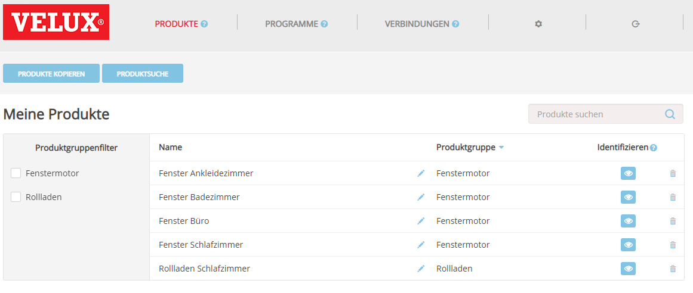
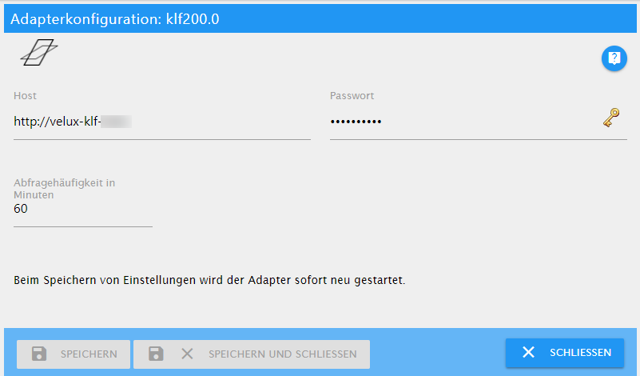

# KLF-200 Adapter Dokumentation

Dieser Adapter dient zur Steuerung einer VELUX® KLF-200-Schnittstelle. Dieser Adapter ist weder ein offizielles VELUX Produktnoch wird er von der Firma unterstützt, die die VELUX-Produkte besitzt.

Der Hauptzweck dieses Adapters ist die Steuerung von elektrischen Dachfenstern und / oder elektrischen Jalousien oder Rollläden.
Die Schnittstelle KLF-200 ist jedoch in der Lage, weitere Geräte wie Lampen, Schalter, Jalousien etc. anzuschließen.
Ich habe den Adapter nicht für die Verwendung mit diesen Geräten entwickelt. So könnte es möglich sein,
dass diese Geräte auch von diesem Adapter gesteuert werden können.

Der Adapter arbeitet mit der internen REST-API der KLF-200-Schnittstelle und Sie müssen weder die Eingänge noch die Ausgänge anschließen, obwohl es immer noch möglich ist, diese parallel zu verwenden.

---

## Bereiten Sie Ihre KLF-200-Schnittstelle vor

Um diesen Adapter verwenden zu können, müssen Sie Ihre KLF-200 Box im **Schnittstellenmodus** einrichten. Es funktioniert nicht, wenn Sie Ihre Box als Repeater verwenden.

> Für eine detaillierte Erklärung der folgenden Aufgaben lesen Sie bitte die mit der Box mitgelieferten Handbücher.
>
> Es wird davon ausgegangen, dass Sie sich in einem Webbrowser erfolgreich bei Ihrer Box angemeldet haben.

### Produkte einrichten

Jedes Produkt, das Sie mit diesem Adapter steuern möchten, muss auf der Seite "Meine Produkte" registriert sein.
Sie können neue Produkte registrieren entweder durch

- Kopieren von einer anderen Fernbedienung
- Suche nach Produkten

Wenn alle Ihre Produkte registriert sind, sollten Sie eine Liste wie die folgende sehen:



### Szenen einrichten

Um eine Szene aufzunehmen, klicken Sie auf die Schaltfläche


Dies öffnet das Fenster *Programmerstellung in Bearbeitung*. Verwenden Sie jetzt die mit Ihrem Produkt gelieferte Fernbedienung, um etwas zu ändern, z.B. öffne das Fenster zu 40%. Geben Sie dann einen Namen für das Programm ein und klicken Sie auf *Programm speichern*.


> TIPP:
> - Benennen Sie Ihr Programm nach Produkt und Öffnungsgrad, zum Beispiel Fenster Badezimmer 40%. Der Adapter verwendet allerdings keine Namenskonventionen.
> - Wenn Ihr Fenster geschlossen ist, beginnen Sie mit einem Öffnungsgrad von 100% und gehen Sie mit jedem weiteren Programm weiter nach unten bis Sie 0% erreichen.
> - Sie haben maximal 32 Programme, die Sie in der Box speichern können.Planen Sie daher Ihre Anzahl an Schritten, da es keinen wirklichen Unterschied zwischen einem zu 30% oder zu 40% geöffnetem Fenster gibt.

Wenn Sie mit der Aufnahme von Programmen fertig sind, erhalten Sie eine Liste wie folgt:


### Verbindungen einrichten

Dieser letzte Schritt ist optional. Wenn Sie die Eingangs- und Ausgangsleitungen nicht verwenden, haben Sie vielleicht bemerkt, dass die kleine LED an der Box ständig blinkt. Um das lästige Blinken loszuwerden, müssen Sie mindestens eine Verbindung einrichten.

Sie müssen es nur in der Box einrichten, Sie müssen nichts verkabeln! Wählen Sie einfach irgendetwas aus.

---

## Konfigurieren Sie den Adapter



### Host

Hostname Ihrer KLF-200-Schnittstelle. Dies ist die gleiche Adresse, die Sie in der Adressleiste Ihres Webbrowsers zum Verbinden mit Ihrer Box eintragen.

### Passwort

Das Passwort, das Sie für die Verbindung mit Ihrer KLF-200-Schnittstelle benötigen. Es ist das gleiche, das Sie bei der Verbindung in Ihrem Webbrowser verwenden.

> Das Standardpasswort des KLF-200 ist `velux123`, aber Sie sollten es trotzdem geändert haben!

### Abfragehäufigkeit in Minuten

<span style="color: #ff0000"><strong><em>Diese Option ist für eine zukünftige Version geplant. Wenn Sie die Konfiguration neu laden möchten, müssen Sie den Adapter neu starten.</em></strong></span>

Die Anzahl der Minuten, nach der der Adapter die Konfiguration erneut von der KLF-200-Schnittstelle lädt.

---

## Benutzung des Adapters

Nachdem der Adapter die Metadaten von der KLF-200-Schnittstelle gelesen hat, finden Sie die folgenden Zustände
im Objektbaum:

Gerät | Kanal | Zustand | Datentyp | Beschreibung
--- | --- | --- | --- | ---
products |  |  |  | Hat für jedes Produkt in der Produktliste des KLF-200 einen Untereintrag.
products |  | productsFound | value | Die Anzahl der Produkte in der Liste. Schreibgeschützt.
products | 0..n | category | text | Produktkategorie. Schreibgeschützt.
products | 0..n | level | level | Aktueller Stand des Produkts Setzen Sie diesen Wert, damit die entsprechende Szene ausgeführt wird. Lesen / Schreiben.
products | 0..n | scenesCount | value | Anzahl der Szenen, in denen das Produkt verwendet wird. Schreibgeschützt.
scenes |  |  |  | Hat für jedes Produkt in der Produktliste des KLF-200 einen Untereintrag.
scenes |  | scenesFound | value | Die Anzahl der Szenen in der Liste. Schreibgeschützt.
scenes | 0..n | productsCount | value | Anzahl der Produkte in dieser Szene. Schreibgeschützt.
scenes | 0..n | run | button.play | Zeigt an, ob die Szene läuft. Setzen Sie diesen Wert, damit die Szene ausgeführt wird. Lesen / Schreiben.
scenes | 0..n | silent | indicator.silent | Gibt an, ob die Szene im leisen Modus ausgeführt wird (sofern dies von den Produkten der Szene unterstützt wird). Schreibgeschützt.

> **WICHTIG:**
>
> Die IDs, die in den Kanälen verwendet werden, sind die IDs, die von der KLF-200-Schnittstelle kommen. Wenn Sie Änderungen an der Produktliste oder an der Programmliste in Ihrem KLF-200 vornehmen, können sich die IDs ändern.

Um eine Szene auszuführen, können Sie den Status `run` der Szene auf `true` setzen oder den Status `level` des Produkts auf einen Wert setzen, der einer Szene entspricht, die das Produkt auf dieses Level setzt.

### Beispiel

Angenommen, Ihr Badezimmerfenster liegt auf Kanal `0`. Sie haben eine Szene auf Kanal `10`, die das Badezimmerfenster zu 40% öffnet.

```javascript
// Variant 1: Open the bathroom window at 40% using the scenes run state:
setState('klf200.0.scenes.10.run', true);
/* 
    The following will happen:
    1. Your window will start to move to 40% opening level.
    2. After your window has stopped, klf200.0.scenes.10.run will be set to 'false' again.
    3. klf200.0.products.0.level will be set to 40%.
*/

// Variant 2: Open the bathroom window at 40% using the products level state:
setState('klf200.0.products.0.level', 40);
/*
    The following will happen:
    1. Your window will start to move to 40% opening level.
    2. klf200.0.scenes.10.run will be set to true.
    3. After your window has stopped, klf200.0.scenes.10.run will be set to 'false' again.
*/

// What happens, if we don't have a scene for that level?
setState('klf200.0.products.0.level', 41);
/*
    The following will happen:
    1. Your window won't move at all!
    2. klf200.0.products.0.level will be reset to the previous value, e.g. 40
*/

```

---

## Bekannte Einschränkungen

Der Adapter steuert das KLF-200 mithilfe der internen REST-API, die von der Webschnittstelle der Box verwendet wird.
Obwohl wir nur eine Teilmenge der API verwenden, gibt es einige Einschränkungen:

- Der Adapter kann den aktuellen Öffnungsgrad eines Fensters nicht lesen. Wenn Sie es mit Ihrer Fernbedienung steuern oder es aufgrund von Regen geschlossen wird, weiß der Adapter nichts davon und es wird immer noch der letzte bekannte Wert angezeigt.
- Die KLF-200-Schnittstelle ist auf maximal 32 Szenen beschränkt.
- Der Adapter weiß nicht, wann eine Aktion beendet wurde. Der Zustand bleibt für mindestens 30 Sekunden `true`.
- Führen Sie Szenen nicht zu schnell hintereinander aus. Der KLF-200 kann dann Fehler melden. (Sie finden die Fehler im Protokoll.)

---

VELUX und das VELUX-Logo sind eingetragene Warenzeichen der VKR Holding A/S.

## Changelog

#### 0.9.5
* (Michael Schroeder) Bug fixes

#### 0.9.4
* (Michael Schroeder) Compatible to Admin 3, add documentation

#### 0.9.0
* (Michael Schroeder) Initial public beta release

#### 0.0.1
* (Michael Schroeder) Initial developer release

## License
The MIT License (MIT)

Copyright (c) 2018 Michael Schroeder <klf200@gmx.de>

Permission is hereby granted, free of charge, to any person obtaining a copy
of this software and associated documentation files (the "Software"), to deal
in the Software without restriction, including without limitation the rights
to use, copy, modify, merge, publish, distribute, sublicense, and/or sell
copies of the Software, and to permit persons to whom the Software is
furnished to do so, subject to the following conditions:

The above copyright notice and this permission notice shall be included in
all copies or substantial portions of the Software.

THE SOFTWARE IS PROVIDED "AS IS", WITHOUT WARRANTY OF ANY KIND, EXPRESS OR
IMPLIED, INCLUDING BUT NOT LIMITED TO THE WARRANTIES OF MERCHANTABILITY,
FITNESS FOR A PARTICULAR PURPOSE AND NONINFRINGEMENT. IN NO EVENT SHALL THE
AUTHORS OR COPYRIGHT HOLDERS BE LIABLE FOR ANY CLAIM, DAMAGES OR OTHER
LIABILITY, WHETHER IN AN ACTION OF CONTRACT, TORT OR OTHERWISE, ARISING FROM,
OUT OF OR IN CONNECTION WITH THE SOFTWARE OR THE USE OR OTHER DEALINGS IN
THE SOFTWARE.

------------------------------------------------------------------------------

VELUX and the VELUX logo are registered trademarks of VKR Holding A/S.