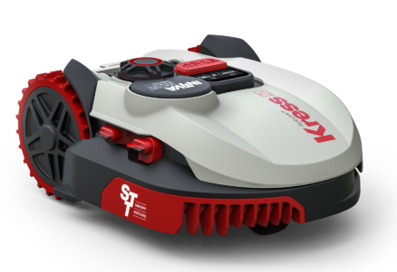

# IoBroker.kress
[Deutsche Beschreibung hier](README_de.md)

Dieser Adapter verbindet den IoBroker mit Ihrem Kress Cloud-Support. Temperaturen, Mähzeiten, Akkuladestand und verschiedene andere Daten werden vom Mäher ausgelesen. Der Adapter kann den Mäher steuern und Sie können die Konfigurationsparameter wie Mähzeiten ändern.

## Installation
Es muss mindestens Knoten 4.X.X installiert sein, Knoten 0.10 und 0.12 werden von diesem Adapter nicht mehr unterstützt.

## Die Einstellungen
- Um eine Verbindung mit dem Mäher herzustellen, geben Sie E-Mail und Passwort von Ihrem worx-Konto in der Konfiguration ein.

## Zweiter Mäher
-Wenn zwei Mäher integriert werden sollen, muss eine zweite Instanz installiert werden, einer wird im Config-Mäher 0 und im zweiten Mäher 1 usw. ausgewählt.

## Beachten
Bild-Quelle: https://www.kress-robotik.com/de/

## Changelog
### 2.5.5 (17.07.2018)
* (MeisterTR) initinal relase

## License
The MIT License (MIT)

Copyright (c) 2017 MeisterTR <meistertr.smarthome@gmail.com>

Permission is hereby granted, free of charge, to any person obtaining a copy
of this software and associated documentation files (the "Software"), to deal
in the Software without restriction, including without limitation the rights
to use, copy, modify, merge, publish, distribute, sublicense, and/or sell
copies of the Software, and to permit persons to whom the Software is
furnished to do so, subject to the following conditions:

The above copyright notice and this permission notice shall be included in
all copies or substantial portions of the Software.

THE SOFTWARE IS PROVIDED "AS IS", WITHOUT WARRANTY OF ANY KIND, EXPRESS OR
IMPLIED, INCLUDING BUT NOT LIMITED TO THE WARRANTIES OF MERCHANTABILITY,
FITNESS FOR A PARTICULAR PURPOSE AND NONINFRINGEMENT. IN NO EVENT SHALL THE
AUTHORS OR COPYRIGHT HOLDERS BE LIABLE FOR ANY CLAIM, DAMAGES OR OTHER
LIABILITY, WHETHER IN AN ACTION OF CONTRACT, TORT OR OTHERWISE, ARISING FROM,
OUT OF OR IN CONNECTION WITH THE SOFTWARE OR THE USE OR OTHER DEALINGS IN
THE SOFTWARE.