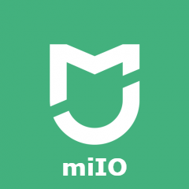
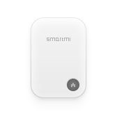
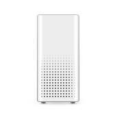
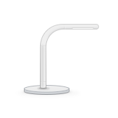
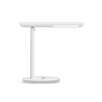

<h1> ioBroker.miio </h1>

## Miio adapter für ioBroker
Dieser Adapter steuert Geräte, die dem miIO-Protokoll folgen.

## Derzeit unterstützter Gerätetyp
| type | icon | model | Getestet |

--- | --- | --- | --- | airfresh |  | zhimi-airfresh-va2 | ❌ | airmonitor |! [] () || | Luftreiniger |  | zhimi.airpurifier.m1 | ❌ | Luftreiniger |  | zhimi.airpurifier.v1 | ❌ | Luftreiniger |  | zhimi.airpurifier.v2 | ❌ | Luftreiniger |  | zhimi .luftreiniger.v3 | ❌ | luftreiniger |  | zhimi.airpurifier.v6 | ❌ | fan |! [] () || ❌ | luftbefeuchter |  | zhimi.humidifier.ca1 | ❌ | Luftbefeuchter |  | zhimi.humidifier.v1 | ❌ | Wasserkocher |  | yunmi.kettle.r1 | light | Licht |  | philips.light.bulb | ✅ | Licht | |  | philips.light.sread1 | ✅ | light |  | yeelink.light.color1 | ✅ | light |  | yeelink.light.lamp1 | ✅ | light | §§ Yeelink.light.mono1 | light | light | §§IIIII_14§ | yeelink.light.mono1 | ✅ | plug |  | chuangmi.plug.m1 | ❌ | plug | §§IIIII_16§ § | chuangmi.plug.v1 | ❌ | plug |  | chuangmi.plug.v2 | ❌ | plug |  | chuangmi.plug.v3 | ✅ | powerstrip | §IIIII_19§§ | qmi.powerstrip.v1 | ❌ | powerstrip |  | zimi.powerstrip.v2 | water | waterpuri | §§IIIII_21§ | yunmi.waterpuri.lx3 | ✅ | waterpuri | §§IIIII_22 §§ | yunmi.waterpuri.v2 | ✅

- Wenn Sie ein Gerät getestet haben, erstellen Sie ein Problem und teilen Sie mir das Ergebnis und das Gerätemodell mit.

## Changelog
### 0.0.6 (2019-04-13)
* Add power load for chuangmi plug

### 0.0.5 (2019-04-04)
* Fix URL mis-match issue

### 0.0.4 (2019-03-31)
* Add yunmi water purifier support. Perfect unit test

### 0.0.3 (2019-03-17)
* Add value mapper function. Add CommandInPara command

### 0.0.2 (2019-03-15)
* Add new device support. Fix some TS lint error

### 0.0.1
* (SchumyHao) initial release

## License
MIT License

Copyright (c) 2019 SchumyHao

Permission is hereby granted, free of charge, to any person obtaining a copy
of this software and associated documentation files (the "Software"), to deal
in the Software without restriction, including without limitation the rights
to use, copy, modify, merge, publish, distribute, sublicense, and/or sell
copies of the Software, and to permit persons to whom the Software is
furnished to do so, subject to the following conditions:

The above copyright notice and this permission notice shall be included in all
copies or substantial portions of the Software.

THE SOFTWARE IS PROVIDED "AS IS", WITHOUT WARRANTY OF ANY KIND, EXPRESS OR
IMPLIED, INCLUDING BUT NOT LIMITED TO THE WARRANTIES OF MERCHANTABILITY,
FITNESS FOR A PARTICULAR PURPOSE AND NONINFRINGEMENT. IN NO EVENT SHALL THE
AUTHORS OR COPYRIGHT HOLDERS BE LIABLE FOR ANY CLAIM, DAMAGES OR OTHER
LIABILITY, WHETHER IN AN ACTION OF CONTRACT, TORT OR OTHERWISE, ARISING FROM,
OUT OF OR IN CONNECTION WITH THE SOFTWARE OR THE USE OR OTHER DEALINGS IN THE
SOFTWARE.