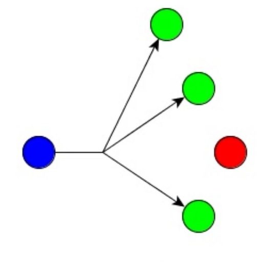

<h1>

 ioBroker.multicast

</ h1>

# Multicast-APi-Adapter für ioBroker
Dieser Adapter bietet eine auf dem Multicast-Kommunikationsprotokoll basierende API zum Senden und Empfangen von Statusinformationen an Geräte mit benutzerdefinierter Firmware.

Zweck dieses Adapters war:

* Alternative zu http post und MQTT-Protokoll
* Bereitstellung einer einheitlichen API basierend auf Multicast-Kommunikation und JSON-formatierter Datenübertragung
* Verwenden Sie einen Zero-Touch-Adapter, um ein beliebiges Ethernet-Gerät (Beispiel: ESP-basiertes Board eq Wemos D1 mini) wie Vansware / Gosound-Smart-Plugs oder andere kundenspezifische Automatisierungslösungen zu integrieren.

### Zero Touch?
Der APi ist so aufgebaut, dass keine zusätzliche Konfiguration des Endbenutzers im Adapter selbst oder auf dem zu verwendenden Gerät erforderlich ist.
Wenn die WLAN-Übertragung verwendet wird, muss nur der WLAN-Berechtigungsnachweis angegeben werden (LAN-basierte Geräte werden vollautomatisch verarbeitet).
Dazu muss der Entwickler der Binärdatei auf dem entsprechenden Chipsatz (wie bei ESP-basierten Chipsätzen) einen Flash durchführen.

Wenn die Firmware allen Regeln des APi folgt (siehe weiter unten), wird die Kommunikation wie folgt behandelt:

* Gerät sendet Statuswerte per UDP-Multicast
* Der Adapter erkennt diese Nachricht und prüft, ob Status für dieses Gerät in ioBroker vorhanden sind

#### Neues Gerät
In der vorherigen Meldung hat der Adapter angegeben, dass kein Gerät gefunden wurde. Die folgende Routine wird ausgeführt:

* ioBroker sendet eine Broadcast-Nachricht, um das Gerät zu initialisieren
* Das Gerät sendet alle Status und die zugehörige Struktur an ioBroker
* ioBroker erstellt das neue Gerät und alle erforderlichen Status
* Wenn alle Status erstellt wurden, sendet ioBroker einen Handshake an das Gerät "Empfangsbereit".
* Das Gerät sendet seine Zustände in Intervallen oder durch Änderungen (wie vom Entwickler des Geräts programmiert).

#### Wiederverbindung vorhandener Geräte
Aus der vorherigen Nachricht, dass das vom Adapter angegebene Gerät bereits vorhanden ist, wird die folgende Routine behandelt:

* ioBroker prüft, ob die Konfiguration auf "Wiederherstellen" eingestellt ist
* Wenn die Wiederherstellung aktiviert ist, sendet ioBroker alle Status (außer Info-Status) an das Gerät
* Wenn alle Zustände empfangen wurden, sendet das Gerät einen Handshake an ioBroker "bereit, Daten zu empfangen".
* ioBroker bestätigt
* Das Gerät sendet seine Zustände in Intervallen oder durch Änderungen (wie vom Entwickler des Geräts programmiert).

#### Statusänderungen
Der Adapter ist so aufgebaut, dass er bis zu fünf Mal wiederholt sendet, um sicherzustellen, dass alle Statusänderungen vom Gerät empfangen werden. Diese Prozedur wird wie folgt gehandhabt:

* Status wird in ioBroker geändert
* Der Adapter erkennt die Wertänderung und sendet den neuen Wert an das Gerät
* Das Gerät muss die Meldung innerhalb von 500ms bestätigen
* Wenn die Meldung nicht bestätigt wird, sendet der Adapter den Wert erneut
* Dies kann bis zu 5 Mal wiederholt werden. Danach zeigt eine Fehlermeldung an, dass die Kommunikation unterbrochen wurde

### APi Struktur und Dokumentation
{zu erledigen / in Bearbeitung}

## Changelog

### 0.1.0

* (Dutchman & Andiling) initial release

## License

MIT License

Copyright (c) 2019 Dutchman & Andiling

Permission is hereby granted, free of charge, to any person obtaining a copy
of this software and associated documentation files (the "Software"), to deal
in the Software without restriction, including without limitation the rights
to use, copy, modify, merge, publish, distribute, sublicense, and/or sell
copies of the Software, and to permit persons to whom the Software is
furnished to do so, subject to the following conditions:

The above copyright notice and this permission notice shall be included in all
copies or substantial portions of the Software.

THE SOFTWARE IS PROVIDED "AS IS", WITHOUT WARRANTY OF ANY KIND, EXPRESS OR
IMPLIED, INCLUDING BUT NOT LIMITED TO THE WARRANTIES OF MERCHANTABILITY,
FITNESS FOR A PARTICULAR PURPOSE AND NONINFRINGEMENT. IN NO EVENT SHALL THE
AUTHORS OR COPYRIGHT HOLDERS BE LIABLE FOR ANY CLAIM, DAMAGES OR OTHER
LIABILITY, WHETHER IN AN ACTION OF CONTRACT, TORT OR OTHERWISE, ARISING FROM,
OUT OF OR IN CONNECTION WITH THE SOFTWARE OR THE USE OR OTHER DEALINGS IN THE
SOFTWARE.