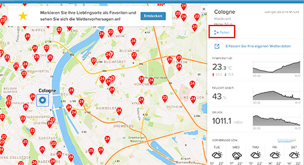

# IoBroker.netatmo-crawler
Netatmo-Crawler-Adapter für ioBroker

=================

Crawlt Informationen von öffentlichen Netatmo-Stationen

Inhaltsverzeichnis

=================

* [Anweisung] (# Anweisung)
* [Allgemeine Informationen] (# Allgemeine Informationen)
* [Luftfeuchtigkeit] (# Luftfeuchtigkeit)
* [Regen regen)
* [Druck] (# Druck)
* [Temperatur] (# Temperatur)
* [Wind] (# Wind)
* [Credits] (# Credits)
* [Changelog] (# changelog)
* [Lizenz] (# Lizenz)

Anweisung

===========

Gehen Sie folgendermaßen vor, um die URL Ihrer bevorzugten Wetterstation zu ermitteln:

1. Öffnen Sie die [Netatmo Weathermap] (https://weathermap.netatmo.com)
2. Suchen Sie Ihre Station und klicken Sie auf das Freigabesymbol

   

3. Klicken Sie auf *Link kopieren*

   

4. Fügen Sie den Link in die Instanzeinstellungen des Adapters ein

   

Allgemeine Information

===================

Der „Netatmo Crawler“ analysiert viele echte lokale Informationen in Ihrer Nähe. Was machen Sie mit all diesen Informationen? Hier einige allgemeine Fakten und Beispiele:

Luftfeuchtigkeit -------- Netatmo verwendet die relative Luftfeuchtigkeit. Dies ist das Verhältnis der aktuellen absoluten Luftfeuchtigkeit zur höchstmöglichen absoluten Luftfeuchtigkeit (abhängig von der aktuellen Lufttemperatur). Ein Wert von 100 Prozent relativer Luftfeuchtigkeit bedeutet, dass die Luft vollständig mit Wasserdampf gesättigt ist und nicht mehr halten kann, wodurch die Möglichkeit von Regen entsteht. Dies bedeutet nicht, dass die relative Luftfeuchtigkeit 100 Prozent betragen muss, damit es regnen kann - es muss 100 Prozent sein, wo sich die Wolken bilden, aber die relative Luftfeuchtigkeit in Bodennähe könnte viel geringer sein.

Regen ---- Verwendet die Einheit Millimeter. Wenn Sie die Einheit Liter pro Meter Würfel wünschen, können Sie diese trotzdem verwenden. Sie können es zum Beispiel zum Gießen im Garten verwenden.

Druck -------- Die Luft um dich herum hat Gewicht und drückt gegen alles, was sie berührt. Dieser Druck wird Atmosphärendruck oder Luftdruck genannt.
Was sollen Sie mit diesem Wert machen? So einfach es klingt: Wettervorhersage! Hoher Druck = gutes Wetter, niedriger Druck = schlechtes Wetter.
Der normale Mittelwert liegt bei 1013 mBar.
Für eine „echte“ Wettervorhersage sollten Sie einige Stunden lang einen Druckverlauf benötigen (ich verwende vier Stunden).
Wenn es fällt, sollte es in Zukunft schlechtes Wetter sein, wenn es steigt, sollte es gutes Wetter sein.
Ich habe einen [Skript zur Vorhersage hier](http://www.beteljuice.co.uk/zambretti/forecast.html) gefunden (er wird als Zambretti-Methode für eine 90% -Prognose bezeichnet).
Andere Einheiten: 1 mbar = 100 Pa = 1 hPa

Temperatur ----------- Hier können Sie das Kühltemperaturniveau berechnen. Für niedrige Temperaturen kann der Windchill (10 °C oder niedriger, mit Wind rechnen) für hohe Temperaturen den Hitzeindex (25 ° C oder höher, mit Luftfeuchtigkeit berechnen) verwenden.
Beispielskript:

```
windchill1 = windchill(temp, windkmh); //Vars to-from IOBroker

function windchill(temperature, windspeed) {
	var windchill = 13.12 + 0.6215 * temperature - 11.37 * Math.pow(windspeed, 0.16) + 0.3965 *
			temperature * Math.pow(windspeed, 0.16);
	return windchill;
}

heatindex1 = heatindex(temp, hum); //Vars to-from IOBroker

function heat(temperature, humidity) {
	var heatindex = -8.784695 + 1.61139411 * temperature + 2.338549 * humidity - 0.14611605 *
			temperature * humidity - 0.012308094 * (temperature * temperature) -
			0.016424828 * (humidity * humidity) + 0.002211732* (temperature *
			temperature) * humidity + 0.00072546 * temperature * (humidity * humidity)
			- 0.000003582 * (temperature * temperature) * (humidity * humidity);
	return heatindex;
}
```

Wind ---- Windgeschwindigkeit ist ein Maß für Luft, die sich von hohem zu niedrigem Druck bewegt, normalerweise aufgrund von Temperaturänderungen.
Die Böenstärke ist der höchste Windwert, gemessen in kurzer Zeit (etwa drei Sekunden).
Sie sollten ein Skript für Ihre Markise oder für die Zambretti-Methode erstellen (siehe oben).

Credits

=======

Vielen Dank an [backfisch](https://github.com/backfisch88) für die erste Idee und Unterstützung!

## Changelog


### 0.3.4
* (Bart19) optimizes error handling
### 0.3.3
* (Bart19) changes some log level
* (Backfisch) adds more documentation
### 0.3.2
* (Bart19) fixes, that rain_yesterday was saved with value rain_today
### 0.3.1
* (Bart19) optimizes error handling
### 0.3.0
* (Bart19) adds timestamps, when last info retrieved from Netatmo and timestamp, when each measure was updated last. In addition, rain_yesterday added
### 0.2.0
* (Bart19) changes admin view. Now you can enter as many station urls as you want. In addition, you can select, how the data should be stored
### 0.1.2
* (Bart19) fix for station4 and introduces allowInit, so adapter will run once on config edits
### 0.1.1
* (Bart19) removes files from archive which are unnecessary
### 0.1.0
* (Bart19) implements automatic tests
### 0.0.8
* (Bart19) updates logo
### 0.0.7
* (Bart19) changes loglevel
### 0.0.6
* (Bart19) updates description
### 0.0.5
* (Bart19) bugfixes
### 0.0.4
* (Bart19) bugfixes
### 0.0.3
* (Bart19) bugfixes
### 0.0.2
* (Bart19) bugfixes
### 0.0.1
* (Bart19) initial release

## License

MIT License

Copyright (c) 2020 Bart19 <webmaster@bart19.de>

Permission is hereby granted, free of charge, to any person obtaining a copy
of this software and associated documentation files (the "Software"), to deal
in the Software without restriction, including without limitation the rights
to use, copy, modify, merge, publish, distribute, sublicense, and/or sell
copies of the Software, and to permit persons to whom the Software is
furnished to do so, subject to the following conditions:

The above copyright notice and this permission notice shall be included in all
copies or substantial portions of the Software.

THE SOFTWARE IS PROVIDED "AS IS", WITHOUT WARRANTY OF ANY KIND, EXPRESS OR
IMPLIED, INCLUDING BUT NOT LIMITED TO THE WARRANTIES OF MERCHANTABILITY,
FITNESS FOR A PARTICULAR PURPOSE AND NONINFRINGEMENT. IN NO EVENT SHALL THE
AUTHORS OR COPYRIGHT HOLDERS BE LIABLE FOR ANY CLAIM, DAMAGES OR OTHER
LIABILITY, WHETHER IN AN ACTION OF CONTRACT, TORT OR OTHERWISE, ARISING FROM,
OUT OF OR IN CONNECTION WITH THE SOFTWARE OR THE USE OR OTHER DEALINGS IN THE
SOFTWARE.