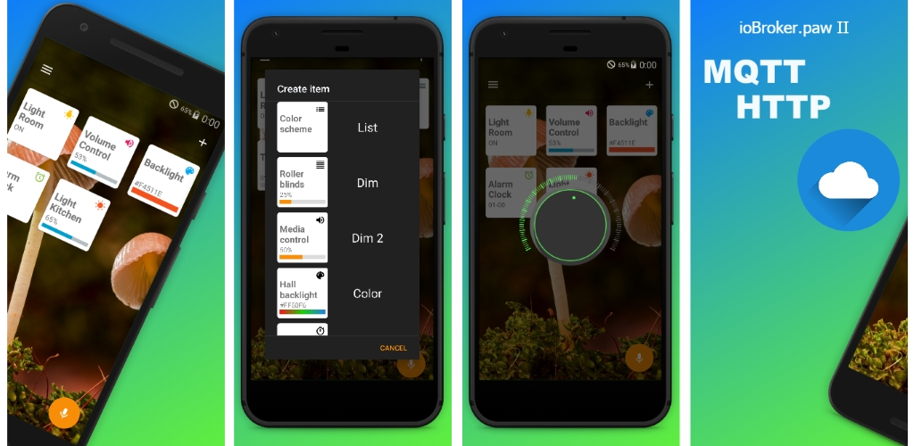
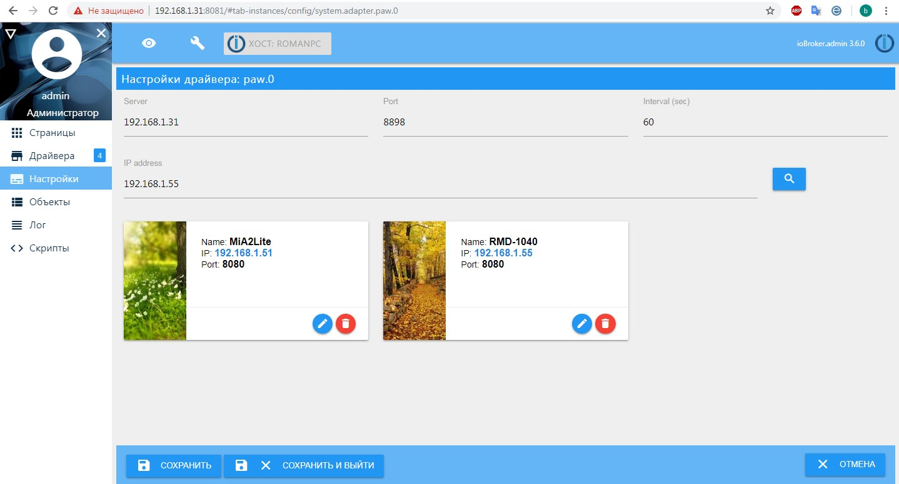
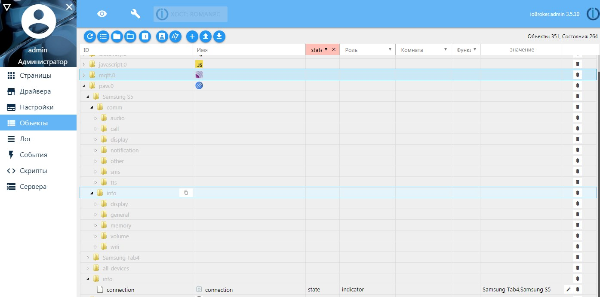

# IoBroker.paw 2 BETA
=================

## Beschreibung
Es ist ein Adapter zur Steuerung von Android-Geräten.
Es kann Texte sprechen, die Lautstärke regeln, Anrufe tätigen, vibrieren und vieles mehr ...
Unterstützung für Tasker- und Locale-Plug-Ins.

## Installieren Sie das Programm und konfigurieren Sie den Adapter.
> !!! Vergessen Sie nicht, den Adapter mit der Anwendung zu aktualisieren. Wenn Sie die alte Version verwenden, können Fehler auftreten.

<a href="https://play.google.com/store/apps/details?id=ru.codedevice.iobrokerpawii" target="_blank"></a>





## Objekt
[name_device] - benennt das Gerät

Für jedes Gerät werden zwei Hauptobjektzweige erstellt:

*** paw.0. [name_device] .info. *** - Informationen zum Gerät *** paw.0. [name_device] .comm. *** - Steuerbefehle

Es gibt auch einen Zweig für alle Geräte: ***paw.0.all_device.*** - Steuerbefehle für alle Geräte

*** paw.0. [name_device] .comm.audio.alarm *** *** paw.0. [name_device] .comm.audio.music *** *** paw.0. [name_device ].comm .audio.notification *** *** paw.0. [name_device ].comm.audio.ring *** *** paw.0. [name_device ].comm.audio.system *** *** paw. 0. [name_device] .comm.audio.voice ***> Stellen Sie die Lautstärke am Gerät ein [Nummer]

*** paw.0. [name_device] .comm.call.number ***> Nummer anrufen [Nummer]

*** paw.0. [name_device] .comm.call.end ***> Anruf ablehnen [boolean]

*** paw.0. [name_device] .comm.display.brightness ***> Helligkeit der Hintergrundbeleuchtung von 4-100 [Anzahl]

*** paw.0. [name_device] .comm.display.mode ***> Hintergrundbeleuchtungstyp automatisch oder manuell [boolean]

*** paw.0. [name_device] .comm.display.toWake ***> Wecker aus dem Ruhezustand [boolean]

*** paw.0. [name_device] .comm.display.timeOff ***> Zeit der Hintergrundbeleuchtung einstellen [Anzahl] (Sek)

*** paw.0. [name_device] .comm.other.home ***> Gehe zum Startbildschirm [boolean]

*** paw.0. [name_device] .comm.other.openURL ***> URL in Browser öffnen [Zeichenfolge]

*** paw.0. [name_device] .comm.other.play ***> Benachrichtigungsmelodie abspielen [boolean]

*** paw.0. [name_device] .comm.other.vibrate ***> Vibration aktivieren, Zeit in Sekunden [Anzahl]

*** paw.0. [name_device] .comm.tts.request ***> Text an Sprache senden [Zeichenfolge]

*** paw.0. [name_device] .comm.tts.stop ***> Rede stoppen [boolean]



## Befehle für Javascript
```javascript


// [dev1] - is the name of the device, you can also enter IP devices.
// You can specify multiple devices separated by commas 'dev1, dev3, 192.168.1.71'
// all - send to all devices.


// send the text to the speech synthesizer.
sendTo("paw.0",'dev1,dev3',{tts:  'Hello World'});

// with callback
sendTo("paw.0",'all',{
    tts:  'Hello World'},function (res){
    log(JSON.stringify(res));
});

// set the screen backlight time in seconds. '0' - do not quit the screen (does not work on all devices)
sendTo("paw.0",'dev1',{timeOff: '60'});

// wake up devices from sleep
sendTo("paw.0",'all',{toWake: true});

// backlight brightness level from 4-100
sendTo("paw.0",'dev1',{brightness: '50'});

// execute shell command (need root)
// "input tap x y" emulates a click on the screen x - coordinates along the mountains. Y - vertical coordinates.
// "poweroff -f" turn off devices
// "reboot" reboot device
sendTo("paw.0",'all',{exec:'input tap 100 100'});

// Exit to home screen. Emulate pressing the HOME button.
sendTo("paw.0",'all',{home:'true'});

// disable battery tracking, translates 0% (need root)
sendTo("paw.0",'dev1',{send:'battery_off'});

// run the application. You can enter a package name 'ru.codedevice.iobrokerpawii' or title name 'ioBroker.PAW II'
sendTo("paw.0",'all',{startApp:'lcf.clock'});

// get the list of installed applications.
sendTo("paw.0",'dev1',{
    apps:  'installed'  // or apps: 'all'  - get all applications
},function (res){
    log(JSON.stringify(res));
});

// !!! Not working yet

// send message.
//sendTo("paw.0",'dev1',{message: '8123456789',text:  'Any text'});
//
//sendTo("paw.0",'192.168.1.71',{
//    message: '8123456789',
//    text:  'Any text'
//},function (res){
//    log(JSON.stringify(response));
//});


// setting the volume from 0 to 15, the maximum volume is set by the system,
sendTo("paw.0",'dev1',{volume: 5});

// call to number
sendTo("paw.0",'192.168.1.71',{call: '0611'});

// play default sound notifications
sendTo("paw.0",'all',{play: true});

// call the number or send ussd command.
sendTo("paw.0",'dev1',{call: '*100#'});

// enables vibration, [number] (time in milliseconds)
sendTo("paw.0",'dev1',{vibrate: '1000'});

// send notifications to devices
sendTo("paw.0",'all',{
    noti:  'Any text',       // text notifications
    title: 'Title',          //optional (default: Title)
    info: 'Any text',        //optional (default: '')
    vibrate:false,           //optional (default: false)  only works on SDK <= 26
    sound:false,             //optional (default: false)  only works on SDK <= 26
    light:true,              //optional (default: false)  only works on SDK <= 26
    id:2,                    //optional (default: id++)
    channel:'Notification_2' //optional (default: 'Notification') Notification profile name, only works on SDK >= 26

},function(res){
     log(JSON.stringify(res));
});

// send alert dialog to devices.
sendTo("paw.0",'all',{
    alert:  'Any text', // text notifications
    id:'alert1',        // id alert, need to respone. respone = {"id":"alert1","state":"Maybe"}
    title: 'Title',     //optional (default: Title)
    positive: 'Yes',    //optional (default: '')
    neutral: 'Maybe',   //optional (default: '')
    negative: 'No' ,    //optional (default: '')
    sound:true          //optional (default: false)
},function(res){
     log(JSON.stringify(res));
});

// open the browser at the specified address
sendTo("paw.0",'dev1',{link: 'http://iobroker.net'});

// end call
sendTo("paw.0",'dev1',{callEnd: 'true'});

// get list Notification Sounds
sendTo("paw.0",'dev1',{listNotificationSounds: 'true'});

// get list Notification Sounds
sendTo("paw.0",'dev1',{
  listNotificationSounds: 'true'
},function(res){
     log(JSON.stringify(res));

// [[{"uri":"content://media/internal/audio/media/14","title":"Beep once"},
// {"uri":"content://media/internal/audio/media/62","title":"Beep once"},
// {"uri":"content://media/internal/audio/media/29","title":"Whistle"}]]
});

// set sounds notification
sendTo("paw.0",'dev1',{sound: 'content://media/internal/audio/media/62'});


/*******  Tasker  *******/

// Attention!!! Enable in settings Tasker "Allow external access"

// Get the task list from the Tasker application "tasks": [auto, bubble, call, clock]
sendTo("paw.0",'dev1',{
    taskerList:  'tasker'
},function (res){
    log(JSON.stringify(res));
});

// Run the task from the Tasker application.
sendTo("paw.0",'dev2',{
    tasker : 'task_name',        // Name task
    myKeyOne : 123,              // (Optional) parameter will be passed to the variable %myKeyOne
    myKeyTwo : "Hello World",    // (Optional) parameter will be passed to the variable %myKeyTwo
                                 // ... and so on
},function (res){
    log(JSON.stringify(res));
});

```

### 0.3.1
* (Bondrogeen) (Adapter) Kleinere Korrekturen. (App) Widget- und erweiterte Elementfunktionalität hinzugefügt

#### 0.3.0
* (foxriver76) Kompatibilität im Kompaktmodus hinzugefügt

#### 0.2.8
* (Bondrogeen) Minore-Fix-Anwendungselement, SDK> = 29 zuordnen und Gerät wurde hinzugefügt.

#### 0.2.7
* (Bondrogeen) Alert-Dialog korrigieren, noti SDK> = 26 App

#### 0.2.6
* (Bondrogeen) kleiner Fixadapter und App

#### 0.2.5
* (Bondrogeen) npm veröffentlichen

#### 0.2.3
* (Bondrogeen) kleinere Fix-App

#### 0.2.2
* (Bondrogeen) kleinerer Fix, fügen Sie Feedback hinzu

#### 0.2.1
* (Bondrogeen) Veröffentlichung App

#### 0.2.0
* (Bondrogeen) erste Veröffentlichung

## License
The MIT License (MIT)

Copyright (c) 2017 bondrogeen <bondrogeen@gmail.com>

Permission is hereby granted, free of charge, to any person obtaining a copy
of this software and associated documentation files (the "Software"), to deal
in the Software without restriction, including without limitation the rights
to use, copy, modify, merge, publish, distribute, sublicense, and/or sell
copies of the Software, and to permit persons to whom the Software is
furnished to do so, subject to the following conditions:

The above copyright notice and this permission notice shall be included in
all copies or substantial portions of the Software.

THE SOFTWARE IS PROVIDED "AS IS", WITHOUT WARRANTY OF ANY KIND, EXPRESS OR
IMPLIED, INCLUDING BUT NOT LIMITED TO THE WARRANTIES OF MERCHANTABILITY,
FITNESS FOR A PARTICULAR PURPOSE AND NONINFRINGEMENT. IN NO EVENT SHALL THE
AUTHORS OR COPYRIGHT HOLDERS BE LIABLE FOR ANY CLAIM, DAMAGES OR OTHER
LIABILITY, WHETHER IN AN ACTION OF CONTRACT, TORT OR OTHERWISE, ARISING FROM,
OUT OF OR IN CONNECTION WITH THE SOFTWARE OR THE USE OR OTHER DEALINGS IN
THE SOFTWARE.