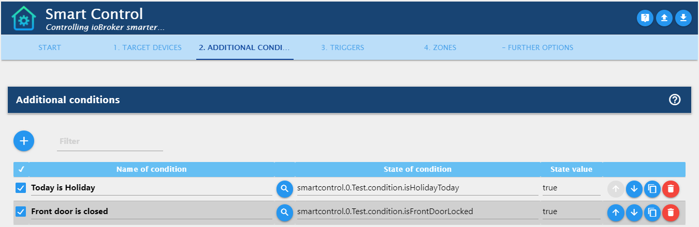
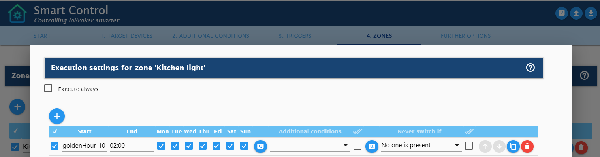

# IoBroker.smartcontrol
## Smart Control Adapter für ioBroker
In unserer [ioBroker](https://github.com/ioBroker/ioBroker) Hausautomation haben wir mehrere Auslöser, z.

 * Bewegungssensor im Korridor löst aus,
 * ein Wandschalter wird gedrückt,
 * Eine bestimmte Zeit tritt ein (z. B. 30 Minuten nach Sonnenuntergang oder Mo-Fr um 7:00 Uhr).

Sobald ein solcher Auslöser ausgelöst wird, möchten wir häufig, dass zusätzliche Bedingungen (nicht) erfüllt sind (z. B. "Heute ist ein Feiertag", "Wohnzimmerfenster ist offen", Helligkeit größer als 100 Lux usw.).

Sobald diese optionalen Überprüfungen bestanden wurden, sollten die Zielzustände (d. H. **Zielgeräte** umgeschaltet werden.

Außerdem sollte nach dem Auslösen eines Bewegungssensors ein Timer laufen, der (sobald keine Bewegung mehr erfolgt) die Zielgeräte nach der eingestellten Anzahl von Sekunden ausschaltet.

All dies kann leicht mit diesem Adapter erreicht werden und noch viel mehr ;-)

Der Zweck dieses Adapters ist es, Ihnen eine sehr **benutzerfreundliche Umgebung** für verschiedene Szenarien bereitzustellen, die Sie benötigen. Während das Obige nur ein einfaches Beispiel für die Verwendung von IFTTT war (* wenn dies, dann das *), können Sie es konfigurieren viele verschiedene Szenarien (in der Adapteroption "Zonen" genannt) für Ihr Zuhause.
Wenn Sie Javascripts / Blockly verwenden, sollten Sie in der Regel mehrere Skripte durch diesen Adapter ersetzen können. Dies gewährleistet außerdem mehr Konsistenz, eine stabile Umgebung und insbesondere eine benutzerfreundlichere Konfiguration.

## Installation
Dieser Adapter befindet sich im "neuesten Repository", aber noch nicht im "stabilen": Wenn Ihr aktives ioBroker-Repository (ioBroker-Administrator -> Klicken Sie oben links auf das Schraubenschlüsselsymbol -> HAUPTEINSTELLUNGEN -> 'Aktives Repository) ...

   * ... spätestens: Einfach regelmäßig installieren
   * ... stabil: [Adapter von eigener URL installieren] (https://github.com/ioBroker/ioBroker.docs/blob/master/docs/en/admin/adapter.md)

Fügen Sie anschließend eine entsprechende Adapterinstanz hinzu.

## Anleitung
Ich habe alle Anweisungen direkt in die Admin-Einstellungen dieses Adapters aufgenommen.

Grund: Wir haben einen schönen Begriff [Medienbruch](https://de.wikipedia.org/wiki/Medienbruch) in deutscher Sprache, der eine unnötige Voraussetzung ist, um das aktuelle Medium zu &quot;brechen&quot; und auf ein anderes Medium (wie eine andere Website, ein anderes Programm usw.) zu wechseln, um es auszuführen / zu vervollständigen eine Aufgabe usw. Da dies umständlich ist, habe ich alle Anweisungen in die Administratoreinstellungen dieses Adapters aufgenommen.

Die meisten dieser Anweisungen können Sie auch hier lesen:

* [** Grundlegende Adapteranweisungen **] (https://github.com/Mic-M/ioBroker.smartcontrol/blob/master/admin/doc-md/start_en.md) - für Deutsch [hier klicken (Deutsch) ] (https://github.com/Mic-M/ioBroker.smartcontrol/blob/master/admin/doc-md/start_de.md)
* [** Zielgeräte **] (https://github.com/Mic-M/ioBroker.smartcontrol/blob/master/admin/doc-md/table-target-devices_en.md) - für Deutsch [hier klicken (Deutsch)] (https://github.com/Mic-M/ioBroker.smartcontrol/blob/master/admin/doc-md/table-target-devices_de.md)
* [** Zusätzliche Bedingungen **] (https://github.com/Mic-M/ioBroker.smartcontrol/blob/master/admin/doc-md/table-conditions_en.md) - für Deutsch [hier klicken (Deutsch )] (https://github.com/Mic-M/ioBroker.smartcontrol/blob/master/admin/doc-md/table-conditions_de.md)
* [** Trigger: Bewegungssensoren **] (https://github.com/Mic-M/ioBroker.smartcontrol/blob/master/admin/doc-md/table-trigger-motion_en.md) - für Deutsch [ Klicken Sie hier (Deutsch)] (https://github.com/Mic-M/ioBroker.smartcontrol/blob/master/admin/doc-md/table-trigger-motion_de.md)
* [** Trigger: Andere Geräte (Wandschalter usw.) **] (https://github.com/Mic-M/ioBroker.smartcontrol/blob/master/admin/doc-md/table-trigger-devices_de .md) - für Deutsch [hier klicken (Deutsch)] (https://github.com/Mic-M/ioBroker.smartcontrol/blob/master/admin/doc-md/table-trigger-devices_de.md)
* [** Trigger: Zeitabhängig **] (https://github.com/Mic-M/ioBroker.smartcontrol/blob/master/admin/doc-md/table-trigger-times_en.md) - für Deutsch [hier klicken (Deutsch)] (https://github.com/Mic-M/ioBroker.smartcontrol/blob/master/admin/doc-md/table-trigger-times_de.md)
* [** Zonen **] (https://github.com/Mic-M/ioBroker.smartcontrol/blob/master/admin/doc-md/table-zones_en.md) - für Deutsch [hier klicken (Deutsch) ] (https://github.com/Mic-M/ioBroker.smartcontrol/blob/master/admin/doc-md/table-zones_de.md)
* [** Ausführungseinstellungen **] (https://github.com/Mic-M/ioBroker.smartcontrol/blob/master/admin/doc-md/table-execution_en.md) - für Deutsch [hier klicken (Deutsch )] (https://github.com/Mic-M/ioBroker.smartcontrol/blob/master/admin/doc-md/table-execution_de.md)

## Screenshots der Adapteroptionen
Bitte beachten Sie, dass diese Screenshots eine Momentaufnahme sind und nicht die neuesten Adapteroptionen widerspiegeln.
Dies dient nur dazu, Ihnen einen Überblick über die Adapteroptionen zu geben.

## Links und Ressourcen
* [** Permanenter Smart Control ioBroker-Forum-Link (Begrüßungsseite) **] (https://forum.iobroker.net/topic/36728/smart-control-adapter-splash-page)

## Anmerkungen
* Dieser Adapter verwendet Sentry-Bibliotheken, um Ausnahmen und Codefehler automatisch an die Entwickler zu melden. ** Weitere Informationen und Informationen zum Deaktivieren der Fehlerberichterstattung finden Sie unter [Sentry-Plugin-Dokumentation] (https://github.com/ioBroker/plugin) -sentry # plugin-sentry)! Sentry Reporting wird ab js-controller 3.0 verwendet.
* Adaptersymbol von [freepik] (https://www.flaticon.com/authors/freepik) von [flaticon.com] (https://www.flaticon.com/). </ Sup> </ sub>

## Changelog

### 0.3.8
* (Mic-M) Updated readme since adapter [is now in latest repository](https://github.com/ioBroker/ioBroker.repositories/pull/930)
* (Mic-M) Updated translations, which also addresses [#26](https://github.com/Mic-M/ioBroker.smartcontrol/issues/26)
* (Mic-M) Fixed/improved 'admin/index_m.js' 

### 0.3.7
* (Mic-M) Mini update, just under the hood.

### 0.3.6
* (Mic-M) Minor translation update and [Compact Mode test](https://forum.iobroker.net/topic/32789/anleitung-f%C3%BCr-adapter-entwickler-compact-mode-testen) successfully completed.

### 0.3.5
* (Mic-M) Internationalization (i18n) only – added all required 10 languages, and provide documentation in English and German plus support for embedded other translations (like Russian, Spanish, etc.) within the admin configuration.

### 0.3.4
* (Mic-M) Test: Implementation of markdown documentation files within adapter configuration by using [zero-md](https://github.com/zerodevx/) for tables 'Target Devices' and 'Additional Conditions' to prepare adapter for multiple languages. Based on your language set in the adapter configuration, either German will be displayed (if language set to German) or English, if set language is not German.

### 0.3.3
* (Mic-M) New feature for Motion sensors: the timer duration and brightness threshold can now be changed via states. These states are available under `smartcontrol.0.options.TriggerMotion.xxx.<duration|briThreshold>` for each of your motion sensors. Please note that any change will cause an adapter restart (for initializing and clearing all existing timers to apply the new values). [Issue #18](https://github.com/Mic-M/ioBroker.smartcontrol/issues/18)

### 0.3.2
* (Mic-M) New feature: In the adapter configuration, tab 'Further Options' > 'Input Validation', you can now select if deactivated configuration table rows should be validated as well.
* (Mic-M) Fix [adapter-check.iobroker.in](https://adapter-check.iobroker.in/) error [E144] "common.installedFrom field found in io-package.json. Must be removed."
* (Mic-M) Fix for adapter unload: check schedule variable for undefined.
* (Mic-M) Fixed debug log line

### 0.3.1
* (Mic-M) Fix error if no duration is set for motion sensor - [Forum Link](https://forum.iobroker.net/post/487630)

### 0.3.0
**Breaking Changes**
* (Mic-M) Entire adapter code refactored. Therefore, tests are required to verify if these massive changes do not affect the adapter functionality. However, none of your existing adapter configuration should be lost and will be kept if you upgrade from 0.2.0+. But please check ALL of your configuration, since new options were added which
can have an effect to your existing configuration.
* (Mic-M) New feature: Implemented [issue #22](https://github.com/Mic-M/ioBroker.smartcontrol/issues/22) - Motion sensors timeout, e.g. for Homematic sensors: Motion sensor timer will now start once a motion sensor is set to false. In previous adapter versions, it was started once set to true.
 <strong>Note:</strong> This change will cause that per your existing adapter configuration, the timer end will be reached later (so: once no motion detected any longer + the seconds you have set)
* (Mic-M) New feature: Time triggers - added options for additional conditions for 'any' or 'all'. [issue #24](https://github.com/Mic-M/ioBroker.smartcontrol/issues/24)
* (Mic-M) New feature: Zones > Execution - added options for additional conditions for 'any' or 'all'. 
* (Mic-M) Many fixes under the hood

### 0.2.2
* (Mic-M) New feature: In '3. TRIGGERS', 'Other Triggers', you can now easily create own states as triggers under 'smartcontrol.x.userstates'

### 0.2.1
* (Mic-M) Fixed motion sensors table, column 'seconds' to allow 0 seconds for deactivation

### 0.2.0
**Breaking Change**
* German: In den Adapter-Optionen wurde der Reiter und die Tabelle "Ausführung" entfernt und stattdessen in "4. ZONEN" integriert.  Das bedeutet für euch: Falls ihr von einer vorherigen Version aktualisiert, sichert zuvor die Adapter-Einstellungen (blauer Knopf mit "Pfeil nach unten" ganz oben rechts in den Adapter-Optionen).
Diese gehen sonst verloren. In einem Texteditor könnt ihr diese einsehen und dann in "4. ZONEN" unter Ausführung übertragen.
* English: Tab "Execution" was removed and transferred to "4. ZONES". If you have installed and used a previous version of this adapter, please save your adapter configuration settings prior to update the adapter (adapter settings: blue button at the top right corner with 'arror down' symbol).

Change Log for 0.2.0:
* (Mic-M) New feature: Admin Options: Removed tab "5. EXECUTION" (German "5. AUSFÜHRUNG") and included in tab "4. ZONES"
* (Mic-M) New feature: Changing name fields (renaming) will also change names in all other tables, in which these names are used. This is a huge usability improvement to quickly re-organize/rename table names without the need to correct in other tables accordingly.
* (Mic-M) Improvement: Add info.connection to allow setting adapter to "yellow" in case of any configuration errors

### 0.1.2-beta.7
* (Mic-M) Improvement: Once user clicks "Save" in admin options, adapter verifies if all required tables are filled, and throws an error via dialog box, which shows details.
* (Mic-M) Fixed error handling for 'overwrite state vals' in target devices table

### 0.1.2-beta.6
* (Mic-M) New feature: Changing name fields in admin options now also sets the names in all other fields to the new value.

### 0.1.2-beta.5
* (Mic-M) New feature: option in Target Devices table to not verify if device is already on/off. Use case is e.g. for button states which do not reflect the actual status of the device in the state (like Broadlink, etc.). Addresses [request #5](https://github.com/Mic-M/ioBroker.smartcontrol/issues/5)

### 0.1.2-beta.4
* (Mic-M) Enhance functionality of validating/correcting config settings  (new feature with 0.1.2-beta.3) to also process overwritten target device values. The issue is described here: [ioBroker forum post](https://forum.iobroker.net/post/472856).
* (Mic-M) Improved validation of all adapter config settings (user input)

### 0.1.2-beta.3
* (Mic-M) New feature: Overwrite target device values in Zones table, addresses [#16](https://github.com/Mic-M/ioBroker.smartcontrol/issues/16) and [#15](https://github.com/Mic-M/ioBroker.smartcontrol/issues/15)
* (Mic-M) Improved dialogs for selection: all selected nodes are expanded when opening, and additional buttons 'collapse all' and 'expand all' - [#17](https://github.com/Mic-M/ioBroker.smartcontrol/issues/17)

### 0.1.2-beta.2
* (Mic-M) Fixed saving of admin options for tab 'Further Options'.

### 0.1.2-beta.1
* (Mic-M) New feature: Additional dialogs in various tables to easily select items (like target devices) by implementing a modal dialog, FancyTree, etc.
* (Mic-M) Improved table filter functionality in adapter configuration

### 0.1.1-beta.6
* (Mic-M) Added [Sentry](https://github.com/ioBroker/plugin-sentry)

### 0.1.1-beta.5
* (Mic-M) New feature: Add filter field to each table in adapter configuration to filter table rows.

### 0.1.1-beta.4
* (Mic-M) Fixed errors of 0.1.1-beta.3. **Note** You may still experience errors in comparison to 0.1.1-beta.2 due to the major and breaking changes of 0.1.1-beta.3. In case of any issues in productive environments: please go back to 0.1.1-beta.2 and report your issue.

### 0.1.1-beta.3
* (Mic-M) **Breaking:** I did some breaking code changes under the hood, to fix various issues. I have tested these changes well, but negative side effects are still likely. No changes to options or states, so no worries here. But please use new version with care and report any issues.
* (Mic-M) Fix: issue https://forum.iobroker.net/post/464466
* (Mic-M) Extensive code changes and several bug fixes within code
* (hombach) corrected typos and wordings in admin/index_m.html
* (hombach) corrected translations in docs/translations.md
* (hombach) extended Travis tests to include ARM CPUs

### 0.1.1-beta.2
* (Mic-M) Fix: Perform configuration validation and correction also for non-active table rows, since these can be switched on thru `smartcontrol.x.options.xxx.xxx.active` states.

### 0.1.1-beta.1
* (Mic-M) New feature: New option in motion sensor table: if activated, motion triggers will not set a timeout if target device was turned on previously without a motion trigger ("manually"). [Forum Link](https://forum.iobroker.net/post/433871)
* (Mic-M) Fix: non-consistent logs for verifying config
* (Mic-M) Change: changed limitTriggerInterval from 2s to 1s - [Issue #3](https://github.com/Mic-M/ioBroker.smartcontrol/issues/3)
* (Mic-M) Fix: 24:00 as time: now treated as 0:00 but adding 24h to timestamp. 
* (Mic-M) Fix: If a trigger state path was used multiple times in different triggers and schedules, second schedule stopped. [Forum Link](https://forum.iobroker.net/post/464208)
* (Mic-M) Improvement: Better info log / extended info log per Option 'Extended Info Log'

### 0.1.0-alpha.11
* (Mic-M) Fix: check for 'is time between'

### 0.1.0-alpha.10
* (Mic-M) New feature: Provide "Toggle?" option in 'Other Triggers' table to allow toggles: if targets are off -> turn on, and vice versa.
* (Mic-M) New feature: Allow using same trigger state multiple times. Required significant code changes.
* (Mic-M) New feature: If you are using multiple motion sensors for a zone: whenever a motion device triggers, the turn off timer is being stopped and a new timer is set per the latest motion sensor.
* (Mic-M) New feature: In certain northern areas is night/nightEnd not available at least in Summer in Germay. New adapter option added to set midnight to 0:00 and midnightEnd to 2:00 in this case.
* (Mic-M) New feature 'Always of after x secs' in Zones table.
* (Mic-M) + a few more features I forgot do mention ;)

### 0.1.0-alpha.9
* (Mic-M) New feature: Triggers (Auslöser) - new option to switch target devices off and not on for 'Other Triggers' and 'Time specific Triggers'

### 0.1.0-alpha.8
* (Mic-M) Editorial only: rename '5. ZEITPLÄNE' (SCHEDULES) into '5. AUSFÜHRUNG' (EXECUTION) throughout the code - https://forum.iobroker.net/post/461282

### 0.1.0-alpha.7
* (Mic-M) Extend option 'triggerStatesAck' to include alias and namespaces not from adapters - https://forum.iobroker.net/post/461221

### 0.1.0-alpha.6
* (Mic-M) Remove requirement that trigger states must be unique - https://forum.iobroker.net/post/461115

### 0.1.0-alpha.5
* (Mic-M) New feature: allow comparison operators >=, <=, >, < for trigger states

### 0.1.0-alpha.4
* (Mic-M) translations

### 0.1.0-alpha.3
* (Mic-M) multiple changes, improvements and enhancements

### 0.1.0-alpha.2
* (Mic-M) multiple changes, improvements and enhancements

### 0.1.0-alpha.1
* (Mic-M) multiple changes, improvements and enhancements

### 0.0.3
* (Mic-M) release for very early testers

## License
MIT License

Copyright (c) 2020 Mic-M <iob.micm@gmail.com>

Permission is hereby granted, free of charge, to any person obtaining a copy
of this software and associated documentation files (the "Software"), to deal
in the Software without restriction, including without limitation the rights
to use, copy, modify, merge, publish, distribute, sublicense, and/or sell
copies of the Software, and to permit persons to whom the Software is
furnished to do so, subject to the following conditions:

The above copyright notice and this permission notice shall be included in all
copies or substantial portions of the Software.

THE SOFTWARE IS PROVIDED "AS IS", WITHOUT WARRANTY OF ANY KIND, EXPRESS OR
IMPLIED, INCLUDING BUT NOT LIMITED TO THE WARRANTIES OF MERCHANTABILITY,
FITNESS FOR A PARTICULAR PURPOSE AND NONINFRINGEMENT. IN NO EVENT SHALL THE
AUTHORS OR COPYRIGHT HOLDERS BE LIABLE FOR ANY CLAIM, DAMAGES OR OTHER
LIABILITY, WHETHER IN AN ACTION OF CONTRACT, TORT OR OTHERWISE, ARISING FROM,
OUT OF OR IN CONNECTION WITH THE SOFTWARE OR THE USE OR OTHER DEALINGS IN THE
SOFTWARE.