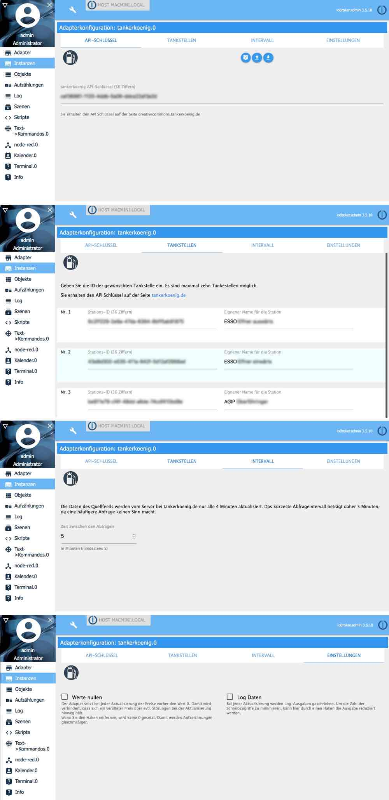
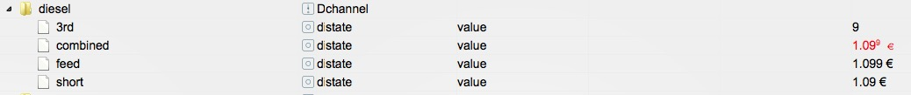

# ioBroker.tankerkoenig

[](https://www.npmjs.com/package/iobroker.tankerkoenig)
[](https://www.npmjs.com/package/iobroker.tankerkoenig)

[](https://nodei.co/npm/iobroker.tankerkoenig/)

**Tests:** Linux/Mac: [](https://travis-ci.org/Pix---/ioBroker.tankerkoenig)
Windows: [](https://ci.appveyor.com/project/Pix---/ioBroker-tankerkoenig/)


## Beschreibung
:de: Dieser Adapter liefert die Spritpreise für 10 festgelegte Tankstellen über den JSON Feed der Internetseite [tankerkoenig.de](https://creativecommons.tankerkoenig.de/#about). Die Daten werden in Objekte gespeichert, um in [ioBroker.vis](https://github.com/ioBroker/ioBroker.vis) verarbeitet zu werden.
Der Adapter verwendet die Seite `prices.php`, welche beim Quellserver von tankerkoenig.de durch die gleichzeitige Abfrage vieler Stationen und die Rückgabe von nur wenigen Daten insgesamt sehr viel weniger Datenverkehr verursacht, als die Abfrage über `list.php` (Umkreissuche) oder `detail.php` (Einzelabfrage einer Tankstelle). Auf die beiden anderen Formen der Abfrage wurde bewusst verzichtet. Somit ist keine Umkreissuche (zB sortiert nach Preis) und keine Lieferung genauerer Daten (Straße, Marke, Hausnummer, etc.) möglich. Die jeweils günstigste Tankstelle für die drei Spritsorten E5, E10 und Diesel werden in einem separaten Kanal gespeichert.

## Einstellungen
### API-Key
Der API Schlüssel ist auf der [Seite von Tankerkönig](https://creativecommons.tankerkoenig.de/#about) erhältlich. Die 36stellige Zeichenkette muss hier eingetragen werden.

### Tankstellen
Es können bis zu 10 Tankstellen abgefragt werden. Dazu ist die Eingabe der Tankstellen ID nötig. Die ID für jede Tankstelle erhält man auf tankerkoenig.de. Sie ist ebenfalls 36stellig.
Zusätzlich kann ein eigener Name für die Station hinterlegt werden. Bei der Eingabe können Zeilen frei gelassen werden (um später ein weitere Tankstelle einzufügen oder nach dem Löschen einer Station).


### Werte nullen
Sollte die Verbindung zum Server nicht funktionieren, verhindert das Löschen der Werte in den Datenpunkte (Reset bzw. nullen), dass veraltete Werte vorgehalten werden. Dieser Reset kann in den Adaptereinstellungen ausgeschaltet werden, um flüssigere History-Daten zu erhalten.

### Log minimieren
Um Schreibzugriffe im Log (z.B. auf empfindliche SD-Karten) zu minimieren, kann ein Haken gesetzt werden.

## Aktivierung
Der Adapter läuft als Daemon (nicht im Schedule Modus) und startet regulär alle fünf Minuten. Die Daten des Quellfeeds werden vom Server bei tankerkoenig.de nur alle 4min aktualisiert, daher macht eine häufigere Abfrage der Daten keinen Sinn und verursacht nur überflüssigen Datenverkehr und kostet Ressourcen. Größere Intervalle sind jederzeit einstellbar.

##  Datenpunkte
Jeder der zehn Kanäle des Feeds produziert für jede der drei Spritsorten E5, E10 und Diesel jeweils drei Datenpunkte:
* `feed` (Preis mit drei Dezimalstellen als Number)
* `short` (Preis mit zwei Dezimalstellen (ungerundet) als String)
* `3rd` (dritte Dezimalstelle des Preises zur Darstellung der Hochzahl in VIS)
* `combined` (fertig HTML formatiert mit Preis und hochgestellter dritter Dezimalstelle oder ggf. Öffnungsstatus ["closed"/"not found"] zur einfachen Darstellung mit VIS HTML Widget)


Ausserdem werden noch drei Datenpunkte gespeichert
* `status` (Station geöffnet?)
* `name` (vom Nutzer vergebener Name der Tankstelle)
* `station_id` (Tankerkönig ID der Tankstelle)

Zusätzlich werden noch den die günstigsten Tankstellen aus der Liste in die Kanäle ermittelt
* `cheapest.E5`
* `chepest.E10`
* `cheapest.diesel`

Innerhalb dieser Kanäle ist die jeweils günstigste Tankstelle für die genannte Spritsorte angelegt. Bieten mehrere Tankstellen einen Treibstoff zum gleichen Preis an, wird die Station ausgegeben, die in den Einstellungen zuerst/ganz oben eingetragen wurde.

Es werden insgesamt 181 Werte geschrieben.

## VIS Nutzung
Der Datenpunkt combined lässt sich in VIS mit diesem Widget darstellen
```
[{"tpl":"tplHtml","data":{"visibility-cond":"==","visibility-val":1,"refreshInterval":"0","gestures-offsetX":0,"gestures-offsetY":0,"signals-cond-0":"==","signals-val-0":true,"signals-icon-0":"/vis/signals/lowbattery.png","signals-icon-size-0":0,"signals-blink-0":false,"signals-horz-0":0,"signals-vert-0":0,"signals-hide-edit-0":false,"signals-cond-1":"==","signals-val-1":true,"signals-icon-1":"/vis/signals/lowbattery.png","signals-icon-size-1":0,"signals-blink-1":false,"signals-horz-1":0,"signals-vert-1":0,"signals-hide-edit-1":false,"signals-cond-2":"==","signals-val-2":true,"signals-icon-2":"/vis/signals/lowbattery.png","signals-icon-size-2":0,"signals-blink-2":false,"signals-horz-2":0,"signals-vert-2":0,"signals-hide-edit-2":false,"html":"<span style=\"font-size: 80%; padding: 0 20px 0 5px;\">Diesel</span>{tankerkoenig.0.stations.0.diesel.combined}"},"style":{"left":"634px","top":"745px","z-index":"20","width":"228px","height":"36px","background-color":"","color":"rgba(225,225,225,1)","font-size":"30px","text-align":"center","background":"rgba(250,0,0,0.1)"},"widgetSet":"basic"}]
```
Der Inhalt des Datenpunktes `combined` wird mit einer CSS-Klasse übergeben. Die Klassen sind `station_open`,`station_closed` und `station_notfound`. Durch die Verwendung von CSS-Definitionen im VIS Editor können so (nicht nur farblich) unterschiedliche Darstellungen für die Zustände "geöffnet" (zB normal), "geschlossen" (zB rote Schrift) und "nicht gefunden" (zB gelbe Schrift) erzielt werden.
```
.station_open {
    color: blue; 
}
.station_closed {
    color: red !important; /* !important kann ggf. weggelassen werden */
}
.station_notfound {
    color: yellow !important; /* !important kann ggf. weggelassen werden */
}

/* € sign */
.station_combined_euro {
    font-family: Times;
    font-size: 80%;
}
```

## Kompakt Modus
Der Adapter ist im Kompaktmodus von ioBroker lauffähig.

## Changelog
### 2.0.10 (2021-02-01)
* (wendy) "has no existing object" issue fixed

### 2.0.9 (2020-04-21)
* (pix) NodeJS 10 or higher required

### 2.0.8 (2020-03-27)
* (Zwer2k) 2.0.8 Catch error if station status reports _no data_

### 2.0.7 (2020-03-25)
* (pix) 2.0.7 Catch error if station status reports _no stations_

### 2.0.6 (2019-04-17)
* (Zwer2k) implementation of utils corrected
* (Zwer2k) fixed error occured when all stations were closed

### 2.0.5 (2019-02-22)
* (jens-maus) fixes to prevent _request()_ floodings

### 2.0.3 (2019-02-21)
* (pix) fixed issue with too short sync interval
* (pix) removed datapoint __price__ which was created for debug only

### 2.0.1 (2019-02-20)
* (pix) fixed scrollbar issue in firefox

### 2.0.0 (2019-02-18)
* (pix) admin3 ready

### 1.3.1 (2019-02-05)
* (arteck, pix) request issues fixed

### 1.3.0 (2019-02-05)
* (pix) Compact mode added

### 1.2.1 (2018-11-25)
* (pix) fixed issue __station_id__ and __status__ mixed up

### 1.2.0 (2018-11-25)
* (pix) new datapoint station ID added

### 1.1.0 (2018-05-12)
* (bluefox) prices as number to allow logging were added

### 1.0.5 (2018-02-07)
* (pix) Log entry opt out

### 1.0.4 (2017-03-21)
* (pix) position of _adapter.stop()_ optimized

### 1.0.3 (2017-01-05)
* (pix) Appveyor testing added

### 1.0.2 (2017-01-04)
* (apollon77) TravisCI testing added

### 1.0.1 (2016-12-20)
* (pix) reset to zero issue fixed

### 1.0.0 (2016-10-08)
* (pix) reset values to zero before each refresh now can be ticked off.

### 0.1.2 (2016-07-05)
* (pix,jens-maus) whitespaces between price and € sign

### 0.1.1 (2016-07-05)
* (pix) € appearance in datapoints __combined__ is customizable through css now (thanx jens-maus)

### 0.1.0 (2016-06-12)
* (pix) first version for npm
* (pix) settings window

### 0.0.8 (2016-06-09)
* (pix) Adapter.stop() fixed

### 0.0.7 (2016-06-09)
* (pix) New channels and values for cheapest station created

### 0.0.6 (2016-06-08)
* (pix) Short prices now string

### 0.0.5 (2016-06-08)
* (pix) Channels added for stations 2 to 10
* (pix) Readme corrected (CSS code example)
* (pix) no more log.warn if station is closed
* (pix) scheduled starting improved

### 0.0.4 (2016-06-01)
* (pix) HTML Code in Datapoint __combined__ corrected

### 0.0.3 (2016-06-01)
* (pix) Datapoint __combined__ with CSS class for status

### 0.0.2 (2016-06-01)
* (pix) Datapoint __combined__

### 0.0.1 (2016-05-31)
* (pix) Adapter created

## License

The MIT License (MIT)

Copyright (c) 2016-2021 pix

Permission is hereby granted, free of charge, to any person obtaining a copy
of this software and associated documentation files (the "Software"), to deal
in the Software without restriction, including without limitation the rights
to use, copy, modify, merge, publish, distribute, sublicense, and/or sell
copies of the Software, and to permit persons to whom the Software is
furnished to do so, subject to the following conditions:

The above copyright notice and this permission notice shall be included in all
copies or substantial portions of the Software.

THE SOFTWARE IS PROVIDED "AS IS", WITHOUT WARRANTY OF ANY KIND, EXPRESS OR
IMPLIED, INCLUDING BUT NOT LIMITED TO THE WARRANTIES OF MERCHANTABILITY,
FITNESS FOR A PARTICULAR PURPOSE AND NONINFRINGEMENT. IN NO EVENT SHALL THE
AUTHORS OR COPYRIGHT HOLDERS BE LIABLE FOR ANY CLAIM, DAMAGES OR OTHER
LIABILITY, WHETHER IN AN ACTION OF CONTRACT, TORT OR OTHERWISE, ARISING FROM,
OUT OF OR IN CONNECTION WITH THE SOFTWARE OR THE USE OR OTHER DEALINGS IN THE
SOFTWARE.