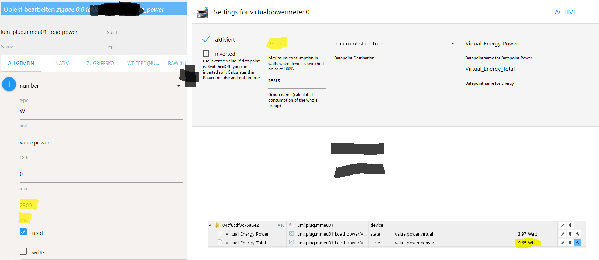

<h1>ioBroker.virtualpowermeter</h1>

## Virtualpowermeter-Adapter für ioBroker
Erstehen Virtuelle Strommesser

Im Smarthome hat man viele Geräte die man zwar schalten kann, diese aber auch nicht gehört Powermeter haben (meist Lichter).

Mit diesem Adapter ist das Ziel zu jedem festgelegten Datenpunkt (über Custom -> MaxWatt (z.B. 60W)) zwei zusätzliche Datenpunkte zu sein -> Energy_Power (z.B. 60 W) und Energy_Total (z.B. 2501,23 Wh).
Diese werden unter virtuellesPowerermeter.0.xxx abgesetzt

Mit diesen neuen Datenfaktoren kann dann eine einfachee Visualisierungung werden.

Die neuen Datenpunkte (besonders die Gruppen) finden super mit valueetrackerovertime weiterverhält werden

## Instanzeinstellungen

hier kan der Standardname für das Power und Energy_Total Einkommen werden.

Die Einstellung Standardeinstellung: Datenpunkt Ziel bestimmt die Standardeinstellung beim Erstellen eines neuen Benutzerdefinierten Einstellungen. Bei "im Landesordner" wird bei neuen Custom-Settings die Standardnamen für Power und Energie genutz. Bei "in group" wird als Standardname die ObjectID des Custom-DP (. Durch _vertr) als Unterverzeichnis + der Standardname für Power und Energie genutz. "irgendwo anders" gehört auch den Standardnamen für Power und Engery muss aber für jeden Custom-DP manuell werden.

## Benutzerdefinierte Einstellungen
Die aktivierung eines Custom-Settings beeinflussen 2 Datenpunkte. Leistung -&gt; Watt, Energie (_Total) -&gt; Wh Der Speicherort sich aus dem Datenpunkt Ziel + Datenpunktname zusammen.

Wichtig: Wenn Destination "in der Gruppe" wenn wenn mehere DP im gleichen Verzeichnis "im aktuellen Statusbaum" benötigt jeden Datenpunkt seiner persönlichen Namen. Wenn das Standardziel "in Gruppe" der Datenpunktname wird, wird die ID des Status geändert. Hier kann aber Auch z.B. Wohnzimmer_Licht.Power und Wohnzimmer_Licht.Energy werden werden.

## Benutzerdefinierte Einstellungen für Geräte die nur Power Angabe (Watt) und man die Wh versucht will
Es gibt Geräte die nur eine Watt ausgabe haben und man aber wissen wird wieviel Strom wirducht wurde. Hierfür kann auch der VirtualPowermeter verwendet werden. Dafür muss nur der Max-Wert vom Datenpunkt und der Max-Power vom VirtualPowermeter gleich sein. Beispiel:

Beispiel mit valueetrackerovertime:

## Changelog
### 1.3.2 (2021-01-27)
* (Omega236) group total is now its own counter
* (Omega236) improved precision
### 1.3.1 (2021-01-25)
* (Omega236) reduce initializations and optimize group handling
### 1.3.0 (2021-01-15)
* (scrounger) default ids for power and energie configurable through adapter settings
* (scrounger) custom: autocomplete for group input added
* (scrounger) option added -> group energy values can only increase 
* (Omega236) Check duplicate Destination DP
* (Omega236n) allows to Set Destination of DP
### 1.2.2 (2020-12-26
* (Omega236) Group Calculations only after InitialFinished
### 1.2.1 (2020-04-15)
* (Omega236) translation
### 1.2.0 (2020-04-15)
* (Omega236) js-controller 3.x support
### 1.1.1 (2020-04-07)
* (Omega236) bugfix translation
### 1.1.0 (2020-04-05)
* (Omega236) inverted added
### 1.0.1
* (Omega236) SecurityUpdates
### 1.0.0
* (Omega236) Final Release
### 0.2.8
* (Omega236) Bug found on travis unsubscribeStatesAsync
### 0.2.6
* (Omega236) texts adapted
### 0.2.5
* (Omega236) awaits missing
### 0.2.4
* (Omega236) var remove and SettingPage Info and dic in class and .bind(this) (Template 1.10)
### 0.2.3
* (Omega236) CodeOptimierung nach eslint
### 0.2.1
* (Omega236) CodeOptimierung und bild
### 0.2.0
* (Omega236) Alle Funktionen implementiert, code noch nicht überprüft/optimiert/getestet
### 0.1.0
* (Omega236) Erste Version mit Grundfunktionalität
### 0.0.1
* (Omega236) initial release

## License
MIT License

Copyright (c) 2021 Omega236 general.of.omega@googlemail.com

Permission is hereby granted, free of charge, to any person obtaining a copy
of this software and associated documentation files (the "Software"), to deal
in the Software without restriction, including without limitation the rights
to use, copy, modify, merge, publish, distribute, sublicense, and/or sell
copies of the Software, and to permit persons to whom the Software is
furnished to do so, subject to the following conditions:

The above copyright notice and this permission notice shall be included in all
copies or substantial portions of the Software.

THE SOFTWARE IS PROVIDED "AS IS", WITHOUT WARRANTY OF ANY KIND, EXPRESS OR
IMPLIED, INCLUDING BUT NOT LIMITED TO THE WARRANTIES OF MERCHANTABILITY,
FITNESS FOR A PARTICULAR PURPOSE AND NONINFRINGEMENT. IN NO EVENT SHALL THE
AUTHORS OR COPYRIGHT HOLDERS BE LIABLE FOR ANY CLAIM, DAMAGES OR OTHER
LIABILITY, WHETHER IN AN ACTION OF CONTRACT, TORT OR OTHERWISE, ARISING FROM,
OUT OF OR IN CONNECTION WITH THE SOFTWARE OR THE USE OR OTHER DEALINGS IN THE
SOFTWARE.