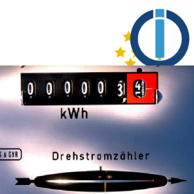
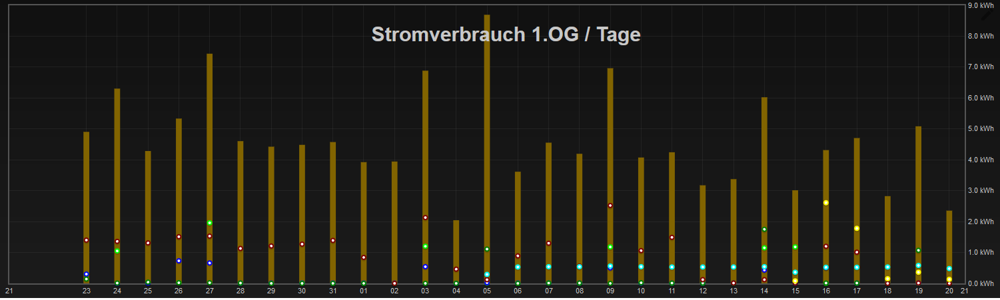

<h1>ioBroker.virtualpowermeter</h1>

## Virtualpowermeter-Adapter für ioBroker
Erstehende Virtuelle Strommesser

Im Smarthome hat man viele Geräte die man zwar schalten kann, diese aber auch nicht gehört Powermeter haben (meist Lichter).

Mit diesem Adapter ist das Ziel zu jedem festgelegten Datenpunkt (über Custom -> MaxWatt (z.B. 60W)) zwei zusätzliche Datenpunkte zu sein -> Energy_Power (z.B. 60 W) und Energy_Total (z.B. 2501,23 Wh).
Diese werden unter virtuellesPowerermeter.0.xxx abgesetzt

Mit diesen neuen Datenfaktoren kann dann eine einfachee Visualisierungung werden.

Die neuen Datenpunkte (besonders die Gruppen) finden super mit valueetrackerovertime weiterverhält werden

Die neuen Datenpunkte für Macht und Gesamt werden normal im gleichen Verzeichnis wie die überwachten Staaten abgesetzt. Bedenken der Pfad einen &quot;.&quot; Dies wird das Verzeichnis als Absolut betrachtet und unter dieser ID abgelegt. Hier ist es wichtig die Datenpunkte in dem eigenen virtualpowermeter.0 abgenommen. 

Beispiel mit valueetrackerovertime:

## Changelog
### 1.2.2 (2020-12-26
* (Lutz Sebastian) Group Calculations only after InitialFinished
### 1.2.1 (2020-04-15)
* (Lutz Sebastian) translation
### 1.2.0 (2020-04-15)
* (Lutz Sebastian) js-controller 3.x support
### 1.1.1 (2020-04-07)
* (Lutz Sebastian) bugfix translation
### 1.1.0 (2020-04-05)
* (Lutz Sebastian) inverted added
### 1.0.1
* (Lutz Sebastian) SecurityUpdates
### 1.0.0
* (Lutz Sebastian) Final Release
### 0.2.8
* (Lutz Sebastian) Bug found on travis unsubscribeStatesAsync
### 0.2.6
* (Lutz Sebastian) texts adapted
### 0.2.5
* (Lutz Sebastian) awaits missing
### 0.2.4
* (Lutz Sebastian) var remove and SettingPage Info and dic in class and .bind(this) (Template 1.10)
### 0.2.3
* (Lutz Sebastian) CodeOptimierung nach eslint
### 0.2.1
* (Lutz Sebastian) CodeOptimierung und bild
### 0.2.0
* (Lutz Sebastian) Alle Funktionen implementiert, code noch nicht überprüft/optimiert/getestet
### 0.1.0
* (Lutz Sebastian) Erste Version mit Grundfunktionalität
### 0.0.1
* (Lutz Sebastian) initial release

## License
MIT License

Copyright (c) 2021 Lutz Sebastian general.of.omega@googlemail.com

Permission is hereby granted, free of charge, to any person obtaining a copy
of this software and associated documentation files (the "Software"), to deal
in the Software without restriction, including without limitation the rights
to use, copy, modify, merge, publish, distribute, sublicense, and/or sell
copies of the Software, and to permit persons to whom the Software is
furnished to do so, subject to the following conditions:

The above copyright notice and this permission notice shall be included in all
copies or substantial portions of the Software.

THE SOFTWARE IS PROVIDED "AS IS", WITHOUT WARRANTY OF ANY KIND, EXPRESS OR
IMPLIED, INCLUDING BUT NOT LIMITED TO THE WARRANTIES OF MERCHANTABILITY,
FITNESS FOR A PARTICULAR PURPOSE AND NONINFRINGEMENT. IN NO EVENT SHALL THE
AUTHORS OR COPYRIGHT HOLDERS BE LIABLE FOR ANY CLAIM, DAMAGES OR OTHER
LIABILITY, WHETHER IN AN ACTION OF CONTRACT, TORT OR OTHERWISE, ARISING FROM,
OUT OF OR IN CONNECTION WITH THE SOFTWARE OR THE USE OR OTHER DEALINGS IN THE
SOFTWARE.