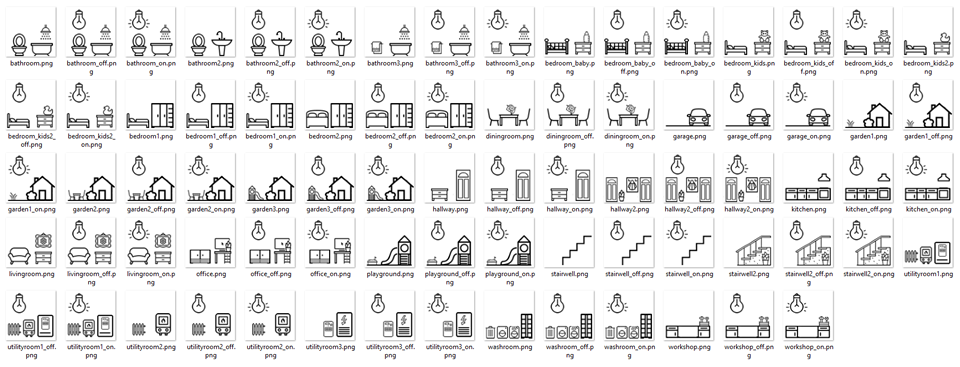

# IoBroker.vis-icontwo
## Icon Adapter für den ioBroker.vis Adapter
Ein Reiner Icon Adapter für die Visualisierung.

Alle Icons sind über den Dateimanager (auf der obersten Ebene) im vis-icontwo Ordner zu finden

---

## Vorschau
Eine kleine Vorschau über den Stil der Ikonen:

ZUM BEISPIEL. Teilauswahl:

ZUM BEISPIEL. Teilauswahl:

ZUM BEISPIEL. Teilauswahl:

Eine vollständige Übersicht aller Ikonen ist hier zu finden (die Ordnerstruktur ist die selbe, wie im Dateimanager):

-> http://icontwo.inventwo.com <-

---

## Besetzung
Falls Dir unsere Arbeit betrifft und du uns nicht möchtest, wir freuen uns über jede Spende.

(Dieser Link gehört zu unserem PayPal-Konto und steht in keiner Verbindung zum ioBroker)

[![Spende] (admin / spende.png)](https://www.paypal.com/cgi-bin/webscr?cmd=_s-xclick&hosted_button_id=GQPD3G25CKTEJ&source=url)

---

## Changelog

### 0.19.1

• (skvarel) - Index & Readme angepasst (Icon Overview)

### 0.19.0

• (skvarel) - Neue Icons hinzugefügt (Lights & Alarm)

### 0.18.0

• (skvarel) - Neue Icons hinzugefügt (Rooms)

### 0.17.1

• (skvarel) - Code angepasst

### 0.17.0

• (skvarel) - Neue Icons hinzugefügt (Network)

### 0.16.1

• (skvarel) - Code angepasst

### 0.16.0

• (skvarel) - Neue Hintergründe hinzugefügt (Backgrounds)

### 0.15.0

• (skvarel) - Neue Hintergründe hinzugefügt (Backgrounds)

### 0.14.0

• (skvarel) - Neue Symbole hinzugefügt (Schedules)

### 0.13.0

• (skvarel) - Neue Symbole hinzugefügt (Lights)

### 0.12.0

• (skvarel) - Neue Symbole hinzugefügt (Lights)

### 0.11.0

• (skvarel) - Neue Symbole hinzugefügt (Phones_Tablets)

### 0.10.0

• (skvarel) - Neue Symbole hinzugefügt (Cooling)

### 0.9.0

• (skvarel) - Neue Symbole hinzugefügt (Devices)

### 0.8.0

• (skvarel) - Neue Symbole hinzugefügt (Cooling & Weather)

### 0.7.0

• (skvarel) - Neue Symbole hinzugefügt (Cooling)

### 0.6.0

• (skvarel) - Neue Symbole hinzugefügt (Devices)

### 0.5.0

• (skvarel) - Neue Symbole hinzugefügt (Brands)

### 0.4.0

• (skvarel) - Neue Symbole hinzugefügt (Cooling)

### 0.3.0

• (skvarel) - Neue Symbole hinzugefügt (Cooling)

### 0.2.0

• (skvarel) - Neue Symbole hinzugefügt (Brands)

### 0.1.11

• (skvarel) - Bug-Fix

### 0.1.10

• (skvarel) - Neue Symbole hinzugefügt (Brands)

### 0.1.9

• (skvarel) - Neue Symbole hinzugefügt (Weather)

### 0.1.8

• (skvarel) - Bug-Fix

### 0.1.7

• (skvarel) - Code angepasst

### 0.1.6

• (skvarel) - Neue Symbole hinzugefügt (Nav and Lights)

### 0.1.5

• (skvarel) - Neue Symbole hinzugefügt (Garage)

### 0.1.4

• (skvarel) - Neue Symbole hinzugefügt (Lampen)

### 0.1.3

• (skvarel) - Neue Symbole hinzugefügt

### 0.1.2

• (skvarel) - Code angepasst

### 0.1.1

• (skvarel) - Bug-Fix

### 0.1.0

• (skvarel) - Erstveröffentlichung

### 0.0.1
• (skvarel) - Die Idee ist geboren

## License

Urheberrechte (c) 2020 [jkvarel](https://github.com/jkvarel) und [skvarel](https://github.com/skvarel) von [inventwo](https://github.com/inventwo)

MIT License (nur in englisch / englisch only)

Permission is hereby granted, free of charge, to any person obtaining a copy
of this software and associated documentation files (the "Software"), to deal
in the Software without restriction, including without limitation the rights
to use, copy, modify, merge, publish, distribute, sublicense, and/or sell
copies of the Software, and to permit persons to whom the Software is
furnished to do so, subject to the following conditions:

The above copyright notice and this permission notice shall be included in all
copies or substantial portions of the Software.

THE SOFTWARE IS PROVIDED "AS IS", WITHOUT WARRANTY OF ANY KIND, EXPRESS OR
IMPLIED, INCLUDING BUT NOT LIMITED TO THE WARRANTIES OF MERCHANTABILITY,
FITNESS FOR A PARTICULAR PURPOSE AND NONINFRINGEMENT. IN NO EVENT SHALL THE
AUTHORS OR COPYRIGHT HOLDERS BE LIABLE FOR ANY CLAIM, DAMAGES OR OTHER
LIABILITY, WHETHER IN AN ACTION OF CONTRACT, TORT OR OTHERWISE, ARISING FROM,
OUT OF OR IN CONNECTION WITH THE SOFTWARE OR THE USE OR OTHER DEALINGS IN THE
SOFTWARE.

---

Icons from Icons8 https://icons8.com/