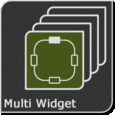
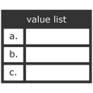

# IoBroker.vis-inventwo
## Schalter Widgets für den ioBroker.vis Adapter
###### .. ab v 2.0.0
<table><tr><td>
<b>Universal</b> </td><td>
 <b>Multi</b> </td><td>
 <b>Bild</b> </td><td>
 <b>Tabelle</b>  </td></tr><tr><td colspan=4></td></tr><tr><td>
<b>Liste</b> </td><td>
 <b>Festzelt</b> </td><td>
 <b>Radio knopf</b> </td><td>
 <b>Schieberegler vertikal</b>  </td></tr><tr><td colspan=4></td></tr><tr><td>
 <b>Schieberegler horizontal</b> </td><td>
 <b>Colorslider horizontal</b> </td><td>
 <b>Colorslider horizontal</b> </td><td>
 <b>Kippschalter</b> </td></tr></table>

###### .. v 1.3.8

Mit Hilfe unserer Widgets lassen sich seine Projekte projizieren. Zur Zeit gehört sich in unserem Adapter NUR die reinen Schaltflächen (siehe oben) und die Icons. Uhr und Wetter gehören aus anderen Adaptern und müssen ggf. geworden werden werden.

---

## Besetzung
Falls Dir unsere Arbeit betrifft und du uns nicht möchtest, wir freuen uns über jede Spende.

(Dieser Link gehört zu unserem PayPal-Konto und steht in keiner Verbindung zum ioBroker)

[![Spende] (http://resources.inventwo.com/github/inventwo/spende.png)](https://www.paypal.com/cgi-bin/webscr?cmd=_s-xclick&hosted_button_id=GQPD3G25CKTEJ&source=url)

---

## 2.7.2
- Fehler im Radiobutton mit Bildfarbe gerechnet
- Fehlerhafte: Doppeltes klicken bei State mit Verweildauer
- Hovereffekt für Buttons eingezogen
- Problem mit der Anzeige des Sliderwerts
- Slider Text anmachen möglich

## 2.7.1
- Bug-Fix

## 2.7.0
- Neues Widget: Farbslider
- JSON Tabelle Spaltenformat boolean und number
- JSON Tabelle Kopfzeile kann fixiert werden
- JSON Tabelle Fehler beim sortieren gehört
- JSON Tabelle konfigurierbare Dummyzeile wenn JSON leer ist
- Fehler gehört

## 2.6.0
- Universal- & Multi-Widget Vergleichsoperatoren gleich, gehören, kleiner und nicht hinzugefügt
- Schieberegler Min / Max invertieren
- Slider Wert erst beim loslassen setzen
- Widget um Wert zu erhöhen oder zu erhöhen
- JSON Tabelle Fehler mit Datum gehört

. JSON Tabelle anzeige von Millisekunden möglich

- JSON Tabelle Platzhalter wenn gefragt leer ist
- JSON Tabelle Spalten können per Klick sortiert werden

## 2.5.11
- Bug-Fix

## 2.5.10
- Bug-Fix

## 2.5.9
- Der Prozess der Bildfarbfilterung wurde behandelt
- Die Bildfarbe kann jetzt ein Datenpunkt sein

## 2.5.8
- Bug-Fix

## 2.5.7
- Bug-Fix

## 2.5.6
- Bug-Fix

## 2.5.5
- Bug-Fix

## 2.5.4
- Bugfix (Status: doppeltes senden dese Wertes bei touch)

## 2.5.3
- Grauer Kippschalter hinzugefügt

## 2.5.2
- Bug-Fix

## 2.5.1
- Bug-Fix

## 2.5.0
- Kippschalter hinzugefügt
- Bug-Fix

## 2.4.3
- Bug-Fix

## 2.4.2
- Bug-Fix

## 2.4.1
- Bug-Fix

## 2.4.0
- Randstil zur JSON-Tabelle hinzugefügt
- Farbauswahö für Icons zu allen Widgets hinzugefügt
- Fehlerbehebung

## 2.3.2
- Fehler bei der Navigation mit dem Widget 'In Widget anzeigen' versucht

## 2.3.1
- Fehler in der JSON Tabelle Spalten

## 2.3.0
- Problem behoben, bei DM Schaltflächen Zweimal Werte senden
- Datum / Uhrzeit und Bildformat für Tabellenzellen hinzugefügt
- Universal- und Multi-Widget-Attribut werden beim Ändern auf Widgetschauen

## 2.2.3
- Fehler in der JSON Tabelle Spalten

## 2.2.2
- Fehler im Multi Widget gehört: Bilder und Text ändern nicht bei Typ Navigation

## 2.2.1
- Fehler in der JSON-Tabelle gehört, wenn kein gehörtiges JSON-Objekt vorhanden ist
- Fehler in der Werteliste Werden: Wert wird nicht aktualisiert

## 2.2.0
- Datenpunktwerte werden jetzt bei allen Widgets im Editor werden
- Neues Widget: Laufschrift
- Universal und Multi State Verweildauer hinzugefügt
- List Widget Abstand zwischen den Einträgen kann gehörtell werden

## 2.1.0
- Datenpunktwerte werden im VIS Editor erhöht!

## 2.0.1
- Übersetzungsfehler gehört
- Border Farbe wird anders
- Widget-Untertitel gehört

## 2.0.0
- Switch, Button, Nav und Background Widget (sowie die kleinen Ausführungen) zu einem eigenen Widget zussammen Verluste -> dem Universal Widget
- Multi Widget -> wie das Universal, nur dass hier auf mehrere Datenpunkte und Werte werden können können.
- Image Widget kann nun auf Datenpunkt kaufen
- Radiobuttons hinzugefügt
- Werteliste hinzugefügt

## 1.3.8
- Der Schieberegler wurde auf dezimal geändert
- Problem mit numerischen Werten behoben

### 1.3.7
- Problem mit der Navigation auf Touchscreens behoben

### 1.3.6
- Option zum Festlegen des Status für die Navigation hinzugefügt
- Problem mit Datenpunkten ohne Konfiguration behoben

### 1.3.5
- Aktualisierungsrate für Tabelle hinzugefügt

### 1.3.4
- Symbole und Hintergründe entfernt, Konfiguration geändert, Navigation korrigiert

### 1.3.3
- Die Option für den Hintergrund-Widget-Wert wurde korrigiert

### 1.3.2
- Bug-Fix

### 1.3.1
- Das Farbverhalten der Navigationsschaltfläche wurde geändert
- Neue Symbole hinzugefügt

### 1.3.0
- JSON-Tabelle hinzugefügt
- Verzögerung für die Navigation hinzugefügt
- Text in Schaltflächen kann jetzt HTML sein
- Neue Symbole hinzugefügt

### 1.2.3
- Aktive Navigationsfarbe hinzugefügt
- Feste Zustandsfarbe für Wertschalter

## 1.2.2
- Fehlerbehebung: Schiebereglerwert, Konfiguration

## 1.2.1
- Fixed Slider Widget: Separatet in zwei Widgets (horizontal und vertikal)

### 1.2.0
- Bild-Widget hinzugefügt
- Schieberegler hinzugefügt, um den Rahmenradius für alle 4 Ecken zu ändern (Wenn diese Version ein Update für Sie ist, müssen Sie auf jede Schaltfläche im Vis-Editor klicken, um die Standardecken wiederherzustellen.)
- Neue Symbole hinzugefügt

### 1.1.1
- Bug-Fix

### 1.1.0
- Slider-Widget hinzugefügt
- Option zum Spiegeln des Bildes hinzugefügt
- Neue Symbole hinzugefügt
- Die Schaltflächen-Widgets wurden geändert, um die Standardoptionen für Schriftart und Text zu verwenden

### 1.0.0
- Widget-Hintergrund und Inhaltsopazität, Wechsel kann von boolesch auf Wert geändert werden, Symbole von weiß auf schwarz geändert, nahtlose Hintergründe hinzugefügt

### 0.1.2
- Fehlerbehebung

...

### 0.1.1
- Fehlerbehebung

...

### 0.1.0 (Erstveröffentlichungung)
- Erfinde zwei Design-Widgets

...

### 0.0.1
- Die Idee ist geboren

---

## Changelog

## License

Urheberrechte (c) 2020 [jkvarel](https://github.com/jkvarel) und [skvarel](https://github.com/skvarel) von [inventwo](https://github.com/inventwo)

MIT License (nur in englisch / englisch only)

Permission is hereby granted, free of charge, to any person obtaining a copy
of this software and associated documentation files (the "Software"), to deal
in the Software without restriction, including without limitation the rights
to use, copy, modify, merge, publish, distribute, sublicense, and/or sell
copies of the Software, and to permit persons to whom the Software is
furnished to do so, subject to the following conditions:

The above copyright notice and this permission notice shall be included in all
copies or substantial portions of the Software.

THE SOFTWARE IS PROVIDED "AS IS", WITHOUT WARRANTY OF ANY KIND, EXPRESS OR
IMPLIED, INCLUDING BUT NOT LIMITED TO THE WARRANTIES OF MERCHANTABILITY,
FITNESS FOR A PARTICULAR PURPOSE AND NONINFRINGEMENT. IN NO EVENT SHALL THE
AUTHORS OR COPYRIGHT HOLDERS BE LIABLE FOR ANY CLAIM, DAMAGES OR OTHER
LIABILITY, WHETHER IN AN ACTION OF CONTRACT, TORT OR OTHERWISE, ARISING FROM,
OUT OF OR IN CONNECTION WITH THE SOFTWARE OR THE USE OR OTHER DEALINGS IN THE
SOFTWARE.

---

Icons from Icons8 https://icons8.com/