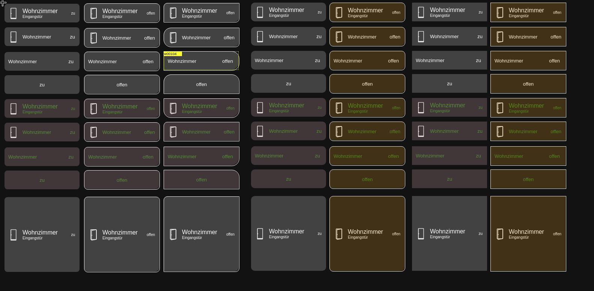

# IoBroker.vis-material-advanced
## Vis-material-advanced adapter für ioBroker
Dieser Adapter bietet standardisierte Widgets für vis in ioBroker. Viele verschiedene vordefinierte Widgets

Die Grundlagen dieses Adapters wurden erstellt von:

* (nisio) https://github.com/iobroker-community-adapters/ioBroker.vis-material
* (pix ---) https://github.com/Pix---/ioBroker.vis-material

aber in 90% umgeschrieben

Mehrere Bugfixes und viele neue Widgets hinzugefügt

## Folgende Widgets sind momentan vorhanden:
### Aktuell
 - Tür
 - Fenster
 - Temperatur
 - Feuchtigkeit
 - Druck
 - Temperatur und Luftfeuchtigkeit
 - Belegung
 - Licht
 - Dimmer
 - Lichttemperatur
 - Verschluss
 - Lautstärke
 - Thermostat
 - Boolescher Wert
 - Nummer
 - Text
 - Ventil

### In Bearbeitung
noch nicht endgültig:

 - Garagentor
 - Radiosender

 Viele Widgets sind noch im Plan

## Optionen
    In den meisten Widgets stehen folgende Optionen zur Verfügung:

    - Textfarbe
    - cardIcon (macht noch nicht überall Sinn, z. B. Dimmer)
    - Deckkraftfarbe (die Standard-Deckkraftfarbe)
    - colorizeByValue (abhängig von einigen Werten kann die Deckkraft geändert werden, z. B. wenn es zu heiß ist, machen Sie es rot, zu kaltem Blau)
    - unten, oben, min, max (die Werte für colorizeByValue)
    - Farbe niedrig / hoch, mittel ... (die Farbe, die verwendet werden soll, wenn der Rand angehoben ist)
    - schreibgeschützt (einige Widgets können so eingestellt werden, dass sie nur für die Anzeige schreibgeschützt sind)
    - Randradius zum Aktivieren und Ändern der runden Ecke
    - valueAlign Richten Sie das Feld Value links, mittig oder rechts aus
    - value-vetical Richten Sie das Feld Value oben, unten oder in der Mitte aus
    - borderColor Farbe des Rahmens, falls aktiviert

### Beginnen
Installieren Sie den Adapter und starten Sie VIS im Bearbeitungsmodus.
Wählen Sie auf der linken Seite vis-material-adapter und dann werden alle Widgets in der Vorschau angezeigt.

............. viele Dokumente fehlen ......................

** das ist example2.png, importiere es und sieh es live ** 

** Sie können die Datei example.json dank @ sigi234 in vis ** importieren

## Changelog
<!--
    Placeholder
    ### __WORK IN PROGRESS__
* 
-->
### 1.2.0 (2020-11-04)
* added option to round every corner different/not 
* added option to change color of border
* added option for shadow and size of shadow

### 1.1.1 (2020-10-18)
* url wrong in package.json

### 1.1.0 (2020-10-15)
* Travis changes

### 1.0.0 (2020-10-14)
* no changes, upgrading to 1.0

### 0.9.1 (2020-10-13)
* some colorizeByValue options did not work

## License
MIT License

Copyright (c) 2020 EdgarM73 <edgar.miller@gmail.com>

Permission is hereby granted, free of charge, to any person obtaining a copy
of this software and associated documentation files (the "Software"), to deal
in the Software without restriction, including without limitation the rights
to use, copy, modify, merge, publish, distribute, sublicense, and/or sell
copies of the Software, and to permit persons to whom the Software is
furnished to do so, subject to the following conditions:

The above copyright notice and this permission notice shall be included in all
copies or substantial portions of the Software.

THE SOFTWARE IS PROVIDED "AS IS", WITHOUT WARRANTY OF ANY KIND, EXPRESS OR
IMPLIED, INCLUDING BUT NOT LIMITED TO THE WARRANTIES OF MERCHANTABILITY,
FITNESS FOR A PARTICULAR PURPOSE AND NONINFRINGEMENT. IN NO EVENT SHALL THE
AUTHORS OR COPYRIGHT HOLDERS BE LIABLE FOR ANY CLAIM, DAMAGES OR OTHER
LIABILITY, WHETHER IN AN ACTION OF CONTRACT, TORT OR OTHERWISE, ARISING FROM,
OUT OF OR IN CONNECTION WITH THE SOFTWARE OR THE USE OR OTHER DEALINGS IN THE
SOFTWARE.