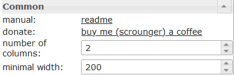

# IoBroker.vis-materialdesign
## Material Design Widgets für ioBroker VIS
[![paypal] (https://www.paypalobjects.com/en_US/i/btn/btn_donateCC_LG.gif)](https://www.paypal.com/cgi-bin/webscr?cmd=_s-xclick&hosted_button_id=VWAXSTS634G88&source=url)

ioBroker Material Design Widgets basieren auf [Google-Richtlinien für das Materialdesign](https://material.io/design/). Der Adapter verwendet die folgenden Bibliotheken:

* [Google Material Components für das Web] (https://github.com/material-components/material-components-web)
* [Vuetify] (https://github.com/vuetifyjs/vuetify)
* [chartjs] (https://www.chartjs.org/)
* [round-slider von thomasloven] (https://github.com/thomasloven/round-slider)
* [Material Design Icons] (https://materialdesignicons.com/)

## Online Beispielprojekt
bereitgestellt von [iobroker.click](https://iobroker.click/index.html), dank bluefox und iobroker.

* <a href="https://iobroker.click/vis/index.html?Material%20Design%20Widgets" target="_blank">VIS Runtime</a> ( <a href="http://iobroker.click:8082/vis/index.html?Material%20Design%20Widgets" target="_blank">alternativ</a> )
* <a href="https://iobroker.click/vis/edit.html?Material%20Design%20Widgets" target="_blank">VIS Editor</a> ( <a href="http://iobroker.click:8082/vis/edit.html?Material%20Design%20Widgets" target="_blank">alternativ</a> )

### Unterstützter Browser
https://github.com/material-components/material-components-web/blob/master/docs/supported-browsers.md

### Unterstützter Browser für die Funktion "Vibrieren auf Mobilgeräten"
https://developer.mozilla.org/en-US/docs/Web/API/Navigator/vibrate

### IoBroker VIS App
Funktioniert momentan nicht, muss per App implementiert werden, siehe https://github.com/ioBroker/ioBroker.vis.cordova

## Material Design Icons und Bilder
<table><thead><tr><th> Bildschirmfoto </th><th> Beschreibung </th></tr></thead><tbody><tr><td rowspan=6></td><td> Einige der Widgets unterstützen die <a href="https://materialdesignicons.com/" target="_blank">Material Design Icons-</a> Bibliothek. Sie können ein Symbol aus der obigen Liste abrufen oder die Bildauswahl öffnen, indem Sie auf die Schaltfläche rechts neben dem Eingabefeld klicken. <br><br> <b>Bildfarben gelten nur für die Materialdesign-Symbole, nicht für ein Bild!</b> </td></tr></tbody></table>

## Button Umschalten


## Card


## Icon Button


## Aufführen


## Fortschritt


## Schieberegler


Einstellungen, die in der folgenden Tabelle nicht aufgeführt sind, sind selbsterklärend.

<table><thead><tr><th> Bildschirmfoto </th><th> Rahmen </th><th> Beschreibung </th></tr></thead><tbody><tr><td rowspan=6></td><td> initDelay </td><td> Wenn der Schieberegler nach dem Laden der Laufzeit nicht sichtbar oder bedienbar ist, muss dieser Wert erhöht werden. Die Eingabe erfolgt in Millisekunden. <br> Erhöhen Sie beispielsweise um 250 Schritte, bis der Schieberegler funktioniert. </td></tr></tbody></table>

## Runder Schieberegler


## Schalter


## Wählen


Einstellungen, die in der folgenden Tabelle nicht aufgeführt sind, sind selbsterklärend.

<table><thead><tr><th> Bildschirmfoto </th><th> Rahmen </th><th> Beschreibung </th></tr></thead><tbody><tr><td rowspan=6></td><td> Methode der Daten des Menüs </td><td> Es gibt drei Methoden, um die Daten des Menüs zu definieren. Zunächst muss es über den Editor definiert werden. Zweitens ist es über eine Json-Zeichenfolge zu definieren. Die dritte Methode besteht darin, sie durch drei Listen für Werte, Bezeichnungen und Symbole zu definieren </td></tr><tr><td> Editor: Anzahl der Menüpunkte </td><td> Art der Daten des Menüs: über Editor <br> Definieren Sie die Anzahl der Menüeinträge. Die einzelnen Menüeinträge können unter Menüpunkt [x] definiert werden </td></tr><tr><td> JSON-String </td><td> Datenmethode des Menüs: Json String <br> Hier können Sie eine JSON-Zeichenfolge hinzufügen, um die Menüeinträge zu definieren, oder Bindungen für einen Datenpunkt verwenden, der eine JSON-Zeichenfolge enthält. <br><br> JSON-Zeichenfolge muss das folgende Format haben: <br> <code>[ { &quot;text&quot;: &quot;text 0&quot;, &quot;subText&quot;: &quot;sub 0&quot;, &quot;value&quot;: &quot;val0&quot;, &quot;icon&quot;: &quot;account-cancel&quot; }, { &quot;text&quot;: &quot;text 1&quot;, &quot;subText&quot;: &quot;sub 1&quot;, &quot;value&quot;: &quot;val1&quot;, &quot;icon&quot;: &quot;/vis/icon/info.png&quot; }, { &quot;text&quot;: &quot;text 2&quot;, &quot;subText&quot;: &quot;sub 2&quot;, &quot;value&quot;: &quot;val2&quot;, &quot;icon&quot;: &quot;facebook-workplace&quot; } ]</code> </td> </tr><tr><td> Werteliste </td><td> Datenmethode des Menüs: Werteliste <br> Definieren Sie die Anzahl der Menüeinträge, indem Sie Werte hinzufügen, die für den Datenpunkt festgelegt werden. Einträge müssen durch Komma getrennt werden </td></tr><tr><td> Werteliste: Etiketten </td><td> Datenmethode des Menüs: Werteliste <br> Definieren Sie die zugehörigen Bezeichnungen der Werte. Einträge müssen durch Komma getrennt werden </td></tr><tr><td> Werteliste: Etiketten </td><td> Datenmethode des Menüs: Werteliste <br> Definieren Sie die zugehörigen Symbole der Werte. Einträge müssen durch Komma getrennt werden. Sie können den Bildpfad oder den Namen der Materialdesign-Symbole verwenden </td></tr></tbody></table>

## Autocomplete


Einstellungen, die in der folgenden Tabelle nicht aufgeführt sind, sind selbsterklärend.

<table><thead><tr><th> Bildschirmfoto </th><th> Rahmen </th><th> Beschreibung </th></tr></thead><tbody><tr><td rowspan=6></td><td> Methode der Daten des Menüs </td><td> Es gibt drei Methoden, um die Daten des Menüs zu definieren. Zunächst muss es über den Editor definiert werden. Zweitens ist es über eine Json-Zeichenfolge zu definieren. Die dritte Methode besteht darin, sie durch drei Listen für Werte, Bezeichnungen und Symbole zu definieren </td></tr><tr><td> Editor: Anzahl der Menüpunkte </td><td> Art der Daten des Menüs: über Editor <br> Definieren Sie die Anzahl der Menüeinträge. Die einzelnen Menüeinträge können unter Menüpunkt [x] definiert werden </td></tr><tr><td> JSON-String </td><td> Datenmethode des Menüs: Json String <br> Hier können Sie eine JSON-Zeichenfolge hinzufügen, um die Menüeinträge zu definieren, oder Bindungen für einen Datenpunkt verwenden, der eine JSON-Zeichenfolge enthält. <br><br> JSON-Zeichenfolge muss das folgende Format haben: <br> <code>[ { &quot;text&quot;: &quot;text 0&quot;, &quot;subText&quot;: &quot;sub 0&quot;, &quot;value&quot;: &quot;val0&quot;, &quot;icon&quot;: &quot;account-cancel&quot; }, { &quot;text&quot;: &quot;text 1&quot;, &quot;subText&quot;: &quot;sub 1&quot;, &quot;value&quot;: &quot;val1&quot;, &quot;icon&quot;: &quot;/vis/icon/info.png&quot; }, { &quot;text&quot;: &quot;text 2&quot;, &quot;subText&quot;: &quot;sub 2&quot;, &quot;value&quot;: &quot;val2&quot;, &quot;icon&quot;: &quot;facebook-workplace&quot; } ]</code> </td> </tr><tr><td> Werteliste </td><td> Datenmethode des Menüs: Werteliste <br> Definieren Sie die Anzahl der Menüeinträge, indem Sie Werte hinzufügen, die für den Datenpunkt festgelegt werden. Einträge müssen durch Komma getrennt werden </td></tr><tr><td> Werteliste: Etiketten </td><td> Datenmethode des Menüs: Werteliste <br> Definieren Sie die zugehörigen Bezeichnungen der Werte. Einträge müssen durch Komma getrennt werden </td></tr><tr><td> Werteliste: Etiketten </td><td> Datenmethode des Menüs: Werteliste <br> Definieren Sie die zugehörigen Symbole der Werte. Einträge müssen durch Komma getrennt werden. Sie können den Bildpfad oder den Namen der Materialdesign-Symbole verwenden </td></tr></tbody></table>

## Top App Bar mit Navigationsleiste
Die obere App-Leiste mit Navigationsleiste kann mit der <a href="https://www.iobroker.net/#en/documentation/viz/basic.md">Ansicht in Widget 8</a> kombiniert werden.

<b>Schauen Sie sich die [Beispielprojekt für Material Design Widgets](https://github.com/Scrounger/ioBroker.vis-materialdesign#online-example-project)</b> an, um zu verstehen, wie es funktioniert.

##### Layout modal:


##### Layout permanent:


<table><thead><tr><th> Bildschirmfoto </th><th> Rahmen </th><th> Beschreibung </th></tr></thead><tbody><tr><td rowspan=3></td><td> Objekt Identifikation </td><td> muss auf einen Datenpunkt vom Typ number gesetzt werden. Dieser Datenpunkt kann beispielsweise von der <a href="https://www.iobroker.net/#en/documentation/viz/basic.md">Ansicht in Widget 8 verwendet werden</a> </td></tr><tr><td> Index der Navigationselemente anzeigen </td><td> Zeigt den Navigationsindex vor dem Artikeletikett an. Diese Nummer kann in der <a href="https://www.iobroker.net/#en/documentation/viz/basic.md">Ansicht in Widget 8 verwendet werden</a> , um die Ansicht zu definieren, die angezeigt werden soll, wenn das Element ausgewählt ist </td></tr><tr><td> Anzahl der Navigationselemente </td><td> Definieren Sie die Anzahl der Navigationselemente </td></tr></tbody></table>

### Untermenü


Einstellungen, die in der folgenden Tabelle nicht aufgeführt sind, sind selbsterklärend.

<table><thead><tr><th> Bildschirmfoto </th><th> Rahmen </th><th> Beschreibung </th></tr></thead><tbody><tr><td rowspan=1></td><td> Anzahl der Untermenüs [x] </td><td> Legen Sie fest, ob das Navigationselement Untermenüs und die Anzahl der Untermenüs enthält. </td></tr><tr><td rowspan=1></td><td> label [x] </td><td> Um den Text der Elemente zu ändern, müssen Sie ein JSON-Objekt in das Beschriftungsfeld mit dem Index des Ansichtsfelds einfügen. <br> Beispiel: <br>

`{"itemText": "Item with Subitems", "subItems": ["subItem1", "subItem2"]}`

Ergebnis: siehe Screenshot </td></tr><tr><td rowspan=1></td><td> icon [x] </td><td> Um die Symbole der Elemente zu ändern, müssen Sie ein JSON-Objekt in das Feld Symbole mit dem Index des Ansichtsfelds einfügen. <br> Beispiel: <br>

`{"itemImage": "/icons-material-svg/hardware/ic_computer_48px.svg", "subItems": ["/vis/widgets/materialdesign/img/IoBroker_Logo.png", "/icons-material-svg/action/ic_android_48px.svg"]}`

Ergebnis: siehe Screenshot </ td> </ tr> </ tbody> </ table>

## Charts
### Linienverlaufsdiagramm:
> Erforderlicher Adapter: [SQL] (https://github.com/ioBroker/ioBroker.sql), [Verlauf] (https://github.com/ioBroker/ioBroker.history) oder [InfluxDb](https://github.com/ioBroker/ioBroker.influxdb)!


Einstellungen, die in der folgenden Tabelle nicht aufgeführt sind, sind selbsterklärend.

<table><thead><tr><th> Bildschirmfoto </th><th> Rahmen </th><th> Beschreibung </th></tr></thead><tbody><tr><td rowspan=6></td><td> Adapterinstanz </td><td> Instanz für den SQL- oder Verlaufsadapter </td></tr><tr><td> Anhäufung </td><td> <a href="https://www.iobroker.net/docu/index-195.htm?page_id=198&lang=en#Aggregation">Verknüpfung</a> </td></tr><tr><td> max. Anzahl der anzuzeigenden Datenpunkte </td><td> Anzahl der maximal anzuzeigenden Datenpunkte </td></tr><tr><td> Zeitintervall zwischen den Datenpunkten in [s] </td><td> Optionale Einstellung, überschreibt die Einstellung &#39;count&#39;. <br> Abstand zwischen den einzelnen Datenpunkten in Sekunden. <br> Wenn Sie beispielsweise Datenpunkte jede Minute anzeigen möchten, müssen Sie hier 60 eingeben </td></tr><tr><td> Zeitintervall über Objekt steuern </td><td> ID eines Datenpunkts zum Ändern des Zeitintervalls des Diagramms. Der Datenpunkt muss eine Zeichenfolge sein und kann <a href="https://github.com/Scrounger/ioBroker.vis-materialdesign/blob/235530e4e54346b5527333ca06ce596519954c67/widgets/materialdesign/js/materialdesign.chart.js#L802">die verknüpften Werte enthalten</a> <br> Sie können hier beispielsweise eine Schaltfläche verwenden, um die Anzeige des Diagramms zur Laufzeit zu ändern </td></tr><tr><td> Boolesches Objekt für die Aktualisierung </td><td> ID von adatapoint, um eine manuelle Aktualisierung des Diagramms auszulösen. <br> Sie können hier beispielsweise eine Schaltfläche verwenden, um das Diagramm zur Laufzeit zu aktualisieren </td></tr><tr><td></td><td> Zeitformate der x-Achse </td><td> Ändern Sie das Zeitformat der X-Achse. Zeitformate müssen für alle Zeiteinheiten eingegeben werden, <a href="https://github.com/Scrounger/ioBroker.vis-materialdesign/blob/c677220868961b3cf0b153fb8bf04e13b4475c09/widgets/materialdesign/js/materialdesign.chart.js#L805">die folgenden Zeiteinheiten sind zulässig.</a> <br> Genehmigte Zeitformate müssen gemäß der Bibliothek moment.js eingegeben werden, <a href="https://momentjs.com/docs/#/displaying/">siehe Link</a> </td></tr><tr><td></td><td> Tooltip-Zeitformate </td><td> Ändern Sie das Zeitformat des Tooltips. Zeitformate müssen für alle Zeiteinheiten eingegeben werden, <a href="https://github.com/Scrounger/ioBroker.vis-materialdesign/blob/c677220868961b3cf0b153fb8bf04e13b4475c09/widgets/materialdesign/js/materialdesign.chart.js#L805">die folgenden Zeiteinheiten sind zulässig.</a> <br> Genehmigte Zeitformate müssen gemäß der Bibliothek moment.js eingegeben werden, <a href="https://momentjs.com/docs/#/displaying/">siehe Link</a> </td></tr></tbody></table>

## Tabelle


##### Eingabedaten
Eingabedaten müssen ein JSON-Array von Objekten sein. Beispiel:

```
[
{"img":"/vis.0/myImages/erlebnis_50.png","name":"Empire","betriebszeit":"4h 06m","funk":"5G","ip":"10.0.0.1"},
{"img":"/vis.0/myImages/erlebnis_100.png","name":"Handy","betriebszeit":"13m","funk":"5G","ip":"10.0.0.2"},
{"img":"/vis.0/myImages/erlebnis_100.png","name":"Harmony Hub - Wohnzimmer","betriebszeit":"18T 07h 21m","funk":"2G","ip":"10.0.0.3"},
{"img":"/vis.0/myImages/erlebnis_25.png","name":"MusicCast - Esszimmer (WX-030)","betriebszeit":"1h 57m","funk":"2G","ip":"10.0.0.4"},
{"img":"/vis.0/myImages/erlebnis_75.png","name":"MusicCast - K�che (ISX-18D)","betriebszeit":"4h 10m","funk":"2G","ip":"10.0.0.5"}
]
```

<table><thead><tr><th> Bildschirmfoto </th><th> Rahmen </th><th> Beschreibung </th></tr></thead><tbody><tr><td rowspan=2></td><td> Schalter </td><td> Datenpunkt vom Typ string mit Eingabedaten wie oben gezeigt </td></tr><tr><td> Daten als JSON </td><td> Optional, geben Sie die Daten wie oben gezeigt ein, wenn kein OID-Datenpunkt festgelegt ist </td></tr><tr><td rowspan=4></td><td> colType [x] </td><td> Wenn Bild ausgewählt ist, muss die Objekteigenschaft den Pfad zum Bild haben ( <a href="https://github.com/Scrounger/ioBroker.vis-materialdesign#input-data">siehe oben</a> ) </td></tr><tr><td> Präfix [x] </td><td> Präfix für Objekteigenschaft, interne Objektbindung ( <a href="https://github.com/Scrounger/ioBroker.vis-materialdesign#internal-object-binding">siehe unten</a> ) und HTML können verwendet werden </td></tr><tr><td> Suffix [x] </td><td> Suffix für Objekteigenschaft, interne Objektbindung ( <a href="https://github.com/Scrounger/ioBroker.vis-materialdesign#internal-object-binding">siehe unten</a> ) und HTML können verwendet werden </td></tr><tr><td> Objektname zum Sortieren [x] </td><td> Hier können Sie eine andere Objekteigenschaft definieren, die zum Sortieren verwendet werden soll. </td></tr></tbody></table>

##### Interne Objektbindung
Präfix & Suffix unterstützt die tabelleninterne Objektbindung -> Sie können mithilfe von auf andere Objekteigenschaften zugreifen

```
#[obj.'propertyName']
```

Beispiel <a href="https://github.com/Scrounger/ioBroker.vis-materialdesign#input-data">siehe oben</a> .

Working Widget Beispiel kann gefunden werden

* [hier] (https://forum.iobroker.net/topic/26199/test-adapter-material-design-widgets-v0-1-x/113)
* [ical Adapter] (https://forum.iobroker.net/topic/26925/test-adapter-material-design-widgets-v0-2-x/581)

## Spaltenansichten - veraltet !!!
In Column Views sind mehrere `view in widget` integriert, die abhängig von der Breite des Widgets automatisch sortiert werden. Mit diesem Widget ist es möglich, ein responsives Layout zu erstellen (ein Layout für Desktop, Tablet und Mobil).

<b>Schauen Sie sich die [Beispielprojekt für Material Design Widgets](https://github.com/Scrounger/ioBroker.vis-materialdesign#online-example-project)</b> an, um zu verstehen, wie es funktioniert.


<table><thead><tr><th> Bildschirmfoto </th><th> Rahmen </th><th> Beschreibung </th></tr></thead><tbody><tr><td rowspan=2></td><td> Anzahl der Spalten </td><td> Anzahl der Spalten festlegen </td></tr><tr><td> Mindestbreite </td><td> minimale Breite jeder Spalte. Verwenden Sie zum Beispiel die Breite der Auflösung eines Mobilgeräts </td></tr><tr><td rowspan=2></td><td> Ansichten in Spalte [x] </td><td> Definieren Sie die Ansichten, die in dieser Spalte angezeigt werden sollen. Mehrere Ansichten müssen durch &#39;|&#39; getrennt werden </td></tr><tr><td> Ansichtshöhe in Spalte [x] </td><td> Definieren Sie die Höhe jeder Ansicht in der Spalte. Mehrere Höhen müssen durch &#39;|&#39; getrennt werden </td></tr></tbody></table>

## Alerts
Das Warnungs-Widget kann z.B. Nachrichten im VIS anzuzeigen, wie es mit dem Pushover-Adapter funktioniert, aber direkt im VIS.


Das Widget "Warnungen" erfordert eine JSON-Zeichenfolge als Objekt, die wie folgt strukturiert sein muss:

```
[
       {
		"text": "we have a new message",
		"backgroundColor": "",
		"borderColor": "darkred",
		"icon": "message-alert-outline",
		"iconColor": "darkred",
		"fontColor": "blue"
	}, {
		"text": "we have a new message",
		"backgroundColor": "#e6b0aa",
		"borderColor": "green",
		"icon": "/vis/img/bulb_on.png",
		"iconColor": "green",
		"fontColor": "gold"
	}, {
		"text": "we have a new message",
		"backgroundColor": "",
		"borderColor": "gold",
		"icon": "alert-outline",
		"iconColor": "gold",
		"fontColor": ""
	}
]
```

<table><thead><tr><th> Bildschirmfoto </th><th> Rahmen </th><th> Beschreibung </th></tr></thead><tbody><tr><td rowspan=2></td><td> Anzahl der Spalten </td><td> Anzahl der Spalten festlegen </td></tr><tr><td> Objekt Identifikation </td><td> Das Objekt muss eine JSON-Zeichenfolge sein, die wie oben beschrieben aufgebaut sein muss </td></tr><tr><td> max. Warnungen </td><td> Maximale Anzahl von Warnungen, die angezeigt werden sollen. </td></tr></tbody></table>

## Changelog

### 0.2.xx
* (Scrounger): Alerts Widget added
* (Scrounger): use of Material Design Icons as images added
* (Scrounger): Perfomrance optimized
* (Scrounger): Input Widget added
* (Scrounger): Masonry Views Widget: settings options for mobile phone and tablet added
* (Scrounger): Masonry Views Widget: another chrome bug fix, option for distance between views added
* (Scrounger): Round Slider: vibrate on mobil devices added
* (Scrounger): bug fixes

### 0.2.32
* (Scrounger): Editor translation bug fix
* (Scrounger): Masonry Views Widget: alignment bug fix for chrome
* (Scrounger): Line History Chart Widget: layout option for line values added
* (Bluefox): Russian translation revised

### 0.2.30
* (Scrounger): Masonry Views Widget added
* (Scrounger): Select Widget: background color bug fix
* (Scrounger): Column Views Widget added
* (Scrounger): Button Widgets: icon height bug fix
* (Scrounger): Vuetify API bug fix
* (Scrounger): Chart Widgets: localization added
* (Scrounger): Line History Chart Widget: color options for each y-axis added
* (Scrounger): Line History Chart Widget: x-axis boundary options added
* (Scrounger): Line History Chart Widget: x-axis scaling bug fix
* (Scrounger): TopAppBar Widget: `view in widget 8` removed -> old TopAppBar Widget will be removed in version 0.3.x
* (Scrounger): bug fixes

### 0.2.22
* (Scrounger): library material-components-web updated to v4.0.0
* (Scrounger): Table: support for objects added
* (Scrounger): List: layout checkbox disabled added
* (Scrounger): vuetify slider added -> old slider will be removed in version 0.3.x
* (Scrounger): vuetify library v2.1.15 added
* (Scrounger): bug fixes

### 0.2.9
* (Scrounger): translations added
* (Scrounger): select Widget: color options added
* (Scrounger): slider Widget: color options added
* (Scrounger): bug fixes

### 0.2.7
* (Scrounger): List Widget: types switch readonly, checkbox readonly & button toggle readonly added
* (Scrounger): Line History Chart Widget: bug fix for hide yaxis by legend click if common axis is set
* (Scrounger): Line History Chart Widget: option to append text to yAxis values added
* (Scrounger): Switch Widget: color options added
* (Scrounger): chartjs lib updated to v2.9.3
* (Scrounger): round-slider: lib updated to v0.3.7
* (Scrounger): Table Widget: wordwrap & width option added
* (Scrounger): Chart Widgets: option for background color of diagram area added

### 0.2.4
* (Scrounger): Round Slider Widget bug fixes
* (Scrounger): Line History Chart Widget: null value bug fix
* (Scrounger): Line History Chart Widget: tooltip bug fix
* (Scrounger): Line History Chart Widget: editor translation improved
 
### 0.2.0
* (Scrounger): Round Slider Widget added
* (Scrounger): Icon Button Adition Widget added
* (Scrounger): Button Adition Widget added
* (Scrounger): Line History Chart Widget added
* (Scrounger): Table Widget added
* (Scrounger): Dialog iFrame Widget added
* (Scrounger): Dialog View Widget added
* (Scrounger): Select Widget added
* (Scrounger): colorSchemes for Charts added
* (Scrounger): bug fixes

### 0.1.5
* (Scrounger): bar chart added
* (Scrounger): pie chart added
* (Scrounger): bug fixes

### 0.1.2
* (Scrounger): list: right label option added
* (Scrounger): slider: value text option for lees or greather than added
* (Scrounger): switch: support for non boolean values added
* (Scrounger): checkbox: support for non boolean values added
* (Scrounger): buttons: image position option added
* (Scrounger): toggle buttons: support for non boolean values added
* (Scrounger): topAppBar: z-Index added
* (Scrounger): haptic feedback (vibration) option for mobil browser added
* (Scrounger): editor text fields changed to html
* (Scrounger): mdc-typography font styles added
* (Scrounger): bug fixes

### 0.1.1
* (Scrounger): bug fixes

### 0.1.0
* (Scrounger): Top App Bar Submenu added
* (Scrounger): List added
* (Scrounger): Button vertical State, Link, Nav added
* (Scrounger): Icon Button State, Link, Nav added
* (Scrounger): initialize slider bug fixes
* (Scrounger): moved hard coded styling options to css
* (Scrounger): styling options extended
* (Scrounger): bug fixes

### 0.0.7
* (Scrounger): Top App Bar Layouts added
* (Scrounger): Top App Bar customizing options added
* (Scrounger): Top App Bar Navigation Drawer backdrop layout added
* (Scrounger): Button State added
* (Scrounger): Button Link added

### 0.0.6
* (Scrounger): Top App Bar with Navigation Drawer added
* (Scrounger): Checkbox added
* (Scrounger): bug fixes
 
### 0.0.5
* (Scrounger): icon button Toggle added
* (Scrounger): color pressed for buttons added
* (Scrounger): Slider bug fix & label for value <= min / >= max added
* (Scrounger): translation added

### 0.0.4
* (Scrounger): cards added

### 0.0.3
* (Scrounger): progress added
 
### 0.0.2
* (Scrounger): slider vertical added
* (Scrounger): switch added
* (Scrounger): button toggle added

### 0.0.1
* (Scrounger) initial release

## License
MIT License

Copyright (c) 2019 Scrounger <scrounger@gmx.net>

Permission is hereby granted, free of charge, to any person obtaining a copy
of this software and associated documentation files (the "Software"), to deal
in the Software without restriction, including without limitation the rights
to use, copy, modify, merge, publish, distribute, sublicense, and/or sell
copies of the Software, and to permit persons to whom the Software is
furnished to do so, subject to the following conditions:

The above copyright notice and this permission notice shall be included in all
copies or substantial portions of the Software.

THE SOFTWARE IS PROVIDED "AS IS", WITHOUT WARRANTY OF ANY KIND, EXPRESS OR
IMPLIED, INCLUDING BUT NOT LIMITED TO THE WARRANTIES OF MERCHANTABILITY,
FITNESS FOR A PARTICULAR PURPOSE AND NONINFRINGEMENT. IN NO EVENT SHALL THE
AUTHORS OR COPYRIGHT HOLDERS BE LIABLE FOR ANY CLAIM, DAMAGES OR OTHER
LIABILITY, WHETHER IN AN ACTION OF CONTRACT, TORT OR OTHERWISE, ARISING FROM,
OUT OF OR IN CONNECTION WITH THE SOFTWARE OR THE USE OR OTHER DEALINGS IN THE
SOFTWARE.