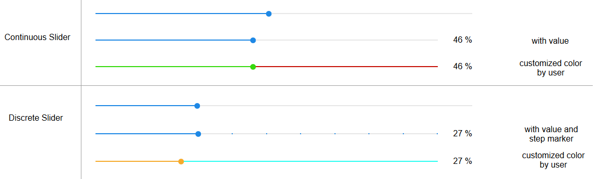

# IoBroker.vis-materialdesign
## Material Design Widgets für ioBroker VIS
[![paypal] (https://www.paypalobjects.com/en_US/i/btn/btn_donateCC_LG.gif)](https://www.paypal.com/cgi-bin/webscr?cmd=_s-xclick&hosted_button_id=YHPPW474N5CKQ&source=url)

Material Design Widgets basierend auf [Webbibliothek für Google-Materialkomponenten](https://github.com/material-components/material-components-web).

### Unterstützter Browser
https://github.com/material-components/material-components-web/blob/master/docs/supported-browsers.md

## Button Umschalten

## Card

## Icon Button

## Liste

## Fortschritt

## Schieberegler

## Schalter

## Top App Bar mit Navigationsleiste
Information:

* Die Position der App-Leiste ist fest codiert und wird immer in der oberen linken Ecke angezeigt. Nur Breite und Höhe sind einstellbar. Im Editor können Sie das Widget verschieben, diese Einstellungen werden jedoch nicht übernommen!
* Im Editor werden Effekte wie Scrollen usw. nicht richtig angezeigt oder verhalten sich anders!
* Checkbox "persistent" muss aktiviert sein!

##### Layout modal:

##### Layout nicht zulässig:

##### Layout permanent:

##### Untermenü

Um das Untermenü zu aktivieren, müssen Sie mehrere mit '|' getrennte Ansichten hinzufügen. in das Anzeigefeld, Beispiel: 

Um den Text der Elemente zu ändern, müssen Sie ein JSON-Objekt in das Beschriftungsfeld mit dem Index des Ansichtsfelds einfügen. Beispiel:

`{"itemText": "Item with Subitems", "subItems": ["subItem1", "subItem2"]}`

Um das Bild der Elemente zu ändern, müssen Sie ein JSON-Objekt in das Bild einfügen, das mit dem Index des Ansichtsfelds abgelegt ist. Beispiel:

`{"itemImage": "/icons-material-svg/hardware/ic_computer_48px.svg", "subItems": ["/vis/widgets/materialdesign/img/IoBroker_Logo.png", "/icons-material-svg/action/ic_android_48px.svg"]}`

## Changelog

### 0.1.5
* (Scrounger): bar chart added
* (Scrounger): pie chart added
* (Scrounger): bug fixes

### 0.1.2
* (Scrounger): list: right label option added
* (Scrounger): slider: value text option for lees or greather than added
* (Scrounger): switch: support for non boolean values added
* (Scrounger): checkbox: support for non boolean values added
* (Scrounger): buttons: image position option added
* (Scrounger): toggle buttons: support for non boolean values added
* (Scrounger): topAppBar: z-Index added
* (Scrounger): haptic feedback (vibration) option for mobil browser added
* (Scrounger): editor text fields changed to html
* (Scrounger): mdc-typography font styles added
* (Scrounger): bug fixes

### 0.1.1
* (Scrounger): bug fixes

### 0.1.0
* (Scrounger): Top App Bar Submenu added
* (Scrounger): List added
* (Scrounger): Button vertical State, Link, Nav added
* (Scrounger): Icon Button State, Link, Nav added
* (Scrounger): initialize slider bug fixes
* (Scrounger): moved hard coded styling options to css
* (Scrounger): styling options extended
* (Scrounger): bug fixes

### 0.0.7
* (Scrounger): Top App Bar Layouts added
* (Scrounger): Top App Bar customizing options added
* (Scrounger): Top App Bar Navigation Drawer backdrop layout added
* (Scrounger): Button State added
* (Scrounger): Button Link added

### 0.0.6
* (Scrounger): Top App Bar with Navigation Drawer added
* (Scrounger): Checkbox added
* (Scrounger): bug fixes
 
### 0.0.5
* (Scrounger): icon button Toggle added
* (Scrounger): color pressed for buttons added
* (Scrounger): Slider bug fix & label for value <= min / >= max added
* (Scrounger): translation added

### 0.0.4
* (Scrounger): cards added

### 0.0.3
* (Scrounger): progress added
 
### 0.0.2
* (Scrounger): slider vertical added
* (Scrounger): switch added
* (Scrounger): button toggle added

### 0.0.1
* (Scrounger) initial release

## License
MIT License

Copyright (c) 2019 Scrounger <scrounger@gmx.net>

Permission is hereby granted, free of charge, to any person obtaining a copy
of this software and associated documentation files (the "Software"), to deal
in the Software without restriction, including without limitation the rights
to use, copy, modify, merge, publish, distribute, sublicense, and/or sell
copies of the Software, and to permit persons to whom the Software is
furnished to do so, subject to the following conditions:

The above copyright notice and this permission notice shall be included in all
copies or substantial portions of the Software.

THE SOFTWARE IS PROVIDED "AS IS", WITHOUT WARRANTY OF ANY KIND, EXPRESS OR
IMPLIED, INCLUDING BUT NOT LIMITED TO THE WARRANTIES OF MERCHANTABILITY,
FITNESS FOR A PARTICULAR PURPOSE AND NONINFRINGEMENT. IN NO EVENT SHALL THE
AUTHORS OR COPYRIGHT HOLDERS BE LIABLE FOR ANY CLAIM, DAMAGES OR OTHER
LIABILITY, WHETHER IN AN ACTION OF CONTRACT, TORT OR OTHERWISE, ARISING FROM,
OUT OF OR IN CONNECTION WITH THE SOFTWARE OR THE USE OR OTHER DEALINGS IN THE
SOFTWARE.