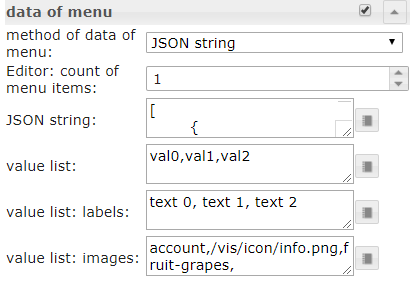
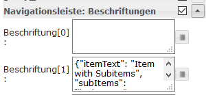
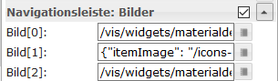
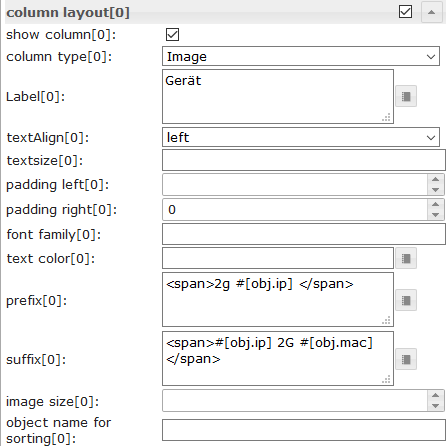
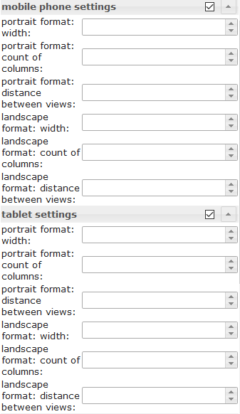
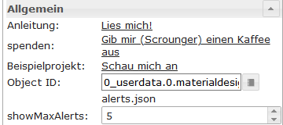
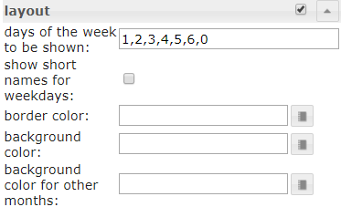
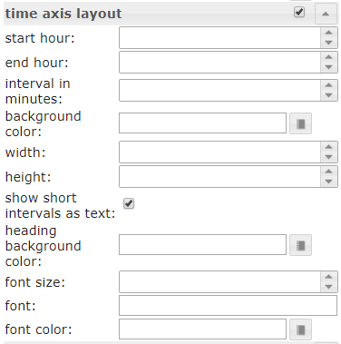

# IoBroker.vis-materialdesign
## Material Design Widgets für ioBroker VIS
[![paypal] (https://www.paypalobjects.com/en_US/i/btn/btn_donateCC_LG.gif)](https://www.paypal.com/cgi-bin/webscr?cmd=_s-xclick&hosted_button_id=VWAXSTS634G88&source=url)

ioBroker Material Design Widgets basieren auf [Richtlinien für das Materialdesign von Google](https://material.io/design/). Der Adapter verwendet die folgenden Bibliotheken:

* [Google Materialkomponenten für das Web] (https://github.com/material-components/material-components-web)
* [Vuetify] (https://github.com/vuetifyjs/vuetify)
* [chartjs] (https://www.chartjs.org/)
* [runder Schieberegler von Thomasloven] (https://github.com/thomasloven/round-slider)
* [Material Design Icons] (https://materialdesignicons.com/)

## Online-Beispielprojekt
bereitgestellt von [iobroker.click](https://iobroker.click/index.html), dank bluefox und iobroker.

* <a href="https://iobroker.click/vis/index.html?Material%20Design%20Widgets" target="_blank">VIS Runtime</a> ( <a href="http://iobroker.click:8082/vis/index.html?Material%20Design%20Widgets" target="_blank">alternativ</a> )
* <a href="https://iobroker.click/vis/edit.html?Material%20Design%20Widgets" target="_blank">VIS Editor</a> ( <a href="http://iobroker.click:8082/vis/edit.html?Material%20Design%20Widgets" target="_blank">alternativ</a> )

## Praktische Beispiele
* [Wetteransicht] (https://forum.iobroker.net/topic/32232/material-design-widgets-wetter-view)
* [Skriptstatus] (https://forum.iobroker.net/topic/30662/material-design-widgets-skript-status)
* [Adapterstatus] (https://forum.iobroker.net/topic/30661/material-design-widgets-adapter-status)
* [UniFi Netzwerk Status] (https://forum.iobroker.net/topic/30875/material-design-widgets-unifi-netzwerk-status)

## Fragen und Antworten zu den Widgets
Wenn Sie Fragen zu den einzelnen Widgets haben, schauen Sie sich zunächst die Themen der einzelnen Widgets an

* [Deutsche Themen] (https://forum.iobroker.net/search?term=Material%20Design%20Widgets%3A&in=titles&matchWords=all&by%5B%5D=Scrounger&categories%5B%5D=7&sortBy=topic.title&sort Themen)

### Unterstützter Browser
https://github.com/material-components/material-components-web/blob/master/docs/supported-browsers.md

### Unterstützte Browserfunktion für Vibrationen auf Mobilgeräten
https://developer.mozilla.org/en-US/docs/Web/API/Navigator/vibrate

### IoBroker VIS App
funktioniert momentan nicht, muss von der App implementiert werden, siehe https://github.com/ioBroker/ioBroker.vis.cordova

## Material Design Icons und Bilder
<table><thead><tr><th> Bildschirmfoto </th><th> Beschreibung </th></tr></thead><tbody><tr><td rowspan=6></td><td> Einige der Widgets unterstützen die <a href="https://materialdesignicons.com/" target="_blank">Material Design Icons-</a> Bibliothek. Sie können ein Symbol aus der obigen Liste auswählen oder die Bildauswahl öffnen, indem Sie auf die Schaltfläche rechts neben dem Eingabefeld klicken. <br><br> <b>Bildfarben gelten nur für die Materialdesignsymbole, nicht für ein Bild!</b> </td></tr></tbody></table>

## Tasten
### Button Toggle


### Symbolschaltfläche


## Karte


## Liste


## IconList


Einstellungen, die in der folgenden Tabelle nicht aufgeführt sind, sind selbsterklärend.

<table><thead><tr><th> Bildschirmfoto </th><th> Rahmen </th><th> Beschreibung </th></tr></thead><tbody><tr><td rowspan=6></td><td> Eingabemethode für die Listendaten </td><td> Die Daten für die IconList können über den Editor eingegeben oder eine JSON-Zeichenfolge verwendet werden </td></tr><tr><td> JSON-String: Objekt-ID </td><td> Objekt-ID des Datenpunkts mit JSON-Zeichenfolge. Die JSON-Zeichenfolge muss das folgende Format haben: <pre> <code> [ { &quot;background&quot;: &quot;red&quot;, &quot;text&quot;: &quot;text1&quot;, &quot;subText&quot;: &quot;number&quot;, &quot;image&quot;: &quot;harddisk&quot;, &quot;imageColor&quot;: &quot;#ec0909&quot;, &quot;imageActive&quot;: &quot;folder&quot;, &quot;imageActiveColor&quot;: &quot;#5ad902&quot;, &quot;buttonBackgroundColor&quot;: &quot;&quot;, &quot;buttonBackgroundActiveColor&quot;: &quot;&quot;, &quot;listType&quot;: &quot;buttonState&quot;, &quot;objectId&quot;: &quot;0_userdata.0.iconList.buttonState.number&quot;, &quot;buttonStateValue&quot;: &quot;60&quot;, &quot;buttonNavView&quot;: &quot;&quot;, &quot;buttonLink&quot;: &quot;&quot;, &quot;buttonToggleValueTrue&quot;: &quot;&quot;, &quot;buttonToggleValueFalse&quot;: &quot;&quot;, &quot;valueAppendix&quot;: &quot;&quot;, &quot;showValueLabel&quot;: &quot;true&quot;, &quot;statusBarColor&quot;: &quot;green&quot;, &quot;lockEnabled&quot;: &quot;false&quot; }, { &quot;background&quot;: &quot;green&quot;, &quot;text&quot;: &quot;text0&quot;, &quot;subText&quot;: &quot;bool&quot;, &quot;image&quot;: &quot;home&quot;, &quot;imageColor&quot;: &quot;#44739e&quot;, &quot;imageActive&quot;: &quot;home&quot;, &quot;imageActiveColor&quot;: &quot;#44739e&quot;, &quot;buttonBackgroundColor&quot;: &quot;&quot;, &quot;buttonBackgroundActiveColor&quot;: &quot;#a0f628&quot;, &quot;listType&quot;: &quot;buttonToggle&quot;, &quot;objectId&quot;: &quot;0_userdata.0.iconList.buttonToggle.bool0&quot;, &quot;buttonStateValue&quot;: &quot;60&quot;, &quot;buttonNavView&quot;: &quot;&quot;, &quot;buttonLink&quot;: &quot;&quot;, &quot;buttonToggleValueTrue&quot;: &quot;&quot;, &quot;buttonToggleValueFalse&quot;: &quot;&quot;, &quot;valueAppendix&quot;: &quot;&quot;, &quot;showValueLabel&quot;: &quot;false&quot;, &quot;statusBarColor&quot;: &quot;&quot;, &quot;lockEnabled&quot;: &quot;false&quot; } ]</code> </pre> Die Eigenschaft <code>listType</code> kann folgende Werte haben: <br> <code>text, buttonState, buttonToggle, buttonToggleValueTrue, buttonToggleValueFalse, buttonNav, buttonLink</code> </td> </tr></tbody></table>

## Fortschritt


## Schieberegler


Einstellungen, die in der folgenden Tabelle nicht aufgeführt sind, sind selbsterklärend.

<table><thead><tr><th> Bildschirmfoto </th><th> Rahmen </th><th> Beschreibung </th></tr></thead><tbody><tr><td rowspan=6></td><td> initDelay </td><td> Wenn der Schieberegler nach dem Laden der Laufzeit nicht sichtbar oder bedienbar ist, muss dieser Wert erhöht werden. Die Eingabe erfolgt in Millisekunden. <br> Erhöhen Sie beispielsweise um 250 Schritte, bis der Schieberegler funktioniert. </td></tr></tbody></table>

## Runder Schieberegler


## Kontrollkästchen


## Schalter


## Eingabe
### Text Eingabe


### Wählen


Einstellungen, die in der folgenden Tabelle nicht aufgeführt sind, sind selbsterklärend.

<table><thead><tr><th> Bildschirmfoto </th><th> Rahmen </th><th> Beschreibung </th></tr></thead><tbody><tr><td rowspan=6></td><td> Methode der Daten des Menüs </td><td> Es gibt drei Methoden, um die Daten des Menüs zu definieren. Zunächst muss es über den Editor definiert werden. Zweitens müssen Sie es über eine JSON-Zeichenfolge definieren. Die dritte Methode besteht darin, sie durch drei Listen für Werte, Beschriftungen und Symbole zu definieren </td></tr><tr><td> Editor: Anzahl der Menüpunkte </td><td> Datenmethode des Menüs: über den Editor <br> Definieren Sie die Anzahl der Menüeinträge. Die einzelnen Menüeinträge können unter Menüpunkt [x] definiert werden. </td></tr><tr><td> JSON-Zeichenfolge </td><td> Datenmethode des Menüs: JSON-Zeichenfolge <br> Hier können Sie eine JSON-Zeichenfolge hinzufügen, um die Menüeinträge zu definieren, oder Bindungen an einen Datenpunkt verwenden, der eine JSON-Zeichenfolge enthält. <br><br> JSON-Zeichenfolge muss das folgende Format haben: <br><pre> <code> [ { &quot;text&quot;: &quot;text 0&quot;, &quot;subText&quot;: &quot;sub 0&quot;, &quot;value&quot;: &quot;val0&quot;, &quot;icon&quot;: &quot;account-cancel&quot; }, { &quot;text&quot;: &quot;text 1&quot;, &quot;subText&quot;: &quot;sub 1&quot;, &quot;value&quot;: &quot;val1&quot;, &quot;icon&quot;: &quot;/vis/icon/info.png&quot;, &quot;iconColor&quot;: &quot;red&quot; }, { &quot;text&quot;: &quot;text 2&quot;, &quot;subText&quot;: &quot;sub 2&quot;, &quot;value&quot;: &quot;val2&quot;, &quot;icon&quot;: &quot;facebook-workplace&quot;, &quot;iconColor&quot;: &quot;green&quot; } ]</code> </pre> </td></tr><tr><td> Werteliste </td><td> Datenmethode des Menüs: Werteliste <br> Definieren Sie die Anzahl der Menüeinträge, indem Sie Werte hinzufügen, die auf den Datenpunkt gesetzt werden. Einträge müssen durch Komma getrennt werden </td></tr><tr><td> Werteliste: Labels </td><td> Datenmethode des Menüs: Werteliste <br> Definieren Sie die zugehörigen Beschriftungen der Werte. Einträge müssen durch Komma getrennt werden </td></tr><tr><td> Werteliste: Labels </td><td> Datenmethode des Menüs: Werteliste <br> Definieren Sie die zugehörigen Symbole der Werte. Einträge müssen durch Komma getrennt werden. Sie können den Bildpfad oder den Namen des Material Design Icons verwenden </td></tr></tbody></table>

### Autocomplete


Einstellungen, die in der folgenden Tabelle nicht aufgeführt sind, sind selbsterklärend.

<table><thead><tr><th> Bildschirmfoto </th><th> Rahmen </th><th> Beschreibung </th></tr></thead><tbody><tr><td rowspan=6></td><td> Methode der Daten des Menüs </td><td> Es gibt drei Methoden, um die Daten des Menüs zu definieren. Zunächst muss es über den Editor definiert werden. Zweitens müssen Sie es über eine JSON-Zeichenfolge definieren. Die dritte Methode besteht darin, sie durch drei Listen für Werte, Beschriftungen und Symbole zu definieren </td></tr><tr><td> Editor: Anzahl der Menüpunkte </td><td> Datenmethode des Menüs: über den Editor <br> Definieren Sie die Anzahl der Menüeinträge. Die einzelnen Menüeinträge können unter Menüpunkt [x] definiert werden. </td></tr><tr><td> JSON-Zeichenfolge </td><td> Datenmethode des Menüs: JSON-Zeichenfolge <br> Hier können Sie eine JSON-Zeichenfolge hinzufügen, um die Menüeinträge zu definieren, oder Bindungen an einen Datenpunkt verwenden, der eine JSON-Zeichenfolge enthält. <br><br> JSON-Zeichenfolge muss das folgende Format haben: <br><pre> <code> [ { &quot;text&quot;: &quot;text 0&quot;, &quot;subText&quot;: &quot;sub 0&quot;, &quot;value&quot;: &quot;val0&quot;, &quot;icon&quot;: &quot;account-cancel&quot; }, { &quot;text&quot;: &quot;text 1&quot;, &quot;subText&quot;: &quot;sub 1&quot;, &quot;value&quot;: &quot;val1&quot;, &quot;icon&quot;: &quot;/vis/icon/info.png&quot;, &quot;iconColor&quot;: &quot;red&quot; }, { &quot;text&quot;: &quot;text 2&quot;, &quot;subText&quot;: &quot;sub 2&quot;, &quot;value&quot;: &quot;val2&quot;, &quot;icon&quot;: &quot;facebook-workplace&quot;, &quot;iconColor&quot;: &quot;green&quot; } ]</code> </pre> </td></tr><tr><td> Werteliste </td><td> Datenmethode des Menüs: Werteliste <br> Definieren Sie die Anzahl der Menüeinträge, indem Sie Werte hinzufügen, die auf den Datenpunkt gesetzt werden. Einträge müssen durch Komma getrennt werden </td></tr><tr><td> Werteliste: Labels </td><td> Datenmethode des Menüs: Werteliste <br> Definieren Sie die zugehörigen Beschriftungen der Werte. Einträge müssen durch Komma getrennt werden </td></tr><tr><td> Werteliste: Labels </td><td> Datenmethode des Menüs: Werteliste <br> Definieren Sie die zugehörigen Symbole der Werte. Einträge müssen durch Komma getrennt werden. Sie können den Bildpfad oder den Namen des Material Design Icons verwenden </td></tr></tbody></table>

## Obere App-Leiste mit Navigationsschublade
Die obere App-Leiste mit Navigationsleiste kann mit der <a href="https://www.iobroker.net/#en/documentation/viz/basic.md">Ansicht in Widget 8</a> kombiniert werden.

<b>Schauen Sie sich die [Beispielprojekt für Material Design Widgets](https://github.com/Scrounger/ioBroker.vis-materialdesign#online-example-project)</b> an, um zu verstehen, wie es funktioniert.

##### Layout modal:


##### Layout permanent:


<table><thead><tr><th> Bildschirmfoto </th><th> Rahmen </th><th> Beschreibung </th></tr></thead><tbody><tr><td rowspan=3></td><td> Objekt Identifikation </td><td> muss von der Typennummer auf einen Datenpunkt gesetzt werden. Beispielsweise kann dieser Datenpunkt von der <a href="https://www.iobroker.net/#en/documentation/viz/basic.md">Ansicht in Widget 8 verwendet werden</a> </td></tr><tr><td> Index der Navigationselemente anzeigen </td><td> Zeigt den Navigationsindex vor der Artikelbezeichnung an. Diese Nummer kann in der <a href="https://www.iobroker.net/#en/documentation/viz/basic.md">Ansicht in Widget 8 verwendet werden</a> , um die Ansicht zu definieren, die angezeigt werden soll, wenn das Element ausgewählt ist </td></tr><tr><td> Anzahl der Navigationselemente </td><td> Definieren Sie die Anzahl der Navigationselemente </td></tr></tbody></table>

### Untermenü


Einstellungen, die in der folgenden Tabelle nicht aufgeführt sind, sind selbsterklärend.

<table><thead><tr><th> Bildschirmfoto </th><th> Rahmen </th><th> Beschreibung </th></tr></thead><tbody><tr><td rowspan=1></td><td> Anzahl der Untermenüs [x] </td><td> Definieren Sie, ob das Navigationselement Untermenüs und die Anzahl der Untermenüs enthält. </td></tr><tr><td rowspan=1></td><td> label [x] </td><td> Um den Text der Elemente zu ändern, müssen Sie ein JSON-Objekt mit dem Index des Ansichtsfelds in das Beschriftungsfeld einfügen. <br> Beispiel: <br>

`{"itemText": "Item with Subitems", "subItems": ["subItem1", "subItem2"]}`

Ergebnis: siehe Screenshot </td></tr><tr><td rowspan=1></td><td> Symbol [x] </td><td> Um die Symbole der Elemente zu ändern, müssen Sie ein JSON-Objekt mit dem Index des Ansichtsfelds in das Symbolfeld einfügen. <br> Beispiel: <br>

`{"itemImage": "/icons-material-svg/hardware/ic_computer_48px.svg", "subItems": ["/vis/widgets/materialdesign/img/IoBroker_Logo.png", "/icons-material-svg/action/ic_android_48px.svg"]}`

Ergebnis: siehe Screenshot </ td> </ tr> </ body> </ table>

## Diagramme
### Balkendiagramm


MACHEN

### Kuchendiagramm
MACHEN

### Linienverlaufsdiagramm:
> Erforderlicher Adapter: [SQL] (https://github.com/ioBroker/ioBroker.sql), [Verlauf] (https://github.com/ioBroker/ioBroker.history) oder [InfluxDb](https://github.com/ioBroker/ioBroker.influxdb)!


Einstellungen, die in der folgenden Tabelle nicht aufgeführt sind, sind selbsterklärend.

<table><thead><tr><th> Bildschirmfoto </th><th> Rahmen </th><th> Beschreibung </th></tr></thead><tbody><tr><td rowspan=6></td><td> Adapterinstanz </td><td> Instanz für den SQL- oder Verlaufsadapter </td></tr><tr><td> Anhäufung </td><td> <a href="https://www.iobroker.net/docu/index-195.htm?page_id=198&lang=en#Aggregation">Verknüpfung</a> </td></tr><tr><td> max. Anzahl der anzuzeigenden Datenpunkte </td><td> Anzahl der maximal anzuzeigenden Datenpunkte </td></tr><tr><td> Zeitintervall zwischen den Datenpunkten in [s] </td><td> Die optionale Einstellung überschreibt die Einstellung &#39;Anzahl&#39;. <br> Abstand zwischen den einzelnen Datenpunkten in Sekunden. <br> Wenn Sie beispielsweise jede Minute Datenpunkte anzeigen möchten, müssen Sie hier 60 eingeben </td></tr><tr><td> Zeitintervall mit Objekt steuern </td><td> ID eines Datenpunkts zum Ändern des Zeitintervalls des Diagramms. <br><br> Wenn der Datenpunkt vom Typ &#39;Zeichenfolge&#39; ist, muss er <a href="https://github.com/Scrounger/ioBroker.vis-materialdesign/blob/235530e4e54346b5527333ca06ce596519954c67/widgets/materialdesign/js/materialdesign.chart.js#L802">einen der verknüpften Werte enthalten</a> <br> Wenn der Datenpunkt vom Typ &#39;Nummer&#39; ist, muss er den Startzeitstempel des Diagramms enthalten. <br><br> Beispielsweise können Sie hier eine Schaltfläche verwenden, um die Anzeige des Diagramms zur Laufzeit zu ändern </td></tr><tr><td> Boolesches Objekt zum Aktualisieren </td><td> ID von adatapoint, um eine manuelle Aktualisierung des Diagramms auszulösen. <br> Beispielsweise können Sie hier eine Schaltfläche verwenden, um das Diagramm zur Laufzeit zu aktualisieren </td></tr><tr><td></td><td> Zeitformate der x-Achse </td><td> Ändern Sie das Zeitformat der X-Achse. Zeitformate müssen für alle Zeiteinheiten eingegeben werden, <a href="https://github.com/Scrounger/ioBroker.vis-materialdesign/blob/c677220868961b3cf0b153fb8bf04e13b4475c09/widgets/materialdesign/js/materialdesign.chart.js#L805">die folgenden Zeiteinheiten sind zulässig.</a> <br> Genehmigte Zeitformate müssen gemäß der Bibliothek moment.js eingegeben werden, <a href="https://momentjs.com/docs/#/displaying/">siehe Link</a> </td></tr><tr><td></td><td> Tooltip-Zeitformate </td><td> Ändern Sie das Zeitformat des Tooltips. Zeitformate müssen für alle Zeiteinheiten eingegeben werden, <a href="https://github.com/Scrounger/ioBroker.vis-materialdesign/blob/c677220868961b3cf0b153fb8bf04e13b4475c09/widgets/materialdesign/js/materialdesign.chart.js#L805">die folgenden Zeiteinheiten sind zulässig.</a> <br> Genehmigte Zeitformate müssen gemäß der Bibliothek moment.js eingegeben werden, <a href="https://momentjs.com/docs/#/displaying/">siehe Link</a> </td></tr></tbody></table>

### JSON-Diagramm
#### Allgemeines
<table><thead><tr><th> Eigentum </th><th> Beschreibung </th><th> Art </th><th> Werte </th></tr></thead><tbody><tr><td> axisLabels </td><td> Achsenbeschriftung des Graphen </td><td> Array </td><td> Zahlen oder Zeichenfolge </td></tr><tr><td> Grafiken </td><td> Daten von Graphen </td><td> Array [ <a href="#graph">Grafik</a> ] </td><td> siehe Grafik </td></tr></tbody></table>

#### Graph
<table><thead><tr><th> Eigentum </th><th> Beschreibung </th><th> Art </th><th> Werte </th></tr></thead><tbody><tr><td> Daten </td><td> Daten des Graphen oder Daten mit Zeitstempel </td><td> Array [Zahlen] | Array [ <a href="#data-with-time-axis">Werte mit Zeitstempel</a> ] </td><td> Nummer </td></tr><tr><td> Art </td><td> Art des Diagramms </td><td> Zeichenfolge </td><td> &#39;line&#39;, &#39;bar&#39; </td></tr><tr><td> legendText </td><td> Text der Legende </td><td> Zeichenfolge </td><td></td></tr><tr><td> Bestellung anzeigen </td><td> Überlagerungsreihenfolge des Diagramms </td><td> Nummer </td><td> 1, 2, ... </td></tr><tr><td> Farbe </td><td> Farbe des Graphen </td><td> Farbe </td><td> hex (# 44739e), rgb (20, 50, 200), rgba (20, 50, 200, 0,5) </td></tr><tr><td> use_gradient_color </td><td> Verwenden Sie eine Verlaufsfarbe </td><td> Boolescher Wert </td><td> Falsch Richtig </td></tr><tr><td> Farbverlauf </td><td> Farbverlaufsarray </td><td> Array [ <a href="#gradientcolor">gradientColor</a> ] </td><td> [{Wert: -20, Farbe: &#39;# 7d3c98&#39;}, {Wert: 0, Farbe: &#39;# 2874a6&#39;}] </td></tr><tr><td> tooltip_title </td><td> Titel des Tooltips </td><td> Zeichenfolge </td><td></td></tr><tr><td> tooltip_text </td><td> Überschreiben des Textes des Tooltips </td><td> Zeichenfolge </td><td></td></tr><tr><td> tooltip_MinDigits </td><td> Maximale Dezimalstellen des Tooltip-Werts </td><td> Nummer </td><td> 0, 1, 2, ... </td></tr><tr><td> tooltip_MaxDigits </td><td> Maximale Dezimalstellen des Tooltip-Werts </td><td> Nummer </td><td> 0, 1, 2, ... </td></tr><tr><td> tooltip_AppendText </td><td> Fügen Sie Text an den Tooltip-Wert an </td><td> Zeichenfolge </td><td></td></tr><tr><td> datalabel_show </td><td> Datenbeschriftungen für Grafik anzeigen </td><td> Zeichenfolge | Boolescher Wert </td><td> false, true, auto </td></tr><tr><td> datalabel_anchor </td><td> Anker von Datenetiketten </td><td> Zeichenfolge </td><td> zentrieren, beginnen, enden </td></tr><tr><td> datalabel_align </td><td> Position des Datenetiketts relativ zum Ankerpunkt </td><td> Zeichenfolge </td><td> links, Start, Mitte, Ende, rechts, oben, unten </td></tr><tr><td> datalabel_offset </td><td> Abstand (in Pixel), um das Datenetikett vom Ankerpunkt wegzuziehen </td><td> Nummer </td><td> 0, 1, 2, ... </td></tr><tr><td> datalabel_text_align </td><td> Textausrichtung des Datenetiketts </td><td> Zeichenfolge </td><td> links, Start, Mitte, Ende, rechts </td></tr><tr><td> datalabel_rotation </td><td> Drehwinkel des Datenetiketts im Uhrzeigersinn (in Grad) </td><td> Nummer </td><td> 0, 1, 2, ... </td></tr><tr><td> datalabel_steps </td><td> Datenbeschriftung bei jedem x-Schritt anzeigen </td><td> Nummer </td><td> 0, 1, 2, ... </td></tr><tr><td> datalabel_minDigits </td><td> minimale Dezimalstellen von Datenetiketten </td><td> Nummer </td><td> 0, 1, 2, ... </td></tr><tr><td> datalabel_maxDigits </td><td> maximale Dezimalstellen von Datenetiketten </td><td> Nummer </td><td> 0, 1, 2, ... </td></tr><tr><td> datalabel_append </td><td> Text an Datenetikett anhängen </td><td> Zeichenfolge </td><td></td></tr><tr><td> datalabel_color </td><td> Datenetikettenfarbe </td><td> Farbe | Array [Farben] </td><td> hex (# 44739e), rgb (20, 50, 200), rgba (20, 50, 200, 0,5) </td></tr><tr><td> datalabel_fontFamily </td><td> Datenetiketten-Schriftfamilie </td><td> Zeichenfolge </td><td></td></tr><tr><td> datalabel_fontSize </td><td> Schriftgröße der Datenbeschriftung </td><td> Nummer </td><td> 1, 2, 5, ... </td></tr><tr><td> datalabel_backgroundColor </td><td> Hintergrundfarbe des Datenetiketts </td><td> Farbe | Array [Farben] </td><td> hex (# 44739e), rgb (20, 50, 200), rgba (20, 50, 200, 0,5) </td></tr><tr><td> datalabel_borderColor </td><td> Randfarbe des Datenetiketts </td><td> Farbe | Array [Farben] </td><td> hex (# 44739e), rgb (20, 50, 200), rgba (20, 50, 200, 0,5) </td></tr><tr><td> datalabel_borderWidth </td><td> Breite des Datenetikettenrahmens </td><td> Nummer </td><td> 1, 2, 5, ... </td></tr><tr><td> datalabel_borderRadius </td><td> Randradius der Datenbeschriftung </td><td> Nummer </td><td> 1, 2, 5, ... </td></tr></tbody></table>

#### Graph liniendiagramm spfeicifc
<table><thead><tr><th> Eigentum </th><th> Beschreibung </th><th> Art </th><th> Werte </th></tr></thead><tbody><tr><td> line_pointStyle </td><td> Punktstil der Linie </td><td> Zeichenfolge </td><td> Kreis, Kreuz, Kreuzrot, Strich, Linie, Rechteck, Rechteck, Rechteck, Stern, Dreieck </td></tr><tr><td> line_pointSize </td><td> Punktgröße der Linie </td><td> Nummer </td><td> 1, 2, 3, ... </td></tr><tr><td> line_pointSizeHover </td><td> Punktgröße der Linie </td><td> Nummer </td><td> 1, 2, 3, ... </td></tr><tr><td> line_PointColor </td><td> Farbe des Linienpunktes </td><td> Farbe | Array [Farben] </td><td> hex (# 44739e), rgb (20, 50, 200), rgba (20, 50, 200, 0,5) </td></tr><tr><td> line_PointColorBorder </td><td> Randfarbe des Linienpunktes </td><td> Farbe | Array [Farben] </td><td> hex (# 44739e), rgb (20, 50, 200), rgba (20, 50, 200, 0,5) </td></tr><tr><td> line_PointColorHover </td><td> Schwebefarbe des Linienpunktes </td><td> Farbe | Array [Farben] </td><td> hex (# 44739e), rgb (20, 50, 200), rgba (20, 50, 200, 0,5) </td></tr><tr><td> line_PointColorBorderHover </td><td> Rand Schwebefarbe des Linienpunktes </td><td> Farbe | Array [Farben] </td><td> hex (# 44739e), rgb (20, 50, 200), rgba (20, 50, 200, 0,5) </td></tr><tr><td> line_spanGaps </td><td> Zeichnen Sie Linien, wenn die Daten Lücken aufweisen </td><td> Boolescher Wert </td><td> Falsch Richtig </td></tr><tr><td> line_steppedLine </td><td> gestufte Linie aktivieren </td><td> Boolescher Wert </td><td> Falsch Richtig </td></tr><tr><td> line_Tension </td><td> Glätte der Linie </td><td> Nummer </td><td> 0 - 1 </td></tr><tr><td> dicke der Linie </td><td> Dicke der Linie </td><td> Nummer </td><td> 1, 2, 5, ... </td></tr><tr><td> line_UseFillColor </td><td> Verwenden Sie die Füllfarbe unter der Linie </td><td> Boolescher Wert </td><td> Falsch Richtig </td></tr><tr><td> line_FillColor </td><td> Füllfarbe unter Linie </td><td> Farbe </td><td> hex (# 44739e), rgb (20, 50, 200), rgba (20, 50, 200, 0,5) </td></tr><tr><td> use_line_gradient_fill_color </td><td> Verwenden Sie die Verlaufsfüllfarbe </td><td> Boolescher Wert </td><td> Falsch Richtig </td></tr><tr><td> line_gradient_fill_color </td><td> Farbverlaufsarray </td><td> Array [ <a href="#gradientcolor">gradientColor</a> ] </td><td> [{Wert: -20, Farbe: &#39;# 7d3c98&#39;}, {Wert: 0, Farbe: &#39;# 2874a6&#39;}] </td></tr><tr><td> line_FillBetweenLines </td><td> Füllfarbe bis zur nächsten / vorherigen Zeile </td><td> Zeichenfolge </td><td> &#39;+1&#39;, &#39;-1&#39;, &#39;+2&#39;, ... </td></tr></tbody></table>

#### Grafik Balkendiagramm spfeicifc
<table><thead><tr><th> Eigentum </th><th> Beschreibung </th><th> Art </th><th> Werte </th></tr></thead><tbody><tr><td> barIsStacked </td><td> gestapelte Stange </td><td> Boolescher Wert </td><td> Falsch Richtig </td></tr><tr><td> barStackId </td><td> ID des Stapels. Balken, die zu einem Stapel kombiniert werden sollen, müssen dieselbe ID haben </td><td> Nummer </td><td> 1, 2, 5, ... </td></tr><tr><td> barColorHover </td><td> Schwebefarbe des Balkens </td><td> Farbe | Array [Farben] </td><td> hex (# 44739e), rgb (20, 50, 200), rgba (20, 50, 200, 0,5) </td></tr><tr><td> barBorderColor </td><td> Randfarbe des Balkens </td><td> Farbe | Array [Farben] </td><td> hex (# 44739e), rgb (20, 50, 200), rgba (20, 50, 200, 0,5) </td></tr><tr><td> barBorderWidth </td><td> Dicke der Balkengrenze </td><td> Nummer </td><td> 1, 2, 5, ... </td></tr><tr><td> barBorderColorHover </td><td> Rand Schwebefarbe der Leiste </td><td> Farbe | Array [Farben] </td><td> hex (# 44739e), rgb (20, 50, 200), rgba (20, 50, 200, 0,5) </td></tr><tr><td> barBorderWidthHover </td><td> Schweben Sie die Dicke der Balkengrenze </td><td> Nummer </td><td> 1, 2, 5, ... </td></tr></tbody></table>

#### Grafik y-Achse
<table><thead><tr><th> Eigentum </th><th> Beschreibung </th><th> Art </th><th> Werte </th></tr></thead><tbody><tr><td> yAxis_id </td><td> ID der y-Achse. Wenn Sie eine gemeinsame y-Achse für mehrere Diagrammdaten verwenden möchten, verwenden Sie dieselbe ID. </td><td> Nummer </td><td> 1, 2, 5, ... </td></tr><tr><td> yAxis_position </td><td> Position der y-Achse </td><td> Zeichenfolge </td><td> links rechts </td></tr><tr><td> yAxis_show </td><td> y-Achse zeigen </td><td> Boolescher Wert </td><td> Falsch Richtig </td></tr><tr><td> yAxis_title_text </td><td> Titel der y-Achse </td><td> Zeichenfolge </td><td></td></tr><tr><td> yAxis_title_color </td><td> Überschreiben Sie die Titelfarbe der y-Achse </td><td> Farbe </td><td> hex (# 44739e), rgb (20, 50, 200), rgba (20, 50, 200, 0,5) </td></tr><tr><td> yAxis_title_fontFamily </td><td> Überschreiben Sie die Schriftfamilie der Titel auf der y-Achse </td><td> Zeichenfolge </td><td></td></tr><tr><td> yAxis_title_fontSize </td><td> Überschreiben Sie die Schriftgröße des Titels der y-Achse </td><td> Nummer </td><td> 1, 2, 5, ... </td></tr><tr><td> yAxis_min </td><td> Minimalwert der y-Achse </td><td> Nummer </td><td> 1, 2, 5, ... </td></tr><tr><td> yAxis_max </td><td> Maximalwert der y-Achse </td><td> Nummer </td><td> 1, 2, 5, ... </td></tr><tr><td> yAxis_step </td><td> Schritte der y-Achse </td><td> Nummer </td><td> 1, 2, 5, ... </td></tr><tr><td> yAxis_minimumDigits </td><td> Mindestanzahl von Dezimalstellen auf der y-Achse </td><td> Nummer </td><td> 1, 2, 5, ... </td></tr><tr><td> yAxis_maximumDigits </td><td> y-Achse maximale Anzahl von Dezimalstellen </td><td> Nummer </td><td> 1, 2, 5, ... </td></tr><tr><td> yAxis_maxSteps </td><td> maximale Schritte der y-Achse </td><td> Nummer </td><td> 1, 2, 5, ... </td></tr><tr><td> yAxis_distance </td><td> y-Achsenwertabstand zur Achse überschreiben </td><td> Nummer </td><td> 1, 2, 5, ... </td></tr><tr><td> yAxis_appendix </td><td> Fügen Sie Text an den Wert der y-Achse an </td><td> Zeichenfolge </td><td></td></tr><tr><td> yAxis_color </td><td> Überschreiben Sie die Farbe des y-Achsenwerts </td><td> Farbe </td><td> hex (# 44739e), rgb (20, 50, 200), rgba (20, 50, 200, 0,5) </td></tr><tr><td> yAxis_fontFamily </td><td> Überschreiben Sie die Schriftfamilie der y-Achsenwerte </td><td> Zeichenfolge </td><td></td></tr><tr><td> yAxis_fontSize </td><td> Überschreiben Sie die Schriftgröße des y-Achsenwerts </td><td> Nummer </td><td> 1, 2, 5, ... </td></tr><tr><td> yAxis_zeroLineWidth </td><td> Breite der Nulllinie der y-Achse </td><td> Nummer </td><td> 0,3, 1,5, 4, ... </td></tr><tr><td> yAxis_zeroLineColor </td><td> Nulllinienfarbe der y-Achse </td><td> Farbe </td><td> hex (# 44739e), rgb (20, 50, 200), rgba (20, 50, 200, 0,5) </td></tr><tr><td> yAxis_gridLines_show </td><td> Y-Achsen-Gitterlinien anzeigen </td><td> Boolescher Wert </td><td> Falsch Richtig </td></tr><tr><td> yAxis_gridLines_color </td><td> Farbe der Gitterlinien der y-Achse </td><td> Farbe </td><td> hex (# 44739e), rgb (20, 50, 200), rgba (20, 50, 200, 0,5) </td></tr><tr><td> yAxis_gridLines_lineWidth </td><td> Breite der Gitterlinien </td><td> Nummer </td><td> 0 - 1 </td></tr><tr><td> yAxis_gridLines_border_show </td><td> Rand der Gitterlinien der y-Achse anzeigen </td><td> Boolescher Wert </td><td> Falsch Richtig </td></tr><tr><td> yAxis_gridLines_ticks_show </td><td> Zeige Tick-Intervall-Ticks auf der y-Achse </td><td> Boolescher Wert </td><td> Falsch Richtig </td></tr><tr><td> yAxis_gridLines_ticks_length </td><td> Länge der Y-Achsen-Gitter-Ticks </td><td> Nummer </td><td> 1, 2, 5, ... </td></tr></tbody></table>

#### Farbverlauf
<table><thead><tr><th> Eigentum </th><th> Beschreibung </th><th> Art </th><th> Werte </th></tr></thead><tbody><tr><td> Wert </td><td> Wert, bei dem Farbe angewendet werden soll </td><td> Nummer </td><td> 1, 2, 5, ... </td></tr><tr><td> Farbe </td><td> Farbe für Wert </td><td> Farbe </td><td> hex (# 44739e), rgb (20, 50, 200), rgba (20, 50, 200, 0,5) </td></tr></tbody></table>

### Diagramm mit Zeitachse
JSON Chart unterstützt Daten mit einem Zeitstempel. Um dies zu verwenden, muss das Datenarray Werte für Zeitstempel (x-Achsenwert) und Wert (y-Achsenwert) haben.

#### Werte mit Zeitstempel
<table><thead><tr><th> Eigentum </th><th> Beschreibung </th><th> Art </th><th> Werte </th></tr></thead><tbody><tr><td> t </td><td> Zeitstempel - xAxis-Wert </td><td> Nummer </td><td> 1, 2, 5, ... </td></tr><tr><td> y </td><td> Wert für Zeitstempel - yAxis-Wert </td><td> Nummer </td><td> 1, 2, 5, ... </td></tr></tbody></table>

#### X-Achseneinstellungen für Daten mit Zeitstempel
<table><thead><tr><th> Eigentum </th><th> Beschreibung </th><th> Art </th><th> Werte </th></tr></thead><tbody><tr><td> xAxis_bounds </td><td> Skalengrenzstrategie <br><br> &#39;Daten&#39;: Stellt sicher, dass die Daten vollständig sichtbar sind und Beschriftungen außerhalb entfernt werden <br> &#39;Ticks&#39;: Stellt sicher, dass die Ticks vollständig sichtbar sind und die Daten außerhalb abgeschnitten werden </td><td> String </td><td> Daten, Zecken </td></tr><tr><td> xAxis_timeFormats </td><td> Zeitformate für die x-Achse </td><td> Objekt </td><td> Zeitformate müssen für alle Zeiteinheiten eingegeben werden, <a href="https://github.com/Scrounger/ioBroker.vis-materialdesign/blob/c677220868961b3cf0b153fb8bf04e13b4475c09/widgets/materialdesign/js/materialdesign.chart.js#L805">die folgenden Zeiteinheiten sind zulässig.</a> <br> Genehmigte Zeitformate müssen gemäß der Bibliothek moment.js eingegeben werden, <a href="https://momentjs.com/docs/#/displaying/">siehe Link</a> </td></tr><tr><td> xAxis_tooltip_timeFormats </td><td> Zeitformate für die x-Achse </td><td> String </td><td> Genehmigte Zeitformate müssen gemäß der Bibliothek moment.js eingegeben werden, <a href="https://momentjs.com/docs/#/displaying/">siehe Link</a> </td></tr></tbody></table>

## Tabelle


##### Eingabedaten
Eingabedaten müssen ein JSON-Array von Objekten sein, Beispiel:

```
[
	{
		"img": "/vis.0/myImages/erlebnis_50.png",
		"name": "Empire",
		"betriebszeit": "4h 06m",
		"funk": "5G",
		"ip": "10.0.0.1"
	},
	{
		"img": "/vis.0/myImages/erlebnis_100.png",
		"name": "Handy",
		"betriebszeit": "13m",
		"funk": "5G",
		"ip": "10.0.0.2"
	},
	{
		"img": "/vis.0/myImages/erlebnis_100.png",
		"name": "Harmony Hub - Wohnzimmer",
		"betriebszeit": "18T 07h 21m",
		"funk": "2G",
		"ip": "10.0.0.3"
	},
	{
		"img": "/vis.0/myImages/erlebnis_25.png",
		"name": "MusicCast - Esszimmer (WX-030)",
		"betriebszeit": "1h 57m",
		"funk": "2G",
		"ip": "10.0.0.4"
	},
	{
		"img": "/vis.0/myImages/erlebnis_75.png",
		"name": "MusicCast - K�che (ISX-18D)",
		"betriebszeit": "4h 10m",
		"funk": "2G",
		"ip": "10.0.0.5"
	}
]
```

<table><thead><tr><th> Bildschirmfoto </th><th> Rahmen </th><th> Beschreibung </th></tr></thead><tbody><tr><td rowspan=2></td><td> Schalter </td><td> Datenpunkt aus Typzeichenfolge mit Eingabedaten wie oben gezeigt </td></tr><tr><td> Daten als JSON </td><td> Optional können Sie Daten wie oben gezeigt eingeben, wenn kein OID-Datenpunkt festgelegt ist </td></tr><tr><td rowspan=4></td><td> colType [x] </td><td> Wenn Bild ausgewählt ist, muss die Objekteigenschaft den Pfad zum Bild haben ( <a href="https://github.com/Scrounger/ioBroker.vis-materialdesign#input-data">siehe oben</a> ). </td></tr><tr><td> Präfix [x] </td><td> Das Präfix für Objekteigenschaft, interne Objektbindung ( <a href="https://github.com/Scrounger/ioBroker.vis-materialdesign#internal-object-binding">siehe unten</a> ) und HTML kann verwendet werden </td></tr><tr><td> Suffix [x] </td><td> Es können Suffixe für Objekteigenschaften, interne Objektbindung ( <a href="https://github.com/Scrounger/ioBroker.vis-materialdesign#internal-object-binding">siehe unten</a> ) und HTML verwendet werden </td></tr><tr><td> Objektname zum Sortieren [x] </td><td> Hier können Sie eine andere Objekteigenschaft definieren, die zum Sortieren verwendet werden soll. </td></tr></tbody></table>

##### Interne Objektbindung
Präfix & Suffix unterstützt die tabelleninterne Objektbindung -> Sie können mit auf andere Objekteigenschaften zugreifen

```
#[obj.'propertyName']
```

Beispiel <a href="https://github.com/Scrounger/ioBroker.vis-materialdesign#input-data">siehe oben</a> .

Ein Beispiel für ein funktionierendes Widget finden Sie hier

* [hier] (https://forum.iobroker.net/topic/26199/test-adapter-material-design-widgets-v0-1-x/113)
* [ical Adapter] (https://forum.iobroker.net/topic/29658/material-design-widgets-table-widget/2)

## Responsive Layout
Es gibt zwei Widgets - Masonry Views und Grid Views - mit denen ein reaktionsfähiges Layout erstellt werden kann (ein Layout für Desktop, Tablet und Mobile). In beiden Widgets sind mehrere `view in widget` integriert.

### Mauerwerksansichten
In Masonry Views sind mehrere `view in widget` integriert, die je nach Breite des Widgets automatisch sortiert werden. Mit diesem Widget ist es möglich, ein ansprechendes Layout zu erstellen (ein Layout für Desktop, Tablet und Handy).
Mauerwerksansichten sind besonders nützlich, wenn die enthaltenen Ansichten unterschiedliche Höhen haben.

<b>Schauen Sie sich die [Beispielprojekt für Material Design Widgets](https://github.com/Scrounger/ioBroker.vis-materialdesign#online-example-project)</b> an, um zu verstehen, wie es funktioniert.


<table><thead><tr><th> Bildschirmfoto </th><th> Rahmen </th><th> Beschreibung </th></tr></thead><tbody><tr><td rowspan=1></td><td colspan=2> Abhängig von der Breite des Widgets können die Anzahl der Spalten und der Abstand zwischen den Ansichten festgelegt werden. Die Einstellungen können unabhängig voneinander für das Hoch- und Querformat vorgenommen werden. Aktivieren Sie den Auflösungsassistenten unter den allgemeinen Einstellungen, um die Breite der Auflösung für die verschiedenen Geräte zu ermitteln. </td></tr><tr><td></td><td> Sichtweite [x] </td><td> Definieren Sie die Breite der Ansicht. Zulässige Werte sind number, px,% oder calc. Beispiele: <code>100</code> , <code>100px</code> , <code>55%</code> , <code>calc(60% - 12px)</code> </td></tr></tbody></table>

### Rasteransichten
In Grid Views sind mehrere `view in widget` integriert, die je nach Breite des Widgets automatisch sortiert werden. Mit diesem Widget ist es möglich, ein ansprechendes Layout zu erstellen (ein Layout für Desktop, Tablet und Handy).
Rasteransichten sind besonders nützlich, wenn die enthaltenen Ansichten dieselbe Höhe haben.

<b>Das Widget &quot;Rasteransicht&quot; enthält insgesamt 12 Spalten. Wenn eine Ansicht eine Breite von 4 Spalten haben soll, müssen Sie in der entsprechenden Ansicht [x] die Spaltenspanne auf 4 setzen.</b>

<b>Schauen Sie sich die [Beispielprojekt für Material Design Widgets](https://github.com/Scrounger/ioBroker.vis-materialdesign#online-example-project)</b> an, um zu verstehen, wie es funktioniert.


<table><thead><tr><th> Bildschirmfoto </th><th> Rahmen </th><th> Beschreibung </th></tr></thead><tbody><tr><td rowspan=1></td><td colspan=2> Abhängig von der Breite des Widgets wird festgelegt, ab welcher Breite des Widgets die Regeln für die Spaltenspanne der einzelnen Ansichten [x] und der Abstand zwischen den Ansichten angewendet werden können. Die Einstellungen können unabhängig voneinander für das Hoch- und Querformat vorgenommen werden. Aktivieren Sie den Auflösungsassistenten unter den allgemeinen Einstellungen, um die Breite der Auflösung für die verschiedenen Geräte zu ermitteln. </td></tr><tr><td></td><td colspan=2> Definieren Sie die Spaltenspanne der Ansicht in Abhängigkeit von der aktuellen Breitenauflösungsregel. <br> Hier können Sie auch festlegen, ob eine Ansicht nur mit einer Auflösung angezeigt werden soll, die höher oder niedriger als ein definierter Wert ist, oder ob sie über eine Objekt-ID sichtbar sein soll. </td></tr></tbody></table>

## Warnungen
Das Warnungs-Widget kann z.B. Anzeigen von Nachrichten im VIS, wie es mit dem Pushover-Adapter funktioniert, jedoch direkt im VIS.


Das Alerts-Widget erfordert eine JSON-Zeichenfolge als Objekt, die wie folgt strukturiert sein muss:

```
[
       {
		"text": "we have a new message",
		"backgroundColor": "",
		"borderColor": "darkred",
		"icon": "message-alert-outline",
		"iconColor": "darkred",
		"fontColor": "blue"
	}, {
		"text": "we have a new message",
		"backgroundColor": "#e6b0aa",
		"borderColor": "green",
		"icon": "/vis/img/bulb_on.png",
		"iconColor": "green",
		"fontColor": "gold"
	}, {
		"text": "we have a new message",
		"backgroundColor": "",
		"borderColor": "gold",
		"icon": "alert-outline",
		"iconColor": "gold",
		"fontColor": ""
	}
]
```

<table><thead><tr><th> Bildschirmfoto </th><th> Rahmen </th><th> Beschreibung </th></tr></thead><tbody><tr><td rowspan=3></td><td> Anzahl der Spalten </td><td> Anzahl der Spalten definieren </td></tr><tr><td> Objekt Identifikation </td><td> Das Objekt muss eine JSON-Zeichenfolge sein, die wie oben beschrieben strukturiert sein muss </td></tr><tr><td> max. Warnungen </td><td> Maximale Anzahl von Warnungen, die angezeigt werden sollen. </td></tr></tbody></table>

Mit dem folgenden Skript können Sie einfache Nachrichten an Datenpunkte senden, die vom Warnungs-Widget verwendet werden.
Das Skript muss in globale Skripte eingefügt werden. Dann ist es möglich, eine Nachricht mit dem folgenden Befehl zu senden

`materialDesignWidgets.sendTo('datapoint_id', 'message', 'color');`

```


var materialDesignWidgets = {};
materialDesignWidgets.sendTo = function (id, text, backgroundColor = '', borderColor = '', icon = '', iconColor = '', fontColor = '') {
    let json = getState(id).val;

    if (json) {
        try {

            json = JSON.parse(json);

        } catch (e) {
            json = [];
            console.warn('Wert ist kein JSON string! Wert wird ersetzt!');
        }
    } else {
        json = [];
    }

    json.push(
        {
            text: text,
            backgroundColor: backgroundColor,
            borderColor: borderColor,
            icon: icon,
            iconColor: iconColor,
            fontColor: fontColor
        }
    )
    setState(id, JSON.stringify(json), true);
}
```

## Kalender


Das Kalender-Widget erfordert eine JSON-Zeichenfolge als Objekt, die wie folgt strukturiert sein muss:

```
[
	{
		"name": "Event",
		"color": "#e74c3c",
		"colorText": "#FFFFFF",
		"start": "2020-01-24",
		"end": "2020-01-26"
	},
	{
		"name": "Meeting",
		"color": "#717d7e",
		"colorText": "#FFFFFF",
		"start": "2020-03-23 16:00",
		"end": "2020-03-24 17:15"
	}
]
```

Nur Hex und RGBA können als Farben verwendet werden!

Einstellungen, die in der folgenden Tabelle nicht aufgeführt sind, sind selbsterklärend.

<table><thead><tr><th> Bildschirmfoto </th><th> Rahmen </th><th> Beschreibung </th></tr></thead><tbody><tr><td rowspan=2></td><td> Wochentage angezeigt werden </td><td> Gibt an, welche Wochentage angezeigt werden sollen. Um nur Montag bis Freitag anzuzeigen, kann ein Wert von <code>1, 2, 3, 4, 5</code> verwendet werden. Um eine Woche ab Montag anzuzeigen, kann ein Wert von <code>1, 2, 3, 4, 5, 6, 0</code> verwendet werden. </td></tr><tr><td> Objekt Identifikation </td><td> Das Objekt muss eine JSON-Zeichenfolge sein, die wie oben beschrieben strukturiert sein muss </td></tr><tr><td rowspan=2></td><td> Startstunde </td><td> Die Stunde, ab der Termine in der Wochen- und Tagesansicht angezeigt werden sollen. </td></tr><tr><td> Endstunde </td><td> Die Stunde, bis zu der Termine in der Wochen- und Tagesansicht angezeigt werden sollen </td></tr></tbody></table>

Wenn Sie das Widget mit [Adapter](https://github.com/iobroker-community-adapters/ioBroker.ical) verwenden möchten, können Sie das ical-Objekt mit dem folgenden Skript für die Arbeit mit dem Widget konvertieren.

```
// momentjs is required as dependecies in javascript adapter
const moment = require("moment");

var instances = $(`[id=ical.*.data.table]`);
instances.on(ical2CalendarWidget);

// remove this, if you know to use your own datapoint
let datapointId = 'materialdesignwidgets.calendar.ical2calendar'
createState(datapointId, "[]", {
  read: true,
  write: false,
  desc: "JSON String for Calendar Widget",
  type: "string",
  def: "[]"
});

function ical2CalendarWidget() {
    try {
        let calList = [];

        for (var inst = 0; inst <= instances.length - 1; inst++) {
            let icalObj = getState(instances[inst]).val;

            if (icalObj) {
                for (var i = 0; i <= icalObj.length - 1; i++) {
                    let item = icalObj[i];

                    // extract calendar color
                    let calendarName = item._class.split(' ')[0].replace('ical_', '');

                    let startTime = moment(item._date);
                    let endTime = moment(item._end);

                    let start = startTime.format("YYYY-MM-DD HH:mm");
                    let end = endTime.format("YYYY-MM-DD HH:mm");

                    if (startTime.format('HH:mm') === '00:00' && endTime.format('HH:mm') === '00:00') {
                        // is full-day event
                        if (endTime.diff(startTime, 'hours') === 24) {
                            // full-day event, one day
                            start = startTime.format("YYYY-MM-DD");
                            end = startTime.format("YYYY-MM-DD");
                        } else {
                            // full-day event, multiple days
                            start = startTime.format("YYYY-MM-DD");
                            end = endTime.format("YYYY-MM-DD");
                        }
                    }

                    // create object for calendar widget
                    calList.push({
                        name: item.event,
                        color: getMyCalendarColor(calendarName),
                        colorText: getMyCalendarTextColor(calendarName),
                        start: start,
                        end: end
                    })
                }

                function getMyCalendarColor(calendarName) {
                    // assign colors via the calendar names, use calendar name as set in ical
                    if (calendarName === 'calendar1') {
                        return '#FF0000';
                    } else if (calendarName === 'calendar2') {
                        return '#44739e'
                    } else if (calendarName === 'calendar3') {
                        return '#32a852'
                    }
                }

                function getMyCalendarTextColor(calendarName) {
                    // assign colors via the calendar names, use calendar name as set in ical
                    if (calendarName === 'calendar1') {
                        return '#FFFFFF';
                    } else if (calendarName === 'calendar2') {
                        return '#FFFFFF'
                    } else if (calendarName === 'calendar3') {
                        return '#FFFFFF'
                    }
                }
            }

            // Enter the destination data point that is to be used as object ID in the widget
            setState(datapointId, JSON.stringify(calList), true);
        }
    } catch (e) {
        console.error(`ical2MaterialDesignCalendarWidget: message: ${e.message}, stack: ${e.stack}`);
    }
}

ical2CalendarWidget();
```

## Changelog

### __WORK IN PROGRESS__
* checkbox: lock option added
* switch: lock option added
* bar & pie chart: option for distance between legends points added
* bar, pie & json chart: tooltip title and value override options added
* pie chart: orientation change bug fix
* json & line history chart: stepped line option added
* table: option for fixed table headline added
* charts: newline bug fixed
* charts: tooltip decimal places bug fix


### 0.3.6 (2020-04-29)
* Input, Select, Autocomplete: default input controll buttons removed
* vuetify library updated to v2.2.26 
* JSON Chart: auto mode to show values added
* Line History Chart: auto mode to show values added
* Bar Chart: auto mode to show values added
* Pie Chart: auto mode to show values added
* Button State: lock icon input field bug fix

### 0.3.4 (2020-04-27)
* Select / AutoComplete Widget: Breaking Changes !!! separator for valuelist changed from comma to semicolon
* Pie Chart Widget: support for json string implemented
* Browser Edge: gradient color bug fix

### 0.3.3
* (Scrounger): css file bug fixes
* (Scrounger): Material Design Icons library updated to v5.1.45

### 0.3.2
* (Scrounger): Select & Autocomplete Widget: color option for menu items added
* (Scrounger): setState type bug fixes
* (Scrounger): small bug fixes

### 0.3.0
* (Scrounger): JSON Chart: error handling added
* (Scrounger): IconList: error handling added
* (Scrounger): Line History chart: debug mode & error handling added
* (Scrounger): Select Widget: handling for object with mulitstate added
* (Scrounger): Autocomplete Widget: handling for object with mulitstate added
* (Scrounger): bug fixes

### 0.2.76
* (Scrounger): deprecated Widgets Slider, TopAppBar, Select, Column View removed
* (Scrounger): JSON Chart Widget added
* (Scrounger): Line Chart Widget: starttime by object added
* (Scrounger): Bar Chart Widget: support for json string oid added
* (Scrounger): Chart Widget: min / max decimals for axis, labels and tooltip added
* (Scrounger): Masonry View Widget: sort order added
* (Scrounger): Grid View Widget: sort order added
* (Scrounger): new Dialog Widget added
* (Scrounger): bug fixes

### 0.2.66
* (Scrounger): IconListWidget: button layout options added
* (Scrounger): IconListWidget: lock option for toggle and state function added
* (Scrounger): Alert Widget: visibility depending on resoltuion added
* (Scrounger): Button Widgets: lock option for toggle and state button added
* (Scrounger): Material Design Icon Widget added
* (Scrounger): bug fixes

### 0.2.62
* (Scrounger): List Widget: binding bug fix
* (Scrounger): Select Widget: number bug fix
* (Scrounger): IconList Widget: object id for json string added, html input field removed from editor
* (Scrounger): Input Widget: clear & null bug fix
* (Scrounger): bug fixes

### 0.2.59
* (Scrounger): Buttons Toggle: option for push function added
* (Scrounger): IconList Widget added
* (Scrounger): Alerts Widget: show dummy message in Editor
* (Scrounger): Grid Views Widget added
* (Scrounger): List Widget: color option for switch added
* (Scrounger): List Widget: dynamic generate item using json string
* (Scrounger): Masonry Views Widget: visible condition added
* (Scrounger): Calendar Widget added
* (Scrounger): translation added
* (Scrounger): VIS Editor: Link to Forum widget threads added
* (Scrounger): bug fixes

### 0.2.49
* (Scrounger): new Select Widget added
* (Scrounger): Autocomplete Widget added
* (Scrounger): Alerts Widget added
* (Scrounger): use of Material Design Icons as images added
* (Scrounger): Perfomrance optimized
* (Scrounger): Input Widget added
* (Scrounger): Masonry Views Widget: settings options for mobile phone and tablet added
* (Scrounger): Masonry Views Widget: another chrome bug fix, option for distance between views added
* (Scrounger): Round Slider: vibrate on mobil devices added
* (Scrounger): bug fixes

### 0.2.32
* (Scrounger): Editor translation bug fix
* (Scrounger): Masonry Views Widget: alignment bug fix for chrome
* (Scrounger): Line History Chart Widget: layout option for line values added
* (Bluefox): Russian translation revised

### 0.2.30
* (Scrounger): Masonry Views Widget added
* (Scrounger): Select Widget: background color bug fix
* (Scrounger): Column Views Widget added
* (Scrounger): Button Widgets: icon height bug fix
* (Scrounger): Vuetify API bug fix
* (Scrounger): Chart Widgets: localization added
* (Scrounger): Line History Chart Widget: color options for each y-axis added
* (Scrounger): Line History Chart Widget: x-axis boundary options added
* (Scrounger): Line History Chart Widget: x-axis scaling bug fix
* (Scrounger): TopAppBar Widget: `view in widget 8` removed -> old TopAppBar Widget will be removed in version 0.3.x
* (Scrounger): bug fixes

### 0.2.22
* (Scrounger): library material-components-web updated to v4.0.0
* (Scrounger): Table: support for objects added
* (Scrounger): List: layout checkbox disabled added
* (Scrounger): vuetify slider added -> old slider will be removed in version 0.3.x
* (Scrounger): vuetify library v2.1.15 added
* (Scrounger): bug fixes

### 0.2.9
* (Scrounger): translations added
* (Scrounger): select Widget: color options added
* (Scrounger): slider Widget: color options added
* (Scrounger): bug fixes

### 0.2.7
* (Scrounger): List Widget: types switch readonly, checkbox readonly & button toggle readonly added
* (Scrounger): Line History Chart Widget: bug fix for hide yaxis by legend click if common axis is set
* (Scrounger): Line History Chart Widget: option to append text to yAxis values added
* (Scrounger): Switch Widget: color options added
* (Scrounger): chartjs lib updated to v2.9.3
* (Scrounger): round-slider: lib updated to v0.3.7
* (Scrounger): Table Widget: wordwrap & width option added
* (Scrounger): Chart Widgets: option for background color of diagram area added

### 0.2.4
* (Scrounger): Round Slider Widget bug fixes
* (Scrounger): Line History Chart Widget: null value bug fix
* (Scrounger): Line History Chart Widget: tooltip bug fix
* (Scrounger): Line History Chart Widget: editor translation improved
 
### 0.2.0
* (Scrounger): Round Slider Widget added
* (Scrounger): Icon Button Adition Widget added
* (Scrounger): Button Adition Widget added
* (Scrounger): Line History Chart Widget added
* (Scrounger): Table Widget added
* (Scrounger): Dialog iFrame Widget added
* (Scrounger): Dialog View Widget added
* (Scrounger): Select Widget added
* (Scrounger): colorSchemes for Charts added
* (Scrounger): bug fixes

### 0.1.5
* (Scrounger): bar chart added
* (Scrounger): pie chart added
* (Scrounger): bug fixes

### 0.1.2
* (Scrounger): list: right label option added
* (Scrounger): slider: value text option for lees or greather than added
* (Scrounger): switch: support for non boolean values added
* (Scrounger): checkbox: support for non boolean values added
* (Scrounger): buttons: image position option added
* (Scrounger): toggle buttons: support for non boolean values added
* (Scrounger): topAppBar: z-Index added
* (Scrounger): haptic feedback (vibration) option for mobil browser added
* (Scrounger): editor text fields changed to html
* (Scrounger): mdc-typography font styles added
* (Scrounger): bug fixes

### 0.1.1
* (Scrounger): bug fixes

### 0.1.0
* (Scrounger): Top App Bar Submenu added
* (Scrounger): List added
* (Scrounger): Button vertical State, Link, Nav added
* (Scrounger): Icon Button State, Link, Nav added
* (Scrounger): initialize slider bug fixes
* (Scrounger): moved hard coded styling options to css
* (Scrounger): styling options extended
* (Scrounger): bug fixes

### 0.0.7
* (Scrounger): Top App Bar Layouts added
* (Scrounger): Top App Bar customizing options added
* (Scrounger): Top App Bar Navigation Drawer backdrop layout added
* (Scrounger): Button State added
* (Scrounger): Button Link added

### 0.0.6
* (Scrounger): Top App Bar with Navigation Drawer added
* (Scrounger): Checkbox added
* (Scrounger): bug fixes
 
### 0.0.5
* (Scrounger): icon button Toggle added
* (Scrounger): color pressed for buttons added
* (Scrounger): Slider bug fix & label for value <= min / >= max added
* (Scrounger): translation added

### 0.0.4
* (Scrounger): cards added

### 0.0.3
* (Scrounger): progress added
 
### 0.0.2
* (Scrounger): slider vertical added
* (Scrounger): switch added
* (Scrounger): button toggle added

### 0.0.1
* (Scrounger) initial release

## License
MIT License

Copyright (c) 2020 Scrounger <scrounger@gmx.net>

Permission is hereby granted, free of charge, to any person obtaining a copy
of this software and associated documentation files (the "Software"), to deal
in the Software without restriction, including without limitation the rights
to use, copy, modify, merge, publish, distribute, sublicense, and/or sell
copies of the Software, and to permit persons to whom the Software is
furnished to do so, subject to the following conditions:

The above copyright notice and this permission notice shall be included in all
copies or substantial portions of the Software.

THE SOFTWARE IS PROVIDED "AS IS", WITHOUT WARRANTY OF ANY KIND, EXPRESS OR
IMPLIED, INCLUDING BUT NOT LIMITED TO THE WARRANTIES OF MERCHANTABILITY,
FITNESS FOR A PARTICULAR PURPOSE AND NONINFRINGEMENT. IN NO EVENT SHALL THE
AUTHORS OR COPYRIGHT HOLDERS BE LIABLE FOR ANY CLAIM, DAMAGES OR OTHER
LIABILITY, WHETHER IN AN ACTION OF CONTRACT, TORT OR OTHERWISE, ARISING FROM,
OUT OF OR IN CONNECTION WITH THE SOFTWARE OR THE USE OR OTHER DEALINGS IN THE
SOFTWARE.