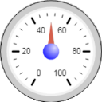

ioBroker.vis-rgraph
============

rgraph - Gauge and Chart widgets for ioBroker.vis ported from http://www.rgraph.net/ (Richard Heyes)

In this package is MIT version of RGraph from 2014-03-28 is used. 
Later the license of RGraph was changed to CC-NC-BY and then to GPL.

## Changelog

### 0.0.2 (2015-10-04)
- (bluefox) add version output

### 0.0.1 (2015-10-04)
- (bluefox) initial checkin

## License
 Copyright (c) 2013-2015 bluefox https://github.com/GermanBluefox
 MIT