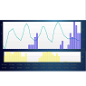

# IoBroker.vis-weather
Dieses Vis-Widget zeigt Wettervorhersagedaten von DasWetter.com oder WeatherUnterground. Sie benötigen DasWetter-Adpater oder WeatherUnterground-Adapter.

Bei wetterbedingtem Wetter müssen Sie die Vorhersage der nächsten 36 Stunden aktivieren.
In DasWetter.com benötigen Sie eine von vier aktivierten Prognosedatenstrukturen. Sie können den auswählen, den Sie anzeigen möchten.

## Hinweise / Wiki
### Prognostundenstunden definieren
Standardmäßig zeigt das Prognosediagramm 40 Stunden (DasWetter) oder 36 Stunden (Wunderground). Wenn Sie es vorziehen, nur z. 10 Stunden Vorhersage, löschen Sie einfach die unnötigen OIDs unter oid_groups in vis-edit.

### OIDs werden bei Verwendung von DasWetter nicht automatisch erstellt
Normalerweise werden OIDs automatisch erstellt, wenn Sie die Instanz- oder Datenstruktur auswählen. Wenn Sie "keine OIDs verfügbar" erhalten, prüfen Sie, ob Sie in "DasWetter" "NextDaysDetailed" verwenden.
Möglicherweise müssen Sie "NextDaysDetailed" aktivieren.

## Bekannte Probleme
* Bitte erstellen Sie Probleme unter [github] (https://github.com/rg-engineering/ioBroker.vis-weather/issues), wenn Sie Fehler finden oder neue Funktionen wünschen

## Changelog

### 2.3.0 (2019-03-25)
* (René) markings added

### 2.2.2 (2018-12-30)
* (René) bug fix: If oid_date is not set when using weatherunderground, an unnecessary error message was issued and the plot was not shown

### 2.2.1 (2018-12-23)
* (René) bug fix issue #12: unnecessary code removed

### 2.2.0 (2018-08-25)
* (René) OID's for different data structures (only DasWetter 2.x)

### 2.1.1 (2018-08-24)
* (René) bug fixes

### 2.1.0 (2018-08-18)
* (René) support of 2.x of weatherundergruond

### 2.0.0
* (René) support of 2.x of daswetter.com

### 1.2.0
* (René) background color and border

### 1.1.2
* (René) Support of admin3

### 1.1.1
* (René) Y axis with units

### 1.1.0
* (René) logs auskommentiert
* (René) Berechnung min / max für Temperaturgraph optimiert
* (René) Y-Achse automatisch ausblenden, wenn Graph nicht dargestellt wird
* (gitbock) konfigurierbare Y-Achsen je Graph (anzeigen/nicht anzeigen)
* (gitbock) Y-Achsen Beschriftung in der Farbe des Graphen
* (gitbock) Max.-/Min Werte für Temperatur Y-Achse
* (gitbock) konfigurierbares Datumsformat für X-Achse

### 1.0.0
* (René) first stable version

### 0.0.7
* (René) bug fix for android app > 1.0.6
* (René) color adjustment for ticks and tick lable (from sbfspot)

### 0.0.6
* (René) css removed

### 0.0.5
* (René) number of labels on X axis adjustable

### 0.0.4
* (René) bug fixes

### 0.0.3
* (René) support of DasWetter.com and weatherunderground

### 0.0.2
* (René) bug fixes
	- in live mode nothing was shown

### 0.0.1
* (René) initial release

## License
Copyright (C) <2017 - 2019>  <info@rg-engineering.eu>

Permission is hereby granted, free of charge, to any person obtaining a copy of this software and associated documentation files (the "Software"), to deal in the Software without restriction, including without limitation the rights to use, copy, modify, merge, publish, distribute, sublicense, and/or sell copies of the Software, and to permit persons to whom the Software is furnished to do so, subject to the following conditions:

The above copyright notice and this permission notice shall be included in all copies or substantial portions of the Software.

THE SOFTWARE IS PROVIDED "AS IS", WITHOUT WARRANTY OF ANY KIND, EXPRESS OR IMPLIED, INCLUDING BUT NOT LIMITED TO THE WARRANTIES OF MERCHANTABILITY, FITNESS FOR A PARTICULAR PURPOSE AND NONINFRINGEMENT. IN NO EVENT SHALL THE AUTHORS OR COPYRIGHT HOLDERS BE LIABLE FOR ANY CLAIM, DAMAGES OR OTHER LIABILITY, WHETHER IN AN ACTION OF CONTRACT, TORT OR OTHERWISE, ARISING FROM, OUT OF OR IN CONNECTION WITH THE SOFTWARE OR THE USE OR OTHER DEALINGS IN THE SOFTWARE.