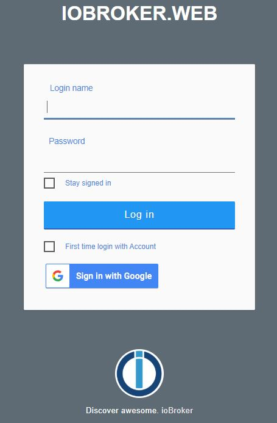

# IoBroker.weblogin
Dieser Adapter ist eine Erweiterung der [Webadapter](https://github.com/ioBroker/ioBroker.web).
Es erweitert die Anmeldeseite um alternative Anmeldemöglichkeiten (Social Media Logins).
Derzeit werden nur die [Google-Authentifizierung](https://github.com/Vertumnus/ioBroker.googleauth) unterstützt.

Natürlich ist die Erweiterung nur dann nützlich, wenn Sie die Authentifizierung auf Ihrem ioBroker-Webserver aktiviert haben.

## Aufbau
### Erweiterter Webadapter
Hier können Sie die Instanz des Webadapters auswählen, den Sie um diesen Adapter erweitern möchten.
Standard ist Alle Instanzen.

### Kontrollkästchen für die erstmalige Anmeldung anzeigen
Aktivieren Sie dieses Kontrollkästchen, wenn Sie auf der Anmeldeseite ein Kontrollkästchen für die erstmalige Anmeldung benötigen.
In der Regel ist dies erforderlich, um Ihr bevorzugtes Social-Media-Konto mit Ihrem Benutzerprofil in ioBroker zu verknüpfen.
Standardmäßig ist es aktiviert.

### Google
Die derzeit nur unterstützte alternative Anmeldemöglichkeit. Wenn diese Option aktiviert ist, wird auf der Anmeldeseite die Schaltfläche "Mit Google anmelden" angezeigt.
Diese Möglichkeit erfordert das Kontrollkästchen für die erstmalige Anmeldung. Standardmäßig ist es aufgrund seiner Eindeutigkeit aktiviert.

## Verwendung
Wenn dieser Adapter installiert und konfiguriert ist, werden auf der Webanmeldeseite zusätzliche Elemente angezeigt.
Abhängig von der Konfiguration werden das Kontrollkästchen für die erstmalige Anmeldung und die Anmeldeschaltflächen für die von Ihnen ausgewählten Social Media-Anmeldungen angezeigt.

## License
MIT License

Copyright (c) 2021 [Armin Junge](mailto:armin.junge.81@gmail.com)

Permission is hereby granted, free of charge, to any person obtaining a copy
of this software and associated documentation files (the "Software"), to deal
in the Software without restriction, including without limitation the rights
to use, copy, modify, merge, publish, distribute, sublicense, and/or sell
copies of the Software, and to permit persons to whom the Software is
furnished to do so, subject to the following conditions:

The above copyright notice and this permission notice shall be included in all
copies or substantial portions of the Software.

THE SOFTWARE IS PROVIDED "AS IS", WITHOUT WARRANTY OF ANY KIND, EXPRESS OR
IMPLIED, INCLUDING BUT NOT LIMITED TO THE WARRANTIES OF MERCHANTABILITY,
FITNESS FOR A PARTICULAR PURPOSE AND NONINFRINGEMENT. IN NO EVENT SHALL THE
AUTHORS OR COPYRIGHT HOLDERS BE LIABLE FOR ANY CLAIM, DAMAGES OR OTHER
LIABILITY, WHETHER IN AN ACTION OF CONTRACT, TORT OR OTHERWISE, ARISING FROM,
OUT OF OR IN CONNECTION WITH THE SOFTWARE OR THE USE OR OTHER DEALINGS IN THE
SOFTWARE.