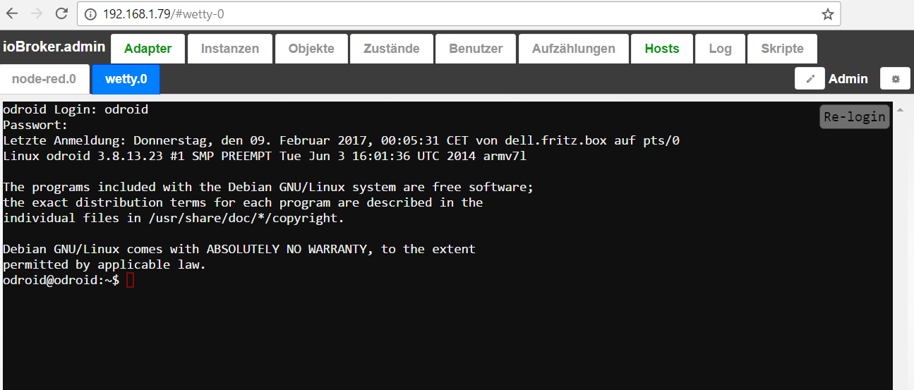

# IoBroker.wetty
Basierend auf [wetty](https://github.com/krishnasrinivas/wetty).

Wetty = Web + tty. Terminalzugriff im Browser über http / https

Wetty-Server zum Öffnen der Befehlszeilenschnittstelle.
Bitte verwenden Sie es nur für Verwaltungszwecke.

Terminal über HTTP und HTTPS. Wetty ist eine Alternative zu ajaxterm / anyterm, aber es ist viel besser als sie, da wetty den Terminal-Emulator (hterm) von ChromeOS verwendet, eine vollständige Implementierung der vollständig in Javascript geschriebenen Terminal-Emulation.
Es verwendet auch Websockets anstelle von Ajax und somit eine bessere Reaktionszeit.

## Changelog

#### 0.1.1
* (bluefox) inital commit