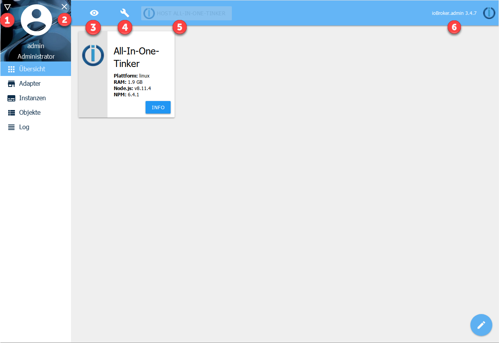

# Einleitung

?> ***Dies ist ein Platzhalter***.
     
   Hilf mit bei ioBroker und erweitere diesen Artikel.  
   Bitte beachte den [ioBroker Style Guide](community/styleguidedoc),
   damit die Änderungen einfacher übernommen werden können.

@@@   
Ziel hier ist "High Level" Beschreibung der wichtigsten Screens der 
Admin-Oberfläche. Vielleicht je Screen ein Bild mit Erklärung der 
wesentlichen Bereiche.  
Sub-Dialoge und Details (z.B. Feldbeschreibungen) sollten in die 
Adapter-Referenz zum Admin-Adapter verweisen.   
@@@

!> Wegen des Umfangs der Dokumentation ist dies nur eine Übersicht, ausführliche Informationen sind in den Seiten hinterlegt, die über die Überschriften der Abschnitte zu den Reitern verlinkt sind. Bitte die Überschriften anklicken.

Der Adapter admin dient der Bedienung der gesamten ioBroker-Installation. Er stellt ein Webinterface zur Verfügung. Dieses wird unter der <IP-Adresse des Servers>:8081 aufgerufen. Dieser Adapter wird direkt bei der Installation von ioBroker angelegt.

Über das vom Adapter zur Verfügung gestellte GUI können u.a. folgenden Funktionen abgerufen werden:

* Installation weiterer Adapter
* Zugriff auf Objektübersicht
* Zugriff auf die Zustandsübersicht der Objekte
* Zugriff auf Benutzer und Gruppen Administration
* Zugriff auf das Logfile
* Verwaltung der Hosts

## Installation
Dieser Adapter wird direkt bei der Installation von ioBroker angelegt eine manuelle Installation ist nicht notwendig

## Konfiguration (im Reiter Instanzen)

### IP
Hier wird die IP-Adresse unter der der Adapter erreichbar ist eingegeben. Verschiedene Ipv4 und Ipv6 Möglichkeiten stehen zur Auswahl. Default ist 0.0.0.0. Dies darf nicht verändert werden!

### Port
Hier wird der Port, unter der der Administrator aufgerufen werden kann eingestellt. Falls auf dem Server mehrere Webserver laufen muss dieser Port angepasst werden, damit es nicht zu Problemen wegen doppelter Portvergabe kommt.

### Verschlüsselung
Soll das sichere Protokoll https verwendet werden ist hier ein Haken zu setzen.

### Authentifikation
Soll eine Authentifizierung erfolgen ist hier ein Haken zu setzen.

## Bedienung
Über den Webbrowser die folgende Seite aufrufen: <IP-Adresse des Servers>:8081

## Reiter
Die Hauptseite des Administrators besteht aus mehreren Reitern. In der Grundinstallation werden die Reiter wie in der Abbildung angezeigt. Über das Dreieck-Icon links oben (1) können nach der Installation zusätzlicher Adapter weitere Reiter hinzugefügt werden. Dort können auch Reiter deaktiviert werden um eine besser Übersicht zu erhalten.

Über das **X**  (2) kann die Menüleiste mit den Reitern ausgeblendet werden um auf mobilen Geräten mehr Platz zu schaffen.

Ausführliche Informationen sind in den Seiten hinterlegt, die über die Überschriften verlinkt sind.

### [Adapter](../admin/adapter.md)
Hier werden die verfügbaren und installierten Adapter angezeigt und verwaltet.

### Instanzen
Hier werden die bereits über den Reiter Adapter installierten Instanzen aufgelistet und können entsprechend konfiguriert werden.

### Objekte
Die verwalteten Objekte (z.B. die Geräte/Variablen/Programme der CCU). Hier können Objekte angelegt und gelöscht werden. Über die Pfeil hoch und Pfeil runter Knöpfe können ganze Objektstrukturen hoch- oder runtergeladen werden. Ein weiterer Knopf ermöglicht die Anzeige der Expertenansicht.

Werden Werte in roter Schrift angezeigt, sind sie noch nicht bestätigt (ack = false).

### Zustände
Die aktuellen Zustände der Objekte.

### Ereignisse
Eine Liste der laufenden Aktualisierung der Zustände.

### Gruppen
Hier werden die angelegten Usergruppen angelegt und die Rechte verwaltet

### Benutzer
Hier können Benutzer angelegt und zu den bestehenden Gruppen hinzugefügt werden.

### Aufzählungen
Hier werden die Favoriten, Gewerke und Räume aus der Homematic-CCU aufgelistet.

### hosts
Informationen über den Rechner, auf dem ioBroker installiert ist. Hier kann die aktuelle Version des js-Controllers upgedated werden. Liegt eine neue Version vor, erscheint die Beschriftung des Reiters in grüner Farbe.

### Log
Hier wird das log angezeigt

Im Reiter Instanzen kann bei den einzelnen Instanzen der zu loggende Loglevel eingestellt werden. In dem Auswahlmenü wird der anzuzeigende Mindest-Loglevel ausgewählt. Sollte ein Error auftreten, erscheint die Beschriftung des Reiters in roter Farbe.

## Systemeinstellungen (4)
In dem sich hier öffnenden Menü werden Einstellungen wie Sprache, Zeit- und Datumsformat sowie weitere systemweite Einstellungen getätigt.

Auch die Repositorien und Sicherheitseinstellungen können hier eingestellt werden.