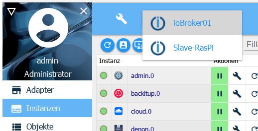

# Das Instanzen-Fenster

?> ***Dies ist ein Platzhalter***.
     
   Hilf mit bei ioBroker und erweitere diesen Artikel.  
   Bitte beachte den [ioBroker Style Guide](community/styleguidedoc),
   damit die Änderungen einfacher übernommen werden können.

# Der Reiter Instanzen
Hier werden die bereits über den Reiter Adapter installierten Instanzen aufgelistet und können entsprechend konfiguriert werden.

## Die Titelzeile
in der Titelzeile befinden sich Icons für die wichtigsten Vorgänge. Zu jedem Icon gibt es eine Kontexthilfe. Dazu einfach mit der Maus eine Weile auf dem Icon bleiben. Außerdem gibt es noch Informationen zu der Auslastung des Servers

Die Icons im einzelnen:

**1.)  Ansicht aktualisieren**

Sollten gerade erst angelegte Instanzen nicht sichtbar sein, hilft ein Anklicken dieses Icons den Zustand der Seite auf den neuesten Stand zu bringen.

**2.) Administratormodus einschalten**

Bei Anwahl dieses Icons werden weitere Spalten zur Konfiguration der Instanzen angezeigt (Toggle-Funktion). Informationen dazu im Abschnitt Seiteninhalt.

**3.) Nur Instanzen des ausgewählten Hosts anzeigen**

In Multihost-Systemen werden die Instanzen aller Hosts über den Admin des Masters verwaltet. Die Information 
auf welchem Host sich diese Instanz befindet steht in der Spalte ***Server***

Wenn im Header ein Host ausgewählt ist, kann man sich mit diesem Button nur die dort installiertne Instanzen anzeigen lassen.

**4.) Filter**

In dieses Feld kann ein Begriff zum Filtern oder zur Suche nach Instanzen eingegeben werden

## Weitere Informationen im Fenster Instanzen

Die ersten Zahlen geben den bisher von den Instanzen verbrauchten Arbeitsspeicher und den restlichen freien Speicher in MB an. Dahinter den freien Speicher in %. In den eckigen Klammern steht der Name des ioBroker-Servers und die Anzahl der laufenden Prozesse.

##Der Seiteninhalt

iobroker_admin_instanzen_headline_columns

Auf der Seite werden die installierten Instanzen der Adapter tabellarisch dargestellt.

Die Tabelle besteht aus folgenden Spalten:

1.) Zustand
Hier wird durch eine Ampel der Zustand der Instanz dargestellt. Weitere Informationen erhält man indem man mit der Maus auf dem Signal stehen bleibt.

iobroker_admin_instanzen_status

Nicht alle Instanzen besitzen diese Ampel. Dies ist aber kein Grund zur Panik. Dies sind entweder zeitgesteuerte Instanzen, die sich nur kurz mit dem Controller verbinden und sich dann sofort wieder abschalten oder wie z.B. vis im Hintergrund weiterlaufen.

2.) Icon
Hier wird das Icon angezeigt, das ioBroker-weit für diesen Adapter verwendet wird

3.) Instanz
In dieser Spalte steht der Name der Instanz. er setzt sich zusammen aus dem Namen des Adapters sowie einer Zahl, die in der Reihenfolge der Installation der Instanzen fortlaufend durchnummeriert wird. Die erste Instanz erhält die 0. Diese Bezeichnung ist die Grundlage für die Bezeichnung der Datenpunkte in ioBroker.

4.) aktiviert
Hier wird die Instanz gestartet oder angehalten. Das grüne Pause-Zeichen zeigt an, dass der Adapter läuft und durch den Klick darauf pausiert werden kann, das rote Play-Zeichen zeigt eine gestoppte Instanz, die mit einem Klick gestartet werden kann.

5.) Konfiguration
Bei Anklicken dieses Icons wird ein adapterspezifisches Konfigurationsmenü geöffnet. Die entsprechenden Menüs sind bei den dazugehörigen Adaptern beschrieben.

6.) restart
Beim Klick auf dieses Icon wird die entsprechende Instanz neu gestartet

7.) Mülleimer
Mit diesem Icon wird die entsprechende Instanz gelöscht. Andere Instanzen des selben Adapters bleiben erhalten. Auch der Adapter selbst bleibt bestehen.

8.) Weblink
Hinter diesem Icon verbirgt sich ein Link auf die Website dieser Instanz. Entweder weil dieser Adapter ein eigenes Webinterface (mit anderem Port) mitbringt, oder nur einen anderen Pfad. Teilweise führt dieser Link auch auf Hilfeseiten.

9.) Titel
Hier wird der Name der Instanz angegeben. Diesen Namen kann man nach den eigenene Wünschen oder Bedürfnissen änder. Dies ist insbesondere dann sinnvoll, wenn es von einem Adapter mehrere Instanzen (mit sonst gleicher Bezeischnung) gibt. Dies wäre z.B. bei hm-rpc der Fall, wenn es für RF, Wired und CuxD je eine Instanz gibt.

10.) Zeitplanung
Bei Adaptern, die zeitgesteuert gestartet werden, wird hier eingetragen wann dieser Adapter starten soll. Diese Zeitplanung ist im Format eines cronjobs. Zur Änderung klickt man auf den Button mit den drei Punkten. Es öffnet sich ein Eingabefenster mit sehr viel Zusatzinformationen und Hilfe.

iobroker_admin_instanzen_cronjob

11.) Neu starten
Wenn diese Checkbox angehakt wird kann hier ebenfalls ein Zeitplan erstellt werden wann diese Instanz neu gestartet werden soll.

12.) Log Stufe
In dieser Spalte kann der jeweilige Loglevel für die Instanz angepasst werden. Zur Verfügung stehen debug, info, warn und error. Standardmäßig steht dieser Wert auf info. Hat man den Eindruck, dass etwas nicht ganz rund läuft kann man ihn auf debug stellen. dann werden im Reiter log zu dieser Instanz auch debug Informationen ausgegeben, die helfen können einen Fehler zu finden. Umgekehrt kann man diesen Wert auch höher stellen, damit das log nicht so umfangreich wird.

13.) RAM Limit
Hier kann man vorgeben wieviel Arbeitsspeicher der Instanz vorsorglich bereitgestellt werden soll. Diese Menge Speicher steht dann anderen Aufgaben nicht mehr zur Verfügung und sollte gerade bei Systemen mit wenig Arbeitsspeicher nicht zu hoch gewählt werden. Sollte die Instanz vorübergehend mehr Speicher benötigen, wird ihr dieser vom System selbstverständlich zugeteilt werden aber anschließend sofort wieder für das System freigegeben. In der Zeit, in dere eine Instanz mehr Speicher benötigt, als ihr reserviert wurde wird der benötigte Speicher rot dargestellt.

14.) RAM Benutzung
Hier wird der tatsächlich von der Instanz verwendete Arbeitsspeicher angezeigt. Diese Werte werden regelmäßig aktualisiert. Nach der Aktualisierung erscheinen diese Werte kurz in grüner Schrift.
