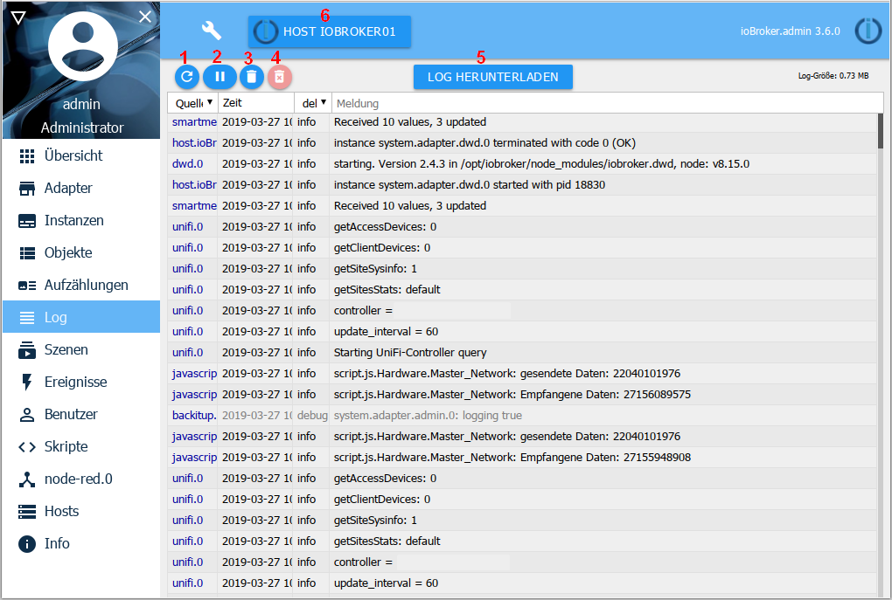
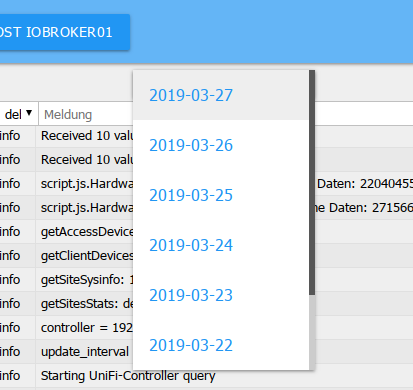
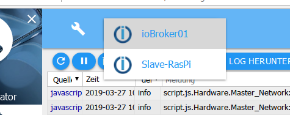

# Die Log-Seite

Hier werden die Meldungen des Systems kontinuierlich ausgegeben. Die neueste 
Meldung befindet sich oben.

## Die Titelzeile

in der Titelzeile befinden sich Icons für die wichtigsten Vorgänge. Zu jedem Icon gibt 
es eine Kontexthilfe. Dazu einfach mit der Maus eine Weile auf dem Icon bleiben.

### Die Icons im einzelnen:
 

**1.) Log aktualisieren**

Mit diesem Button wird die die Liste aktualisiert.

**2.) Aktualisierung anhalten**

Bei einem Klick auf diesen Button wird die ständige Aktualisierung der Liste angehalten. 
Statt des Pause-Icons erscheint jetzt die Anzahl der neuen, nicht angezeigten Meldungen.

**3.) Liste löschen**

Mit dem Klick auf dieses Icon wird nur die auf dem Bildschirm befindliche Liste gelöscht

**4.) Log auf dem Host löschen**

Mit dem Klick auf dieses Icon wird das gesamte Log auf dem Host endgültig gelöscht.

 
**5.) Log herunterladen**
mit diesem Button kann man ein komplettes Tageslog der letzten Tage aus dem 
Verzeichnis /opt/iobroker/logs herunterladen:

Dabei erhält man den folgenden Screen:

Da in der Auflistung im Log-Fenster oft Zeilen abgeschnitten werden, ist es wichtig hier einmal nachzusehen ob es mehr Informationen gibt.

**6.) Host-Liste**

In dem Log werden nur Meldungen angezeigt, die von dem hier eingestellten Host kommen. In Multihost-Umgebungen kann man hier den zu loggenden Host einstellen.
 

## Der Seiteninhalt

 

Auf der Seite werden die vorhandenen Objekte tabellarisch dargestellt.

Die Spaltenköpfe 1 und 3 enthalten Pulldownmenüs die als Filterkriterien dienen, 
in Spalte 4 kann ein Filterkriterium frei eingegeben werden

**1.) Quelle**

Mit diesem Pulldownmenü können die Meldungen nach der loggenden Instanz gefiltert 
werden. In dem Menü werden nur die Instanzen angezeigt, zu denen es auch Einträge 
auf der Seite gibt.

**2.) Zeit**

Hier wird der Timestamp der Meldung aufgelistet. Diese Spalte ist nicht filterbar. 

**3.) angezeigter Loglevel**

Mit diesem Menü kann eingestellt werden welcher Schweregrad der Meldung angezeigt 
werden soll. Hierbei handelt es sich jedoch nur um einen Filter der vorhandenen Liste. 
Um für eine Instanz das Logging in einem bestimmten Level festzulegen muss dieses 
auf der Instanzen-Seite eingestellt werden.

Fehler werden in roter Schrift dargestellt:

Liegt ein Fehler auf irgendeinem Host vor, erscheint auch die Beschriftung ***Log*** 
in der Menüleiste in roter Schrift.

**4.) Meldung**

In dieser Spalte wird die jeweilige Meldung angezeigt, soweit sie in die Spalte passt. 
Der Rest wird abgeschnitten. Mit Mouse-Over kann man noch die ganze Meldung sehen. 
Zum posten im Forum bitte das Log herunterladen und die Meldung dort heraus kopieren.

