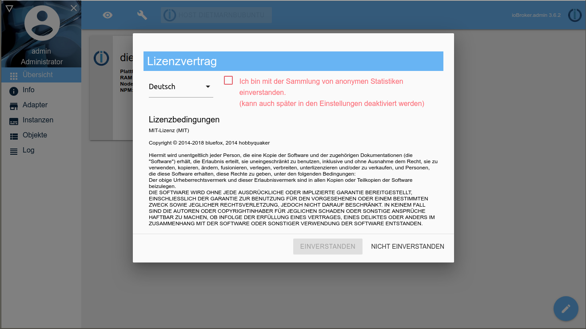
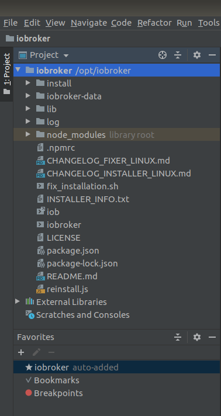
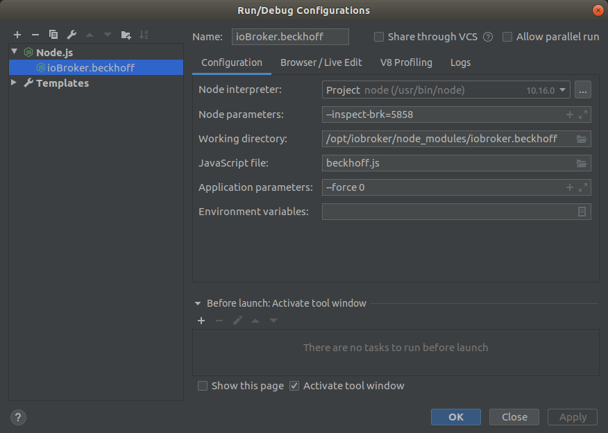
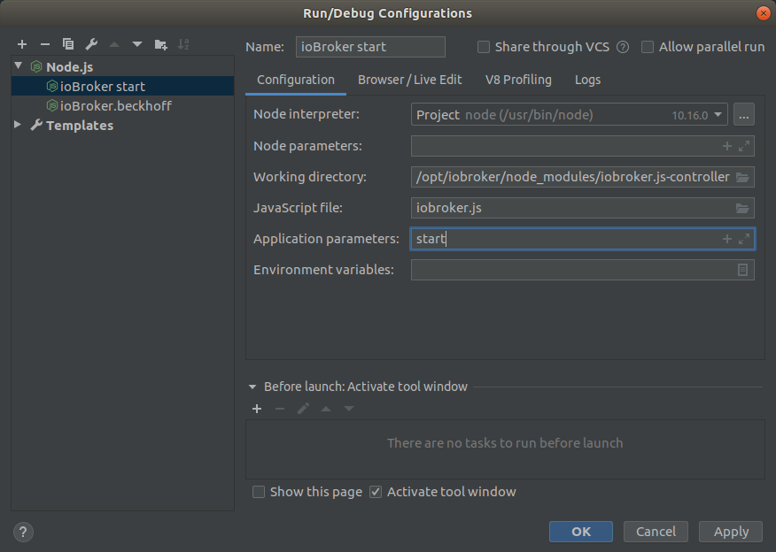
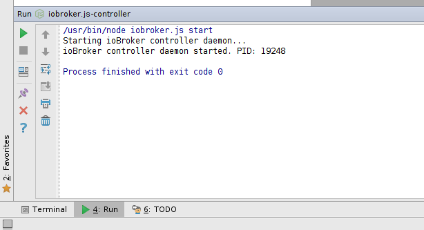
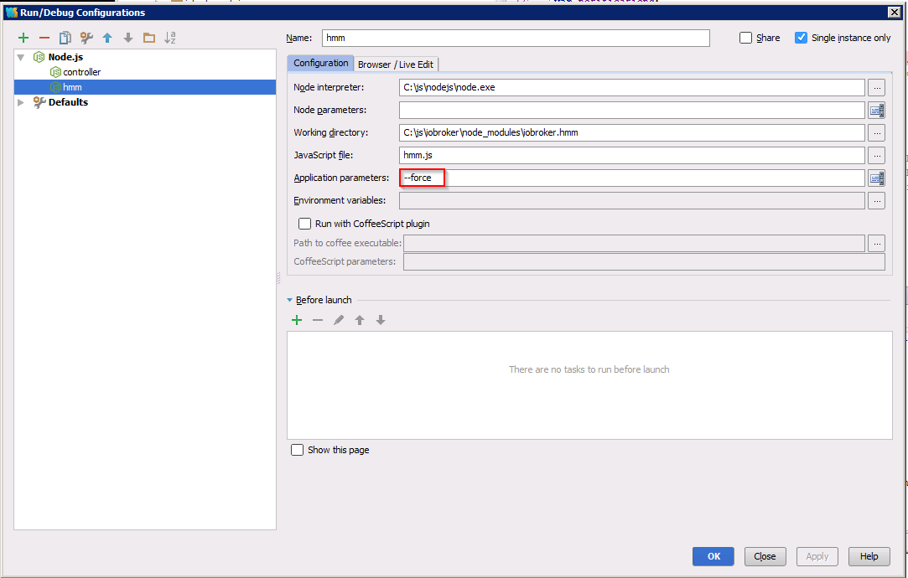
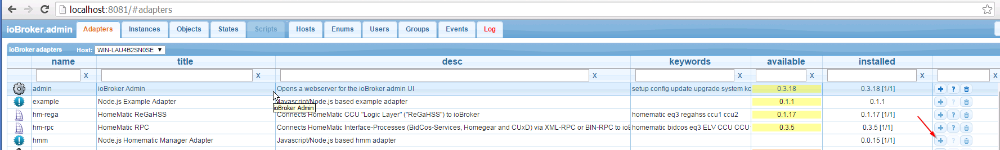
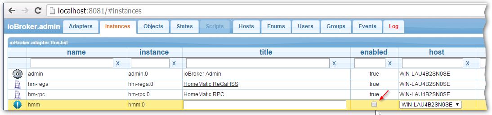
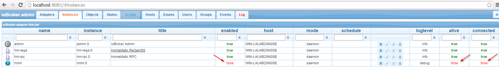
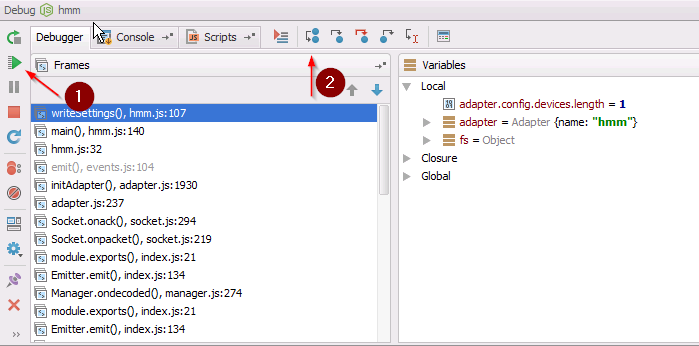

# WebStorm
Auf dieser Seite zeigen wir Ihnen, wie Sie eine ioBroker-Entwicklungsumgebung installieren und einrichten.
WebStorm wird für die Hauptentwicklung verwendet, möglicherweise ist [Visual Studio Code](./vscode.md) eine Alternative.

Diese Dokumentation ist wie ein "Kochbuch", aber ohne Erklärungen zu Javascript, NodeJS, HTML5 usw.

## Installation von WebStorm
### Linux
*Hinweis: Je nach Linux Distribution kann die Installation abweichen. Hier wird die Installation auf Ubuntu 18.04 beschrieben.*
 1. Gehen Sie auf die Webseite von [jetBrains](https://www.jetbrains.com/webstorm/download/#section=linux) und laden Sie WebStorm für Linux herunter
 
 2. Öffnen Sie ein Terminal und wechseln Sie in das Download-Verzeichnis
 
 3. Entpacken Sie die Datei mit `sudo tar xfz WebStorm-*.tar.gz -C /opt/` in das Verzeichnis /opt/
 
 4. Wechseln Sie in den Ordner /opt/WebStorm-*/bin/ und geben Sie `./webstorm.sh` ein
 
 5. Auf dem Welcome Screen können Sie dann unter `Configure -> Create Desktop Entry` die jeweiligen Einträge erstellen, damit Sie später, das Programm über die grafische Oberfläche starten können

### Windows
 1. Gehen Sie auf die Webseite von [jetBrains](https://www.jetbrains.com/webstorm/download/#section=windows) und laden Sie WebStorm für Windows herunter
 
 2. Führen Sie die WebStorm.*.exe aus und folgen Sie dem Installationswizard

## Installation von Node.js
### Linux
*Hinweis: Je nach Linux Distribution kann die Installation abweichen. Hier wird die Installation auf Ubuntu 18.04 beschrieben.*
 1. Öffnen Sie ein Terminal und installieren Sie curl mit dem Befehl `sudo apt-get install curl`
 
 2. Sobald curl installiert ist können Sie das jeweilig gewünschte PPA hinzufügen. Das PPA unterscheidet sich je nach Version die Sie installieren wollen. Wir empfehlen Ihnen mit der aktuellen  LTS Version zu arbeiten. Zum Zeitpunkt der Erstellung dieser Anleitung ist dies Node.js 10. Der Befehl dafür lautet `curl -sL https://deb.nodesource.com/setup_*.x | sudo -E bash -` -> z.B. `curl -sL https://deb.nodesource.com/setup_10.x | sudo -E bash -`
 
 3. Dann können Sie Node installieren `sudo apt-get install nodejs`
 
 4. Um zu Überprüfen ob die Installation erfolgreich war können Sie die Versionen von Node.js und npm abfragen `node -v` bzw. `npm -v`
 
 ### Windows
  1. Gehen Sie auf die Website von [Node.js](https://nodejs.org/en/download/) und laden Sie den Windows Installer (.msi) 64-bit herunter
  
  2. Führen Sie die node-v*-x64.msi aus und folgen dem Installationswizard

## Installation von ioBroker
### Linux
*Hinweis: Je nach Linux Distribution kann die Installation abweichen. Hier wird die Installation auf Ubuntu 18.04 beschrieben.*
 1. Öffnen Sie ein Terminal und installieren Sie die notwendigen Build Tools für die Installation von ioBroker. Dies können Sie mit folgendem Befehl `sudo apt-get install -y build-essential libavahi-compat-libdnssd-dev libudev-dev libpam0g-dev`
 
 2. Da Sie curl durch die Node.js Installation bereits installiert haben sollten, können Sie gleich mit der Installation von ioBroker fortfahren `curl -sL https://iobroker.net/install.sh | bash -`
 
    __Wichtig__: Da Linux ein sehr striktes Rechtesystem hat ist es wichtig sich zu überlegen mit welchem User der ioBroker installiert wird. Werden Funktionen bzw. Adapter genutzt die "Root" Rechte benötigen sollte der ioBroker gleich mit Root rechten installiert werden. In allen anderen Fällen empfiehlt es sich, den ioBroker mit dem User zu installieren mit dem auch das Debugging ausgeführt wird. Die "Root" installation hat den Nachteil das Webstorm nicht mehr so ohne weiteres Dateien verändern kann. Mit dem Befehl `sudo chmod -R 777 /opt/iobroker` im Terminal kann das Problem gelöst werden, muss aber nach einer Neuinstallation eines Adapters wiederholt werden.
    
 3. Folgen Sie dem Installationswizard. Ist die Installation abgeschlossen öffnen Sie Ihren Browser mit http://localhost:8081. Sie sollten den Begrüßungsbildschirm von ioBroker sehen.

### Windows
 1. Erstellen Sie den Ordner ioBroker im Root-Verzeichnis ihres Laufwerkes. z.B. C:\ioBroker
 
 2. Öffnen Sie eine Eingabeaufforderung und welchseln sie in das ioBroker Verzeichnis z.B. `cd /d C:\ioBroker`
 
 3. Starten Sie die Installation des ioBroker's mit dem Befehl `npm install iobroker` und folgen Sie dem Installationswizard. Ist die Installation abgeschlossen öffnen Sie Ihren Browser mit http://localhost:8081. Sie sollten den Begrüßungsbildschirm von ioBroker sehen.
 

## Konfigurieren Sie WebStorm, um einen Adapter zu debuggen
*Hinweis: Die Konfiguration von WebStorm unterscheidet sich kaum zwischen Linux und Windows, deshalb werden wir hier nicht mehr unterscheiden*

 1. Öffnen Sie WebStorm
 
 2. Klicken Sie auf `File -> Open` und wählen Sie den iobroker Wurzelordner aus
 
 3. Ihr neues WebStorm-Projekt sollte so aussehen...
 
    

### Erstellen Sie die "Run Configuration" des ioBrokers und des Adapters
1. Gehen Sie zu `Run -> Edit Configuration` und erstellen Sie eine Node.js Konfiguration.

   

2.  Füllen Sie die Felder wie folgt aus, beachten Sie aber die Systembedingten underschieden in den Pfaden `Node interpreter` und `Working directory`. Hier an dem Beispiel des ioBroker.beckhoff Adapters mit der die Instanznummer 0 dargestellt. Dies kann aber auf jeden Adapter übertragen werden. Zu beachten ist das im Feld `Application parameters` die richtige Instanz angegeben wird. 

    
    
 3. Damit sie den ioBroker aus WebStorm heraus starten können empfehlen wir Ihnen auch eine "Run Configuration" für den ioBroker zu erstellen. Startet ioBroker mit dem Betriebssystem mit, ist dies nicht notwendig.
 
    
    
### Debuggen eines Adapters
 1. Falls ioBroker noch nicht läuft starten Sie ioBroker mit der Auswahl...

    

2. Sie fragen sich vielleicht, wie Sie ioBroker stoppen können? Öffnen Sie ein Terminal in WebStorm und geben Sie folgendes ein ...

    

## So debuggen Sie einen ioBroker-Adapter
In diesem Kapitel erfahren Sie, wie Sie einen ioBroker-Adapter wie "iobroker.hmm" debuggen können.
Starten Sie den ioBroker wie zuvor erwähnt. Verwenden Sie nicht den "Debug-Modus". Verwenden Sie für ioBroker nur den "Run-Modus".
Installieren Sie einen Adapter wie ioBroker.hmm von der Befehlszeile aus wie folgt 

Konfigurieren Sie den WebStorm "Debug-Einstellungen" ...

Gehen Sie zur ioBroker-Webseite http:// localhost: 8081 und installieren Sie den iobroker.hmm-Adapter: 

Nach der Installation des Adapters müssen wir die Adapterinstanz deaktivieren ...

... weiter 

... am Ende sollten Sie dieses Ergebnis sehen: 

Nun zurück zu WebStorm. Öffnen Sie die Datei hmm.js und setzen Sie einen Haltepunkt wie diesen: 

Beginnen Sie mit dem Beheben des iobroker.hmm-Adapters: 

Wenn Sie am ersten Haltepunkt anhalten, können Sie die nächsten Schritte steuern, indem Sie 1) das Programm fortsetzen. 2) Schritt vorbei: 
