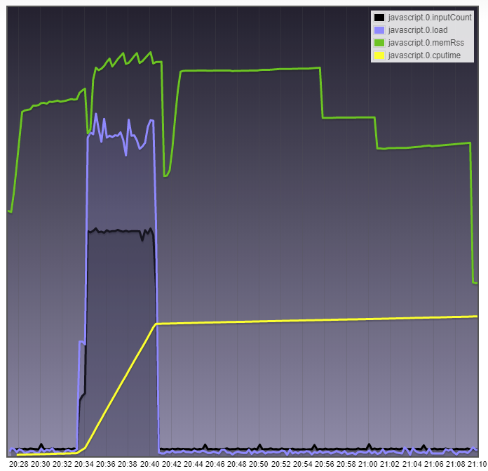

# Performancemonitoring
Ansatzpunkt für eine Performanceanalyse innerhalb von ioBroker ist die Objektauflistung im Admin. 
Dort werden Systeminformationen über den oder die Hosts (ioBroker ist Multihost-fähig) und zu 
den einzelnen Adaptern bereitgestellt. An diese Informationen gelangt man, indem man die Objektauflistung in den Expertenmodus umschaltet:

## Performancewerte von Hosts
Ein Host ist im ioBroker-Sprachgebrauch ein Rechner, der einen ioBroker js-Controller-Prozess ausführt. 
Das können in einer Multihost-Umgebung zur Verteilung der Last eben auch gerne mehrere Rechner sein. 
Sogar das jeweilig eingesetzte Betriebssystem darf sich unterscheiden. 
Eine hübsche Aufgabe für z.B. Raspberry Pi-Clusterstacks, um dort mit dem 1GB RAM Hardwarelimit klarzukommen.  

Der js-Controller der ioBrokers koordiniert das Starten und Stoppen der Adapter und führt im Hintergrund 
weitere Systemmanagementaufgaben aus. Im Admin sind zum jeweiligen Hostrechner sowie zum js-Controller 
unter der ID `system.host.<Name_des_Hostrechners>` Performance-Werte zu finden. 

Hier eine Auflistung der einzelnen Kennzahlen und ihre Bedeutung:

| Kennzahl | Datentyp | Einheit | Beschreibung |
|----------|----------|---------|--------------|
| **alive**          | Logik     | keine     | Zeigt an, ob der ioBroker js-Controller auf dem Host aktiv ist |
| **diskFree**       | Zahl      | MiB       | Freier Speicherplatz auf dem logischen Laufwerks, auf dem ioBroker installiert ist *bi = binäres Vielfaches (1 MB = 1.000.000 Byte) < (1 MiB = 1.048.576 Byte = 1 × 1024 × 1024 Byte)* |
| **diskSize**       | Zahl      | MiB       | Gesamtgröße des logischen Datenträgers, auf dem ioBroker installiert ist |
| **diskWarning**    | Zahl      | %         | Hier kann man einen Prozentwert eintragen. Im Admin wird eine Warnung angezeigt, wenn der freie Platz auf dem Datenträger diesen Wert unterschreitet (z.B. 20). Das ist vor allem sinnvoll, wenn der History-Adapter aktiv ist.  |
| **freemem**        | Zahl      | MB        | Gesamter verfügbarer RAM-Systemspeicher des Hosts |
| **inputCount**     | Zahl      | /15s      | Anzahl an Veränderungen bei den State-Werten. Ein Eingangsevent kann z.B. vom Anlegen oder Setzen eines Wertes ausgelöst werden |
| **load**           | Zahl      | %         | Gesamtsystemlast der CPU, gemittelt über jeweils eine Sekunde. Nicht wundern, unter Windows ist dieser Wert immer 0 |
| **mem**            | Zahl      | %         | Speichernutzung. Verhältnis zwischen freiem Speicher und Gesamtsystemspeicher |
| **memHeapTotal**   | Zahl      | MB        | Größe des vom js-Controller reservierten Heap-Speichers |
| **memHeapUsed**    | Zahl      | MB        | Größe des vom js-Controller genutzen Heap-Speichers |
| **memRss**         | Zahl      | MB        | Resident Set, gesamte Größe des vom js-Controller im RAM genutzen Speichers |
| **outputCount**    | Zahl      | /15s      | Ausgangs-Events umfassen Aktionen wie Wertevergleich, schreiben eines Wertes in die States-DB, Events aufgrund von Subscriptions oder das Logging eines Adapters um z.B. Aussagen über .connected|oder .alive-States zu bekommen. So kommen auch die 8 Events zustande, die typischerweise beim Ereignisausgangswert in der Instanzen-Liste stehen. |
| **uptime**         | Zahl      | s         | Laufzeit des ioBrokers auf diesen Host seit dem letzten Neustart |

Das folgende Schaubild zeigt symbolisch, wie Heap, Code und Stack zur Gesamtspeichernutzung **memRss** eines nodejs-Prozesses beitragen:

Wenn der Master-js-Controller selbst die Objekt- und State-Datenbank für das Gesamtsystem bereitstellt, 
kann man sehr schön mit dieser Kennzahl den Unterschied zwischen 300 und 3000 ioBroker-Objekte am 
Speicherverbrauch feststellen. So schwankt z.B. auf meinem Windows-System dieser Wert bei 3500 Objekten 
und 2700 States zwischen 75 und 128MB. Die in nodejs integrierte Garbage Collection lässt grüßen. 
Nutze ich hingegen Redis als State-Datenbank, geht der Speicherverbrauch für den js-Controller auf 50MB zurück. 
(Jetzt braucht Redis 25MB zusätzlich = wieder 75MB ;))

Übersteigt die Anzahl der Stateänderungen die Verarbeitskapazität von abhängien Eventkonsumenten 
(z.B. Javascript mit on:-Triggern), baut sich in den in-Memory-Datenbanken eine Warteschlange auf. 
Dies kann man am Speicherverbrauch des js-Controllers erkennen. Sobald die Systemlast wieder fällt 
und den Eventkonsumenten zur Verabeitung der ausstehenden Wertänderungen ausreichend Zeit gegeben wird, 
kehrt der Wert von memRss wieder auf den Ursprungswert zurück:

Wie so häufig in diesem Umfeld kann man anhand von fixen Wertangaben keine exakten Aussagen über die Ursache von Fehlern machen. 
Was jedoch häufig hilft, ist die Beobachtung eines fehlerfrei funktionierenden Systems (=Referenzwerte) und dann der 
Vergleich **des gleichen Systems** unter Fehlerbedingungen. Zusätzlich ist es sehr nützlich, wenn man den ein oder 
anderen Datenpunkt in der Histore mit aufzuzeichnet, um z.B. Tendenzen und Ausreißer festzuhalten.

## Performancewerte von Adaptern
Jeder Adapter hat seinen eigenen Performancekennzahlen. 
Sie sind jeweils unter der ID `system.adapter.<Name_des_Adapters>.<Instanz>` abgelegt und unterscheiden sich etwas von denen des Hosts.

| Kennzahl | Datentyp | Einheit | Beschreibung |
|----------|----------|---------|--------------|
| **alive**         | Logik | keine | Zeigt an, ob der Adapter aktiv geschaltet ist |
| **connected**     | Logik | keine | Gibt Auskunft, ob sich der Adapter innerhalb der letzten 30 Sekunden gemeldet hat |
| **inputCount**    | Zahl  | /15s  | Anzahl an Veränderungen bei den State-Werten. Ein Eingangsevent kann z.B. vom Anlegen oder Setzen eines Wertes ausgelöst werden |
| **memHeapTotal**  | Zahl  | MB    | Größe des vom Adapter reservierten Heap-Speichers |
| **memHeapUsed**   | Zahl  | MB    | Größe des vom Adapter genutzen Heap-Speichers |
| **memRss**        | Zahl  | MB    | Resident Set, gesamte Größe des vom Adapter im RAM genutzen Speichers |
| **inputCount**    | Zahl  | /15s  | Anzahl an Veränderungen der State-Werte. Ein Eingangsevent kann z.B. vom Anlegen oder dem Setzen eines Wertes ausgelöst werden |
| **outputCount**   | Zahl  | /15s  | Ausgangs-Events umfassen Aktionen wie Wertevergleich, schreiben eines Wertes in die States-DB, Events aufgrund von Subscriptions oder das Logging eines Adapters um z.B. Aussagen über .connected- oder .alive-States zu bekommen. So kommen auch die 8 Events zustande, die typischerweise beim Ereignisausgangswert in der Instanzen-Liste stehen. |
| **uptime**        | Zahl  | s     | Laufzeit des Adapters seit Adapterstart |

Wenn zum Beispiel der Javascript-Adapter urplötzlich nach einer Scriptänderung von 100 **inputCount**-Events
auf mehrere tausend hochschnellt, besteht die starke Vermutung, dass man eine Triggerschleife, 
d.h. ein Ringbezug in sein Script eingebaut hat. 

Sinnvoll ist auch die Betrachtung von **memRss**, um z.B. Speicherlecks durch Scripte oder in 
Adaptern zu erkennen. Mit **alive** und **connected** kann man sehr schön in vis den Status des Adapters 
visualisieren beziehungsweise die Anzeige von falschen Daten unterdrücken, wenn der Adapter keine neue Werte liefern kann.

## Ausblick und Frage
Da zeige ich einfach mal ein Bild als Blick in die Zukunft (und in meine Entwicklungumgebung):

Bei den Adaptern fehlt mir die Anzeige der durch den individuellen Adapter verursachen CPU-Last **cpu**. 
Immerhin will man auch ohne ressourcenhungriger Installation weiterer Monitoring-Adapter wissen, wer im 
System gerade der Übeltäter ist. Nachdem nodejs single-threated ist, bezieht sich hier die Anzeige auf 
einen CPU-Core. Mehr als 100% geht hier nicht. 

Da hilft auch der Einsatz von CPUs mit mehreren Cores nicht, wenn ein Adapter hier ständig hohe Werte anzeigt. 
Einzig eine schnellere CPU (im Volksmund höherer Takt), eine Optimierung des Programmcodes oder die Aufteilung 
der Last auf mehrere Adapter (sofern möglich) sind in diesem Fall zielführend. 

Über die Kennzahl **cputime** lässt dich die Summe der Prozessorzeit, die vom Adapter seit Start genutzt wurde, auswerten. 
Sie gibt Aufschluss über die Häufigkeit oder Intensität (Stichwort rechenintensiv), mit der ein Programm den Prozessor beansprucht. 
Diese Summe ist praktisch immer niedriger als die gesamte Laufzeit des Adapters **uptime**, da der Adapter selbst bei 
intensiver Nutzung kaum pausenlos Befehle an den Prozessor sendet. 

Hier sieht man schön, wie die verschiedenen Kennzahlen zusammspielen und wie die Reaktion des Javascript-Adapters 
auf eine plötzliche Anforderungswelle in Flot aussieht:

Übrigens war hier der Javascript-Adapter schon so ausgelastet, das er nicht mehr alle Events sofort annehmen konnte. 
Es bildete sich eine Event-Warteschlange.

Damit wir auch etwas mehr über die Auslastung des <u>Hosts</u> und dort speziell über den Master aller Adapter, dem js-controller, erfahren, habe ich auch für diesen einige Performancecounter vorgesehen. Die folgenden Zustammenstellung zeigt ein mögliches zukünftiges Aussehen der Host-Performancecounter.

Das gilt wie gesagt vorbehaltlich der Prüfung durch Bluefox und frühestens erst ab js-Controller 1.5.x:

Als Zusammenfassung die Bedeutung der Datenpunkte:

| Kennzahl | Datentyp | Einheit | Datenquelle | Beschreibung |
|----------|----------|---------|-------------|--------------|
| **alive**         | Logik | keine | js-controller | Zeigt an, ob der ioBroker js-Controller auf dem Host aktiv ist. Wechselt automatisch 25 Sekunden nach dem Ableben auf false |
| **cpu**           | Zahl  | % Auslastung eines Cores | js-controller | Gibt die Auslastung des Cores an, auf dem der js-controller ausgeführt wird. Sehr viel mehr als 100% geht hier nicht, da nodejs single-threaded ist |
| **cputime**       | Zahl  | s     | js-controller | Die Prozessorzeit (englisch CPU Time) bezeichnet die gemessene Zeit in Sekunden, in der der js-controller seit dem letzten Programmstart tatsächlich Kommandos an den Prozessor gesendet hat. Diese Summe ist praktisch immer niedriger als die gesamte Laufzeit (uptime) des Programms, da dieses selbst bei intensiver Nutzung kaum pausenlos Befehle an den Prozessor sendet. |
| **diskFree**      | Zahl  | MiB   |               | Freier Speicherplatz auf dem logischen Laufwerks, auf dem ioBroker installiert ist *bi = binäres Vielfaches (1 MB = 1.000.000 Byte) < (1 MiB = 1.048.576 Byte = 1 × 1024 × 1024 Byte)* |
| **diskSize**      | Zahl  | MiB   |               | Gesamtgröße des logischen Datenträgers, auf dem ioBroker installiert ist |
| **diskWarning**   | Zahl  | %     |               | Hier kann man einen Prozentwert eintragen. Im Admin wird eine Warnung angezeigt, wenn der freie Platz auf dem Datenträger diesen Wert unterschreitet (z.B. 20). Das ist vor allem sinnvoll, wenn der History-Adapter aktiv ist.  |
| **freemem**       | Zahl  | MB    |               | Gesamter verfügbarer RAM-Systemspeicher des Hosts |
| **inputCount**    | Zahl  | /15s  | js-controller | Anzahl an Veränderungen bei den State-Werten. Ein Eingangsevent kann z.B. vom Anlegen oder Setzen eines Wertes ausgelöst werden |
| **load**          | Zahl  |       |               | Gesamtsystemlast über alle CPU-Cores, gemittelt über jeweils eine Sekunde. Z.B. Rechner mit 8 CPU-Cores -> Wert 7.9 = System fast überlastet, 0.1 = nichts los; 4 Cores -> Wert 3.9 = Überlastung - wenn dauerhaft, 0.1 = nichts los |
| **mem**           | Zahl  | %     |               | Speichernutzung. Verhältnis zwischen freiem Speicher und Gesamtsystemspeicher |
| **memHeapTotal**  | Zahl  | MB    | js-controller | Größe des vom js-controller reservierten Heap-Speichers |
| **memHeapUsed**   | Zahl  | MB    | js-controller | Größe des vom js-controller genutzen Heap-Speichers |
| **memRss**        | Zahl  | MB    | js-controller | Resident Set, gesamte Größe des vom js-controller im RAM genutzen Speichers |
| **outputCount**   | Zahl  | /15s  | js-controller | Ausgangs-Events umfassen Aktionen wie Wertevergleich, schreiben eines Wertes in die States-DB, Events aufgrund von Subscriptions oder das Logging. So kommen auch hier die 10+ Events zustande |
| **uptime**        | Zahl  | s     | js-controller | Laufzeit des ioBrokers auf diesen Host seit dem letzten Neustart |
| **memAvailable**  | Zahl  | MB    | js-controller | (Nur auf *nix-Systemen) Verfügbarer freier Speicher für neue Speicheranforderungen, ohne das das System anfangen muss, belegten Speicher auszulagern. Berechnet aus MemFree, Active(file), Inactive(file), SReclaimable und den unteren Schwellwerten aus `/proc/zoneinfo`. Vgl. [https://git.kernel.org](https://git.kernel.org/pub/scm/linux/kernel/git/torvalds/linux.git/commit/?id=34e431b0ae398fc54ea69ff85ec700722c9da773) |