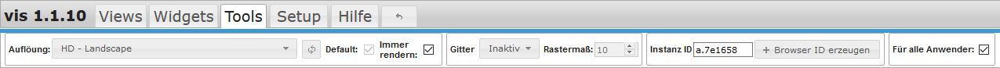
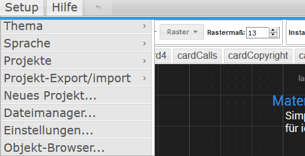
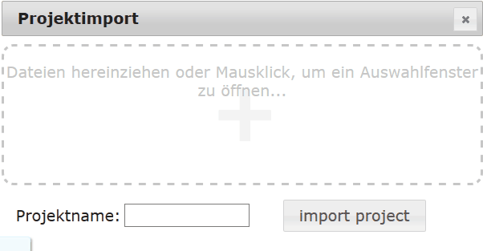
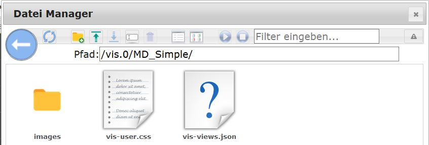

# Visualisierungen mit VIS

## Generell
@@@  
VIS ist eine mächtige Anwendung, die eine ausführliche Anleitung
und Tutorials verdient. In welcher Form und an welcher Stelle
diese Anleitung bereitgestellt wird, ist noch nicht definiert.  
@@@

##   
## Konfiguration

Eine Konfiguration des Adapters ist nicht nötig. Es kann nur eine VIS Instanz geben.

* * *

## Bedienung

Der Adapter wird über `<IPdesServers>:8082/vis/index.html` aufgerufen und damit die Visualisierung angezeigt. 
In einem Projekt befinden sich mehrere Ansichten (Views). 
Auf jeder View sind wieder mehrere Widgets frei platzierbar, die zur Anzeige oder Bedienung dienen. 
Zur Erstellung und Konfiguration einer Visualisierung muss man den **Editor** laden. 
Der Editor wird über `<IPdesServers>:8082/vis/edit.html` oder über den Hyperlink im Reiter Instanzen 
des admin-Adapter aufgerufen. 
Nach Schließen des Editors über das Close-Window Icon ( (x) rechts oben) wird die zuletzt bearbeitete View 
in der Funktionsansicht dargestellt. 
Dieser kann jederzeit aufgerufen werden mit `<IPdesServers>:8082/vis/index.html#ViewName` 
Der Editor teilt sich in verschiedene Bereiche auf.  

* * *

## Die Reiter im Kopfbereich (1)

### Views

Ist dieser Reiter angewählt, kann man in dem darunterliegenden Pulldown-Menü den zu bearbeitenden View 
aus den existierenden auswählen.  

Die vier Icons rechts daneben sind selbsterklärend und beziehen sich auf die Views. 
Nach Anklicken der Arbeitsfläche wechselt die Ansicht in der Eigenschaften-Sidebar auf der rechten Seite 
auf den Reiter Views und zeigt die Einstellungen für die View.

### Widgets

Wird der Reiter Widgets aktiviert ändert sich die darunterliegende Werkzeugleiste 

Die Werkzeuge für die Bearbeitung von Widgets werden angezeigt.

#### Pulldownmenü
Hier kann man ein Widget zur Bearbeitung auswählen, bzw. das ausgewählte Widget wird hier angezeigt.

#### Iconleiste
Die drei Icons für löschen, kopieren und Info werden aktiv, wenn ein Widget angewählt ist.

#### Widgets ausrichten  

Wenn man mit gedrückter Maustaste mehrere Widgets auswählt (oder mit Ctrl-Klick) 
kann man anschließend mit Hilfe dieser Icons Gruppen ausrichten 
(linksbündig, rechtsbündig, oben bündig, unten bündig, zentriert, mittig vertikal ausgerichtet). 
Außerdem kann man mehrere Widgets mit gleichem Abstand (horizontal und vertikal) positionieren, 
sowie mit den letzten beiden Icons die Größe von mehreren Widgets anpassen. 
Wählt man ein Widget an, wechselt die Ansicht in der Eigenschaften-Sidebar auf der rechten Seite 
auf den Reiter Widget und zeigt die Einstellungen für dieses Widget.
Mit der möglichen Mehrfachauswahl kann man über die rechte Sidebar die Eigenschaften mehrerer Widgets 
gleichzeitig verändern.

#### Alle Widgets
Die beiden Widgets dienen der einfacheren Bearbeitung von Views. 
Das erste sorgt dafür, dass die Werte der Widgets nicht aktualisiert werden, 
das zweite verhindert das Verschieben von Widgets.

#### Widget exportieren

Ist ein widget aktiviert, kann man mit diesem Button den CSS-Code des Widgets exportieren.

#### Widget importieren

Umgekehrt, kann man hier z.B. Widgets importieren, die nicht im Umfang von vis enthalten sind. 
Nach Anklicken eines Widgets wechselt die Ansicht in der Eigenschaften-Sidebar auf der rechten Seite 
auf den Reiter Widget und zeigt die Einstellungen für das ausgewählte Widget.

### Tools

Wird der Reiter Tools aktiviert ändert sich die darunterliegende Werkzeugleiste 

 Die Werkzeuge für die Erleichterung der Bearbeitung von [Views](http://www.iobroker.net/?page_id=1193&lang=de) werden angezeigt

#### Auflösung

Hier werden viele voreingestellte Bildschirmauflösungen von Mobilgeräten angezeigt, 
aber auch ein Punkt "Vom Anwender definiert" bietet die Möglichkeit eigene Einstellungen vorzunehmen. 
Wählt man hier etwas aus, wird auf der Arbeitsfläche ein Rahmen eingezeichnet, 
der der gewählten Bildschirmauflösung entspricht.

#### Default

Wenn _default_ angehakt ist, wird die aktive [View](http://www.iobroker.net/?page_id=1193&lang=de) 
zur Standardview gemacht und geladen, falls die VIS-Ansicht 
(siehe [Projekt](http://www.iobroker.net/?page_id=188&lang=de&preview_id=188&preview_nonce=d845a20ee2&preview=true#Projekt)) 
mit der oben eingestellten Auflösung geladen wird. 
**Beispiel:** Es wird die Anzeige _iPad Portrait_ gewählt und in der View _Start_ 
das Kästchen _Default_ angehakt. 
Angenommen, auf einem iPad wurde aus dem Projekt nun eine View mit Namen _Wetter_ im Querformat geladen. 
Sollte das iPad nun ins Hochformat gedreht werden, wird automatisch die vorher für diese Auflösung (Hochformat) 
als Standard (_default_) festgelegte View _Start_ angezeigt. 
So ist bei entsprechend beweglichen Geräten eine Steuerung durch Bewegung möglich 
(zum Beispiel "zurück zum Hauptmenü" oder _hoch_ zeigt eine andere View als _quer_).

#### Gitter

hier gibt es die Möglichkeiten _inaktiv_, _Elemente_ und _Raster_. Wählt man Elemente, rasten die Widgets beim Bewegen mit der Maus an einem benachbarten Element ein. Bei Raster kann man noch ein Rastermaß (in px) angeben, in dem die Widgets dann einrasten.

#### Instanz ID

Hier wird eine eindeutige ID angezeigt, die sich z.B. per VIS [Control Command](https://github.com/iobroker/ioBroker.vis/blob/master/README.md#control-interface) mit einem Script ansprechen lässt.

#### Browser ID

klickt man diesen Button an, wird eine neue ID im vorigen Feld erzeugt. Dadurch ist jeder Browser auf jedem Endgerät einzeln identifizierbar.

#### exportieren

hier kann man seinen View exportieren, um ihn z.B. in einer andren Installation zu nutzen. BeimAnklicken des Buttons öffnet sich ein Fenster, in dem der View in Textform angeboten wird. Diese Daten kann man mit Strg-C in die Zwischenablage legen und in einen Editor laden und dann sichern

#### importieren

Nach dem Anklicken öffnet sich ein leeres Fenster. Hier kann man eine über die Funktion _exportieren_ erhaltene Textdatei hinein kopieren. Anschließend links unten einen Namen für den View eingeben und den Button _importieren_ anklicken. Ab da steht der neue View zur Verfügung. Diese Funktion eignet sich zum Importieren von Beispielen aus dem Forum.

### Setup

  
#### Thema
Hier steht ein Farbschema für den Editor zu Auswahl.

#### Sprache
Die Bediensprache für den Editor kann festgelegt werden

#### Projekte
Projekte sind Sammlungen von [Views](http://www.iobroker.net/?page_id=1193&lang=de). 
Standardmäßig ist das Projekt _main_ angelegt und wird über `<IPdesServers>:8082/vis/index.html#ViewName` 
aufgerufen. 
Die Dateien des Projektes befinden sich in der ioBroker-Installation 
im Ordner `_ioBroker-Ordner_/iobroker-data/files/vis.0/main`.

#### Projekt-Export/import  
Projekte können als Ganzes exportiert werden (z.B. um mit anderen Usersn zu teilen):  
Es wird eine zip-Datei erstellt, die die verwendeten Bilder, das Stylesheet vis-user.css und die eigentlichen Definitionen vis-views.json enthält.  
Zusätzlich gibt es die Option, das Projekt anonymisiert zu exportieren. :construction:  
Um andere Projekte zu importieren, zieht man die zip-Datei eines oben beschriebenen Export 
einfach auf das Fenster und gibt einen Namen für das neue Projekt an:  

#### neues Projekt...
Hier kann ein neues Projekt angelegt werden. 
Ein Fenster öffnet sich und fordert die Eingabe eines Projektnamens. 
Nach dem Bestätigen lädt der Editor das neue Projekt unter dieser Adresse: `<IPdesServers>:8082/vis/_projektname_/index.html#ViewName.`   
Die Dateien des neuen Projektes befinden sich in der ioBroker Installation unter 
`_ioBroker-Ordner_/iobroker-data/files/vis.0/projektname`.  
**Tipp**: Einen Projektordner kann man duplizieren und das Duplikat im VIS Editor bearbeiten 
`<IPdesServers>:8082/vis/_projektname_duplikat_/index.html`.

#### Anwendung
Beim Laden eines Projektes werden alle [Views] :construction: (http://www.iobroker.net/?page_id=1193&lang=de) 
dieses [Projektes] :construction: (http://www.iobroker.net/?page_id=188&lang=de&preview_id=188&preview_nonce=d845a20ee2&preview=true#Projekt) mitgeladen. 
Mitunter ist das nicht sinnvoll und bremst das System. 
Daher kann man Views, die zusammengehören, in verschiedenen Projekten zusammenfassen. 
Sinnvoll ist beispielsweise ein Trennung nach Endgeräten mit verschiedenen Bildschirmauflösungen. 
So kann man ein Projekt _Smartphone_ anlegen und darin Views anlegen, die für Touch-Bedienung und 
vertikale Ausrichtung optimiert sind. 
Durch die bewusste Reduzierung der Widgets bleibt das Projekt klein im Datenvolumen 
und lädt daher auch von unterwegs (z.B. über VPN und Mobilfunk) schnell. 
Ein weiteres Projekt _Wandtablet_, das nur auf dem Tablet an der Wand zur Anzeige kommt, 
braucht keine Views aus dem Projekt _Smartphone _zu laden. 
Das Hauptprojekt _main_ zur Anzeige aller Daten wird gängigerweise nur vom Desktop PC aus angezeigt 
und editiert. 
Hier spielen Datenvolumen und Rechengeschwindigkeit meist keine Rolle. 
Sollen Views in mehreren Projekten verwendet werden, 
können sie mit dem Befehl [exportieren](http://www.iobroker.net/?page_id=188&lang=de&preview_id=188&preview_nonce=d845a20ee2&preview=true#exportieren) :construction:/
[importieren](http://www.iobroker.net/?page_id=188&lang=de&preview_id=188&preview_nonce=d845a20ee2&preview=true#importieren) :construction: kopiert werden. 
Das Verlinken über Navigationswidgets von einem Projekt zum anderen ist nicht möglich.  
**Tipp**: Es kann auch sinnvoll sein, ein Test-Projekt anzulegen, wenn mit CSS-Befehlen experimentiert wird.

#### Dateimanager... (6)

Nach Auswahl dieses Menüpunkts können auf bequeme Weise Dateien in das ioBroker Dateisystem hinein 
oder herauskopiert werden, ohne dass weitere Zusatzprogramme benötigt werden. 
Der Dateimanager öffnet sich:

[caption id="attachment_6007" align="aligncenter" width="799"] 
*Die Bilder sind nur die Beispielbilder und sind von entsprechenden Firmen urheberrechtlich geschützt.[/caption]

Das Verhalten ähnelt jedem Dateimanager. 
Über den blauen Button "Pfeil links" manövriert man eine Hierarchie-ebene höher, 
mit Klick auf einen Ordner in diesen hinein. 
Mit dem Icon "Ordner+" kann ein neuer Ordner erzeugt werden. 
Hat man das gewünschte Verzeichnis erreicht, wählt man eine Datei an, kann man sie mit dem blauen Pfeil 
auf den Rechner herunterladen, klickt man den grünen Pfeil an, so öffnet sich die "Dropbox". 
 
Hier können Dateien einfach durch Drag & Drop abgelegt werden und anschließend durch Klick 
auf den Button _**Upload**_ auf den ioBroker Server geladen werden. 
Alternativ kann auch irgendwo in der Fläche geklickt werden, dann öffnet sich eine Dateiauswahl. 
Die Dateiliste leert sich und wenn keine weiteren Dateien hochgeladen werden sollen, 
verlässt man die Dropbox über den Button **_Schließen_**.

#### Einstellungen... (7)

*   _**Neuladen falls keine Verbindung länger als:**_ Der aktive View wird komplett neu geladen, 
wenn die Verbindung zwischen Frontend (Tablet) zum Server länger als die Voreingestellte Zeit unterbrochen war. 
Um dies zu verhindern kann diese Zeit auch auf _**nie**_ gestellt werden.
*   _**Wiederverbindungsintervall:**_ Die Zeit, in der vom Frontend versucht werden soll, 
den Server zu erreichen.
*   _**Dunkles Reconnect-Screen:**_ Üblicherweise ist die Seite weiß, wenn versucht wird, den View neu zu laden. 
Damit dies in dunklen Räumen nicht stört, kann der Screen mit dieser Checkbox auf dunkel umgestellt werden.
*   _**Löschen aus RAM nicht aktive Views:**_ Um den wertvollen Arbeitsspeicher am Frontend, 
der gerade bei günstigen Tablets meist nur 1GB beträgt, 
zu sparen, können Views, die länger nicht mehr benötigt wurden aus dem RAM entfernt werden. 
Bei erneutem Laden des entsprechenden Views dauert dies dann allerdings länger. 
Mit dieser Option wird die Zeit eingestellt, die nicht benutzte Views im RAM gehalten werden sollen.

#### Objekt-Browser... (8)

  
Hier kann nach einem Objekt gesucht werden. 
Dieses wird nach Anklicken des Buttons _**Auswählen**_ in die Zwischenablage gelegt. 
Zum schnelleren Auffinden können die Filterfelder über den Spaltenköpfen verwendet werden.

### Hilfe (5)

Hier gibt es unter _Shortcuts_ eine Übersicht der Tastenbefehle und unter _über das Projekt_ eine kurze Info.

### Undo-Button (6)

Mit diesem Button kann man die letzte(n) Aktion(en schrittweise) rückgängig machen.

* * *

## Die Widget-Sidebar (2)

Sie dient der Auswahl von Widgets. 
Die Widgets werden als Icons dargestellt und können per drag und drop auf die Arbeitsfläche gezogen, 
oder mit dem Button _Einfügen_ an Position 0,0 der Arbeitsfläche positioniert werden.  
  
Das Feld unter dem Button _Einfügen_ ist ein Filterfeld. 
Hier kann man einen Begriff eingeben um die Icons danach zu durchsuchen. 
Alle Icons, die diesen Begriff enthalten werden angezeigt. 
Löscht man den letzten Filter (oder den \*), erhält man eine Pulldownliste mit den möglichen Suchbegriffen. 
Darunter befindet sich das Auswahlfeld für die Widget Sätze.  
Der Stern (*) steht für alle Widgetsätze.  
Beim Filtern nach Begriffen werden automatisch immer alle Widgetsätze durchsucht. 
Sonst bietet das Pulldownmenü jedoch auch die verschiedenen Widgetsätze als Filter an.

* * *

## Die Arbeitsfläche (3)

Hier werden die Widgets für den View positioniert. Dies kann mit der Maus oder den Pfeiltasten geschehen. 
Ist der Reiter Widgets aktiv, stehen auch einige Hilfen zur Ausrichtung zur Verfügung.

* * *

## Die Einstellungen-Sidebar (4)

hier werden alle Einstellungen für die  Views und die Widgets über die entsprechenden Reiter eingegeben. 
Außerdem bietet der Reiter CSS fortgeschrittenen Anwendern die Möglichkeit eigene Entwicklungen einzubinden.

*   Datenpunkt Zuordnung
*   Widgetgröße
*   Schriftgröße und Farbe
*   Hintergrund
*   Rahmen, Linienfarbe, -art, -stärke
*   css-Parameter

Um Datenpunkte anzeigen oder Aktionen durchführen zu können, muss der Datenpunkt dem Widget zugeordnet werden. 
Dieser Eintrag ist im Abschnitt _Allgemein_ zu finden.