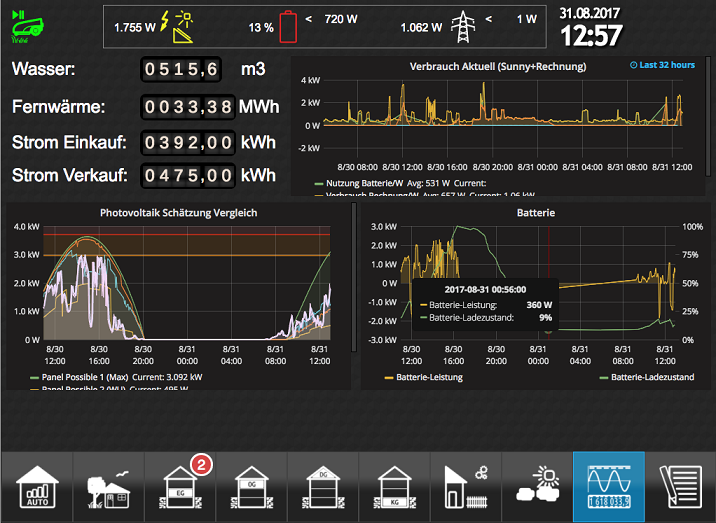

# Welcome to ioBroker
!> **Note for beginners** If too many unknown terms have been used while reading these first words, they will be explained in detail again on [next page](./basics/README.md).

ioBroker is a software solution to integrate various smart home systems, which would remain standalone solutions without ioBroker, into an overall system.

ioBroker is therefore ***the*** integration platform for the Internet of Things.

An ioBroker system has a modular structure. A large number of ***adapters*** enable communication with over 200 different platforms from A for Alexa to Z for time recording.

Be it the integration of commercial products from almost all areas of life or the integration of a self-created solution - ioBroker makes almost everything possible.

!> The documentation is under construction and is constantly being expanded. It is therefore possible that links do not yet work or that content is missing. We appreciate any help with creating new articles or for improvements. Information on this is available in [in the forum](https://forum.iobroker.net).   **Until all content has been taken over, the old documentation is still [to be found here](https://www.iobroker.net/docu/). It will be successively replaced by the new documentation.**

## Cross-platform
Anyone who deals with home automation will sooner or later find that systems are often not perfect. Every system has its strengths and weaknesses. ioBroker is therefore cross-platform. Parallel operation with existing solutions is possible at any time. Synergy effects can be used and the best of all worlds can be brought together.

ioBroker IS at home on almost all platforms. ioBroker can be installed on Windows, Linux, OSX or as a Docker image.
Preconfigured installation images relieve the user of the installation work.

Remote management of a locally installed ioBroker system is possible 24/7 for the user or for system integrators via optional cloud-based access. Access control can be freely configured by the user using users and groups.

## Scalable
If further smart home systems are to be connected in the course of time, these can be implemented by the user at any time using additional adapters during operation. ioBroker itself is also scalable.
Several ioBroker servers can be connected to form a `Mutihost` system.
It is even possible to mix operating system platforms and to couple SoC single-board computers with large multicore servers.
For systems with the highest performance requirements, Redis, a particularly fast database, can optionally be integrated.

## Programmable
Optional programming is done with JavaScript, a script language that has been continuously developed since 1995. This is easy to learn so that new requirements can be implemented quickly. This makes it possible that everyone can contribute to ioBroker and that individual requirements can also be implemented.

For beginners in programming, there is the 'Blockly' variant, which enables you to quickly get results yourself without extensive programming knowledge using 'drag and drop'.

## Visualization
With `VIS` ioBroker provides a powerful tool for creating an individual visualization. Current values from sensors can be displayed graphically in the same way as historical processes. Live images from surveillance cameras, the implementation of an alarm system, heating systems and air conditioning - almost everything that is imaginable can also be implemented.

 *Example of a self-created VIS user interface*

The user has maximum design freedom. Prefabricated modules for easy use help the user with this. But not only the display of information is possible. Devices can also be controlled quickly using the visualization interface. The operation of the surface can be tailored to the most varied of end devices - from smartphones to wall tablets with touch functions to personal computers - everything can be implemented by simple drag and drop.

Simple, prefabricated user interfaces can be implemented quickly with the material or HabPanel adapter.

## Community
Since 2014, ioBroker has secured broad support from thousands of users and developers due to its many advantages. In the specially set up [Forum](https://forum.iobroker.net), users and developers meet and exchange their experiences and suggestions. Since ioBroker is open source software, all source texts are freely available on the [GitHub](https://github.com/ioBroker) platform.

?> What ioBroker is not: ioBroker is not commercial software. ioBroker is developed and maintained by volunteers. Therefore, the use of the software is at your own liability, with the exception of willful damage.
There is no contractually agreed support.

[im Forum]: https://forum.iobroker.net/viewtopic.php?f=8&t=16933